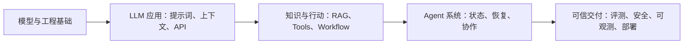

<h1 align="center">AI Agent Engineer</h1>

<p align="center"><strong>从“会调用模型”到“能可靠交付 Agent”的中文工程学习路线</strong></p>

<p align="center">
  不追逐框架清单。以真实交付物、可验证能力和工程取舍为主线，<br />
  把 LLM、RAG、Tool Calling、MCP、评测与部署串成一条真正能走下去的路线。
</p>

<p align="center">
  <a href="https://gaos6e.github.io/AI-Agent-Engineer/"></a>
  <a href="docs-CN/All%20of%20AI.md"></a>
  <a href="https://github.com/gaos6e/AI-Agent-Engineer/actions/workflows/deploy-pages.yml"></a>
</p>

<p align="center">
  <a href="https://gaos6e.github.io/AI-Agent-Engineer/"><strong>立即开始学习</strong></a> · <a href="docs-CN/All%20of%20AI.md">查看完整路线</a> · <a href="docs-CN/">浏览全部课程</a>
</p>

> **学完不是读完。** 每门课都以“能交付什么、怎样验证”为完成条件；框架、协议和多 Agent 只在它们真的能解决问题时再引入。

## 先看看，你会走到哪里



这不是把所有新名词排成一列的资料夹。路线更在意：**什么时候需要一项技术、怎样证明它有效，以及什么时候应退回更简单的确定性 workflow。**

## 选择你的起点

| 如果你想做… | 从这条路径开始 | 路线以什么为目标 |
| --- | --- | --- |
| 能调用工具、可审批、可恢复的 AI 应用 | Agent 应用开发 | 有状态的单 Agent，并能说明何时不该用 Agent |
| 可引用、可更新、可定位问题的知识库 | RAG 与知识库 | 有访问控制与分层指标的 RAG 双管线 |
| 可观测、可回滚、经得起真实运行的系统 | Agent 平台与可靠性 | 有 trace、发布门禁与事故演练的运行平台 |
| 能被打断、会用工具的实时多模态体验 | 多模态与实时交互 | 可测量延迟与恢复能力的交互原型 |

[查看四条角色路径的完整课程顺序 →](docs-CN/All%20of%20AI.md)

## 用它来学习，而不是收藏

1. **先选要交付的东西。** 选一条角色路径，而不是从第一篇笔记硬读到最后一篇。
2. **补齐真正的前置。** 先完成核心课；推荐课按能力缺口补，选修课只在项目需要时进入。
3. **留下可运行的产物。** 一个小应用、检索链路、评测样本或故障复盘，都比“看过”更有价值。
4. **把质量门前置。** 安全、评测、隐私和可观测性不是上线前最后一天才补的章节。

`目标 → 角色路径 → 硬前置 → 可运行产物 → 证据检查 → 下一段能力`

## 你会遇到的主题

| 从地基开始 | 把能力接起来 | 让系统经得起使用 |
| --- | --- | --- |
| AI 基础认知、Python、JSON、API、Git、数学与机器学习 | 现代 LLM、提示词、上下文工程、RAG、向量检索、Tool Calling、MCP、Agent Skills、工作流与多 Agent | 评测体系、Benchmark、数据质量、LLMOps、运行监控、AI 安全、隐私计算与治理 |

课程不是一次性堆砌：目录、角色路径和前置关系会随公开内容一同校验更新。完整结构从[课程地图](docs-CN/All%20of%20AI.md)进入最合适。

## 适合谁

- 想从“会用 ChatGPT / API”走到能做 AI 应用的人；
- 正在搭 RAG 或 Agent，却不想把可观测性、评测和安全留成技术债的人；
- 想判断 MCP、A2A、LangChain、CrewAI 或多 Agent 是否**真的**适合当前问题的人；
- 希望把中文学习笔记变成可复查、可练习、能落地的工程能力的人。

## 公开阅读、反馈与贡献

优先在[在线学习站](https://gaos6e.github.io/AI-Agent-Engineer/)阅读：支持全文搜索、深浅主题、课程导航和中英文页面切换，根路径默认进入中文站。GitHub 上可直接浏览一一配对的 `docs-CN/` 与 `docs-EN/`。

发现错别字、断链、过时信息或路线问题，欢迎提交 Issue。修改正文或引入第三方资料前，请先阅读[公开发布策略](.website/PUBLISHING.md)：公开仓库只保留经过许可、隐私与资源检查的发布快照，不能再发布的参考内容会保留来源说明，而不是直接复制正文。

## 本地预览（维护者）

<details>
<summary>展开运行网站与发布检查</summary>

需要 Node.js 22 或更高版本（CI 使用 Node.js 24）。在 PowerShell 7 中运行：

```powershell
Set-Location ".website"
npm ci
npm test
npm run build
npm run preview
```

本地预览地址为 `http://127.0.0.1:8080/AI-Agent-Engineer/`。日常编辑时可运行 `npm run dev` 自动重建。

网站由 Quartz 5 驱动；构建会检查本地链接、敏感信息、许可证边界和数学渲染错误。详细设计约束见[`.website/DESIGN.md`](.website/DESIGN.md)。

</details>

---

<div align="center">

如果这份路线帮你少走了弯路，欢迎点一个 Star。<br />
<a href="https://gaos6e.github.io/AI-Agent-Engineer/">开始学习</a> · <a href="docs-CN/All%20of%20AI.md">浏览课程地图</a>

</div>
