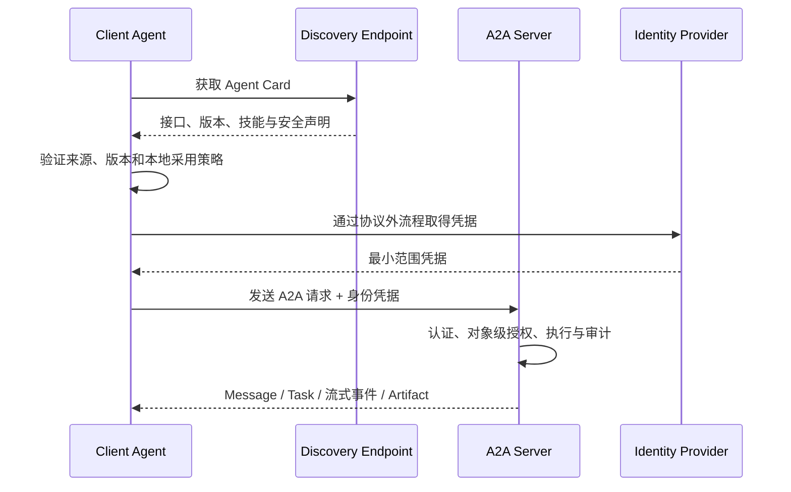

# A2A 协议边界与架构

## 本节目标

- 判断一个问题是否真的需要 A2A；
- 区分 Agent 间协议、工具协议、应用内编排和普通 API；
- 把协议互操作与业务信任分开设计。

## A2A 解决什么

A2A 面向两个独立部署、可能由不同团队或框架实现的 Agent 应用。调用方只依赖对方公开的能力、通信接口与任务语义，不需要读取对方的 Prompt、内存、工具清单或内部执行图。

它提供的核心互操作面包括：

- 通过 Agent Card 描述身份、能力、技能、binding、版本和安全要求；
- 以 Message 发起或继续交互；
- 以 Task 表达有状态、可能长时间运行的工作；
- 以 Artifact 交付任务产物；
- 通过轮询、流式订阅或 webhook 获取进展；
- 让不同 binding 保持语义等价，并显式协商协议版本。

## 五种常被混淆的边界

| 机制 | 主要两端 | 解决的问题 | 不负责什么 |
| --- | --- | --- | --- |
| Tool Calling | 模型/运行时 ↔ 应用工具执行器 | 模型提出结构化调用，应用校验并执行 | 跨组织 Agent 发现、长任务协议 |
| MCP | Host/Client ↔ MCP Server | 连接工具、资源、Prompt 等上下文能力 | 独立 Agent 应用间任务协作 |
| Agent 框架 | 同一应用内部组件 | 状态图、handoff、子 Agent、持久化 | 跨实现的开放网络合同 |
| A2A | Client Agent ↔ Remote Agent | 能力发现、消息、任务、工件与异步协作 | 内部推理算法、具体工具实现 |
| 普通业务 API | 服务消费者 ↔ 领域服务 | 明确资源或命令的业务合同 | 通用 Agent 任务生命周期 |

> [!warning] 协议不是信任
> 对方能说 A2A，不等于其身份、技能描述、结果或安全声明可信。发现、认证、授权、输出验证、审计与合同责任仍需由部署方建立。

## 什么时候值得采用

满足越多条件，A2A 的价值越高：

- Agent 由不同团队、供应商或技术栈独立演进；
- 调用需要长任务、流式进度、人工补充输入或异步恢复；
- 需要发布可发现的能力目录，而不是共享内部代码；
- 希望在 JSON-RPC、gRPC 与 HTTP+JSON 之间保留同一语义模型；
- 需要显式管理协议版本、扩展和跨组织安全边界。

以下场景通常先用更小的接口：

- 同一进程内把任务交给一个 Python 函数；
- 同一 LangGraph/CrewAI 应用内的子图或 handoff；
- 只有一个固定请求和一个固定响应的普通领域服务；
- 没有独立发布、权限或版本边界，却只想增加“Agent 协议”标签。

## 最小部署视图

身份提供方不由 A2A 实现。规范描述安全方案如何声明和随请求传输，但凭据获取、策略决策与资源授权属于部署系统。

## 采用前的六个问题

1. 哪两个独立发布单元需要互操作？
2. 普通 API 为什么不足？缺的是发现、任务状态，还是异步交付？
3. 谁签发调用身份，服务端按什么对象和租户授权？
4. 哪些数据允许跨边界，哪些 Artifact 必须净化或隔离？
5. 协议版本、SDK 版本和业务合同分别怎样升级与回滚？
6. 怎样证明不同 binding 的行为等价，而不只是都能返回 `200`？

如果这些问题没有答案，引入 A2A 只会把不清晰的系统边界变成更大的网络边界。

## 自测

1. 为什么“用 MCP 暴露一个检索工具”与“用 A2A 委派给一个研究 Agent”不是同一合同？
2. 同一进程内的两个子 Agent 是否必须使用 A2A？为什么？
3. Agent Card 能证明远端 Agent 的真实能力吗？还缺哪些证据？

## 参考资料

- [A2A Protocol 官方首页](https://a2a-protocol.org/latest/)
- [A2A Protocol 1.0.0 规范](https://a2a-protocol.org/latest/specification/)
- [A2A 与 MCP](https://a2a-protocol.org/latest/topics/a2a-and-mcp/)
