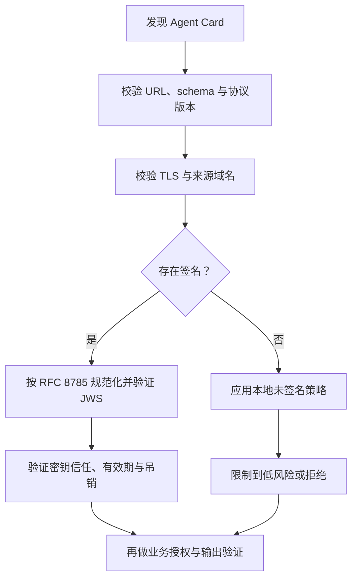

# Agent Card、发现与信任

## 本节目标

- 读懂 A2A 1.0 Agent Card 的必需字段；
- 区分能力发现、身份真实性和实际授权；
- 设计公开卡、扩展卡、缓存与轮换策略。

## Agent Card 是可机器读取的服务声明

A2A 1.0 的 Agent Card 至少描述：

- `name`、`description`、Agent 自身 `version`；
- 按偏好排序的 `supportedInterfaces`；
- `capabilities`；
- 默认输入/输出媒体类型；
- 一个或多个 `skills`；
- 按需声明的 provider、安全方案、安全要求、签名和文档地址。

每个 `supportedInterfaces` 项同时给出 `url`、`protocolBinding` 和 `protocolVersion`。`protocolVersion` 属于接口，而不是 Agent Card 顶层；这是 A2A `1.0` 与 `0.3` 的重要结构差异。

```jsonc
{ // 一个发现阶段使用的 Agent Card；声明能力不等于已验证身份、授权或信任
  "name": "Research Brief Agent", // 面向人的 agent 名称，不能作为唯一身份凭据
  "description": "Produces source-bounded research briefs.", // 简要说明任务范围，实际行为仍需评测和合同验证
  "version": "2.3.1", // Card/agent 版本，升级时需重新评估兼容性与信任
  "supportedInterfaces": [ // agent 可被调用的接口列表，客户端必须逐项选择并验证
    { // 一个 HTTP+JSON 接口声明
      "url": "https://agents.example.com/research/a2a", // 目标 endpoint；生产中需校验证书、域名和允许列表
      "protocolBinding": "HTTP+JSON", // 传输绑定类型，决定请求/响应编码方式
      "protocolVersion": "1.0" // 该接口支持的协议版本，调用前仍要协商兼容性
    } // 结束接口声明
  ], // 结束 supportedInterfaces 数组
  "capabilities": { // agent 声称支持的能力开关，不替代运行期权限
    "streaming": true, // client 可以准备接收流式任务/工件更新
    "pushNotifications": false // agent 不会主动向 client 推送通知，需由 client 轮询/订阅其他机制
  }, // 结束能力对象
  "defaultInputModes": ["text/plain", "application/json"], // 默认接受的输入 MIME 类型，仍需对每次 payload 验证
  "defaultOutputModes": ["application/json"], // 默认输出 MIME 类型，client 不应盲目执行其中内容
  "skills": [ // 更细的可发现任务能力列表
    { // 一项可选择的 research skill
      "id": "research-brief", // 稳定 skill ID，便于请求、评测和审计关联
      "name": "Research brief", // 展示给用户的能力名称
      "description": "Builds a cited brief from an approved source set.", // 明确只使用已批准来源，避免开放式无界检索承诺
      "tags": ["research", "citations"] // 辅助检索/路由标签，不能单独决定授权
    } // 结束 skill 对象
  ] // 结束 skills 数组
}
```

> [!note] JSONC 教学表示
> 这是带行尾解释的 Card；发布或校验严格 JSON 前请删除 `//` 注释。

该示例是教学用最小结构，不表示无需认证即可在生产环境公开服务。

## 三种发现方式

官方规范列出三类入口：

1. `https://{server}/.well-known/agent-card.json`；
2. 组织维护的 registry/catalog；
3. 客户端直接配置的 Agent Card URL 或内容。

它们对应不同控制面。Well-known URI 便于开放发现；registry 可加审核、所有权和生命周期；直接配置适合固定合作方。生产系统通常还需要所有者、环境、数据分类、支持窗口和下线状态，这些不应靠自由文本 `description` 猜测。

## 发现不等于信任



签名只能证明“持有某密钥的主体签过这份卡”。还必须确认：

- `kid`/`jku` 指向的密钥来源是否可信；
- 密钥是否过期、吊销或被错误复用；
- 签名覆盖的规范化内容是否与接收内容一致；
- 域名、组织身份和合同主体是否匹配；
- 技能声明是否通过独立测试，而不是自我宣传。

## 公开卡与认证后扩展卡

当 `capabilities.extendedAgentCard` 为真时，客户端可在认证后请求更详细的 Agent Card。合理用途包括只向合作方公开受限技能、专用接口或更具体的策略信息。

边界要点：

- 公开卡不得包含凭据、内部拓扑或不必要的敏感技能细节；
- 扩展卡请求必须使用公开卡声明的安全方案完成认证；
- 返回内容仍需按调用者权限裁剪，不能把“已登录”当成全量授权；
- 缓存应绑定身份、卡版本和有效期；登出或权限变化后清除扩展卡缓存。

## 缓存与变更

Agent Card 是运行时依赖，不能永久缓存。至少记录：

- 获取 URL、时间、内容摘要和 Agent `version`；
- 每个接口的 A2A `protocolVersion`；
- 签名验证结果与使用的信任锚；
- 选择了哪个 binding、为什么没有选择其他项；
- 卡变化后触发的兼容性测试和审批。

不要把 Agent 的产品版本与 A2A 协议版本混为一个字段，也不要只比较字符串大小决定兼容性。

## 常见错误

- 读取到 Card 就自动调用全部技能；
- 把 `skills.tags` 当成授权范围；
- 在 Card 中嵌入 API key 或内部地址；
- 验证了 JWS 数学签名，却没有验证密钥归属；
- 仍按 `0.3` 读取顶层 `url`、`preferredTransport` 和 `protocolVersion`；
- 多接口只取第一个，却不检查客户端是否支持其 binding 和版本。

## 自测

1. 为什么 HTTPS、JWS 和对象级授权三者不能互相替代？
2. `version: 2.3.1` 与 `protocolVersion: 1.0` 分别版本化什么？
3. 哪些信息适合放公开卡，哪些应放认证后扩展卡？

## 参考资料

- [A2A 1.0 AgentCard 定义](https://a2a-protocol.org/latest/specification/#441-agentcard)
- [A2A Agent Discovery](https://a2a-protocol.org/latest/specification/#8-agent-discovery-the-agent-card)
- [RFC 8785：JSON Canonicalization Scheme](https://www.rfc-editor.org/rfc/rfc8785)
- [RFC 7515：JSON Web Signature](https://www.rfc-editor.org/rfc/rfc7515)
