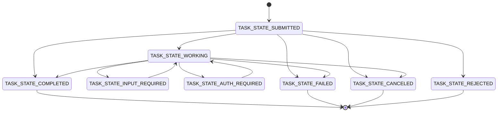

# Task、消息与工件生命周期

## 本节目标

- 区分 Message、Task、TaskStatus、Part 与 Artifact；
- 处理终态、中断态、补充输入和授权恢复；
- 为重试、重复事件和不完整历史设计幂等边界。

## 五个对象各司其职

| 对象 | 工程职责 | 常见误用 |
| --- | --- | --- |
| Message | 发起任务、澄清、补充输入或状态说明 | 把关键最终产物只塞进 Message |
| Task | 服务端生成 ID 的有状态工作单元 | 用客户端本地 ID 冒充服务端 Task ID |
| TaskStatus | 当前状态、可选说明和时间 | 只看文本，不检查枚举状态 |
| Part | Message/Artifact 内的一段文本、字节、URL 或结构化数据 | 同时设置多种内容字段 |
| Artifact | Task 产生的正式输出 | 把临时进度当成最终结果 |

A2A 1.0 明确建议用 Artifact 交付任务结果；Message 更适合通信。Task `history` 不保证保存全部消息，断线后的流也不保证自动补齐所有瞬时消息，因此关键结果不能只依赖临时状态文本。

## Task 状态机

图是教学化的常用转换视图，不是规范中全部允许行为的机器化复制。实际客户端应以规范、目标 SDK 与服务合同为准。

状态可分为：

- 进行中：`SUBMITTED`、`WORKING`；
- 中断并等待外部动作：`INPUT_REQUIRED`、`AUTH_REQUIRED`；
- 终态：`COMPLETED`、`FAILED`、`CANCELED`、`REJECTED`；
- `UNSPECIFIED`：不能作为成功或可继续的默认值。

## 输入与授权中断不同

`INPUT_REQUIRED` 表示缺少业务输入，例如需要用户选择报告范围。`AUTH_REQUIRED` 表示继续执行所需的授权尚未满足。后者不能用“请把 token 发到聊天里”解决；规范建议凭据通过安全的带外渠道直接提供给原始请求方，避免在 Agent 链中层层转发。

恢复流程至少记录：

1. 哪个 Task、哪个动作被中断；
2. 需要的是业务信息、人工批准还是机器凭据；
3. 谁有权满足请求，作用域和有效期是什么；
4. 恢复后从哪个幂等点继续；
5. 客户端通过订阅、webhook 还是轮询获取后续状态。

## Part 的 one-of 约束

A2A 1.0 将文本、文件与数据统一为一个 `Part`，内容由成员存在性区分。每个 Part 必须且只能包含 `text`、`raw`、`url`、`data` 之一；JSON 字段使用 camelCase，枚举使用规范定义的 `SCREAMING_SNAKE_CASE`。

这与 `0.3` 的 `kind` discriminator 和嵌套 `file` 结构不兼容。解析器若同时“宽松接受一切”，很容易让错误载荷悄悄进入下游。

## 幂等与重复交付

网络重试、流重连和 webhook 至少一次投递都可能产生重复。调用方需要：

- 使用 `messageId`、Task ID、Artifact ID 和事件摘要去重；
- 将副作用与协议消息分离，服务端按业务幂等键执行；
- 终态后拒绝非法回退，或把新工作显式建成新 Task；
- 对 Artifact chunk 使用 ID、顺序、`append` 与 `lastChunk` 组合验证；
- 不因收到重复 `COMPLETED` 就重复入库、发送邮件或扣费。

## 失败不是一个字符串

至少分开处理：

- 协议错误：字段、binding、版本或操作不兼容；
- 认证/授权错误：身份无效或对象范围不足；
- 任务拒绝：服务端决定不承接；
- 任务失败：已经承接但执行失败；
- 交付失败：任务可能成功，但流/webhook/客户端处理失败；
- 业务结果不可接受：协议成功，Artifact 却不满足质量或安全门。

## 自测

1. 为什么 `AUTH_REQUIRED` 不是终态？
2. 为什么完成状态和 Artifact 都需要校验？
3. Task 历史能否作为完整审计日志？为什么？

## 参考资料

- [A2A 1.0 Core Objects](https://a2a-protocol.org/latest/specification/#41-core-objects)
- [A2A 1.0 Messages and Artifacts](https://a2a-protocol.org/latest/specification/#37-messages-and-artifacts)
- [A2A v1.0 迁移说明](https://a2a-protocol.org/latest/whats-new-v1/)
