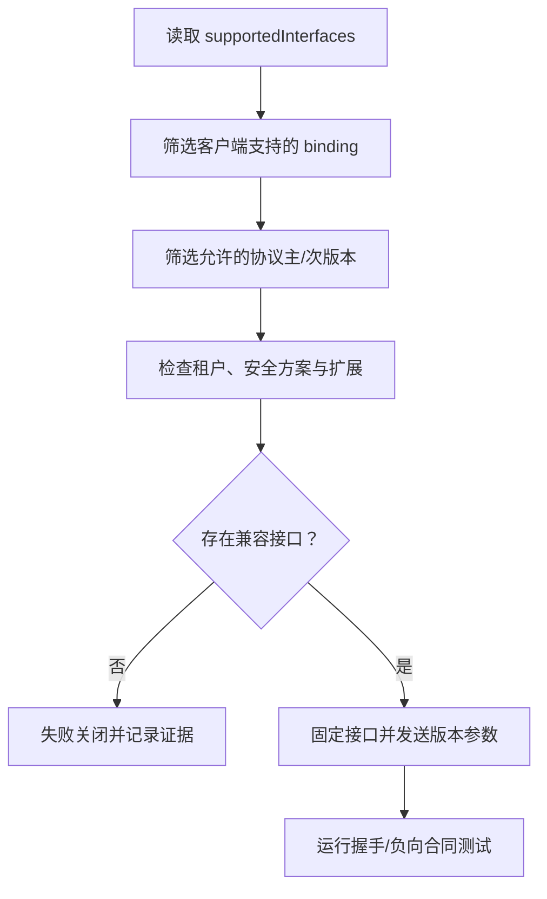

# 传输、流式、异步与版本协商

## 本节目标

- 理解 A2A 1.0 的抽象操作与 binding 分层；
- 为同步、长任务和断线场景选择交付方式；
- 让协议版本、binding 和业务版本可以独立演进。

## 先统一语义，再选择 binding

A2A 1.0 以规范数据模型和抽象操作为共同语义，再映射到三种标准 binding：

- `JSONRPC`；
- `GRPC`；
- `HTTP+JSON`。

同一个 Agent 暴露多个 binding 时，规范要求它们提供相同操作能力、语义等价结果、可映射的错误和等价认证。不能把 HTTP 接口做成完整版、gRPC 接口做成阉割版，却仍宣称二者可互换。

Agent Card 的 `supportedInterfaces` 按偏好排序。客户端选择自己支持的第一项，但仍应检查 URL、binding、协议版本、租户字段和本地安全策略。

## 三种结果获取方式

| 方式 | 适用场景 | 主要风险 | 最小恢复证据 |
| --- | --- | --- | --- |
| 轮询 `GetTask` | 低频、客户端无法保持连接 | 轮询风暴、延迟、重复读取 | `ETag`/节流策略、最后状态与终态 |
| 流式发送/订阅 | 需要低延迟进度或增量 Artifact | 断线、重复、事件遗漏、背压 | Task ID、已处理事件/Artifact 游标、重连策略 |
| Push notification | 长任务、客户端暂时离线 | SSRF、伪造回调、重放、投递失败 | 回调身份、幂等键、允许目标、重试与死信记录 |

流式连接不是持久队列。官方规范明确提醒：客户端断线重连后可能收不到此前所有状态消息，关键事实应可通过 Task 和 Artifact 重新读取。

## 版本不是一个数字

至少同时管理四个版本：

1. A2A 协议版本：例如接口声明的 `1.0`；
2. binding/SDK 版本：具体实现与序列化行为；
3. Agent 产品版本：Agent Card 顶层 `version`；
4. 业务合同版本：输入数据、Artifact schema、技能语义和质量门。

A2A 1.0 客户端在 HTTP 类请求中应发送 `A2A-Version` 服务参数，并只调用 Agent Card 声明支持的版本。不要自动回落后继续执行高风险动作；回落可能静默丢失签名、租户或扩展能力。

## 流式事件的正确消费

Task 状态更新与 Artifact 更新是不同事件。客户端应：

- 按 Task/Context 关联事件，不按到达连接猜测归属；
- 验证每个流响应只承载一个合法变体；
- 对增量 Artifact 按 `artifactId`、`append`、`lastChunk` 聚合；
- 终态后关闭或停止消费，但允许幂等重复终态；
- 限制单事件、单 Artifact 和整个 Task 的大小；
- 把内容校验、恶意 URL 和敏感信息策略应用到每个 Part。

## Webhook 需要双向安全

Remote Agent 作为 webhook 调用方时，要限制目标地址，阻止内网、环回、云元数据地址和重定向绕过；作为接收方的客户端要验证调用身份、Task 归属、时间窗与重放。不要把用户任意提供的 URL 原样注册为通知目的地。

至少记录：

- 谁创建了通知配置；
- 允许的目标域、解析后的 IP 与重定向策略；
- 使用的认证方案、密钥轮换和失效方式；
- 重试上限、退避、超时、死信与告警；
- 重复投递的幂等处理结果。

## 扩展与自定义 binding

扩展通过 URI 标识。必需扩展不被客户端支持时应失败，而不是静默忽略或自动降级到旧版。自定义 binding 也必须保留核心操作、数据语义、错误映射、认证与互操作测试；“走 WebSocket”本身不是合格的 binding 规范。

## 自测

1. 多个 binding 都返回 `200` 能否证明语义等价？
2. 为什么流重连后仍需要 `GetTask` 或 Artifact 读取？
3. 协议回落为什么可能是安全变化，而不只是兼容性变化？

## 参考资料

- [A2A Protocol Binding Requirements](https://a2a-protocol.org/latest/specification/#5-protocol-binding-requirements-and-interoperability)
- [A2A Streaming and Asynchronous Operations](https://a2a-protocol.org/latest/topics/streaming-and-async/)
- [A2A Custom Protocol Bindings](https://a2a-protocol.org/latest/topics/custom-protocol-bindings/)
