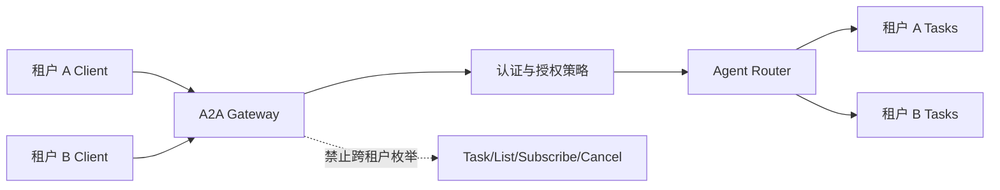

# 认证、授权与多租户安全

## 本节目标

- 把发现、认证、授权、审批和凭据获取分成独立步骤；
- 为每个 Task 和操作实施对象级、租户级范围限制；
- 防住跨 Agent 链的凭据泄漏、SSRF、注入和不可信 Artifact。

## A2A 复用企业身份体系

A2A 不自创身份提供方。Agent Card 可以声明 API key、HTTP auth、OAuth 2.0、OpenID Connect、mTLS 等安全方案；客户端通过协议外流程取得凭据，再按 binding 规则随请求传输。

这形成五个不同问题：

| 问题 | 负责边界 |
| --- | --- |
| 这是谁？ | 认证与服务端身份验证 |
| 能访问哪个 Agent/技能？ | 服务级与技能级授权 |
| 能访问哪个 Task/Artifact？ | 对象级授权 |
| 能代表哪个用户或组织？ | 委托、租户与作用域 |
| 这个危险动作是否获批？ | 交易级审批与策略执行 |

认证成功只回答第一个问题，不能自动推出其余答案。

## 每个操作都要先授权再查询

规范要求服务端把 Task 列表、读取、取消、订阅和通知配置限制在调用者的授权范围内。尤其不能先查询全局对象、再在响应阶段过滤；存在性、计数、时序和错误差异都可能泄漏其他租户信息。

服务端至少把以下值绑定在一起：

- 认证主体和委托用户；
- Agent/技能；
- Task 与 Context；
- tenant/workspace/project；
- 数据分类与允许目的；
- 允许操作、时间窗与风险上限。

> [!danger] `tenant` 不是授权证明
> A2A 1.0 的 `tenant` 是不透明路由值。客户端按选中接口携带它，服务端负责解释；攻击者同样可以篡改请求字段。服务端必须把它与已认证主体和自己的租户模型重新绑定。

## `AUTH_REQUIRED` 的凭据边界

Agent 可用 `TASK_STATE_AUTH_REQUIRED` 表示执行中需要额外授权。规范建议凭据通过安全的带外渠道直接提供给最初请求凭据的 Agent。若凭据沿 Agent 链在消息中转发，每个中间 Agent 都可能看见并滥用它。

安全设计应优先：

- audience 绑定到原始 Agent；
- scope 只覆盖当前动作和对象；
- 短时有效、一次性或可立即吊销；
- 不写入 Task history、普通 Trace 或 Artifact；
- 恢复执行前重新验证用户意图和参数；
- 失败、超时或取消后撤销未使用凭据。

## 跨 Agent 内容仍是不可信输入

Remote Agent 的 Message 和 Artifact 可能包含：

- 提示注入或伪造系统指令；
- 恶意文件、超大载荷或解析炸弹；
- 指向内网、环回或云元数据服务的 URL；
- 伪造引用、越权数据和敏感信息；
- 诱导上游 Agent 发起支付、删除或权限变更的文本。

接收端必须把它们当成外部输入，经过 schema、大小、媒体类型、来源、恶意内容、数据分类和动作策略校验。A2A 只定义交换结构，不为 Artifact 的真实性背书。

## 多租户最小威胁模型

负向测试至少覆盖：

- 用租户 A 凭据读取、列举、取消或订阅租户 B Task；
- 修改 `tenant`、Task ID、Context ID 或 webhook config ID；
- 通过错误码、分页 token、延迟差异推断别的对象存在；
- 公共 Agent Card 泄漏私有技能或内部 URL；
- webhook URL 的 DNS rebinding、重定向和私网解析；
- `AUTH_REQUIRED` 恢复时替换动作参数或审批对象。

## 生产检查表

- [ ] 所有生产 binding 使用 TLS，并验证服务端身份；
- [ ] Agent Card 的安全声明与网关实际策略一致；
- [ ] 每个操作在数据访问前做对象级授权；
- [ ] tenant 只用于路由，不作为唯一权限依据；
- [ ] 凭据不进入 Message、Artifact、普通日志或模型上下文；
- [ ] webhook 有允许目标、身份验证、重放保护和幂等处理；
- [ ] Part URL、文件、结构化数据和文本分别校验；
- [ ] 高风险副作用经过模型外策略和参数绑定审批；
- [ ] 事件和审计记录支持撤销、调查与租户隔离验证。

## 自测

1. 为什么已经验证 JWT 仍可能出现跨租户越权？
2. `AUTH_REQUIRED` 时为什么不应让用户把 token 直接写进 Message？
3. 收到签名 Agent Card 后，Artifact 是否可以跳过内容校验？

## 参考资料

- [A2A Authentication and Authorization](https://a2a-protocol.org/latest/specification/#7-authentication-and-authorization)
- [A2A Security Considerations](https://a2a-protocol.org/latest/specification/#13-security-considerations)
- [A2A Multi-Tenancy](https://a2a-protocol.org/latest/topics/multi-tenancy/)
- [[AI安全/00-目录|AI 安全]]
