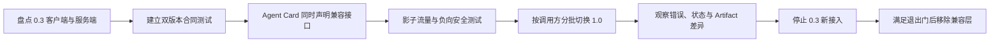

# 互操作测试、迁移与采用决策

## 本节目标

- 把“SDK 能启动”升级为跨实现互操作证据；
- 识别 A2A `0.3` 到 `1.0` 的关键破坏性变化；
- 用进入、观察、退出条件管理前沿技术。

## 互操作不是单方单元测试

至少需要四层证据：

1. **结构合同**：必需字段、one-of、枚举、时间戳、错误格式；
2. **行为合同**：Task 状态、取消、订阅、重试、Artifact 聚合；
3. **跨实现矩阵**：不同语言/SDK、客户端/服务端、binding 与版本组合；
4. **生产边界**：身份、租户、网关、限流、日志、故障和回滚。

官方 TCK 或 SDK 测试能增强前两层证据，但不能替代你的业务授权、数据策略和线上 SLO。

## 一份最小测试矩阵

| 维度 | 正向用例 | 必须有的负向用例 |
| --- | --- | --- |
| Agent Card | 选择兼容首选接口 | 缺字段、错误版本、未知必需扩展、签名失败 |
| Message/Part | text/data/file URL 各一种 | 多内容字段、旧 `kind`、超大载荷、恶意 URL |
| Task | 完成、失败、取消、输入/授权恢复 | 终态回退、跨 Task/Context、重复副作用 |
| Streaming | 状态与 Artifact 增量 | 断线、重复、乱序、缺失 `lastChunk` |
| Webhook | 认证回调与幂等接收 | 重放、伪造来源、SSRF、失败重试耗尽 |
| 多租户 | 同租户读取与订阅 | 跨租户 list/get/cancel/subscribe |
| 多 binding | 语义等价结果 | 能力、错误或认证不一致 |

## `0.3` 到 `1.0` 不能只改版本字符串

A2A 官方迁移说明列出的高影响变化包括：

- 枚举值改为 `TASK_STATE_*`、`ROLE_*` 的 `SCREAMING_SNAKE_CASE`；
- Part 取消 `kind` 和嵌套 file，改为 `text/raw/url/data` 成员 one-of；
- `protocolVersion`、URL 与 binding 收敛到 `supportedInterfaces[]`；
- 流事件去掉旧 discriminator，按成员存在性区分；
- 操作名、错误表示、分页与 HTTP 路径发生调整；
- 增加多租户、Agent Card 签名、显式版本参数等生产能力。

迁移应采用兼容窗口：

回滚单位要包含协议适配器、Agent Card、网关配置、业务 schema 和观测查询；只回滚 SDK 包可能留下不匹配的 Card 或路由。

## 前沿主题的采用状态

本项目使用四种状态，而不是“热门/不热门”：

| 状态 | 进入条件 | 允许动作 |
| --- | --- | --- |
| observe | 有一手资料，但规范/生态仍快速变化 | 记录事实、跑离线实验，不进入关键路径 |
| trial | 有版本化合同和可回滚试验 | 受控流量、非关键业务、明确退出条件 |
| adopt | 价值、互操作、安全和运维证据均满足 | 进入支持矩阵和生产治理 |
| hold/retire | 价值不足、兼容失败或风险超限 | 停止新接入、迁移和归档证据 |

A2A `1.0` 的发布状态不自动等于你的组织应当 `adopt`。组织是否采用仍取决于跨边界需求、伙伴支持、身份模型、TCK/合同结果和总拥有成本。

## 采用决策记录

至少写清：

- 现有问题与普通 API/MCP/框架内编排为何不足；
- 固定的协议、SDK、binding 和业务 schema 版本；
- 调用方/服务方/身份方/数据所有者；
- 正向、负向、互操作和故障注入结果；
- 可接受的版本窗口与弃用通知期；
- 回滚触发器、兼容层所有者和退出日期；
- 未验证的供应商、扩展、传输与法规环境。

## 自测

1. 为什么官方 SDK 的单元测试不能证明两个供应商实现可互操作？
2. `0.3` Card 上只把版本改成 `1.0` 会遗漏哪些结构变化？
3. 哪些证据会让一个主题从 `trial` 进入 `adopt`？

## 参考资料

- [A2A v1.0 变更说明](https://a2a-protocol.org/latest/whats-new-v1/)
- [A2A 1.0 Interoperability Testing](https://a2a-protocol.org/latest/specification/#128-interoperability-testing)
- [A2A 官方路线图](https://a2a-protocol.org/latest/roadmap/)
- [A2A GitHub Releases](https://github.com/a2aproject/A2A/releases)
