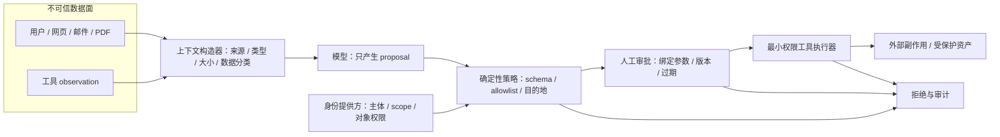

# 资产、信任边界与威胁建模

## 本节目标

学完后，你应能把一个 Agent 画成可审查的数据流，区分资产、威胁、弱点、控制和残余风险，并为每条高风险路径指定可验证证据。

## 安全到底保护什么

“让模型更听话”不是安全目标。安全首先保护具体对象：

- **机密性（Confidentiality）**：私有邮件、密钥、客户数据不被未授权主体看到；
- **完整性（Integrity）**：知识库、记忆、工具参数和业务记录不被悄悄篡改；
- **可用性（Availability）**：攻击者不能用循环调用、超长输入或资源耗尽使服务失效；
- **人的安全与自主权**：系统不应在用户不知情时替他发信、付款或作出高影响决定。

AI safety、security、privacy 和 governance 有交集但不相同。安全工程主要问“面对故障、误用或攻击，边界是否仍有效”；隐私还问数据是否应被收集和如何被使用；治理决定谁有权接受风险。不能用其中一个词替代全部问题。

## 五个基本对象

| 对象 | 问题 | 邮件草稿 Agent 示例 |
| --- | --- | --- |
| 资产 | 不能丢失、泄露或篡改的是什么 | 邮件正文、邮箱身份、审计轨迹 |
| 威胁主体 | 谁可能造成损失，具有什么能力 | 恶意发件人、越权用户、被攻陷的连接器 |
| 信任边界 | 数据或权限在哪一步改变信任等级 | 邮件进入上下文、模型输出进入工具适配器 |
| 攻击路径 | 攻击者如何跨多步到达资产 | 邮件隐藏指令→模型选工具→外发敏感数据 |
| 控制与证据 | 哪一层阻断，如何证明 | 工具白名单、对象级授权、负向测试和审计事件 |

漏洞是使威胁路径成立的弱点；风险是路径成立后对资产造成的可能损失；残余风险是控制实施后仍留下的部分。三者不能混写。

## 从零完成一次威胁建模

### 1. 冻结用途与非目标

先用一两句话写清系统承诺。例如：“读取用户指定的一封邮件并生成草稿，永不自动发送。”再写非目标：不遍历其他邮件、不写入长期记忆、不调用任意网络地址。用途越含糊，越无法判断某项能力是否过多。

### 2. 列出资产与影响

给资产分级只是起点，还要写出损失：泄露一封邮件、跨租户读取、冒用用户发送、审计记录缺失分别影响谁。不要只写“高风险”。

### 3. 画数据流与控制流

至少包含用户、模型、Prompt 构造器、检索/记忆、工具适配器、身份提供方、外部服务、日志和管理员。箭头上写数据类型与方向；另外标出谁决定工具可见性、授权和审批。模型上下文里的角色文字不是可信身份。



*图 1　从不可信内容到外部副作用的信任边界。文字替代：外部内容和工具观察先经来源与数据分类，再由模型提出动作；确定性策略结合真实身份校验 schema、权限和目的地，高风险动作还需绑定参数且会过期的审批，之后最小权限执行器才可影响资产；拒绝和执行均进入审计。图依据本节威胁路径、NIST AI 600-1 与 MITRE ATLAS 的风险分析边界整理；Mermaid 源码即再生成方式。*

### 4. 标出信任边界

外部网页、邮件、PDF、OCR、工具返回都可能是不可信数据；模型输出同样是不可信建议。常见关键边界是：

```text
外部内容 ──> Prompt/上下文 ──> 模型输出 ──> 确定性策略 ──> 工具执行器
   数据面                         控制边界        权限边界
```

边界处要问：是否校验来源、类型、身份、对象权限、目的地、数据分类和状态版本？失败时是否默认拒绝？

对每条可产生副作用的路径，还要画出策略决策点（PDP）与真正执行拒绝/放行的策略执行点（PEP）。一次授权至少绑定来自可信通道的“已认证调用者、被代理用户与租户、工作负载身份、动作、对象、用途/环境、对象状态或版本”；模型只能提出动作和业务参数，不能生成或覆盖这些授权事实。任一事实缺失、过期或不一致时应进入拒绝或人工复核，而不是由 Prompt 猜测补齐。

### 5. 写攻击路径，不只写漏洞名

好的路径有前置条件、步骤、资产和终态：

> 恶意发件人把指令放进邮件正文；系统把正文与可信指令混入同一上下文；模型提出调用发送工具；共享服务身份有 `mail.send`；执行器未检查用户授权；邮件内容被发往攻击者地址。

STRIDE（伪装、篡改、抵赖、信息泄露、拒绝服务、权限提升）可用作漏项检查，但不能替代系统特有的路径分析。对 Agent 还要专门检查提示注入、记忆/上下文投毒、工具滥用、模型或数据供应链变化。

### 6. 为控制写验证证据

“增加 guardrail”不可验收。改成：外部邮件不能改变工具白名单；未知收件人返回明确拒绝；审批令牌绑定规范化参数且 5 分钟过期；跨租户对象 ID 必须失败。每项控制还应有负责人、状态、残余风险和复查触发条件。

## 风险登记表模板

| 字段 | 示例 |
| --- | --- |
| 资产/影响 | 私有邮件被外发，影响用户与组织 |
| 攻击路径 | 不可信邮件→上下文→发送工具 |
| 前置条件 | Agent 可见发送工具且使用共享身份 |
| 预防控制 | 删除发送工具、短期只读身份、目的地默认拒绝 |
| 检测/响应 | 工具拒绝事件、异常目的地告警、紧急停用 |
| 验证 | 间接注入负向测试、scope diff、审批重放测试 |
| 残余风险/负责人 | 模型仍可能生成错误草稿；产品负责人接受 |

## 常见错误

- 把系统 Prompt 当秘密或安全边界；它可能被泄露，也不能执行授权。
- 只画模型，不画身份、连接器、记忆和运维控制面。
- 只分析恶意用户，忽略被投毒的文档、依赖或工具输出。
- 风险分级没有影响说明，或控制没有可重复验证。
- “供应商通过认证”就跳过本系统配置、权限和数据流审查。

## 练习与自测

为“读取共享盘文档并创建工单”的 Agent：

1. 写用途和三个非目标；
2. 列出至少五项资产、四条信任边界和三类威胁主体；
3. 写一条从恶意文档到越权工单的完整路径；
4. 为路径安排预防、检测、响应各一项控制，并写负向测试。

- [ ] 能向别人解释资产、漏洞、威胁、风险与残余风险的区别。
- [ ] 能把模型输出和外部内容都视为不可信输入。
- [ ] 能从用途推导最小能力，而不是从已有工具倒推用途。
- [ ] 能为每项关键控制给出机器可检查或可演练的证据。

## 下一步

继续学习 [[AI安全/01-基础与风险/02-提示注入与间接注入|提示注入与间接注入]]，再把攻击路径落实到工具与身份边界。

## 参考资料

- [NIST AI Risk Management Framework](https://www.nist.gov/itl/ai-risk-management-framework)（获取日期：2026-07-21）
- [NIST AI 600-1, Generative AI Profile](https://doi.org/10.6028/NIST.AI.600-1)（2024 年 7 月发布；获取日期：2026-07-21）
- [MITRE ATLAS](https://atlas.mitre.org/)（持续更新的 AI 对抗战术与技术知识库；获取日期：2026-07-21）
