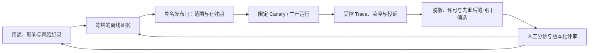

# 文档、透明与可追溯证据

## 本节目标

为不同受众提供能采取行动的信息，并让一个结果可以追溯到当时的系统、数据、配置、人员和决策。透明不是公开全部源代码；文档也不是把模板填满后束之高阁。

## 先问受众要做什么

| 受众 | 需要的信息 | 目的 |
| --- | --- | --- |
| 最终用户/受影响者 | 正在与 AI 交互、用途、主要限制、人工渠道、申诉或纠错方式 | 知情使用、避免过度依赖、寻求救济 |
| 操作人员 | 输入边界、正确解释、必须复核的情形、禁止动作、停用与升级 | 安全操作 |
| 负责人/审批者 | 收益、影响评估、测试、残余风险、例外、监控与回滚 | 作出有依据的决定 |
| 工程与运维 | 组件/版本、数据流、阈值、运行手册、事件证据 | 复现、修复、变更 |
| 独立审查/监管接口 | 适用范围内的记录、控制与证据链 | 验证声明和回应询问 |

“提供模型很复杂”不是有意义的透明；“公开所有 Prompt 和日志”也可能泄露安全控制、个人数据或商业秘密。按受众、风险和适用义务提供最少且足够的信息。

透明、可解释和可追溯不是同义词：透明让受众知道 AI 的角色、限制与救济；可解释支持理解某个结果或决定；可追溯支持还原版本、输入来源、控制和责任。三者都不要求保存或披露模型的隐藏思维过程（chain of thought）；生产调查应依赖可控的输入/来源、结构化决策、工具结果、策略与人工记录。

## 治理文档集合

- **系统卡/清单记录**：目的、边界、负责人、受影响者、组件、状态和限制。
- **数据说明与模型/组件卡**：来源、适用性、版本、评测和已知缺口。
- **影响评估与风险登记**：影响路径、控制、证据、残余风险和决策。
- **评测报告**：数据集、指标、分群、失败案例、阈值、环境和不可推广的边界。
- **审批与例外记录**：批准对象的精确版本、条件、期限、批准人和复查触发器。
- **变更日志**：谁在何时为什么改变了什么，验证、发布和回滚结果如何。
- **用户说明与操作手册**：恰当使用、人工监督、投诉、停用和恢复。
- **事件/危险与退役记录**：时间线、影响、证据、行动、复盘和后续义务。

## 可追溯的运行记录

对每次重要运行保留足以复盘的 `run_id`、时间、可信身份、系统/模型/Prompt/索引/工具版本、输入来源类别、关键决策、人工覆盖、输出/动作摘要和错误状态。不要默认保存完整 Prompt、文档、个人数据、密钥或模型思维过程；用引用、哈希、脱敏摘要和受控证据库满足调查需要。

证据需要完整性、访问控制、保留期和删除规则。哈希只能证明字节一致，不能证明内容正确；日志存在也不代表操作合理。定期从一次用户投诉反向追踪，验证所有版本与负责人确实可找到。

## 将证据交接给发布门，而不复制生产内容

治理工件需要能从离线评测交接到发布、运行和回归，但每一段只携带完成其职责所需的引用。一个最小交接集可包含：

| 交接物 | 它回答的治理问题 | 它不能单独证明 |
| --- | --- | --- |
| 不可变发布单元与 `release_id` | 哪个代码、Prompt、检索、工具和策略组合被评审 | 该组合安全、有效或合规 |
| 完整离线 `evidence_sha256` | 哪个 suite/dataset/rubric/grader/harness 版本支持了结论 | 证据来源真实、审批者真实或内容正确 |
| 门禁决定、条件、有效期与 `candidate_gate_evidence_sha256` | 谁在什么范围内允许该发布进入 Canary 或生产 | 允许长期无限扩展，或替代运行时授权 |
| 受控 Trace/Log 引用、时间窗与监控摘要 | 线上观察能否回查到发布与门禁 | 原始 Prompt、用户输入或工具结果应被广泛保存 |

生产信号只能形成经脱敏、许可、去重和人工复核的回归候选；它不能自动修改冻结评测集、评分阈值或发布结论。完整 SHA-256 适合受控交接和变更检测，不是签名或访问令牌；高基数或含个人信息的值也不应成为 Metric label。完整的生命周期合同与离线项目边界见 [[评测体系/02-方法与质量/08-离线到线上证据交接与回归闭环|离线到线上证据交接与回归闭环]]。

### 证据闭环：观察提出候选，人工改变基线

*图 1　治理证据闭环（原创整理）。运行观察能够提出需要复查的候选，但不会自行改写风险登记、评测基线或发布结论；只有具名人员以新版本工件完成评审后，候选才可能回写到风险与离线证据。*

## 声明与证据对齐

把“系统公平、安全、可解释”拆成可验证声明：对谁、在什么环境、用什么指标和阈值、由谁测试、何时测试、有哪些失败。版本或用途改变后，旧证据不能自动继承。

外部说明应写清 AI 的角色和人的责任。例如“系统生成缺失材料清单，由工作人员核对，不决定资格”比“AI 辅助提升效率”更可操作。若人工只是机械确认且无法理解或推翻输出，不应称为有效人工监督。

## 练习与自测

选择一个 Agent 运行，从用户投诉出发倒推：能否定位当时模型、Prompt、知识源、工具参数、人工决定和批准条件？设计一个不保存原始敏感文本仍可调查的日志方案。

- [ ] 能为不同受众提供不同深度且可行动的信息。
- [ ] 任何关键声明都有版本化证据和适用边界。
- [ ] 能追溯重要结果，又不把秘密和个人数据复制到普通日志。
- [ ] 人工监督描述与实际权力、时间和信息一致。

## 下一步与资料基线

下一步进入 [[AI治理/02-控制与治理/05-上线审批与变更管理|上线审批与变更管理]]。资料获取日期：2026-07-22。参考 [OECD AI Principles](https://oecd.ai/en/ai-principles) 的透明、可解释、可追溯与问责原则，[NIST AI RMF Core](https://airc.nist.gov/airmf-resources/airmf/5-sec-core/) 及 [NIST AI 600-1](https://doi.org/10.6028/NIST.AI.600-1)。具体披露义务随角色、用途和地区变化，必须另行核对。
