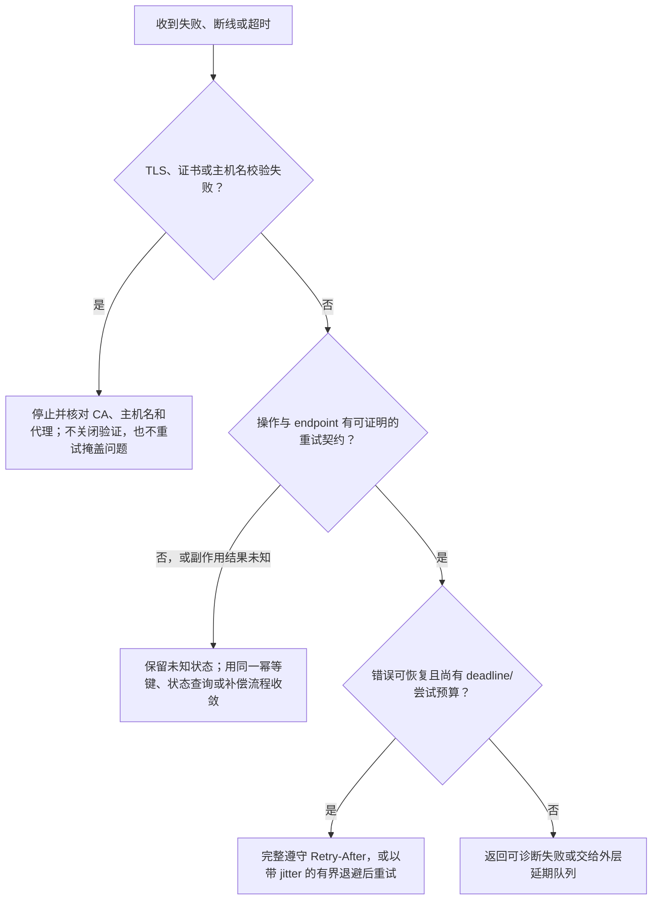

# 超时、重试、退避与幂等性

## 本节目标

理解超时之后为什么结果可能“未知”，仅对适合的操作和故障自动重试；会设置连接/读取超时、最大尝试次数、指数退避、jitter 与 `Retry-After`；能用服务端支持的幂等键降低重复创建风险。

## 超时不是一个数字

一次请求可能经历 DNS、建立 TCP/TLS 连接、发送请求、等待首字节、持续读取响应等阶段。Requests 常用二元组区分连接与读取超时：

```python
response = requests.get(url, timeout=(3.05, 20))  # 分别限制连接和读取空闲等待；它不是整个业务操作的总 deadline。
```

- **连接超时**：建立连接阶段允许等待多久；
- **读取超时**：连接后底层 socket 在多长时间没有收到数据就失败。

Requests 的 `timeout` 不是整个业务操作的绝对截止时间。长响应可能不断收到字节而持续超过 20 秒；DNS、系统调度、重试和退避也会累加。Agent 任务还需要更外层的 deadline 或取消机制，例如“这个工具调用总共最多 45 秒”。

### 为什么必须显式设置

不设置超时，故障连接可能长期占用 worker，最终拖垮队列。超时值也不能随意设得极短：正常尾延迟会被误判为故障，然后重试进一步放大负载。应根据 endpoint 的实际延迟分布和用户体验设定，并区分交互请求与批任务。

## 超时后结果可能未知

客户端读取超时不等于服务端没有执行。例如：

1. 客户端发送“创建订单”；
2. 服务端已创建成功；
3. 响应在网络中丢失；
4. 客户端看到超时，再次 POST；
5. 若无去重机制，产生两个订单。

因此，“捕获 Timeout 后立即重试”对读取操作常可接受，对有副作用的创建操作可能危险。

## 先判定操作，再判定错误

RFC 9110 将 GET、HEAD、OPTIONS、PUT、DELETE 定义为幂等方法，POST 和 PATCH 默认不幂等。但这是方法的协议语义，不保证任意业务实现正确遵守，也不代表所有 PUT/DELETE 都适合客户端在任意条件下自动重试。

一个保守矩阵：

| 操作/故障 | 连接失败且可确认未发送 | 读取超时/连接中断 | 429 | 500/502/503/504 | 其他 4xx |
| --- | --- | --- | --- | --- | --- |
| GET/HEAD | 可有限重试 | 可有限重试 | 按文档与 `Retry-After` | 可有限重试 | 通常不重试 |
| PUT/DELETE | 核对 API 语义后重试 | 核对并发控制与幂等语义 | 同左 | 同左 | 通常不重试 |
| POST 创建 | 仅在库能明确分类时仍需谨慎 | 默认不自动重试 | 仅服务支持幂等键/查询恢复时 | 同左 | 修正请求 |

这不是标准强制策略，而是工程起点。最终以目标 API 文档、业务损失和服务端去重能力为准。



这是一棵工程决策树，不是“看到任一异常就重试”的协议规则。特别是 Requests 中 `SSLError` 是 `ConnectionError` 的子类；客户端若按过宽的异常分支处理，会把身份验证失败误判为暂时故障。

## 尝试次数、退避与 jitter

假设第 1 次失败后的基础等待为 `b`，第 `n` 次重试可用：

$$
d_n = \min(d_{max}, b \times 2^{n-1})
$$

若大量客户端同时失败，完全相同的等待会让它们同时再试。加入 jitter（随机扰动）打散请求，例如 full jitter：

$$
wait_n \sim U(0, d_n)
$$

务必同时设置：

- 最大尝试次数；
- 单次连接/读取超时；
- 最大退避时间；
- 整个任务的 deadline；
- 全局重试预算，防止多层 SDK、客户端、队列各自重试导致倍增。

例如 SDK 重试 3 次，外层任务再重试 3 次，最坏可能产生 9 次而非 3 次调用。要明确只由哪一层承担主要重试。

## `Retry-After` 优先，但仍要有上限

`Retry-After` 可为 ASCII 十进制秒数或 HTTP 日期。429、503 等响应可能使用它，但是否出现由服务端决定。客户端应正确解析两种格式，并把负数、非 ASCII 数字和任意文本视为无效值。若合法等待值超过当前 deadline/等待预算，应快速失败或交给队列延期；不能把 120 秒静默截成 2 秒后提前重试。

## 幂等键解决什么

部分 API 允许客户端在创建请求中发送唯一键：

```python
from uuid import uuid4  # 导入随机 UUID 生成器，为一次新的逻辑创建操作生成唯一键。

idempotency_key = str(uuid4())  # 这一个 key 必须在同一次逻辑操作的所有重试中复用。
response = requests.post(  # 调用已由官方契约确认支持幂等键的创建 endpoint。
    f"{base_url}/jobs",  # 以受控基础地址拼接 jobs 资源路径。
    headers={"Idempotency-Key": idempotency_key},  # 将同一操作身份放入服务端支持的 header。
    json={"task": "index-document", "document_id": "doc-42"},  # 发送与该 key 绑定的规范业务 payload。
    timeout=(3.05, 30),  # 限制创建请求的连接和读取阶段，不把未知结果误当成未执行。
)
```

关键原则：

- **只有官方文档声明支持时才使用**；header 名、保存期限、冲突行为并非所有服务统一；
- 同一次逻辑操作的重试复用同一个 key，新操作使用新 key；
- key 与规范化请求参数共同参与去重；同 key 不同 payload 应被视为冲突；
- 幂等键不能替代业务唯一约束、状态查询和补偿流程；
- key 本身不应含用户隐私或业务秘密。

如果 API 不支持幂等键，可考虑客户端生成资源 ID、业务唯一键、提交后按业务标识查询，或把“创建”放入有 exactly-once 幻觉防护的服务端事务中。没有任何可核验机制时，POST 读取超时应进入“结果未知”状态，而不是直接宣称失败。

## 并发控制与条件请求

幂等不等于不会覆盖别人的更新。两个客户端同时 PUT 时，后到者可能覆盖先到者。支持 ETag 的 API 可要求：

```http
If-Match: "version-7"
```

若版本已变化，服务端可返回 412，客户端重新读取并决定如何合并。RFC 6585 还定义了 428，用于服务端要求条件请求。这属于“防丢失更新”，与“防重复创建”是不同问题。

## Requests 中的重试位置

Requests 可以通过 `Session` 挂载 adapter，并使用 urllib3 的 `Retry` 能力。配置时必须显式决定允许的方法、状态码、退避、`Retry-After` 和最大次数；不要把 POST 粗暴加入所有重试。

```python
from requests import Session  # 导入可共享连接和 adapter 配置的 HTTP 会话。
from requests.adapters import HTTPAdapter  # 导入把 Retry 策略绑定到协议前缀的 adapter。
from urllib3.util import Retry  # 导入 Requests 底层 urllib3 的重试策略对象。

retry = Retry(  # 定义明确、有限且只覆盖安全方法的底层重试合同。
    total=3,  # 最多三次重试；加初始请求最多可能出现四次尝试。
    connect=3,  # 连接阶段失败最多可消耗三次重试预算。
    read=2,  # 读取失败只允许两次重试，降低未知副作用风险。
    status=2,  # 满足 status_forcelist 的 HTTP 状态最多重试两次。
    allowed_methods=frozenset({"GET", "HEAD", "OPTIONS"}),  # 仅自动重试本例明确选择的无副作用读取方法。
    status_forcelist={429, 500, 502, 503, 504},  # 只把常见临时状态列入候选，4xx 参数/权限错误不在其中。
    backoff_factor=0.5,  # 为指数退避提供基础因子；真实服务仍应核对当前库的精确算法。
    respect_retry_after_header=True,  # 服务端给出合法 Retry-After 时优先遵守它。
)

session = Session()  # 创建由本代码负责关闭的会话和连接池。
session.mount("https://", HTTPAdapter(max_retries=retry))  # 只把重试策略挂到 HTTPS 请求，HTTP 不自动继承该策略。
```

这里 `Retry(total=3)` 的 `total` 表示最多 3 次**重试**，加上初始请求最多可能有 4 次尝试；它不同于本库项目的 `max_attempts=3`（总尝试次数为 3）。配置多层重试时必须先统一计数口径。

库的具体版本行为可能变化；使用时核对 Requests/urllib3 当前官方文档并写测试。本知识库的综合项目用显式循环教学，让每个决策可见。

## 常见错误

- 只设重试次数，不设每次 timeout 和整体 deadline。
- 对 400、401、403、404、422 自动重试；请求不变时通常不会自愈。
- 对所有 POST 重试，造成重复计费或重复任务。
- 退避无上限、无 jitter，或忽略合法 `Retry-After`。
- SDK、HTTP client、队列和工作流各重试一层，却没人计算总次数。
- 读取超时后把操作记为“失败”，忽略“服务端可能已成功”。
- 每次重试生成新的幂等键，使服务端无法识别同一逻辑操作。

## 练习与自测

1. 计算 `base=0.5`、上限 8 秒时前 6 次指数退避的上限。
2. 为“读取天气”“创建付款”“删除临时文件”“提交 LLM batch”分别写重试决策和依据。
3. 画出 POST 超时后的三种结果：未收到、已收到未执行、已执行但响应丢失；客户端能否仅凭 Timeout 区分？
4. 修改 adapter 示例，让测试能断言 POST 不会自动重试。

- [ ] 我理解连接/读取超时和总 deadline 不同。
- [ ] 我会先判断操作是否可重复，再判断错误是否临时。
- [ ] 我会配置最大次数、上限、jitter、`Retry-After` 和总预算。
- [ ] 我能解释幂等键何时复用、何时新建。

## 参考资料

- [RFC 9110: Idempotent Methods](https://www.rfc-editor.org/rfc/rfc9110.html#name-idempotent-methods)
- [RFC 9110: Retry-After](https://www.rfc-editor.org/rfc/rfc9110.html#name-retry-after)
- [RFC 6585: 428 and 429](https://www.rfc-editor.org/rfc/rfc6585.html)
- [Requests Advanced Usage](https://docs.python-requests.org/en/stable/user/advanced/)
- [urllib3 `Retry` API](https://urllib3.readthedocs.io/en/stable/reference/urllib3.util.html#urllib3.util.Retry)

获取日期：2026-07-22。下一步：[[API/06-错误分类日志与排查|错误分类、日志与排查]]。
