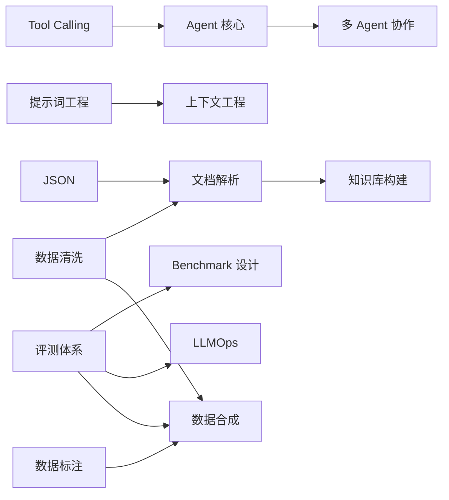
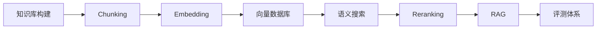
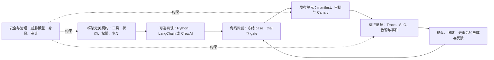

# AI Agent Engineer 学习路线

这是一张课程地图，不是一条要求所有人从头走到尾的流水线。先按目标选择角色路径，再回到课程地图补前置；每门课以“能交付什么、怎样验证”为完成条件，而不是以“读完页面”为完成条件。

> [!info] 路线状态
> 本路线于 2026-07-21 依据当前课程、示例测试和公开站点规则复核。协议、SDK、模型目录和法规等易变内容应以各课的 `source_checked`、稳定/实验标记及当前官方资料为准。
>
> 57 门顶层课程现已全部迁移到可验证的 v2 ID、知识域、目录序、硬前置与角色顺序。旧 `ai_learning_stage/order` 暂时只驱动本页的可勾选 Dataview 阶段地图；公开首页和课程导航使用 v2 字段。勾选产生的个人完成状态只保存在本地，公开构建会移除它。字段合同见 [[维护记录/学习路线元数据v2规范|学习路线元数据 v2 规范]]。

## 课程地图

<!-- AI_LEARNING_CATALOG:START -->
| 知识域 | 学习重点 |
| --- | --- |
| 工程与数学基础 | [[AI基础认知/00-目录\|AI基础认知]] · [[Python基础/00-目录\|Python基础]] · [[数据结构基础/00-目录\|数据结构基础]] · [[JSON/00-目录\|JSON]] · [[API/00-目录\|API]] · [[Markdown/00-目录\|Markdown]] · [[Git/00-目录\|Git]] · [[Linux命令/00-目录\|Linux命令]] · [[正则表达式/00-目录\|正则表达式]] · [[概率统计/00-目录\|概率统计]] · [[线性代数/00-目录\|线性代数]] · [[微积分基础/00-目录\|微积分基础]] · [[机器学习/00-目录\|机器学习]] · [[深度学习/00-目录\|深度学习]] |
| 模型与上下文 | [[现代LLM能力与模型选择/00-目录\|现代LLM能力与模型选择]] · [[提示词工程/00-目录\|提示词工程]] · [[上下文工程/00-目录\|上下文工程]] · [[LLM API集成/00-目录\|LLM API集成]] |
| 检索与数据 | [[向量基础/00-目录\|向量基础]] · [[数据清洗/00-目录\|数据清洗]] · [[数据标注/00-目录\|数据标注]] · [[文档解析/00-目录\|文档解析]] · [[知识库构建/00-目录\|知识库构建]] · [[Chunking策略/00-目录\|Chunking策略]] · [[Embedding/00-目录\|Embedding]] · [[向量数据库/00-目录\|向量数据库]] · [[语义搜索/00-目录\|语义搜索]] · [[Reranking/00-目录\|Reranking]] · [[RAG/00-目录\|RAG]] |
| 多模态 | [[多模态AI/00-目录\|多模态AI]] · [[OCR/00-目录\|OCR]] · [[语音识别/00-目录\|语音识别]] · [[语音合成/00-目录\|语音合成]] · [[实时多模态交互/00-目录\|实时多模态交互]] · [[图像生成/00-目录\|图像生成]] · [[视频生成/00-目录\|视频生成]] |
| Agent 运行时 | [[Tool Calling（含 Function Calling）/00-目录\|Tool Calling（含 Function Calling）]] · [[MCP/00-目录\|MCP]] · [[Agent 核心/00-目录\|Agent 核心]] · [[环境型Agent/00-目录\|环境型Agent]] · [[Agent Skills/00-目录\|Agent Skills]] · [[Agentic Design Patterns/00-目录\|Agentic Design Patterns]] · [[工作流自动化/00-目录\|工作流自动化]] · [[多Agent协作/00-目录\|多Agent协作]] |
| 框架实践 | [[LangChain/00-目录\|LangChain]] · [[CrewAI/00-目录\|CrewAI]] |
| 评测与可靠性 | [[数据可视化/00-目录\|数据可视化]] · [[评测体系/00-目录\|评测体系]] · [[Benchmark设计/00-目录\|Benchmark设计]] · [[数据合成/00-目录\|数据合成]] |
| 安全与治理 | [[AI安全/00-目录\|AI安全]] · [[隐私计算/00-目录\|隐私计算]] · [[AI治理/00-目录\|AI治理]] |
| 生产运维 | [[MLOps/00-目录\|MLOps]] · [[运行监控/00-目录\|运行监控]] · [[LLMOps/00-目录\|LLMOps]] |
| 前沿与参考 | [[A2A/00-目录\|A2A]] |
<!-- AI_LEARNING_CATALOG:END -->

## 四条角色化路径

| 路径 | 建议顺序 | 主要学习产物 | 掌握证据 |
| --- | --- | --- | --- |
| Agent 应用开发 | AI 基础认知 → 工程基础按能力补齐 → 现代 LLM/提示词/上下文/API → [[#早期安全与评测 Milestone\|早期 milestone]] → Tool Calling/Agent 核心 → 按需 runtime 与框架 → 工作流 → 数据与完整评测 → LLMOps → 安全/隐私 → 可选多 Agent/A2A | 一个有状态、可审批、可恢复的单 Agent | 离线测试覆盖权限、幂等、终止、恶意观察和失败恢复；能解释何时退回确定性 workflow |
| RAG 与知识库 | AI 基础认知 → LLM 应用基础 → [[#早期安全与评测 Milestone\|早期 milestone]] → 数据质量/文档解析/知识库 → Chunking/向量/Embedding/检索/重排 → RAG → 可视化与完整评测 → 安全/隐私；多模态摄取与 LangChain 均为可选分支 | 一条有 ACL、可引用、可更新、可定位失败的双管线 RAG | 分开报告摄取、检索、生成和端到端指标；能从错误样本定位责任层 |
| Agent 平台与可靠性 | AI 基础认知 → LLM 与 Agent 核心 → 按需 runtime/框架 → 工作流 → 数据质量/评测/合成/Benchmark → MLOps/LLMOps/监控 → 安全/隐私/治理 → 多 Agent 协作 → 按需 A2A 互操作 | 带 trace、发布门禁、灰度、回滚和事故演练的运行平台 | 多次 trial 有可比初态/终态；副作用、成本、延迟、安全与恢复均有门禁和审计证据 |
| 多模态与实时交互 | AI 基础认知 → 现代 LLM → 多模态 AI → OCR（推荐）与 ASR/TTS（核心） → Tool Calling/Agent 核心 → 数据与实时交互 → 完整评测/安全/隐私 → 可选生成媒体与多 Agent | 可被打断、能调用工具并保持会话状态的实时原型 | 测量首包/首音频/轮次延迟、打断成功率和恢复；能说明级联与端到端语音方案的取舍 |

上表是便于阅读的路线摘要；下方 v2 清单才是逐课顺序与 `core/recommended/optional` 定位的可校验快照。“→”表示推荐推进，不表示所有中间课都必须完整学习。[[#早期安全与评测 Milestone|早期安全与评测 milestone]] 是已有章节组成的早期质量门，不是一门虚构的新课，也不表示必须提前完成整门 AI 安全或评测体系；生产发布前仍要完成与系统风险相称的其余安全、评测和治理内容。MCP 只在需要标准化连接外部能力或上下文时加入；A2A 只在独立 Agent 应用需要跨框架或跨组织互操作时加入；LangChain/LangGraph、CrewAI 或普通 Python 应由状态、恢复、协作和控制需求决定，均不是所有项目的硬前置。

## 机器可校验的角色路径

下列清单由 57 门课程入口的 v2 track 元数据生成，并在公开构建时逐字校验。顺序表示这条角色路径中的学习推进；“推荐”和“可选”不会自动升级为完整课程硬前置。

<!-- AI_LEARNING_ROLE_TRACKS:START -->
### Agent 应用开发

共 32 门：9 门核心、13 门推荐、10 门可选。

| 顺序 | 课程 | 定位 |
| ---: | --- | --- |
| 1 | [[AI基础认知/00-目录\|AI基础认知]] | 核心 |
| 2 | [[Python基础/00-目录\|Python基础]] | 推荐 |
| 3 | [[JSON/00-目录\|JSON]] | 推荐 |
| 4 | [[数据结构基础/00-目录\|数据结构基础]] | 推荐 |
| 5 | [[API/00-目录\|API]] | 推荐 |
| 6 | [[Markdown/00-目录\|Markdown]] | 推荐 |
| 7 | [[Git/00-目录\|Git]] | 推荐 |
| 8 | [[Linux命令/00-目录\|Linux命令]] | 可选 |
| 9 | [[正则表达式/00-目录\|正则表达式]] | 可选 |
| 10 | [[概率统计/00-目录\|概率统计]] | 推荐 |
| 11 | [[机器学习/00-目录\|机器学习]] | 推荐 |
| 12 | [[现代LLM能力与模型选择/00-目录\|现代LLM能力与模型选择]] | 核心 |
| 13 | [[提示词工程/00-目录\|提示词工程]] | 核心 |
| 14 | [[上下文工程/00-目录\|上下文工程]] | 核心 |
| 15 | [[LLM API集成/00-目录\|LLM API集成]] | 核心 |
| 16 | [[Tool Calling（含 Function Calling）/00-目录\|Tool Calling（含 Function Calling）]] | 核心 |
| 17 | [[Agent 核心/00-目录\|Agent 核心]] | 核心 |
| 18 | [[MCP/00-目录\|MCP]] | 可选 |
| 19 | [[环境型Agent/00-目录\|环境型Agent]] | 可选 |
| 20 | [[Agent Skills/00-目录\|Agent Skills]] | 可选 |
| 21 | [[Agentic Design Patterns/00-目录\|Agentic Design Patterns]] | 可选 |
| 22 | [[LangChain/00-目录\|LangChain]] | 可选 |
| 23 | [[CrewAI/00-目录\|CrewAI]] | 可选 |
| 24 | [[工作流自动化/00-目录\|工作流自动化]] | 核心 |
| 25 | [[数据标注/00-目录\|数据标注]] | 推荐 |
| 26 | [[数据可视化/00-目录\|数据可视化]] | 推荐 |
| 27 | [[评测体系/00-目录\|评测体系]] | 推荐 |
| 28 | [[LLMOps/00-目录\|LLMOps]] | 推荐 |
| 29 | [[AI安全/00-目录\|AI安全]] | 核心 |
| 30 | [[隐私计算/00-目录\|隐私计算]] | 推荐 |
| 31 | [[多Agent协作/00-目录\|多Agent协作]] | 可选 |
| 32 | [[A2A/00-目录\|A2A]] | 可选 |

### RAG 与知识库

共 35 门：17 门核心、12 门推荐、6 门可选。

| 顺序 | 课程 | 定位 |
| ---: | --- | --- |
| 1 | [[AI基础认知/00-目录\|AI基础认知]] | 核心 |
| 2 | [[Python基础/00-目录\|Python基础]] | 推荐 |
| 3 | [[JSON/00-目录\|JSON]] | 核心 |
| 4 | [[数据结构基础/00-目录\|数据结构基础]] | 可选 |
| 5 | [[API/00-目录\|API]] | 推荐 |
| 6 | [[Markdown/00-目录\|Markdown]] | 推荐 |
| 7 | [[Git/00-目录\|Git]] | 推荐 |
| 8 | [[Linux命令/00-目录\|Linux命令]] | 可选 |
| 9 | [[正则表达式/00-目录\|正则表达式]] | 推荐 |
| 10 | [[概率统计/00-目录\|概率统计]] | 推荐 |
| 11 | [[线性代数/00-目录\|线性代数]] | 推荐 |
| 12 | [[机器学习/00-目录\|机器学习]] | 推荐 |
| 13 | [[现代LLM能力与模型选择/00-目录\|现代LLM能力与模型选择]] | 核心 |
| 14 | [[提示词工程/00-目录\|提示词工程]] | 核心 |
| 15 | [[上下文工程/00-目录\|上下文工程]] | 核心 |
| 16 | [[LLM API集成/00-目录\|LLM API集成]] | 核心 |
| 17 | [[多模态AI/00-目录\|多模态AI]] | 可选 |
| 18 | [[数据清洗/00-目录\|数据清洗]] | 核心 |
| 19 | [[OCR/00-目录\|OCR]] | 可选 |
| 20 | [[语音识别/00-目录\|语音识别]] | 可选 |
| 21 | [[文档解析/00-目录\|文档解析]] | 核心 |
| 22 | [[知识库构建/00-目录\|知识库构建]] | 核心 |
| 23 | [[Chunking策略/00-目录\|Chunking策略]] | 核心 |
| 24 | [[向量基础/00-目录\|向量基础]] | 推荐 |
| 25 | [[Embedding/00-目录\|Embedding]] | 核心 |
| 26 | [[向量数据库/00-目录\|向量数据库]] | 核心 |
| 27 | [[语义搜索/00-目录\|语义搜索]] | 核心 |
| 28 | [[数据标注/00-目录\|数据标注]] | 推荐 |
| 29 | [[Reranking/00-目录\|Reranking]] | 核心 |
| 30 | [[RAG/00-目录\|RAG]] | 核心 |
| 31 | [[数据可视化/00-目录\|数据可视化]] | 推荐 |
| 32 | [[LangChain/00-目录\|LangChain]] | 可选 |
| 33 | [[评测体系/00-目录\|评测体系]] | 核心 |
| 34 | [[AI安全/00-目录\|AI安全]] | 核心 |
| 35 | [[隐私计算/00-目录\|隐私计算]] | 推荐 |

### Agent 平台与可靠性

共 38 门：14 门核心、16 门推荐、8 门可选。

| 顺序 | 课程 | 定位 |
| ---: | --- | --- |
| 1 | [[AI基础认知/00-目录\|AI基础认知]] | 核心 |
| 2 | [[Python基础/00-目录\|Python基础]] | 推荐 |
| 3 | [[JSON/00-目录\|JSON]] | 推荐 |
| 4 | [[数据结构基础/00-目录\|数据结构基础]] | 推荐 |
| 5 | [[API/00-目录\|API]] | 推荐 |
| 6 | [[Markdown/00-目录\|Markdown]] | 推荐 |
| 7 | [[Git/00-目录\|Git]] | 推荐 |
| 8 | [[Linux命令/00-目录\|Linux命令]] | 推荐 |
| 9 | [[正则表达式/00-目录\|正则表达式]] | 可选 |
| 10 | [[概率统计/00-目录\|概率统计]] | 推荐 |
| 11 | [[机器学习/00-目录\|机器学习]] | 推荐 |
| 12 | [[现代LLM能力与模型选择/00-目录\|现代LLM能力与模型选择]] | 核心 |
| 13 | [[提示词工程/00-目录\|提示词工程]] | 核心 |
| 14 | [[上下文工程/00-目录\|上下文工程]] | 核心 |
| 15 | [[LLM API集成/00-目录\|LLM API集成]] | 核心 |
| 16 | [[Tool Calling（含 Function Calling）/00-目录\|Tool Calling（含 Function Calling）]] | 核心 |
| 17 | [[Agent 核心/00-目录\|Agent 核心]] | 核心 |
| 18 | [[MCP/00-目录\|MCP]] | 可选 |
| 19 | [[环境型Agent/00-目录\|环境型Agent]] | 可选 |
| 20 | [[Agent Skills/00-目录\|Agent Skills]] | 可选 |
| 21 | [[Agentic Design Patterns/00-目录\|Agentic Design Patterns]] | 可选 |
| 22 | [[LangChain/00-目录\|LangChain]] | 可选 |
| 23 | [[CrewAI/00-目录\|CrewAI]] | 可选 |
| 24 | [[工作流自动化/00-目录\|工作流自动化]] | 核心 |
| 25 | [[数据清洗/00-目录\|数据清洗]] | 推荐 |
| 26 | [[数据标注/00-目录\|数据标注]] | 推荐 |
| 27 | [[数据可视化/00-目录\|数据可视化]] | 推荐 |
| 28 | [[评测体系/00-目录\|评测体系]] | 核心 |
| 29 | [[数据合成/00-目录\|数据合成]] | 推荐 |
| 30 | [[Benchmark设计/00-目录\|Benchmark设计]] | 核心 |
| 31 | [[MLOps/00-目录\|MLOps]] | 推荐 |
| 32 | [[LLMOps/00-目录\|LLMOps]] | 核心 |
| 33 | [[运行监控/00-目录\|运行监控]] | 核心 |
| 34 | [[AI安全/00-目录\|AI安全]] | 核心 |
| 35 | [[隐私计算/00-目录\|隐私计算]] | 推荐 |
| 36 | [[AI治理/00-目录\|AI治理]] | 核心 |
| 37 | [[多Agent协作/00-目录\|多Agent协作]] | 推荐 |
| 38 | [[A2A/00-目录\|A2A]] | 可选 |

### 多模态与实时交互

共 29 门：10 门核心、13 门推荐、6 门可选。

| 顺序 | 课程 | 定位 |
| ---: | --- | --- |
| 1 | [[AI基础认知/00-目录\|AI基础认知]] | 核心 |
| 2 | [[Python基础/00-目录\|Python基础]] | 推荐 |
| 3 | [[JSON/00-目录\|JSON]] | 推荐 |
| 4 | [[数据结构基础/00-目录\|数据结构基础]] | 可选 |
| 5 | [[API/00-目录\|API]] | 推荐 |
| 6 | [[Markdown/00-目录\|Markdown]] | 推荐 |
| 7 | [[Git/00-目录\|Git]] | 推荐 |
| 8 | [[Linux命令/00-目录\|Linux命令]] | 可选 |
| 9 | [[正则表达式/00-目录\|正则表达式]] | 可选 |
| 10 | [[概率统计/00-目录\|概率统计]] | 推荐 |
| 11 | [[线性代数/00-目录\|线性代数]] | 推荐 |
| 12 | [[机器学习/00-目录\|机器学习]] | 推荐 |
| 13 | [[深度学习/00-目录\|深度学习]] | 推荐 |
| 14 | [[现代LLM能力与模型选择/00-目录\|现代LLM能力与模型选择]] | 核心 |
| 15 | [[多模态AI/00-目录\|多模态AI]] | 核心 |
| 16 | [[OCR/00-目录\|OCR]] | 推荐 |
| 17 | [[语音识别/00-目录\|语音识别]] | 核心 |
| 18 | [[语音合成/00-目录\|语音合成]] | 核心 |
| 19 | [[Tool Calling（含 Function Calling）/00-目录\|Tool Calling（含 Function Calling）]] | 核心 |
| 20 | [[Agent 核心/00-目录\|Agent 核心]] | 核心 |
| 21 | [[数据标注/00-目录\|数据标注]] | 推荐 |
| 22 | [[数据可视化/00-目录\|数据可视化]] | 推荐 |
| 23 | [[实时多模态交互/00-目录\|实时多模态交互]] | 核心 |
| 24 | [[评测体系/00-目录\|评测体系]] | 核心 |
| 25 | [[AI安全/00-目录\|AI安全]] | 核心 |
| 26 | [[隐私计算/00-目录\|隐私计算]] | 推荐 |
| 27 | [[图像生成/00-目录\|图像生成]] | 可选 |
| 28 | [[视频生成/00-目录\|视频生成]] | 可选 |
| 29 | [[多Agent协作/00-目录\|多Agent协作]] | 可选 |
<!-- AI_LEARNING_ROLE_TRACKS:END -->

## 早期安全与评测 Milestone

这个 milestone 只复用现有课程中的必要章节。在让模型读取不可信外部内容、连接远程能力或执行工具前，至少完成下列小闭环：

| 质量门 | 复用章节 | 完成证据 |
| --- | --- | --- |
| 早期安全 | [[AI安全/01-基础与风险/01-资产信任边界与威胁建模\|资产、信任边界与威胁建模]] → [[AI安全/01-基础与风险/02-提示注入与间接注入\|提示注入与间接注入]] → [[AI安全/01-基础与风险/03-工具越权与数据外泄\|工具越权与数据外泄]] → [[AI安全/02-控制与治理/04-身份最小权限与供应链\|身份与最小权限]] | 一张标出不可信输入、受保护资产、身份、授权点和最大副作用的威胁模型 |
| 评测基础 | [[评测体系/01-基础与设计/01-评测目标与基本单元\|评测目标与基本单元]] → [[评测体系/01-基础与设计/02-用例数据集与分层\|用例数据集与分层]] → [[评测体系/02-方法与质量/03-确定性断言指标与评分规则\|确定性断言、指标与评分规则]] | 一份写清目标、典型/边界/失败用例和至少一个确定性断言的最小评测卡 |

这里的完成证据只允许学习者开始受控实践，不是生产安全、完整评测、渗透测试或发布批准。完整课程仍分别进入 [[AI安全/00-目录|AI 安全]] 与 [[评测体系/00-目录|评测体系]]。

## 机器可校验的硬前置关系

下面只画**完整课程级硬前置**，不把 track 推荐顺序、早期 milestone 或“建议先学”伪装成依赖。网站构建会校验前置存在、无环、同角色可见、顺序更早，以及 core 闭包。

| 关系 | 证据边界 |
| --- | --- |
| [[JSON/00-目录\|JSON]] + [[数据清洗/00-目录\|数据清洗]] → [[文档解析/00-目录\|文档解析]] | 文档解析入口明确要求先完成两者；在 RAG track 中都为 core 且顺序更早 |
| [[文档解析/00-目录\|文档解析]] → [[知识库构建/00-目录\|知识库构建]] | 知识库构建入口明确要求先完成文档解析 |
| [[提示词工程/00-目录\|提示词工程]] → [[上下文工程/00-目录\|上下文工程]] | 上下文工程入口使用“先完成”强语义；Embedding/RAG 只属后续联结，不是本课硬前置 |
| [[Tool Calling（含 Function Calling）/00-目录\|Tool Calling]] → [[Agent 核心/00-目录\|Agent 核心]] | 两条 Agent 主线与多模态工具路线的硬前置 |
| [[评测体系/00-目录\|评测体系]] → [[LLMOps/00-目录\|LLMOps]] | LLMOps 发布门与回归证据的硬前置 |
| [[评测体系/00-目录\|评测体系]] → [[Benchmark设计/00-目录\|Benchmark 设计]] | Benchmark 入口明确要求先掌握 case、grader 与回归合同 |
| [[数据清洗/00-目录\|数据清洗]] + [[数据标注/00-目录\|数据标注]] + [[评测体系/00-目录\|评测体系]] → [[数据合成/00-目录\|数据合成]] | 数据合成入口使用“先学习”强语义；平台 track 中三项均可见且顺序更早 |
| [[Agent 核心/00-目录\|Agent 核心]] → [[多Agent协作/00-目录\|多 Agent 协作]] | 多 Agent 入口明确要求先完成 Agent 核心；工作流是推荐顺序，具体框架可选 |

其余课程用 `hard_prerequisites: []` 表示“逐页审阅后未发现普遍课程级硬前置”，再用角色 track 表达推荐顺序。57 门入口均已完成这一判断；“建议先学”“具备某个局部能力”或“项目中通常先做”不会被擅自升级为整门课程依赖。

### RAG 角色顺序不是硬依赖图

Chunking、Embedding、向量数据库、语义搜索与 Reranking 已逐页复核并进入 RAG track。它们之间存在稳定的系统集成顺序，但各课首页只要求按需复习相关能力，且课程可单独学习、替换实现或并行实践，因此没有升级为“必须完整学完上一门课”的课程级硬边。

> [!note] 图中箭头表示 RAG 角色路线的推荐顺序，不进入课程级硬前置 DAG。实际项目常会并行迭代分块、表示、召回、重排与评测；学习者也可只进入其中一个模块做专项工程。

## 内容层级

| 层级 | 用法 | 当前代表内容 |
| --- | --- | --- |
| 核心课程 | 建立可迁移的 Agent 工程契约，优先学习 | 现代 LLM 能力与模型选择、提示词工程、上下文工程、LLM API、Tool Calling、Agent 核心、评测体系、AI 安全 |
| 进阶课程 | 围绕岗位或系统边界选择 | RAG 全链路、MCP、环境型 Agent、工作流自动化、LLMOps、运行监控、多 Agent、多模态与实时交互 |
| 前沿专题 | 记录规范基线、采用状态和兼容策略，不作为稳定前置 | 已形成可选课程的 A2A 1.0；仍处观察层的 MCP 扩展与 Apps、实验性 Tasks、AG-UI，以及新型 benchmark |
| 实践项目 | 把概念变成可运行证据 | 各课程末尾的离线项目、fixtures、负向测试和评测图 |
| 参考资料 | 按需查阅，不淹没原创主线 | Python/深度学习历史完整教程、框架与官方文档整理层、生成模态的专项资料 |

## 内容来源与状态

本库用 `content_origin` 区分原创讲解、资料整理与第三方材料，用 `content_status` 区分已验证、动态、待复核和冻结参考。字段缺失表示历史页面尚未分类，**不**表示默认原创或已经验证。定义、许可边界和深审流程见 [[维护记录/内容质量与来源标记规范|内容质量与来源标记规范]]。

课程中的产品/API 快照还要结合 `source_checked`、版本和实际测试阅读；第三方完整复刻若缺少公开再分发证据，只在本地参考层保留，公开网站用来源说明页代替正文。

## 学习闭环

完成一门课程时，至少留下五类证据：

1. 一张能说清系统边界、状态或数据流的图，或一份等价的结构说明；
2. 一个小而真实的实现，输入、输出、权限和失败语义明确；
3. 至少一个预期失败用例，而不只有成功演示；
4. 可重复的验证命令和结果记录；
5. 一段说明“何时不该使用本技术”的决策边界。

若课程首页已有更严格的掌握标准，以课程首页为准。框架、供应商和模型只作为实现样例；核心判断应能迁移到其他实现。

## 从框架到生产反馈的证据闭环

框架只是把已有契约落到代码中的一个可选实现层：选择普通 Python、LangChain 或 CrewAI，不会免除工具权限、状态恢复、评测、发布或运行责任。下图描述一个项目如何把一次实现变成可追溯的长期改进循环；它不是课程级硬前置图，也不代表任一框架自动提供安全、正确性或生产可靠性。

*图 3　框架到生产反馈的证据闭环。文字替代：先把工具、状态、权限和恢复定义成框架无关合同，再选用 Python 或可选框架实现；冻结的离线 case、trial 与 gate 支持一个可追溯发布单元；Canary 进入运行后，Trace、SLO、告警和事件提供观察证据；只有经过确认、脱敏、去重和版本化的失败才回灌评测。安全与治理在合同、发布和运行三处设置约束。Mermaid 源码即再生成方式。*

实现层可从 [[Tool Calling（含 Function Calling）/00-目录|Tool Calling]]、[[Agent 核心/00-目录|Agent 核心]] 开始，再按控制需求选择 [[LangChain/00-目录|LangChain]] 或 [[CrewAI/00-目录|CrewAI]]。评测到运行的字段、摘要和人工交接可直接从 [[评测体系/02-方法与质量/08-离线到线上证据交接与回归闭环|离线到线上证据交接与回归闭环]] 学起，再由 [[LLMOps/00-目录|LLMOps]] 与 [[运行监控/00-目录|运行监控]] 深化；[[AI安全/00-目录|AI 安全]] 和 [[AI治理/00-目录|AI 治理]] 约束整条链，而不是在上线末尾补一份清单。

## 进阶与研究方向

| 方向 | 何时学习 | 边界 |
| --- | --- | --- |
| 模型适配与私有部署 | 提示词、RAG、工具和模型选择仍无法满足质量、隐私或成本约束时 | 先建立任务级评测和可回退基线，再比较 fine-tuning、LoRA、量化与推理服务 |
| 对齐与强化学习 | 需要研究偏好优化、模型训练或行为控制时 | 不作为一般 Agent 应用开发前置 |
| 协议与系统前沿 | 已能区分稳定规范、扩展和候选版本，并承担兼容验证时 | 记录版本、实现支持和采用证据，避免把草案写成稳定结论 |
| AGI/通用系统研究 | 作为研究视野 | 与可交付 Agent 工程课程分层维护 |

阶段审计与取舍记录见 [[维护记录/2026-07-18-内容审计与重构记录|2026-07-18 内容审计与重构记录]]、[[维护记录/2026-07-19-第二阶段内容深审记录|2026-07-19 第二阶段内容深审记录]]、[[维护记录/2026-07-19-第三阶段框架恢复与路线元数据记录|2026-07-19 第三阶段框架恢复与路线元数据记录]]、[[维护记录/2026-07-19-第四阶段RAG评测安全生产证据链记录|2026-07-19 第四阶段 RAG、评测、安全与生产证据链记录]]、[[维护记录/2026-07-19-第五阶段来源MCP工具结果证据链记录|2026-07-19 第五阶段来源、MCP 与工具结果证据链记录]]、[[维护记录/2026-07-19-第六阶段跨模块传输持久化证据链记录|2026-07-19 第六阶段跨模块、传输与持久化证据链记录]]、[[维护记录/2026-07-19-第七阶段外部来源工件与路线可移植性记录|2026-07-19 第七阶段外部来源工件与路线可移植性记录]]、[[维护记录/2026-07-19-第八阶段三家Provider合同与流式状态机记录|2026-07-19 第八阶段三家 Provider 合同与流式状态机记录]]、[[维护记录/2026-07-20-第九阶段动态资料发布门禁与运行时审计记录|2026-07-20 第九阶段动态资料、发布门禁与运行时审计记录]]、[[维护记录/2026-07-20-第十阶段来源许可路线元数据与OpenAI动态页记录|2026-07-20 第十阶段来源许可、路线元数据与 OpenAI 动态页记录]]与[[维护记录/2026-07-21-第十一阶段检索来源MCP与路线元数据记录|2026-07-21 第十一阶段检索、来源、MCP 与路线元数据记录]]。

本轮全量迁移、消费者收敛与验证证据见 [[维护记录/2026-07-21-第十二阶段全量路线元数据与消费者收敛记录|2026-07-21 第十二阶段全量路线元数据与消费者收敛记录]]。

本轮 A2A 前沿课程、安全评测生产化深审与受控 stub 取舍见 [[维护记录/2026-07-21-第十三阶段A2A协议课程与安全评测生产化深审记录|2026-07-21 第十三阶段 A2A 协议课程与安全评测生产化深审记录]]。

本轮 Agent 运行时状态不变量、Context Pack 可信控制面与失败关闭深审见 [[维护记录/2026-07-21-第十四阶段Agent运行时与上下文可信控制面深审记录|2026-07-21 第十四阶段 Agent 运行时与上下文可信控制面深审记录]]。

本轮提示词版本化资产、三家 Provider 状态合同、检索安全评测与向量删除/并发语义深审见 [[维护记录/2026-07-21-第十五阶段提示词API与检索状态合同深审记录|2026-07-21 第十五阶段提示词、API 与检索状态合同深审记录]]。

本轮 Tool Calling 审计与持久恢复、MCP pending/传输语义、RAG 事件身份和知识库在线 ACL/投影边界深审见 [[维护记录/2026-07-21-第十六阶段工具协议与RAG生命周期深审记录|2026-07-21 第十六阶段工具协议与 RAG 生命周期深审记录]]。

本轮 LangChain/CrewAI 运行时合同与离线—线上生产反馈闭环深审见 [[维护记录/2026-07-21-第十七阶段框架运行时与生产反馈闭环深审记录|2026-07-21 第十七阶段框架运行时与生产反馈闭环深审记录]]。

本轮基础学习入口、模型决策证据、检索控制面、动态组件治理与协作恢复深审见 [[维护记录/2026-07-22-第十八阶段决策证据检索控制面与协作恢复深审记录|2026-07-22 第十八阶段决策证据、检索控制面与协作恢复深审记录]]。

本轮摄取与知识库投影、数据质量、媒体/OCR 证据及实时恢复合同深审见 [[维护记录/2026-07-22-第十九阶段摄取数据多模态与实时合同深审记录|2026-07-22 第十九阶段摄取、数据、多模态与实时合同深审记录]]。

本轮协议输入、Agent 委派、机器学习、生成媒体与工作流控制面深审见 [[维护记录/2026-07-22-第二十阶段协议媒体机器学习与工作流合同深审记录|2026-07-22 第二十阶段协议、媒体、机器学习与工作流合同深审记录]]。

本轮厂商 API、数据标注、深度学习工程路线与语音 I/O 合同深审见 [[维护记录/2026-07-22-第二十一阶段深度学习语音数据标注与厂商API合同深审记录|2026-07-22 第二十一阶段深度学习、语音、数据标注与厂商 API 合同深审记录]]。

本轮实时会话、环境执行与多 Agent 身份/冲突控制面深审见 [[维护记录/2026-07-22-第二十二阶段实时环境与多Agent控制面深审记录|2026-07-22 第二十二阶段实时、环境与多 Agent 控制面深审记录]]。

本轮安全/治理控制、离线评测、发布门与运行监控生产证据链深审见 [[维护记录/2026-07-22-第二十三阶段安全治理与生产证据链深审记录|2026-07-22 第二十三阶段安全、治理与生产证据链深审记录]]。

本轮检索证据、Agent Skills、MCP/Tool Calling、Agent 运行时与 LangChain/LangGraph 框架合同深审见 [[维护记录/2026-07-22-第二十四阶段检索工具与Agent运行时深审记录|2026-07-22 第二十四阶段检索、工具与 Agent 运行时深审记录]]。
