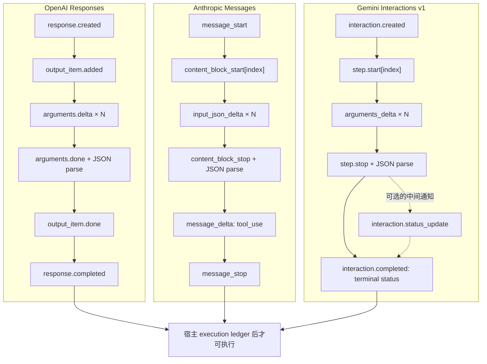

# 项目：三家 Provider 合同测试

> [!important] 证据边界
> 本项目完全离线，不读取密钥、不导入供应商 SDK、也不调用真实 API。它证明的是：在 **2026-07-21 固定的官方 API Reference 与 SDK 类型基线**下，事件投影解析、身份关联、终态门禁和续接 payload 满足本地合同；查阅机器 schema 时还必须单独核对其 API version，不能把 v1beta union 混入稳定 v1。OpenAI/Gemini fixture 是 `typed-sse-projection`，Anthropic 是 `wire-sse-envelope-projection`；它们不是真实 SSE 字节、SDK 实例或 live conformance 证据。

## 为什么要在可靠客户端之后再做一层

[[LLM API集成/07-可靠客户端项目与自测|可靠客户端项目]]解决供应商无关的责任：超时边界、单一重试预算、暂时/永久错误、partial 与 terminal、operation ID 和可观测性。它有意使用本地 canonical 事件，所以不能证明真实 Provider 合同。

本项目补上下一层：分别消费 OpenAI Responses、Anthropic Messages 与 Gemini Interactions v1 的事件形状，并构造各自的工具结果续接。三家共享“模型提出调用、宿主执行、结果再回传”的概念，但没有一个无损的通用 wire JSON：

| 边界    | OpenAI Responses                                                                          | Anthropic Messages                                 | Gemini Interactions v1                                       |
| ----- | ----------------------------------------------------------------------------------------- | -------------------------------------------------- | ------------------------------------------------------------ |
| 一轮输出  | 有序异构 `output` Items                                                                       | 有序 `content` blocks                                | 有序 `steps`                                                   |
| 客户端调用 | `function_call` Item                                                                      | `tool_use` block                                   | `function_call` step                                         |
| 结果关联键 | `call_id`，不是 Item `id`                                                                    | `tool_use_id`                                      | `call_id`，对应 function-call step `id`                         |
| 工具轮终态 | `response.completed` 后检查 output；completed 仍可能只有调用                                         | `message_stop`，最终 `stop_reason=tool_use`           | `interaction.completed`，Interaction `status=requires_action` |
| 有状态续接 | 普通 HTTP `previous_response_id`；前序 Response 必须可检索                                          | 无服务端对话句柄；重放完整消息历史                                  | `previous_interaction_id`；前序 Interaction 必须已存储               |
| 无状态续接 | canonical prior input Items + 本轮完整 output Items + results                                 | 本来就是完整历史重放                                         | 统一 Step 数组；create 快照补 prior input，GET 快照不再重复补                |
| 配置重发  | 官方明确 `instructions` 不随 previous ID 继承；本地策略还显式重发 tools/tool choice 等 caller-owned controls | `system`、tools、messages 与 request controls 都由调用方发送 | previous ID 不继承 tools、system 或生成配置                           |
| 流式关联  | `sequence_number + output_index + item_id`                                                | block `index`                                      | step `index` 仅作流内关联；可选 `event_id` 可用于续流去重                    |

这里的内部 dataclass 只提供编排所需的有限投影，同时保留原始 Item/block/step。它不把 Provider 字段重命名后谎称三家语义相同。

解析完成后，三家 turn 都保存一个本地 canonical snapshot digest。续接构造器会在复制 history、call identity 或 opaque block 前重新核对 digest；这只能检测本地对象在解析后被意外变异，不能替代签名、数据库 CAS 或跨进程真实性证明。工具声明还必须包含本轮实际观察到的 function name，避免把另一套同形状 schema 静默套到结果上。

## 先纠正两个容易过时的结论

### Gemini Interactions 已经 GA

截至 2026-07-21，Google 官方说明 Interactions 自 **2026 年 6 月起 Generally Available**，稳定端点进入 `v1`；它不应再标为 preview/beta。GenerateContent 则被官方称为 **legacy but fully supported**：它仍是稳定、广泛存在且需要维护的 API，不等于 deprecated 或即将下线。

稳定性要分四层记录：

| 层 | 应记录什么 | 本项目基线 |
| --- | --- | --- |
| API 版本 | `v1` 还是可变化的 `v1beta` | Interactions `v1` |
| API family | 端点自身 GA、legacy 或 preview | Interactions GA；GenerateContent legacy 且完整支持 |
| 模型 | 精确模型 ID 是否 stable/preview | fixture 使用合成 opaque 值，不宣称 live 可用性 |
| 单项能力与 SDK | schema/tool 组合、SDK 默认端点和具体行为 | `google-genai 2.12.1`；真实 Client 仍应显式选择 `api_version="v1"` |

Interactions 的 2026 年 5—6 月迁移曾把 `outputs` 改为 `steps`，并更改结构化输出和 SSE 事件。旧博客、旧 fixture 或缓存中的 `outputs` 不属于当前 v1 合同。

### SDK 自动重试不是服务端幂等

截至核验日，OpenAI Responses 与 Anthropic Messages 的公开参考及当前 Python SDK 都没有提供可据以宣称 `/responses` 或 `/messages` **服务端 exactly-once** 的通用幂等合同；Google 资料中也没有找到生成请求的通用幂等键承诺。后一句是基于官方资料未发现该合同的审计结论，不是“服务端绝对没有内部去重”的证明。

三家 Python SDK 又都可能默认重试部分连接、超时、429 或 5xx。于是：

```text
SDK 自动重试 ≠ 服务端去重 ≠ 工具副作用幂等 ≠ exactly-once
```

安全基线是：先把 Provider 一轮完整落到终态，再把待执行调用写入宿主 execution ledger；写工具还需业务幂等键、审批与结果对账。超时后重新 POST 可能得到新的 response/message/interaction 和新的 call ID，不能只用 Provider call ID 充当业务唯一键。

## 项目文件

| 文件 | 职责 |
| --- | --- |
| [[LLM API集成/examples/provider_contracts/provider_contracts.py\|provider_contracts.py]] | strict fixture loader、三家独立状态机、opaque identity、结果集合绑定和五种续接构造器 |
| [[LLM API集成/examples/provider_contracts/test_provider_contracts.py\|test_provider_contracts.py]] | 99 项正常、漂移、交错、截断、错误、重放、来源攻击与越界测试 |
| [[LLM API集成/examples/provider_contracts/fixtures/openai_responses_tool_stream.json\|OpenAI fixture]] | 当前 Responses Reference 的 `sequence_number`、参数 delta/done、Item done 与 terminal output |
| [[LLM API集成/examples/provider_contracts/fixtures/anthropic_messages_tool_stream.json\|Anthropic fixture]] | named SSE envelope 投影、ping、text/tool block、`input_json_delta` 与 `message_stop` |
| [[LLM API集成/examples/provider_contracts/fixtures/gemini_interactions_tool_stream.json\|Gemini fixture]] | Interactions GA v1 的 typed SSE 投影、`event_id`、argument delta、status 与 terminal |

三份 fixture 都固定记录 provider、API family/version、contract revision、SDK baseline、核验日期和官方 URL。loader 将 URL 绑定到对应官方文档域与 SDK GitHub repository；GitHub path 会先逐 segment 校验 percent encoding 并解码，再拒绝 `.`/`..`、空 segment、重复或编码分隔符、反斜杠、嵌套编码及跨仓库路径。userinfo、仿冒子域和非默认 HTTPS 端口也会失败；显式 `allow_local_source_urls=True` 只为本地 fixture harness 开放 loopback。该 allowlist 是元数据卫生检查，不是内容签名、TLS pinning 或真实性证明。示例 ID 与模型值是合成数据，不依赖文档示例中的 `resp_`、`msg_`、`toolu_`、`int_` 前缀。

## 运行项目

只使用 Python 3.11 标准库。从同时包含 `docs/` 与 `.website/` 的项目根目录执行：

```powershell
Push-Location -LiteralPath 'docs\LLM API集成\examples\provider_contracts'  # 进入 Provider 合同示例目录，确保测试按预期导入 fixture。
py -3.11 -B -W error -m unittest -v test_provider_contracts.py  # 在普通模式运行三家 Provider 的离线合同回归测试。
py -3.11 -O -B -W error -m unittest -v test_provider_contracts.py  # 在优化模式复跑，证明关键检查不依赖裸 assert。
Pop-Location  # 恢复调用前的工作目录。
```

`-B` 禁止生成 bytecode，`-W error` 把 warning 当失败；`-O` 证明关键门禁不依赖会被优化器移除的裸 `assert`。测试不会访问网络，也没有真实等待。

## 三套状态机，而不是一个事件名替换表



### 共同安全不变量

三套实现只共享下列宿主不变量：

1. 参数分片先按 Provider 身份键累计，完成事件后再做 strict JSON 解析；
2. 参数必须是 JSON object，重复字段、`NaN/Infinity`、非 UTF-8 文本、过深或过大值失败；
3. 并行调用不能靠“当前调用”单变量关联；
4. EOF、流内 error、失败/截断 terminal 和非法顺序不会释放 provisional 调用；
5. 一个 turn 的每个调用必须恰有一个结果，不允许缺失、额外或重复结果；
6. Provider ID 视为 opaque text，不依赖示例前缀；
7. 已知必要字段缺失会失败，新增可选字段与未知遥测事件会被保留；未知 block/step/status 若可能改变执行语义则 fail closed。

“允许新增字段”与“发现漂移”不矛盾：fixture 元数据和已知关键字段是版本化 golden contract；原始 payload 仍保留，CI 可在升级 SDK/OpenAPI 时审阅 diff。把所有 Provider object 都设为 `additionalProperties:false` 会在官方新增可选字段时制造无意义事故。

## OpenAI Responses：Item、call ID 与完整 terminal

当前 Responses 函数参数流的权威字段是：

- `response.function_call_arguments.delta`：`delta`、`item_id`、`output_index`、`sequence_number`、`type`；
- `response.function_call_arguments.done`：再带完整 `arguments` 与 `name`；
- `response.output_item.done`：给出最终 function-call Item；
- `response.completed`：给出完整 Response。

本项目用 `(output_index, item_id)` 分离交错参数流，并要求 `sequence_number` 严格递增；不臆测序号一定从 0 开始或连续。delta 拼接值必须与 done、Item done 和 terminal output 中的身份与参数一致；非函数 Item 也必须逐索引绑定完整生命周期，不能只校验 `type`。

> [!warning] 官方资料的当前漂移
> Function calling 指南中的部分事件示例仍包含 `response_id` 且省略 `sequence_number`；2026-07-21 的 API Reference 与 `openai-python 2.46.0` 生成类型则要求 `sequence_number`，参数 delta/done 类型没有 `response_id`。本 fixture 以机器 Reference + 固定 SDK tag 为基线，同时允许未来额外字段。升级时应重新对照两处，而不是静默复制旧示例。

`response.completed` 只表示这次 Response 步骤完成；output 可能只有一个或多个 `function_call`，并不表示已经得到最终 assistant 文本。编排器必须继续工具循环，直到出现经过业务验证的最终 message/refusal，或明确失败、截断与取消。terminal 还必须包含完整 output，并与先前观察到的 Item added/done 生命周期一致；不能因为函数调用配对正确，就忽略丢失的 reasoning、message 或其他非函数 Item。

有状态续接由 `build_openai_responses_continuation()` 构造：

```json
{
  "model": "fixture-model",
  "previous_response_id": "response-A",
  "store": false,
  "instructions": "每轮显式重发的受控指令",
  "tool_choice": "auto",
  "parallel_tool_calls": false,
  "max_output_tokens": 512,
  "tools": [
    {
      "type": "function",
      "name": "lookup_order",
      "parameters": {
        "type": "object",
        "properties": {"order_ref": {"type": "string"}},
        "required": ["order_ref"],
        "additionalProperties": false
      },
      "strict": true
    }
  ],
  "input": [
    {
      "type": "function_call_output",
      "call_id": "call-A",
        "output": "{\"status\":\"shipped\"}"
    }
  ]
}
```

字段阅读：

- `model` 是本地 fixture 的合成模型标识；真实部署应由受控模型配置提供。
- `previous_response_id` 绑定已被证明可服务端检索的前序 Response，不能用任意字符串替代。
- `store` 决定新一轮 Response 的存储选择；它与前序 Response 是否可续接是独立问题。
- `instructions` 必须在本轮显式发送，不能假定由前序 response 自动继承。
- `tool_choice`、`parallel_tool_calls` 与 `max_output_tokens` 是本地 request controls，应按业务预算与策略设置。
- `tools` 中的 `strict` 与 JSON Schema 约束函数参数形状，但不授予服务端权限。
- `input` 的 `function_call_output.call_id` 必须精确对应先前 function call，`output` 只应含经过校验的工具结果。

这里必须使用 `call_id`，不能错用 function-call Item `id`。对本项目覆盖的普通 HTTP `POST /responses`，`previous_response_was_stored=True` 是本地构造器要求的前置证明，表示前序 Response 可被服务端检索；它不是官方请求字段。Responses WebSocket mode 对当前连接最近一轮另有内存缓存例外，不属于这个构造器。新请求的 `store` 独立决定新 Response 是否保存，因此从已存储前序继续、同时让新一轮 `store=false` 是合法且不同的选择。

官方明确说明 `instructions` 不随 `previous_response_id` 继承；链中先前输入 token 仍作为输入计费，服务端句柄不是“免费上下文”。本项目进一步把 `tool_choice`、并行开关、输出预算与 tools 等 caller-owned controls 作为每请求配置，通过显式 `request_controls` 重发，并拒绝它们覆盖受保护字段。这是可审计的本地安全策略，不冒充所有字段都具有同一条官方“不继承”承诺。

若采用 `store=false`/ZDR 手工管理上下文，应传入 canonical prior input Item 对象，并按原顺序重放**每一个** `response.output` Item，尤其是 reasoning Items，再追加结果；本项目没有把这一路径缩成“只重放可见文本”。direct function caller 元数据会原样保留；尚未实现语义的 programmatic caller 与 namespace 会 fail closed，避免把不同调用来源错误降级成普通函数。

## Anthropic Messages：block 顺序与无状态历史

Anthropic fixture 是 **wire SSE envelope projection**：它保留 named event 与 JSON `data` 两层，并检查两者事件名一致，但不声称覆盖真实字节分帧或 SDK 解码。`ping` 可以出现；HTTP 已成功后仍可能收到 `event: error`。SDK 可能过滤 ping 并把 error 转成异常，所以 envelope projection 与 SDK-object fixture 不能混写为一层。

工具参数来自同一 block index 的多个 `input_json_delta.partial_json`。空字符串是合法 delta；零参数工具可由 block start 中的初始 `{}` 完成。只有 `content_block_stop` 后才解析对象，而只有最终 `message_delta.stop_reason=tool_use` 与 `message_stop` 都出现后才允许执行。若显式启用 eager/fine-grained 输入流，官方允许在流末得到不完整 JSON；本地状态机会把它放入 recovery calls，续接时强制返回 `is_error=true`，绝不能执行该输入。若同一截断 turn 还有已完整的兄弟调用，兄弟调用也进入 recovery，不能先行执行。

Messages 不用 response ID 续接。`build_anthropic_messages_continuation()` 明确重放：

1. 调用前的 `user/assistant` 历史；
2. 本轮完整 assistant content，包括工具前后的普通文本、thinking/redacted thinking、签名、server-tool blocks 与所有 `tool_use`；
3. 下一条 `user` 消息中的全部 `tool_result`；
4. 顶层 `system`、model、max tokens、同一 tools 定义与显式 request controls。

多个并行调用的结果必须位于同一条 user 消息中，且所有 `tool_result` 先于普通文本。Anthropic 原生支持 `is_error`，所以错误结果不应被伪装为成功文本。`server_tool_use` 是 Anthropic 执行的服务端工具；一轮同时出现 server/client tools 时，完整 assistant blocks 仍要重放，但只有客户端 `tool_use` 交给宿主执行。

本地 `AnthropicMessagesTurn.calls` 只暴露已经满足 `stop_reason=tool_use` 且输入可解析的 executable calls；非法 JSON 或 `max_tokens` 截断的调用进入独立 `recovery_calls`。这不是 Anthropic 的原生字段，而是为了让“先筛 `input_error is None` 再执行”的调用方也不能绕过整轮终态门禁。

顶层 `system` 可是字符串或 text-block 数组，仍是覆盖面最广的默认做法。Anthropic 当前也为少数已核验模型提供 mid-conversation system message；截至核验日包括 Fable 5、Mythos 5 与 Opus 4.8，不包括本库入门示例使用的 Sonnet 5。中途 system 必须紧随 user 轮次，或紧随以 server-tool result 结束的 assistant 轮次；连续 system 块可作为同一组，之后只能结束历史或接 assistant。构造器因此只有在调用方显式证明模型能力并满足这些位置约束时才允许历史中的 `role=system`；否则 fail closed。

> [!warning] 动态 beta：server-side fallback
> Anthropic 当前只为请求 **Claude Fable 5** 的 Claude API 与 Claude Platform on AWS 提供 server-side fallback beta；请求需带 `fallbacks` 并使用精确 beta `server-side-fallback-2026-06-01`，Message Batches、Amazon Bedrock、Google Cloud 与 Microsoft Foundry 不支持这一 server-side 参数。只有 safety classifier 的 decline 才触发 fallback；429/rate limit、overload 与 server error 会原样返回，不能把它们当成模型 fallback。允许的目标也不能靠教程硬编码：带该 beta 查询 Models API，并读取主模型条目的 `allowed_fallback_models`；空列表表示该主模型不支持 `fallbacks`。fallback 发生时，响应会加入 `{"type":"fallback","from":{"model":...},"to":{"model":...}}` block；流中它是没有 delta 的 `content_block_start/stop` 对，`usage.iterations` 还会出现 `fallback_message`。下一轮回放时 block 的位置也有语义，不能删除或移动。
>
> 本项目固定的是未启用该 beta 的 Messages wire projection，尚未实现 fallback 前后 thinking/tool block 的保留与丢弃规则。因此遇到 `fallback` block 会抛出 `UnsupportedProviderState`，新增红队测试证明不会把它当未知遥测忽略。只有另建 beta-specific fixture、固定 beta/SDK、覆盖 `usage.iterations` 与多轮 replay 后，才能安全支持；这里不根据文档片段猜解析。

当前已知 stop reason 包括 `end_turn`、`max_tokens`、`stop_sequence`、`tool_use`、`pause_turn`、`refusal` 与 `model_context_window_exceeded`。只有 `tool_use` 进入本项目的客户端工具执行路径；其他值和未来新值都保留原始类型并停止释放调用，生产 adapter 应为每类建立显式恢复路径。

## Gemini Interactions：GA v1、存储与续流

Interactions SSE 使用 `event_type`，当前基线包括：

- `interaction.created`；
- `step.start / step.delta / step.stop`；
- 可选且只表示中间进展的 `interaction.status_update`；
- `interaction.completed`；
- `error`。

函数参数位于 `arguments_delta.arguments` 字符串；该字段在 v1 schema 中可省略，所以缺失不能被字符串化为 `"None"`。零参数工具可由初始 `{}` 完成，`step.stop` 后才解析。`status_update` 可以完全不出现，且不能覆盖 terminal 中的权威状态；工具轮用 `requires_action`，而 `interaction.completed` 事件名本身并不保证 Interaction 的 `status` 等于 `completed`。

事件可带 `event_id`。本项目把相同 ID + 相同 payload 的重放视为幂等交付；相同 ID + 不同 payload 视为冲突。官方 `last_event_id` 用于对**仍可检索的已存储 Interaction 发起 GET stream** 时续流，不是对任意创建 POST 的通用恢复游标；真实实现应同时持久化 interaction ID 与 high-water event ID，不能把断线后的整个 POST 当成同一请求重放。

`step.start / step.delta / step.stop` 的 `index` 只是同一条流内的 step 关联键。当前 v1 reference 没有承诺它从 0 开始、连续、单调，或等于最终 `interaction.steps` 数组下标；实现因此接受 int32 范围内的负数和非连续值，并按 `step.start` 的观察顺序保存 step。稳定 v1 当前定义 15 类 Step 判别器，这只是协议基线，不代表每个模型都支持每种工具组合；其中只有 `function_call` 由客户端执行。thought、model output 以及 Google 托管的 search、code、URL、file、maps 等 step 必须保留为非客户端 step，不能伪装成函数调用。当前 v1beta/SDK 前瞻 schema 另有 MCP server step，但本项目的稳定 v1 parser 会将其视为未知语义并 fail closed。

Interactions 默认 `store=true`。官方当前给出的免费保存期为 1 天；付费项目可配置 7、14、28 或 55 天，默认且最长为 55 天。这是一项隐私与治理选择，不应由 SDK 默认值替应用决定。有状态构造器分别要求 `previous_interaction_was_stored=True`（证明前序可引用）和本轮显式 `store: bool`（决定新 Interaction 是否保存），两者不能合并成一个开关。

若使用 `store=false`，不能发送 `previous_interaction_id`，而应提交统一的 canonical Step 数组：初始 `user_input`、本轮完整 model-generated steps，再加结果。create 响应的 `steps` 只含模型生成步骤，所以还要补 `prior_input_steps`；GET 快照已经含输入历史，禁止再次补入。流中只有可完整重建的 function-call steps 时，构造器可直接生成无状态续接；thought 可在完整 create/GET 快照中核对 summary/signature 后重放，而 model output 与托管工具等本地尚不能证明语义完整的 opaque step 会 fail closed。所有快照都必须绑定 interaction ID、来源与 call ID，不能用 SSE `index` 猜数组位置。

`previous_interaction_id` 不继承 tools、system instruction 或生成配置。两个构造器都要求显式重发这些字段；需要结构化最终回答时也可重发 `response_format`。Gemini 原生函数声明使用 `{"type":"function","name":...,"parameters":...}`，不接受 OpenAI 的 `strict` 字段；JSON 最终格式是 `{"type":"text","mime_type":"application/json","schema":...}`。当前 usage 总量字段是可选的 `total_input_tokens`、`total_output_tokens` 与 `total_tokens`；缺失不等于 0，adapter 应保留完整 raw usage。

GenerateContent 仍需单独维护：它使用 `contents → candidates → content.parts`、客户端历史重放、candidate 级 `finishReason` 与 safety envelope，并可能要求原样保留 Gemini 3 的 `thoughtSignature`。不能用 Interactions `steps/status/event_id` 解析器直接消费 GenerateContent。

## 工具参数约束与结构化最终回答不是一个开关

三家都需要区分：

| 合同 | 约束对象 | 仍不能证明 |
| --- | --- | --- |
| Provider 原生 tool/function schema 约束 | 模型提出的工具参数形状；例如 OpenAI function 的 `strict` | 权限、资源归属、业务正确、副作用安全、幂等 |
| structured final output | 工具循环之后的最终模型回答 | refusal、截断或安全拦截时必然符合 schema |

OpenAI Responses 的最终格式位于 `text.format`；Anthropic 位于 `output_config.format`；Gemini Interactions 位于 `response_format`。三家的 tool 声明形状也不同：OpenAI 使用 `parameters` 并可声明 `strict`，Anthropic 使用 `input_schema`，Gemini 使用 `type=function + parameters` 且没有 OpenAI 的 `strict` 字段。不能把 Chat Completions 的 `response_format` 或某一家字段复制给三家。

OpenAI 的默认值还必须按 API family 区分：Responses function tool 省略 `strict` 时会先尝试把 schema 规范化为 strict，无法规范化才回退 non-strict 并在响应 tool 上报告 `strict:false`；Chat Completions 省略时仍默认 non-strict。本项目示例显式写 `strict:true`，并要求对象关闭 `additionalProperties`、所有 properties 列入 `required`，避免依赖隐式转换。即使 Provider 提供原生 schema 约束，宿主仍需本地 schema、语义、授权与审批校验；Anthropic structured-output SDK helper 发生 schema 转换时还应保存原 schema 与实际发送 schema。

## 99 项测试覆盖什么

| 层 | 代表性反例 |
| --- | --- |
| Fixture provenance | 重复 JSON 字段、非有限数、BOM、错误 API version/revision/layer、URL 用户信息、HTTP 来源、仿冒官方子域、跨 SDK 仓库、dot segment、编码/重复分隔符与反斜杠、本地 loopback 显式 opt-in、空事件 |
| OpenAI stream | 交错双调用、重复/倒序 sequence、Item 生命周期、direct caller 保留、programmatic/namespace fail closed、delta/done/terminal 不一致、EOF、failed/incomplete/error |
| Anthropic stream | ping、零参数、eager 非法 JSON、截断兄弟调用全部进入 recovery、event/data 漂移、block 重叠、thinking/redacted thinking、server/client tool 混合、server-side fallback beta fail closed、usage 倒退、缺 message_stop |
| Gemini stream | event ID 幂等/冲突、可选 status update、当前 usage 字段、负数/非连续 index、thought 快照、create/GET history 边界、opaque step fail closed、未知状态、error、缺 terminal、交错双调用 |
| Continuation | call ID 精确集合、三家原生 tool shape、caller controls、防字段覆盖、Anthropic system 能力门禁与 `is_error`、OpenAI/Gemini 前序存储证明和本轮 `store` 分离 |
| 数据边界 | 非 UTF-8、非有限值、过深/过大/过长 JSON、畸形 URL、事件/分片上限、解析后嵌套快照变异、caller-owned config 防变异、protected audit 不被构造器添加 |

这些测试检查真实 seam，而不只断言“程序没崩溃”。不过，最后一项只证明构造器不会自行添加 protected audit；调用者仍必须像 [[Tool Calling（含 Function Calling）/05-结果、错误与不可信数据|Tool Result 双投影]] 那样，先把内部审计与模型可见结果分开。若把秘密直接放入 `ModelVisibleToolResult.output`，任何序列化器都无法替调用者恢复正确的数据分类。

## 项目没有证明什么

- 没有安装或运行三家 SDK，也没有验证真实 SSE framing、SDK typed-object 解码、HTTP、代理、TLS、timeout 或限流 header；
- 没有声明文档示例模型仍可用，fixture 中模型和 ID 是合成值；
- 没有执行 OpenAI built-in/programmatic tools、Anthropic server tools、Gemini 托管 step 或 GenerateContent wire；Gemini 稳定 v1 的 15 类 Step 只是判别器覆盖，model output/托管工具等 opaque delta 无法在本地证明无损重建；
- 没有实现 Anthropic `server-side-fallback-2026-06-01` beta 的 fallback block、`usage.iterations` 与跨模型历史重放；当前固定合同对该 block 明确 fail closed；
- 没有覆盖图片、文件等多模态 tool result；
- Gemini `response_format` 对 text/JSON 做字段校验，对 audio/image/video 只验证已知判别器，并未证明媒体配置或 live 输出；
- 没有 durable request/execution ledger、数据库事务、审批或业务幂等键；
- 没有证明 strict/structured decoding 的 live 行为、模型工具选择质量或真实成本；
- fixture parity 不是 live conformance，更不是服务端 exactly-once 证明。

## 扩展为 live 合同测试

真实接入应另建显式凭据门控、低费用、无副作用的 integration suite：

1. 在 vault 外创建并锁定环境，固定 SDK 与 API version；
2. 每家关闭或预算化 SDK 默认重试，避免与 [[LLM API集成/07-可靠客户端项目与自测|外层重试预算]]相乘；
3. 先运行只返回固定短文本的 smoke，再运行只读工具；
4. 捕获脱敏后的 raw wire/SDK typed fixture，记录 SDK、API、模型、日期和 schema/hash；
5. 对照 golden fixture 审阅新增字段、enum、事件顺序和默认存储变化；
6. 故障注入 EOF、流内 error、429、恢复游标与重复交付；
7. 最后才连接真实副作用工具，并要求 durable ledger、审批、业务幂等和状态查询。

离线 suite 始终作为默认测试；live suite 不应因缺少密钥而让普通课程验证失败。

## 自测题

1. 为什么 OpenAI `response.completed` 可能仍然不是最终用户答案？
2. Responses 的 function-call Item `id` 与 `call_id` 分别用于什么？
3. Anthropic 为什么必须重放完整 assistant content，而不能只保存 `tool_use`？thinking、server tool 与 client tool 混合时会丢什么？
4. `message_stop`、`content_block_stop` 和 `stop_reason=tool_use` 各证明了什么？
5. Gemini `status_update` 为什么既不是必需事件，也不能覆盖 terminal status？
6. `previous_interaction_id` 为什么要分别证明前序已存储和决定本轮 `store`，又为什么不能省略 tools/system/config？
7. Gemini SSE step `index` 为什么不能直接当作最终 `steps` 数组下标？
8. SDK 默认重试、Provider call ID 与业务幂等键为什么是三类不同机制？
9. 何时应允许未知字段，何时必须对未知 event/block/status fail closed？

## 掌握检查

- [ ] 能运行普通与 `-O` 两组 99 项测试，并解释至少一个红队用例。
- [ ] 能从三家流中分别指出 provisional、provider terminal 与宿主可执行三个阶段。
- [ ] 能解释 OpenAI Item/call、Anthropic block/tool-use、Gemini step/interaction 的身份边界。
- [ ] 能构造三家正确续接，且不会把配置继承、结果顺序或存储默认值想当然。
- [ ] 能把 strict tool、structured final、业务校验、授权和幂等分成不同控制层。
- [ ] 能清楚说明 fixture test、SDK integration test、live model eval 与生产审计各自证明什么。

## 主要参考资料

### OpenAI

- [Responses API：Function calling](https://developers.openai.com/api/docs/guides/function-calling)（`strict` family 差异，访问于 2026-07-21）
- [Responses streaming events reference](https://developers.openai.com/api/reference/resources/responses/streaming-events)（访问于 2026-07-21）
- [Conversation state](https://developers.openai.com/api/docs/guides/conversation-state)（访问于 2026-07-21）
- [Programmatic tool calling](https://developers.openai.com/api/docs/guides/tools-programmatic-tool-calling)（访问于 2026-07-21）
- [Structured Outputs](https://developers.openai.com/api/docs/guides/structured-outputs)（访问于 2026-07-21）
- [openai-python 2.46.0](https://github.com/openai/openai-python/releases/tag/v2.46.0)（发布于 2026-07-17）

### Anthropic

- [Streaming Messages](https://platform.claude.com/docs/en/build-with-claude/streaming)（访问于 2026-07-21）
- [Handle tool calls](https://platform.claude.com/docs/en/agents-and-tools/tool-use/handle-tool-calls)（访问于 2026-07-21）
- [Fine-grained tool streaming](https://platform.claude.com/docs/en/agents-and-tools/tool-use/fine-grained-tool-streaming)（访问于 2026-07-21）
- [Mid-conversation system messages](https://platform.claude.com/docs/en/build-with-claude/mid-conversation-system-messages)（访问于 2026-07-21）
- [Stop reasons and fallback](https://platform.claude.com/docs/en/build-with-claude/handling-stop-reasons)（访问于 2026-07-21）
- [Refusals and fallback](https://platform.claude.com/docs/en/build-with-claude/refusals-and-fallback)（Fable 5、触发条件、beta header、fallback block、平台与流式语义，访问于 2026-07-21）
- [Models API：Get a Model（beta）](https://platform.claude.com/docs/en/api/beta/models/retrieve)（`allowed_fallback_models`，访问于 2026-07-21）
- [Structured outputs](https://platform.claude.com/docs/en/build-with-claude/structured-outputs)（访问于 2026-07-21）
- [API errors](https://platform.claude.com/docs/en/api/errors)（访问于 2026-07-21）
- [anthropic-python 0.117.0](https://github.com/anthropics/anthropic-sdk-python/releases/tag/v0.117.0)（发布于 2026-07-16）

### Google

- [Gemini Interactions overview](https://ai.google.dev/gemini-api/docs/interactions-overview)（访问于 2026-07-21）
- [Interactions API v1 reference](https://ai.google.dev/api/interactions-api-v1)（访问于 2026-07-21）
- [Interactions v1beta OpenAPI](https://ai.google.dev/static/api/interactions.openapi.json)（访问于 2026-07-21；只用于版本漂移对照，不作为稳定 v1 union）
- [Interactions streaming](https://ai.google.dev/gemini-api/docs/streaming)（访问于 2026-07-21）
- [Gemini function calling](https://ai.google.dev/gemini-api/docs/function-calling)（访问于 2026-07-21）
- [May 2026 breaking changes](https://ai.google.dev/gemini-api/docs/interactions-breaking-changes-may-2026)（访问于 2026-07-21）
- [google-genai 2.12.1](https://github.com/googleapis/python-genai/releases/tag/v2.12.1)（发布于 2026-07-16）

## 下一步

把本项目产生的 provider call identity 与 [[Tool Calling（含 Function Calling）/07-工具调用评测与离线项目|Tool Result v2]] 的可信 execution context 绑定；需要持久化时再进入 [[Tool Calling（含 Function Calling）/08-项目-SQLite持久化幂等与Outbox恢复|SQLite 幂等与 Outbox 恢复]]。返回 [[LLM API集成/00-目录|LLM API 集成学习目录]]。
