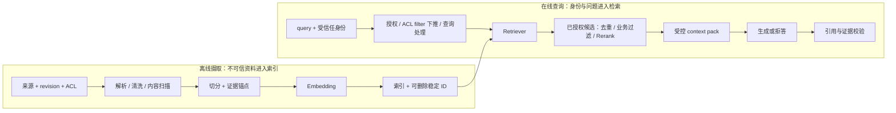

# Retrieval 与 RAG 组件

## 本节目标

把 RAG 拆成可验证的数据管线，理解 LangChain 中 Document、loader、splitter、embedding、vector store、retriever 与 Agent 工具之间的关系，并能判断 2-step RAG 和 Agentic RAG 的取舍。

## Retrieval 解决什么

模型参数中的知识不等于你的最新私有资料。检索先根据问题找到外部知识片段，生成再依据片段回答。LangChain 提供统一组件和集成，但框架不会自动修复坏 PDF、错误切分、缺失权限或过时索引。



每一箭头都应能独立观察和评测。先在 5～20 篇可人工检查的文档上跑通，再扩大数据量。

## LangChain 组件地图

- **Document loader**：把文件或服务读成 Document；读取成功不代表版面语义正确。
- **Text splitter**：按长度、结构或语义切片；chunk size 是实验参数，不是固定答案。
- **Embedding model**：把文本映射为向量；模型和归一化方式必须版本化。
- **Vector store**：保存向量和元数据并执行相似度查询；不同实现的过滤能力不同。
- **Retriever**：给定文本查询返回 Document，是比 vector store 更通用的读取接口，也是可用 `invoke` / `batch` 调用的 Runnable。
- **授权过滤**：使用认证后的 tenant、scope 和业务状态，在未授权片段离开数据边界前过滤；不能从用户自然语言直接相信这些字段。
- **Reranker / 业务过滤**：只处理已授权候选，再做相关性重排、去重、时间或来源策略；Reranker 不应先看到未授权正文。
- **Tool**：把检索能力暴露给 Agent；模型决定何时调用时，循环会更动态。

LangChain v1 将旧 `langchain.retrievers`、`langchain.indexes` 等高层导入的一部分迁到 `langchain-classic`；`BaseRetriever`、vector-store 抽象和当前 `langchain_core.indexing` 仍在 `langchain-core`。看到旧导入路径时，应按具体类检查迁移指南和当前 API，不能把所有 retriever/indexing 能力概括成“都移走了”。

## 分数合同不能跨后端猜测

`score` 不是统一单位。切换 vector store 时，如果只保留阈值数字而不保留分数定义、方向和版本，就可能把“更相关”与“更远”解释反了。

| API / 形态 | 合同 | 本轮核验边界 |
| --- | --- | --- |
| `similarity_search_with_score` | 返回后端原始分数；可能是相似度，也可能是距离，范围和方向都由实现决定 | `langchain-core==1.4.9` 的 `InMemoryVectorStore` 使用余弦相似度并降序，值越大越相似；不能外推到 FAISS、数据库或托管服务 |
| `similarity_search_with_relevance_scores` | 目标合同是归一到 `[0,1]` 且越大越相关，但需要具体实现提供映射 | 当前 `InMemoryVectorStore` 没有实现 relevance 映射，调用会抛 `NotImplementedError`；不能因为基类存在该方法就假设后端支持 |
| `similarity_score_threshold` retriever | 阈值针对 relevance score，而不是任意 raw score | 选择前必须先确认后端能产生受支持、已校准的 relevance score；否则应在自己的 adapter 中定义并测试阈值语义 |
| Retriever `invoke` / `batch` | 返回 `Document`，提供统一 Runnable 调用面 | 默认结果不携带 raw score；需要分数、路由原因或 trace 时，应定义显式结果合同，而不是从 `Document` 猜测 |

`DeterministicFakeEmbedding` 适合验证 wiring 和调用形状，不具备语义检索质量。它在当前实现中还需要 NumPy，而 `langchain-core` 不会自动安装 NumPy；因此只安装 `langchain-core` 并不能保证该分支可运行。

## 元数据先于向量库选型

每个片段至少考虑：

```json
{
  "chunk_id": "policy-v3-section-4-chunk-02",
  "document_id": "policy-v3",
  "title": "退款政策",
  "section": "4. 特殊情形",
  "version": "3",
  "effective_at": "2026-06-01",
  "access_scope": "support-team",
  "source_path": "policies/refund-v3.md"
}
```

字段阅读：

- `chunk_id` 是片段的稳定主键，用于引用、撤回、幂等更新和问题复现。
- `document_id` 将多个片段归属到同一原始文档版本。
- `title` 与 `section` 提供给人阅读和定位的来源上下文。
- `version` 与 `effective_at` 帮助检索层排除已失效或尚未生效的资料。
- `access_scope` 必须来自可信授权上下文，用于在生成前执行权限过滤。
- `source_path` 是可追溯来源位置；是否能暴露给模型或用户仍取决于数据分类策略。

`chunk_id` 应写入 `Document.id`，metadata 可保留同值用于外部系统对账；不提供 ID 时，某些实现会生成随机 ID，给撤回、复现和幂等更新带来困难。重复 ID 的覆盖/upsert 语义也必须按后端验证。

权限过滤应在检索执行层实现，不要先检出无权内容再要求模型“忽略”。过滤值必须来自认证和授权后的受信任上下文，不能直接采用用户声称的 tenant/scope。远程后端还要验证过滤确实下推到服务端；文档撤回和版本更新则依赖稳定 ID 与可删除索引。

## 信任、外发与副作用边界

- Loader 读入的 PDF、网页和工单都是不可信数据，不因为进入 `Document.page_content` 就获得指令权；进入模型前要与 system/developer 指令分层，并测试间接提示注入。
- 远程 Embedding 会接收待编码文本；远程 vector store 会保存向量及通常可见的 metadata。上线前要逐字段决定允许外发的正文、身份、路径与业务标签。
- ACL、tenant、状态和有效期应在候选进入生成上下文前由模型外代码执行。若后端不支持所需 filter，先缩小受权索引或增加可信网关，不能把过滤责任交给模型。
- Chroma、Milvus Lite 等“本地”示例仍可能创建数据库目录；远程服务、模型下载和 telemetry 也有网络或持久化副作用。教学命令必须写明生成位置和清理方法。
- LangSmith tracing 是可选观测能力，不是检索前置。trace 可能包含 query、文档片段、工具结果和用户数据，应先配置采样、脱敏、保留期与访问控制，再显式启用。

## 2-step RAG 与 Agentic RAG

| 方案 | 数据流 | 优点 | 主要风险 |
| --- | --- | --- | --- |
| 2-step RAG | 固定检索一次，再生成一次 | 延迟和路径可预测，易评测 | 复杂问题可能需要查询改写或多跳 |
| Agentic RAG | 模型决定何时、如何、多次检索 | 灵活处理开放任务 | 循环、成本、遗漏检索和工具误用 |
| Hybrid | 确定性检索为主，必要时进入 Agent | 保留基线又允许升级 | 路由条件和两套轨迹需评测 |

官方 Retrieval 页面把 RAG Agent 和 2-step chain 都列为教程路径。工程建议是先建立 2-step 基线：只有数据证明固定检索不足时，才引入动态循环。

## 分层评测

1. **解析**：标题、表格、页码和段落是否保留？
2. **切分**：答案证据是否落在可用片段，是否被截断？
3. **检索**：Recall@k、MRR/nDCG 或人工命中，权限过滤是否正确？
4. **生成**：答案是否被证据支持、引用是否真实、无答案时是否拒答？
5. **系统**：索引版本、延迟、成本、失败率和数据新鲜度。

测试集至少覆盖：库中可答、多片段、库中无答案、过时版本、权限不允许、同义查询、拼写错误和带提示注入的恶意文档。生成流畅不能补救检索为空。

多数 top-k 实现即使问题无关也会返回“最接近”的若干项，所以“库中无答案”通常不等于空列表。拒答门应来自经过标注集校准的后端特定阈值、独立充分性判断或两者组合，不能直接复制另一个 store 的 raw score 阈值。

## 常见错误与排查

- 召回差就换向量数据库：先抽查解析和 chunk，再比较 embedding 与查询。
- 检索结果无来源 ID：无法引用、撤回和定位错误。
- 把 raw similarity 当成 distance，或把某后端的阈值方向复制到另一后端。
- 把 InMemory 的 callable metadata filter 复制成远程数据库语法，却没有验证真正的服务端下推。
- 把片段放进 system message：外部文本获得了不应有的指令优先级。
- 索引更新不记录版本：线上问题无法复现。
- 只评最终答案：不能知道失败来自检索还是生成。

## 动手实践

### Layer A：先建立框架无关基线

选 5 篇本地 Markdown，人工设计 15 个问题和期望文档。先不接模型：实现关键字基线，记录 top-3 命中与错误；再为每个片段增加 `chunk_id`、`document_id`、section、version 和 access_scope。最后写出“证据不足”和“权限过滤后无结果”的确定性响应。

### Layer B：真实 LangChain Core、离线检索合同

`retrieval_layer_b/` 对应本库中的 [[LangChain/00-初学者路线/examples/retrieval_layer_b/in_memory_retrieval.py|in_memory_retrieval.py]]、[[LangChain/00-初学者路线/examples/retrieval_layer_b/test_in_memory_retrieval.py|test_in_memory_retrieval.py]]和[[LangChain/00-初学者路线/examples/retrieval_layer_b/requirements.txt|requirements.txt]]。示例使用透明的三维关键词教学 Embedding 与真实 `InMemoryVectorStore`，因此能稳定验证 API、ID、metadata、callable filter、raw cosine score 和 Retriever Runnable；它不证明真实 Embedding 的语义质量。

从仓库根目录运行：

```powershell
$example = Resolve-Path '.\docs\LangChain\00-初学者路线\examples\retrieval_layer_b'  # 将课程示例目录解析为绝对路径。
Push-Location $example  # 临时进入示例目录，使 requirements 与脚本相对路径稳定。
try {  # 确保任一命令失败时仍会恢复原工作目录。
    uv run --isolated --with-requirements '.\requirements.txt' python -B '.\in_memory_retrieval.py'  # 在一次性隔离环境运行离线检索演示。
    uv run --isolated --with-requirements '.\requirements.txt' python -B -m unittest -v '.\test_in_memory_retrieval.py'  # 普通模式运行完整检索合同测试。
    uv run --isolated --with-requirements '.\requirements.txt' python -B -O -m unittest -v '.\test_in_memory_retrieval.py'  # 验证校验逻辑不依赖优化模式会移除的裸 assert。
    uv run --isolated --with-requirements '.\requirements.txt' python -B -W error -m unittest -v '.\test_in_memory_retrieval.py'  # 将所有未处理 warning 视为测试失败。
    uv run --isolated --with-requirements '.\requirements.txt' python -B -O -W error -m unittest -v '.\test_in_memory_retrieval.py'  # 同时覆盖优化与严格 warning 的组合环境。
} finally {  # 无论运行成功或失败，都执行目录栈清理。
    Pop-Location  # 回到进入示例目录前的位置。
}
```

`requirements.txt` 固定本轮直接依赖 `langchain-core==1.4.9` 与兼容 Python 3.11 的 `numpy==2.4.6`；它不是完整传递依赖 lockfile。只有安装阶段访问包索引，脚本不调用模型或远程服务，并用 `tracing_context(enabled=False)` 在调用范围关闭 LangSmith trace。2026-07-22 的验收为 17 项测试在 normal、`-O`、`-W error` 和 `-O -W error` 四种模式均通过；CLI 输出依赖版本、唯一授权命中 `alpha:refund:v1`，以及 `invoke` / `batch` 对应的稳定文档 ID。

> [!important] Layer B 的安全边界
> InMemory callable filter 在本进程评分前执行，适合证明调用形状，却不是远程数据库的服务端 ACL。`batch()` 默认可使用线程池，本例只读 store；不要把并发写入悄悄加进同一示例。示例中的 `0.5` 只对透明教学向量成立，不是生产阈值。

## 自测

- [ ] 能画出索引阶段与查询阶段，并指出每层可测指标。
- [ ] 能解释 retriever 比 vector store 更一般的原因。
- [ ] 能说明 2-step RAG 相对 Agentic RAG 的工程优势。
- [ ] 能设计不会把未授权片段送入模型的过滤位置。
- [ ] 能说明 raw score 的方向为何不能跨 backend 复用。
- [ ] 能用 `Document.id` 和 metadata 回查、撤回并验证一个 chunk。

## 下一步

进入 [[LangChain/00-初学者路线/05-Memory State与Persistence|Memory、State 与 Persistence]]，区分检索知识、运行状态和长期记忆。

## 资料基线

官方 API/源码基线核对日期：2026-07-20；本地运行验证日期：2026-07-22。

- [LangChain Retrieval](https://docs.langchain.com/oss/python/langchain/retrieval)
- [LangChain v1 迁移指南](https://docs.langchain.com/oss/python/migrate/langchain-v1)
- [langchain-core Retriever API 概述](https://reference.langchain.com/python/langchain-core/langchain_core)
- [InMemoryVectorStore 源码（1.4.9 固定 commit）](https://github.com/langchain-ai/langchain/blob/1c3a4186cf2ba4f28face59118ac7786de009f91/libs/core/langchain_core/vectorstores/in_memory.py)
- [VectorStore 与 Retriever 源码（1.4.9 固定 commit）](https://github.com/langchain-ai/langchain/blob/1c3a4186cf2ba4f28face59118ac7786de009f91/libs/core/langchain_core/vectorstores/base.py)
- [PyPI：langchain-core 1.4.9](https://pypi.org/project/langchain-core/1.4.9/)
- [PyPI：NumPy 2.4.6（Python ≥3.11）](https://pypi.org/project/numpy/2.4.6/)
- [[LangChain/02-LangChain/01-Semantic Search|冻结参考页：Semantic Search（待复核，不作为运行基线）]]
- [[LangChain/02-LangChain/02-RAG Agent|冻结参考页：RAG Agent（动态 API 需重新核验）]]
- [[RAG/00-目录|RAG 原理与系统路线]]
