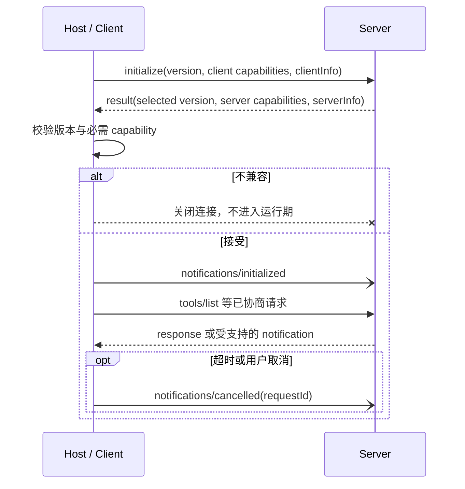

# MCP 生命周期、能力协商与传输

## 本节目标

学完后，你应能：

- 区分 JSON-RPC request、response 与 notification，并正确管理 ID。
- 沿初始化、运行、关闭三个阶段解释一次会话。
- 根据发送方向检查 capability，而不是只看顶层版本号。
- 比较 stdio 与 Streamable HTTP，定位 framing、会话、版本和超时问题。

## JSON-RPC 是消息信封

MCP 数据层以 JSON-RPC 2.0 表达消息：

| 类型 | 关键字段 | 是否期待回复 | 核心约束 |
| --- | --- | --- | --- |
| request | `jsonrpc`、`id`、`method`、可选 `params` | 是 | 同一发送方不能在请求未完成时复用 ID |
| response | `jsonrpc`、`id`、`result` 或 `error` | 否 | ID 与原请求相同，result/error 二选一 |
| notification | `jsonrpc`、`method`、可选 `params` | 否 | 不能有 ID |

```json
{"jsonrpc":"2.0","id":7,"method":"tools/list"}
{"jsonrpc":"2.0","id":7,"result":{"tools":[]}}
{"jsonrpc":"2.0","method":"notifications/tools/list_changed"}
```

ID 属于请求发送方的关联空间。两端可以同时发 request；所以实现应按“发送方向 + ID”关联，而不是在整条双向连接上假设一个全局 ID 序列。布尔值在 Python 中是整数子类，但 MCP RequestId 不应把 `true` 当成整数 ID。

> [!note] 教学验证器的边界
> 本库的离线验证器采用比通用 JSON-RPC 更严格的 profile：拒绝顶层未知字段、重复 JSON key、NaN/Infinity，并只支持课程用到的 params 对象。这有助于尽早暴露错误，不等于完整官方 conformance。

## 生命周期一：初始化



*图 1　稳定 MCP 会话的初始化与受约束运行时序。文字替代：client 首先发送 initialize，server 返回选定版本和能力；client 本地校验，不兼容就关闭，兼容才发送 initialized 通知并进入正常请求；取消只关联已发请求，不等于断开连接。图依据 MCP `2025-11-25` lifecycle 与 JSON-RPC 2.0 绘制；Mermaid 源码即再生成方式。*

初始化必须是 client 与 server 的第一次交互：

1. client → server：`initialize` request，包含它支持的 `protocolVersion`、client capabilities 与 `clientInfo`。
2. server → client：同 ID response，返回选定协议版本、server capabilities 与 `serverInfo`。
3. client 检查 server 选择的版本是否受支持；若不支持，应断开。
4. client → server：`notifications/initialized`。
5. 进入正常 operation。

在 server 响应 initialize 前，client 除 ping 外不应发其他 request；在 server 收到 initialized notification 前，server 除 ping 和 logging 外不应发其他 request。课程项目为了让状态机更清晰，采用更严格的“握手三步连续完成”。

### 版本协商不是“双方都写 latest”

client 发送它支持的版本，server 可回同版本，也可选择另一个自己支持的版本；client 最终决定是否接受。协议版本、SDK 版本、host 产品版本和 server 包版本是四个不同字段。

当前第一方版本页在 2026-07-21 仍把 `2025-11-25` 标为 latest；`2026-07-28` 仍是明确标注为 Draft 的 release candidate，且日期晚于本次复核日。后者移除了 initialize，不能把它的消息形状套进本页的稳定状态机。对 `2025-11-25` 会话仍必须以 initialize response 的协商值为准；使用 HTTP 后，client 还必须在后续请求中发送 `MCP-Protocol-Version` header。

## 生命周期二：能力受约束的运行

capabilities 是双向、按拥有者声明的：

```jsonc
{ // initialize 后双方实际协商出的能力子集示意
  "clientCapabilities": { // client/host 提供给 server 的反向能力，不是 server 自动可调用的权限
    "roots": {"listChanged": true}, // client 支持 roots/list_changed 通知，用于告知可访问根目录变化
    "sampling": {"tools": {}}, // client 允许 sampling 子能力中的 tools 形状，但仍需逐请求控制与授权
    "elicitation": {"form": {}, "url": {}} // client 声明支持表单与 URL elicitation；用户是否同意另行决定
  }, // 结束 client capabilities
  "serverCapabilities": { // server 对 client 暴露的能力，不等于用户/tenant 已获资源授权
    "tools": {"listChanged": true}, // server 提供 tools，并能通知工具列表变化
    "resources": {"subscribe": true, "listChanged": true}, // server 支持订阅资源和资源列表变化通知
    "prompts": {} // server 支持 prompts 基础能力；空对象代表没有额外子能力声明
  } // 结束 server capabilities
}
```

> [!note] JSONC 教学表示
> 该对象用于逐行说明协商语义；实际 `initialize` JSON-RPC payload 需要删除 `//` 注释。

检查顺序应是：

1. 方法方向对吗？例如 `tools/call` 通常 client → server，`roots/list` 是 server → client。
2. receiver 是否声明顶层 capability？
3. 是否还需要 sub-capability？例如带 tools 的 sampling 需要 `sampling.tools`；URL elicitation 需要 `elicitation.url`。
4. 在 `2025-11-25` 稳定规范中，若请求带实验性 `task`，receiver 是否声明对应 `tasks.requests...`？tool 的 `execution.taskSupport` 是否也允许？新的 Tasks 扩展是另一套观察中的 contract，不能混用。
5. 业务身份、scope 和用户同意是否满足？能力协商不能替代这一步。

列表、订阅与通知也要看 sub-capability。server 只有声明 `tools.listChanged: true` 才应发送 `notifications/tools/list_changed`；Resources 中 `listChanged` 与 `subscribe` 相互独立：前者允许列表变化通知，后者允许 subscribe/unsubscribe 和成功订阅后的单项 updated 通知。client 的 roots 变更通知同理。Capability 仍不是数据授权，业务身份、scope、URI ACL 与撤销状态必须逐次检查。

## 生命周期三：关闭

MCP 没有专用 shutdown 消息：

- stdio 通常由 client 先关闭 server stdin，等待退出，超时再按操作系统方式终止。
- HTTP 通过关闭相关连接表示结束。

“关闭 SSE 流”不等于“取消请求”。Streamable HTTP 连接可能随时中断；要取消仍应发送 MCP cancellation notification。生产实现还要释放子进程、会话、任务、临时文件和下游连接。

## 标准传输一：stdio

stdio 适合本地 server：

- client 启动 server 子进程。
- stdin/stdout 交换 UTF-8 JSON-RPC；每条消息由换行分隔，消息内部不得嵌入换行。
- server 的 stdout 只能输出合法 MCP 消息。
- 诊断日志写 stderr；stderr 有内容不一定代表协议失败。

Windows 常见问题：

- host 的工作目录与手动运行时不同；配置使用绝对路径。
- GUI host 继承的 `PATH` 与 PowerShell 会话不同。
- server 用 `print("started")` 写到 stdout，污染第一条 JSON。
- 文件采用错误编码，或把格式化 JSON 跨多行写入 stdio。
- 把真实密钥写进共享配置；应使用 host 的秘密管理和最小环境变量。

## 标准传输二：Streamable HTTP

当前规范的 Streamable HTTP 取代了 `2024-11-05` 的旧 HTTP+SSE transport。新传输：

- server 提供一个同时支持 POST/GET 的 MCP endpoint。
- client 每发送一条 JSON-RPC 消息，都用新的 HTTP POST。
- request 的响应可能是 `application/json`，也可能是 `text/event-stream`；client 必须能处理两者。
- client 可用 HTTP GET 打开 SSE 流接收 server 发起的消息。
- 会话可使用 `Mcp-Session-Id`，但 session ID 不是身份凭据。
- SSE event ID 可支持断线恢复；重复投递与业务幂等仍要在更高层设计。

安全最低线：

- 校验 `Origin`，不合法时拒绝，防 DNS rebinding。
- 本地 HTTP server 默认只绑定 `127.0.0.1`，不要无意监听 `0.0.0.0`。
- 远程使用 HTTPS 和正确授权。
- 不把连接断开自动当成取消，也不把 session ID 当授权。

可执行证据见 [[MCP/学习路线/08-项目-Loopback-Streamable-HTTP与OAuth资源边界|Loopback Streamable HTTP 与 OAuth 资源边界项目]]：它在 `127.0.0.1` 上真实验证 POST/GET/DELETE、JSON/SSE、版本/session header、Origin、恢复 cursor 与 session 终止；请求 `Content-Type: application/json` 是该教学 profile 的额外加严策略，不冒充 stable 规范原文。

## 超时、取消、进度与 Tasks

规范建议所有发出 request 都有可配置超时。超时后：

1. 发送 cancellation notification；
2. 停止等待原 response；
3. 记录 request ID、方法、耗时和取消结果；
4. 根据动作是否幂等，决定是否重试。

收到 progress 可以延长普通超时判断，但仍应有绝对上限，防恶意或失控 peer 无限占用资源。Tasks 解决的是可持久、可轮询的执行状态，不应拿来替代所有普通超时；它仍需要 TTL、所有权绑定、轮询间隔和最终结果处理。稳定规范中的实验性 Tasks 与新的 Tasks 扩展及迁移边界见 [[MCP/学习路线/07-前沿专题-扩展Apps与版本兼容|前沿专题：扩展、Apps 与版本兼容]]。

## 分层排错表

| 证据 | 更可能的层 | 下一步 |
| --- | --- | --- |
| 程序不存在、连接拒绝 | 启动/传输 | 查绝对命令、cwd、端口、TLS |
| stdout 第一行不是 JSON | stdio framing | 把日志移到 stderr |
| initialize ID 对不上 | JSON-RPC/生命周期 | 保存双向原始消息并按方向关联 |
| `-32602 Invalid params` | schema 或 capability | 查 initialize 交换、方法方向、参数 |
| HTTP POST 后没有预期 response | HTTP/SSE/超时 | 查 Content-Type、SSE 流、session 与代理日志 |
| 工具返回 `isError: true` | 工具执行/业务 | 把可操作错误交给模型或用户，不要重建连接 |

## 动手练习

1. 手写 initialize request、response、initialized notification，标出每条的方向与 ID。
2. 在纸上同时发一个 client request ID `5` 和 server request ID `5`，解释为什么二者不冲突。
3. 设计一个 capability gate：server 未声明 tools 时，client 应怎样向上层报告，而不是仍发送 `tools/list`？
4. 把一个 stdio server 的“启动完成”日志分别写到 stdout 与 stderr，预测 client 行为。
5. 为远程工具调用写出三种超时后策略：只读查询、带幂等键写入、无法确定是否成功的写入。

## 自测

1. notification 为什么不能带 ID？
2. current protocol version 与 negotiated version 有何不同？
3. 为什么看到 `sampling` 仍不能发送带 tools 的 sampling request？
4. HTTP 断线为何不等于取消？
5. Streamable HTTP 中 SSE 是可选承载形式，为什么不能把它与旧 HTTP+SSE transport 视为同一版本？

能独立画出三阶段时序，并对任一消息说明“方向、ID、capability、传输证据”，才算掌握。

## 下一步

进入 [[MCP/学习路线/04-授权与安全边界|授权与安全边界]]，把协议可用性和实际权限分开。

## 参考资料

以下均为第一方或协议原始来源，获取/复核日期：2026-07-21。

- [MCP Lifecycle](https://modelcontextprotocol.io/specification/2025-11-25/basic/lifecycle)
- [MCP Transports](https://modelcontextprotocol.io/specification/2025-11-25/basic/transports)
- [MCP Schema Reference](https://modelcontextprotocol.io/specification/2025-11-25/schema)
- [Protocol Versioning](https://modelcontextprotocol.io/docs/learn/versioning)
- [JSON-RPC 2.0 Specification](https://www.jsonrpc.org/specification)
