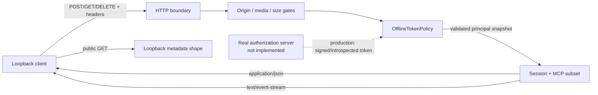
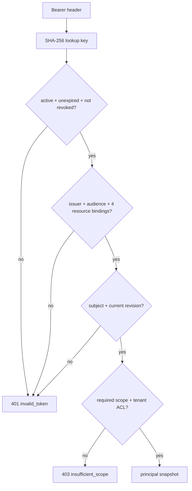

# 项目：Loopback Streamable HTTP 与 OAuth 资源边界

## 项目目标

在 `127.0.0.1` 上启动真实 HTTP server 和 client，用可重复的本地往返验证 MCP `2025-11-25` Streamable HTTP 与受保护 resource server 的关键边界：

- 单一 MCP endpoint 上的 POST、GET 与 DELETE；
- `Accept`、请求/响应 `Content-Type`、`MCP-Protocol-Version` 与 `Mcp-Session-Id`；
- JSON response、POST SSE response、GET SSE stream 与 `Last-Event-ID` 恢复；
- `Origin` allowlist、回环地址监听、请求/响应大小上限；
- 401、403、`WWW-Authenticate` 与 loopback Protected Resource Metadata 形状；
- token audience/resource、RFC 8707 两次 `resource`、scope、tenant、授权修订、过期与撤销；
- session 创建、身份绑定、TTL、容量、显式终止与并发访问；
- 错误响应不回显 bearer token 或 session ID。

> [!warning] Stable 与 Draft 必须隔离
> 本项目只实现 `2025-11-25` stable 的有状态初始化模型。`2026-07-28` 在 2026-07-21 仍是 Draft release candidate；它的无 initialize、移除 `Mcp-Session-Id`、server discovery 与逐请求 capability 设计不进入本项目的 wire contract。迁移观察见 [[MCP/学习路线/07-前沿专题-扩展Apps与版本兼容|前沿专题：扩展、Apps 与版本兼容]]。

> [!important] 真实 HTTP，不是真实 OAuth
> HTTP 往返、header、status、JSON/SSE framing 与 session 都真实发生；token 则由进程内 `OfflineTokenPolicy` 查找预置的无效/有效 claims。它没有 authorization server、授权码、PKCE、签名/JWKS、issuer discovery、introspection、refresh token 或 TLS，不能证明 OAuth 部署正确。

> [!warning] PRM 形状不等于 RFC 9728 合规
> 为保持离线、零依赖和随机端口，本项目的 resource identifier 是 `http://127.0.0.1:<port>/mcp`。RFC 9728 要求 resource identifier 使用 `https`；因此本项目只验证 metadata path、document 字段与 challenge 关联，**不宣称实现 RFC 9728**。生产互操作必须在 HTTPS endpoint 上重做发现与黑盒测试。

## 与离线消息验证器的关系

两个项目是互补测试层，不互相冒充：

| 项目 | 真实边界 | 主要覆盖 | 明确不覆盖 |
| --- | --- | --- | --- |
| [[MCP/学习路线/06-项目-离线MCP消息验证\|离线 MCP 消息验证]] | 无网络；直接驱动 Python 状态机 | 54 个多 primitive 消息场景、capability、Resources、Tasks；用 wire 外 `transport_context` 表示已验证身份 | HTTP framing、SSE、401/403、PRM 形状、真实 session header |
| 本项目 | `127.0.0.1` 上真实 HTTP/1.1 往返 | Streamable HTTP、header/status、JSON/SSE、session 与离线 resource policy | 完整 MCP 方法/schema、真实 OAuth/验签、SDK 互操作 |

本项目没有导入 `validate_mcp_messages.py`，也没有把 `transport_context` 塞进 JSON-RPC。生产系统应在 HTTP/OAuth adapter 验证 token 后，把**可信且有类型的授权决策**传给消息/业务层；不能让请求正文自报 `subject`、`tenant` 或 `authorization_revision`。



*图 1　项目边界。实线是本项目执行的真实本地数据流；虚线是生产系统必须补齐、但本项目没有伪造的 OAuth 能力。*

## 先建立规范合同

### Streamable HTTP stable 合同

下表区分 MCP stable 的规范要求与本项目主动加严的教学策略。

| 边界 | `2025-11-25` stable | 本项目策略 |
| --- | --- | --- |
| endpoint | server 提供一个同时支持 POST 与 GET 的 MCP endpoint | 固定 `/mcp`；PUT/PATCH/HEAD/OPTIONS 返回安全的 405 |
| POST | 每条 JSON-RPC message 使用新的 POST；`Accept` 同时列出 `application/json` 与 `text/event-stream` | body 只能是一个严格 UTF-8 JSON object；拒绝 duplicate key、NaN 与 transfer encoding |
| POST request response | server 返回单个 `application/json` object 或 `text/event-stream` | `ping` 走 JSON，`resources/list` 走 SSE，让 client 必须验证两种路径 |
| notification/response | 能接受时返回空 body 的 202，不能接受时返回 HTTP error | 接受唯一的 initialized notification；因没有 outstanding server request，拒绝 unsolicited response |
| initialize 版本协商 | client 在 `InitializeRequest` 提议版本；server 不支持时必须在 `InitializeResult` 返回自己支持的替代版本，由 client 决定是否断开 | body 提议 Draft 时返回 200 与 stable `2025-11-25`，不会把 Draft 当成已协商版本；教学 client 若不接受应停止握手 |
| GET | client 可用 GET + `Accept: text/event-stream` 开流；server 返回 SSE 或 405 | 返回一个 server notification 后关闭；仅对同一 GET notification stream 的 `Last-Event-ID` 做受限恢复 |
| session | initialize response 可分配安全、可见 ASCII session ID；后续 request 必须携带；缺失通常 400，终止后 404 | session 绑定 subject、tenant、授权修订，有固定 TTL 与容量 |
| DELETE | client 不再使用 session 时应发送 DELETE；server 可用 405 表示不支持 | 实现 DELETE，成功 204；之后相同 session 404 |
| protocol header | 初始化完成后的 HTTP request 必须携带协商版本；无效/不支持版本返回 400 | 只接受 `2025-11-25`；若 initialize 上额外出现冲突 header，也按本地 hardening 拒绝，不把它混同于 body 协商 |
| Origin | server 必须校验出现的 Origin；无效时 403；本地应只监听 `127.0.0.1` | 精确 allowlist；无 Origin 的非浏览器 client 可通过；server 不监听 `0.0.0.0` |

> [!note] `Content-Type` 的证据边界
> Stable transport 页明确规定 POST body 是一个 JSON-RPC message，并规定 request 对应 response 的 `application/json`/`text/event-stream` 类型；该页没有把 POST request 的 `Content-Type: application/json` 单列为同等级 MUST。本项目仍把它设为**教学 profile 的加严要求**，用于防类型混淆；不要把这条本地 hardening 误引为 stable 原文。

### OAuth resource server 合同

对受保护的 HTTP MCP endpoint：

1. client 在每个 HTTP request 重新发送 `Authorization: Bearer ...`，不能把 access token 放进 URI query。
2. 无 token、无效 token、过期 token或错误 issuer/audience 获得 401。
3. token 有效但 scope/权限不足获得 403；运行期 scope challenge 应给出 `error="insufficient_scope"`、所需 `scope` 与 `resource_metadata`。
4. 生产 MCP server 通过 HTTPS 实现 RFC 9728 Protected Resource Metadata；401 challenge 可用 `resource_metadata` 指向它，client 还要支持 well-known fallback。
5. client 在 authorization request 和 token request 都发送 RFC 8707 `resource`，并使用目标 MCP server 的 canonical URI。
6. resource server 只接受专门签发给自己的 token，不接收或透传其他 resource 的 token。

本项目只在 HTTP loopback 上模拟两个等价的 metadata path：

```text
/.well-known/oauth-protected-resource/mcp
/.well-known/oauth-protected-resource
```

返回的最小教学文档包含 `resource`、至少一个 `authorization_servers` 和 `scopes_supported`。Metadata endpoint 不接收 bearer credential，避免 client 把 token 误发到 discovery 请求。路径与字段可用于验证 client/server 的控制流，但 HTTP resource identifier 不能作为 RFC 9728 conformance 证据。

## 项目文件

| 文件 | 作用 |
| --- | --- |
| [[MCP/examples/streamable_http/loopback_mcp_http.py\|loopback_mcp_http.py]] | 标准库 HTTP server/client、离线 token policy、session/SSE 状态与 CLI |
| [[MCP/examples/streamable_http/test_loopback_mcp_http.py\|test_loopback_mcp_http.py]] | 80 个 codec、policy、HTTP/server state、Unicode identity 与 CLI 回归测试 |

没有第三方依赖、外部网络、API key、数据库或生成 fixture。server 由测试绑定随机 loopback port，并在用例结束时关闭。

## 运行

从仓库根目录进入 MCP：

```powershell
Set-Location ".\docs\MCP" # 进入 MCP 项目目录，确保 loopback 示例的相对路径可用
```

先跑正常链路：

```powershell
python -B .\examples\streamable_http\loopback_mcp_http.py demo # 运行正常 HTTP/SSE/session 链路，预期 verdict 为 PASS
```

预期摘要：

```json
{"http_round_trips": 8, "profile": "loopback-streamable-http-teaching-profile-v1", "protocol_version": "2025-11-25", "verdict": "PASS"}
```

再跑攻击/失效链路：

```powershell
python -B .\examples\streamable_http\loopback_mcp_http.py attack # 运行四种负向攻击链路，BLOCK 表示它们均已被拒绝
```

预期摘要：

```json
{"blocked_attacks": 4, "profile": "loopback-streamable-http-teaching-profile-v1", "protocol_version": "2025-11-25", "verdict": "BLOCK"}
```

这里的 `BLOCK` 是负向验收结论：四类攻击均被拒绝时 CLI 退出码为 0；若任一攻击穿透，命令才以非零退出。它不是“程序运行失败”。

运行四种解释器/警告模式组合：

```powershell
python -B .\examples\streamable_http\test_loopback_mcp_http.py # 普通模式执行 HTTP boundary 回归测试
python -B -O .\examples\streamable_http\test_loopback_mcp_http.py # 验证关键安全检查不依赖 bare assert
python -B -W error .\examples\streamable_http\test_loopback_mcp_http.py # 将 HTTP/资源相关警告视为失败
python -B -O -W error .\examples\streamable_http\test_loopback_mcp_http.py # 在组合严格模式下再次运行测试
```

`-O` 证明安全决策没有依赖会被优化移除的 production `assert`；`-W error` 防止资源、线程或 HTTP 使用警告被忽略。测试中的 `unittest` assertion 只是验收断言，不承担运行时安全逻辑。

## 实现走读

### 1. 严格接收顺序

HTTP handler 依次执行：

```text
path/header 数量与大小
→ Origin
→ method/Accept/Content-Type
→ 有界 body + strict JSON
→ bearer token policy
→ protocol/session/lifecycle
→ method scope 与 tenant data
→ JSON/SSE response
```

早期失败会关闭当前 HTTP connection，避免尚未读取的 body 被当成下一条 request。所有错误只返回稳定的公开 code，不返回 token、claims、session ID 或内部异常。

### 2. 有界输入与状态

| 对象 | 上限/策略 | 防止的问题 |
| --- | --- | --- |
| request body | 16 KiB；JSON 最深 64 层 | 大 body、递归解析耗尽 |
| 单 header value | 2 KiB | 超长 credential/header |
| header 总量 | 32 项、12 KiB | 多 header/重复字段滥用 |
| path | 2 KiB 且不接受 query | URI token 泄露与解析分歧 |
| response | 64 KiB | client/server 无界读写 |
| active sessions | 默认 8 | 会话内存耗尽 |
| session TTL | 默认 60 秒 | 永久 session replay |
| 单次 SSE event 集 | 最多 16 | 恢复/投递队列膨胀 |
| 同时处理的 HTTP request | 默认 64 | 无界线程/连接并发；满载直接 503 |
| socket read | 默认 2 秒 | loopback slow request 长期占槽 |

这些数值是小型教学 fixture 的资源预算，不是生产通用默认值。生产上限应由流量、消息大小分布、代理限制和压测证据决定。

### 3. 离线 token policy

`TokenRecord` 明确保存：

- `issuer`、`audience` 与离线 policy 记录的目标 resource；
- authorization request 和 token request 各自使用的 RFC 8707 resource；
- `subject`、`tenant`、scope 集合与 `authorization_revision`；
- token ID、active 状态与 expiry。

policy 每次 HTTP request 都重新检查：



*图 2　离线 resource policy 的判定顺序。SHA-256 只避免在字典 key 中保存 raw fixture token，不是密码哈希、token 签名或线上秘密存储方案。*

`authorization_resource` 与 `token_resource` 是测试控制面保存的“签发流程证据”，不是 MCP header，也不是 client 可以在业务 request 中自报的字段。生产系统要从真实 authorization server flow、签名或 introspection 证据获得这些结论。

Fixture 在 endpoint 创建时先生成一种规范化的 loopback URI，随后做精确匹配。Stable 建议为互操作接受 scheme/host 大小写差异；生产实现应采用经过测试的 URI canonicalization，再比较语义明确的 resource identifier，不能照搬本项目的字符串比较去处理任意公网 URI。

### 4. Session 不是身份凭据

初始化成功时 server 生成高熵、visible ASCII `Mcp-Session-Id`，并绑定：

```text
(subject, tenant, authorization_revision, expires_at)
```

后续 request 同时需要 bearer token 和 session ID。仅有 session ID 不够；把别人的 session 与另一个有效 token 拼接也得到 404，不暴露该 session 是否属于其他 principal。token 撤销或授权 revision 更新后，即使 session 尚未到 TTL，下一次 request 仍 fail closed。

### 5. JSON 与 SSE 两条成功路径

- `ping` 返回 `Content-Type: application/json` 的一个 JSON-RPC response。
- `resources/list` 返回 `Content-Type: text/event-stream`，SSE `data` 中是同 request ID 的 JSON-RPC response。
- Resource `uri` 必须遵循 RFC 3986。示例固定使用 ASCII authority `kb://tenant/`，把 tenant 作为 UTF-8 percent-encoded path segment；不会把原始 tenant（尤其 Unicode 或 `/ ? #`）直接拼进 authority/路径语法。
- GET SSE 只发 server notification，不混入无来源的 JSON-RPC response。
- `Last-Event-ID` 只能引用当前 session 中**同一原始 GET notification stream** 已投递的 event；本 profile 每个 session 只有这一条可恢复的 GET notification stream，POST SSE 的 event ID 不进入恢复队列。显式 cursor 只返回其后的 GET notification；无 cursor GET 是 at-most-once 教学 poll，第二次不会重放已从内存队列选出的 event。
- 显式 DELETE 成功后，相同 session 的任何 request 都返回 404，client 应重新 initialize，而不是盲目重试旧 session。

本项目让 GET SSE 发送一个 event 后关闭。Stable 允许 server 关闭并由 client 恢复；本项目没有实现长连接 backpressure、`retry` 字段、多并行 stream、投递确认或持久 event store。尤其不要把 cursorless at-most-once poll 当成生产级可靠投递：网络写失败与进程重启仍可能丢事件，生产实现必须用持久 cursor/lease 和幂等消费解决。

### 6. 401 与 403 不能混用

| 条件 | HTTP | Challenge |
| --- | --- | --- |
| bearer 缺失 | 401 | `resource_metadata` + 当前 request 的最小 `scope`；不伪造 `invalid_token` |
| bearer 未知、inactive、expired、revoked | 401 | `invalid_token` + `resource_metadata` + 当前 request 的最小 `scope` |
| issuer/audience/resource/revision binding 无效 | 401 | 同上；不说明具体 claim，减少 oracle |
| token 有效但 method scope 不足 | 403 | `insufficient_scope` + required `scope` + `resource_metadata` |
| token 有效但 tenant ACL 不足 | 403 | 通用 `forbidden`，不误导 client 做无效 scope step-up，也不泄露其他 tenant |
| Origin 不在 allowlist | 403 | 不发 OAuth challenge |
| session 缺失/格式错误 | 400 | 无 challenge |
| session 不存在、过期、已终止或 owner 不匹配 | 404 | 无 challenge |
| initialize body 提议不支持的版本 | 200 + server 支持的替代版本 | client 比较结果后继续或断开，不发送 `initialized` 来假装兼容 |
| 后续 protocol header 缺失/不支持，或 initialize 上额外给出冲突 header | 400 | 无 challenge；后者是本项目加严策略 |

## 测试矩阵

80 个测试分为：

| 层 | 数量 | 代表性证据 |
| --- | ---: | --- |
| strict codec/SSE parser | 11 | duplicate key、NaN、UTF-8、JSON 深度预算、未知 SSE field |
| offline token policy | 16 | issuer/audience/resource、RFC 8707 两次 resource、tenant/revision、expiry/revocation/scope、Unicode/malformed claim |
| HTTP boundary/server state | 50 | 真实 POST/GET/DELETE、初始化替代版本、header/status、JSON/SSE、Unicode principal/session、Origin、容量、32 路并发、显式恢复与无 cursor 不重放、无秘密泄漏 |
| CLI | 3 | subprocess `PASS`/`BLOCK` 与入口函数 |

特别关注以下反例：

1. 合法 token 发给另一个 audience/resource，必须 401。
2. authorization request 或 token request 的 `resource` 任一个不匹配，必须 401。
3. 只有 session ID、换 subject 拼 session、session 过期或 DELETE 后重用，均不能继续请求。
4. scope 不足必须 403，并给最小 step-up 线索。
5. invalid Origin 403，但不能误导 client 进入 OAuth step-up。
6. 32 个并发 ping 都独立返回；session 容量达到上限时 fail closed。
7. GET 使用同一原始 GET notification stream 的正确 `Last-Event-ID` 后不重复 cursor 之前的 event；POST SSE 或别的 session 的 event ID 都不可用，同一 session 无 cursor 的第二次 poll 也不重放。
8. token 撤销或 revision 切换后，现存 session 下一次访问立即失败。
9. error body/header 不包含测试 token 或 session ID。

## 逐步实验

每次只改变一项，先预测 status/header，再运行测试：

1. 将 `Accept` 改成只有 `application/json`，观察 POST 406。
2. 把 `Content-Type` 改成 `text/plain`，说明这是教学 profile 的 415 hardening。
3. 去掉后续 request 的 `MCP-Protocol-Version` 或 session header。
4. 将 initialize body 版本改成 Draft 日期，确认 server 返回 stable 替代版本；client 若不接受必须停止握手。再把后续 protocol header 改成 Draft，确认返回 400。
5. 在 URI query 加 `access_token`，确认 body 不回显它。
6. 用正确 token + 错误 session owner，确认 404 而不是泄露 owner。
7. 删除 `resources:read`，比较 403 与 invalid token 的 401 challenge。
8. 把 authorization/token request 的任一个 resource 改到另一个 server。
9. initialize 后调用 `set_revision` 或 `revoke`，再复用旧 session。
10. 取得 GET notification stream 的 event ID，用 `Last-Event-ID` 恢复；再尝试 POST SSE 或另一个 session 的 event ID。

## 生产扩展顺序

不要把这个教学 server 直接部署。建议按风险逐层替换：

1. **传输实现**：换官方 SDK 的 Streamable HTTP transport，保留相同黑盒 contract tests。
2. **TLS/代理**：远程只用 HTTPS；核对反向代理的 body/header/timeout/buffering 行为与可信 proxy header。
3. **真实 OAuth**：实现 PRM 与授权服务器 metadata discovery、authorization code + PKCE、精确 redirect URI、RFC 8707 resource、验签/JWKS 或 introspection。
4. **token policy**：校验 issuer、audience、clock skew、scope、tenant/subject ACL、revocation；不做 token passthrough。
5. **持久 session/event**：采用带 TTL、owner binding、容量控制和原子状态迁移的共享存储；设计 SSE resume、去重与 backpressure。
6. **业务幂等**：SSE 恢复只解决消息 redelivery，不证明写操作幂等；为有副作用工具单独设计 idempotency key、状态查询和 `OUTCOME_UNKNOWN`。
7. **可观测性**：只记录 token/session 的不可逆相关标识或审计 ID，不记录 bearer、授权码、refresh token、敏感 resource 内容。
8. **互操作与故障注入**：至少用两个官方 SDK/host 验证 JSON/SSE、断线、401/403 step-up、代理超时、并发、撤权与跨节点 session。

## 项目验收

- [ ] `demo` 经过 8 次真实 loopback HTTP 往返并输出 `PASS`。
- [ ] `attack` 拒绝 invalid Origin、unknown token、insufficient scope 与 revoked token，并输出 `BLOCK`。
- [ ] 80 个测试在 normal、`-O`、`-W error` 与组合的 `-O -W error` 下全通过。
- [ ] 能指出请求 `Content-Type` 是本项目加严策略，不伪称 stable 明文 MUST。
- [ ] 能解释 bearer、session、capability 与 tenant ACL 为什么是四个不同控制层。
- [ ] 能解释 401、403、400、404 与 Origin 403 的使用边界。
- [ ] 能从 401 challenge 定位 loopback metadata 形状，并说明它为何不是 RFC 9728 合规证据，以及 authorization/token request 都需要 RFC 8707 resource。
- [ ] 能指出 `OfflineTokenPolicy` 没有证明签名、issuer discovery、PKCE 或 introspection。
- [ ] 能解释 SSE resume/redelivery 为什么不等于业务写操作幂等。
- [ ] 未监听 `0.0.0.0`，未访问外网，未生成或输出真实凭据。

## 尚未验证的边界

- 官方完整 TypeScript/JSON Schema 与 conformance corpus；
- authorization server discovery 的多 well-known 顺序、Client ID Metadata Document、动态注册、授权码/PKCE 与 step-up UI；
- JWT/JWS、JWKS rotation、opaque token introspection、refresh token rotation、clock skew 与真实 revocation latency；
- TLS、HTTP/2、反向代理、负载均衡、跨进程 session、长连接 backpressure 与网络分区；
- 多 stream 全局 event ID、持久 redelivery、`retry`、断线竞态与业务幂等；
- 完整 MCP primitives、capability、Tasks、SDK/host 互操作和性能容量。

因此项目名称是 `teaching-profile-v1`，不是 OAuth server、生产 middleware 或官方 MCP conformance suite。

## 参考资料

以下为第一方规范或原始标准，获取/复核日期：2026-07-21。

- [MCP 2025-11-25 Transports](https://modelcontextprotocol.io/specification/2025-11-25/basic/transports)
- [MCP 2025-11-25 Authorization](https://modelcontextprotocol.io/specification/2025-11-25/basic/authorization)
- [MCP 2025-11-25 Lifecycle](https://modelcontextprotocol.io/specification/2025-11-25/basic/lifecycle)
- [MCP 2025-11-25 Schema Reference](https://modelcontextprotocol.io/specification/2025-11-25/schema)
- [2026-07-28 MCP Specification Release Candidate](https://blog.modelcontextprotocol.io/posts/2026-07-28-release-candidate/)
- [RFC 8707: Resource Indicators for OAuth 2.0](https://www.rfc-editor.org/rfc/rfc8707.html)
- [RFC 9728: OAuth 2.0 Protected Resource Metadata](https://www.rfc-editor.org/rfc/rfc9728.html)
- [RFC 6750: OAuth 2.0 Bearer Token Usage](https://www.rfc-editor.org/rfc/rfc6750.html)
- [RFC 9110: HTTP Semantics](https://www.rfc-editor.org/rfc/rfc9110.html)
- [JSON-RPC 2.0 Specification](https://www.jsonrpc.org/specification)
