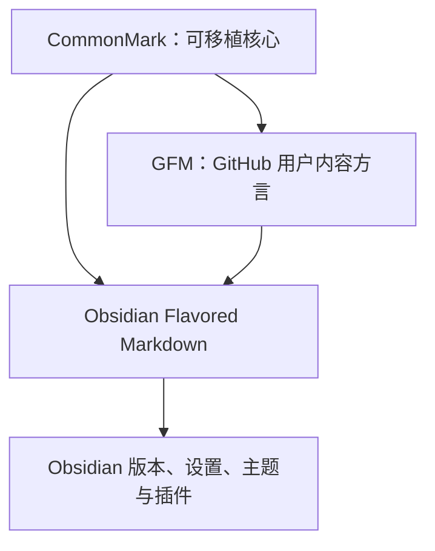

# CommonMark、GFM 与 Obsidian 语法边界

## 本节目标

本节解决一个工程问题：一段 Markdown 在 Obsidian 中正常，为什么复制到 GitHub、文档站或模型上下文后会变样？学完后，你应能给每种语法标注所属层级，并根据交付目标选择“可移植”还是“充分利用 Obsidian”。

## Markdown 不是单一运行时

“Markdown”是一个家族名称。实际结果由语法方言、宿主解析器和渲染环境共同决定。



截至 **2026-07-14**：

- CommonMark 官网列出的最新发布规范是 **0.31.2（2024-01-28）**。
- GFM 的正式规范页仍标为 **0.29-gfm（2019-04-06）**；它是 GitHub 用户内容的方言，不等于“最新 CommonMark 加几个功能”的版本号关系。
- Obsidian 在 CommonMark/GFM 基础上提供 wikilink、embed、callout、Properties、注释和 Mermaid 等宿主能力。

这些版本是实际核对结果，不是永久保证。后续复用笔记时应重新查看官方页面。

## 三层能力矩阵

| 能力 | CommonMark 0.31.2 | GFM 0.29-gfm | Obsidian | 工程建议 |
| --- | :---: | :---: | :---: | --- |
| 标题、段落、列表、引用 | 是 | 是 | 是 | 作为可移植骨架 |
| 强调、链接、图片、代码围栏 | 是 | 是 | 是 | 外部交付优先使用 |
| 表格 | 否 | 扩展 | 支持 | 仅用于短比较 |
| 删除线 | 否 | 扩展 | 支持 | 不把它当唯一状态证据 |
| 任务列表 | 否 | 扩展 | 支持且可交互 | 导出后交互行为可能变化 |
| 裸 URL 扩展自动链接 | 有限 | 扩展 | 依宿主 | 重要链接写描述文本 |
| `[[wikilink]]` | 否 | 否 | 是 | vault 内导航使用 |
| `![[embed]]` | 否 | 否 | 是 | 离开 Obsidian 前需转换 |
| `> [!note]` callout | 否 | 否 | 是 | 不能假设其他渲染器同样显示 |
| YAML Properties | 规范未定义 | 规范未定义 | 原生结构化属性 | 某些平台上下文另有 frontmatter 行为，不能归入 GFM |
| Mermaid 围栏 | 只是带信息字符串的代码围栏 | GFM 规范未定义图形渲染 | 宿主可渲染 | Mermaid 是宿主功能，不是 GFM 语法保证 |

> [!important] 规范与平台功能要分开
> GitHub 网页能够渲染 Mermaid，不代表 Mermaid 属于 GFM 0.29-gfm；同理，GitHub 的 `@mention`、议题引用和提交哈希识别也是平台行为。写兼容性说明时要说清“哪个宿主提供了什么”。

## 可移植核心怎么写

需要同时在 Obsidian、GitHub 和普通 Markdown 工具中阅读时，优先采用：

- ATX 标题：`## 标题`；
- 空行分段；
- `-` 列表和 `1.` 步骤；
- 标准 Markdown 外链与相对文件链接；
- 带语言标记的围栏代码；
- 简单引用；
- 不依赖 CSS 才能理解的文本。

一个可移植 README 片段：

````markdown
## 运行

在仓库根目录执行：

```powershell
python -m unittest
```

预期：测试进程退出码为 `0`。实际结果请在变更记录中填写，不要预先声称通过。
````

即便语法可移植，路径、Shell 和命令仍可能不兼容。Markdown 兼容不等于操作环境兼容。

## 何时使用 GFM 扩展

如果主要交付目标是 GitHub，可以使用表格、任务列表、删除线和扩展自动链接，但要知道边界：

- 表格单元格只适合简短行内内容，不能可靠容纳复杂块；
- 任务列表规范定义复选框结构，但是否可点击由实现决定；
- 删除线表达“作废”很直观，却不会保存作废原因或时间；
- 裸 URL 可被某些宿主识别，正式文档仍应使用 `[描述](URL)`。

## 何时使用 Obsidian 扩展

知识库内部协作可以利用：

- 完整路径 wikilink，获得反向链接和重命名更新；
- note、heading、block 和附件 embed；
- Properties 支持检索和 Dataview 等后续消费；
- callout 区分警告、示例和补充；
- Mermaid 表达流程与关系。

代价是锁定程度更高。准备导出时，需要决定是保留源码、转成普通链接/图片，还是明确要求读者使用 Obsidian。

## HTML 不是通用逃生舱

CommonMark 允许原始 HTML 块，但宿主可能过滤、转义或采用不同的内部解析规则。Obsidian 官方说明：**Markdown 语法不会在 HTML 元素内部继续解析**。因此：

```html
<details>
<summary>展开答案</summary>
<strong>这里使用 HTML 粗体，而不是 Markdown 星号。</strong>
</details>
```

不要因为某段混合写法在 GitHub 可用，就断言它在 Obsidian 或发布系统中相同。HTML 还会降低纯文本可读性；只有核心语法表达不了且目标宿主已验证时再用。

## 兼容性决策流程

1. **确认读者和目标宿主**：只在本 vault、同时上 GitHub，还是要交给未知工具？
2. **写可移植骨架**：标题、段落、列表、代码和普通链接。
3. **逐项增加扩展**：每个扩展都能回答“它解决什么问题？”
4. **记录降级方式**：callout 变引用、embed 变链接、Mermaid 变 SVG 或文字说明。
5. **在真实目标复核**：编辑器预览、Obsidian 阅读视图和 GitHub 各自检查。
6. **记录版本与未验证项**：尤其是 Mermaid、插件和发布系统。

## 动手练习：给语法贴标签

把下面各项标为 `CommonMark`、`GFM`、`Obsidian` 或 `平台功能`，并写出离开原宿主后的降级方案：

1. `## 标题`
2. `- [ ] 任务`
3. `[[Knowledge/AI Agent Engineer/docs-CN/Markdown/00-目录|Markdown]]`
4. `> [!warning]`
5. Mermaid 代码围栏被渲染成 SVG 图
6. GitHub 中 `#123` 自动变成议题链接

参考判断：第 1 项属于 CommonMark；第 2 项是 GFM 扩展且 Obsidian 也支持；第 3、4 项是 Obsidian 扩展；第 5 项取决于宿主渲染能力；第 6 项是 GitHub 平台行为。

再选择本 vault 中一篇含 wikilink、callout 和 Mermaid 的笔记，复制到临时文件并设计一个“纯 Markdown 降级版”。不必真的发布，但要列出会失去什么。

## 常见误区

- **把 GFM 称为唯一标准 Markdown**：它是特定方言。
- **把围栏语言名当执行承诺**：`mermaid`、`python` 都只是信息字符串，宿主决定如何处理。
- **把 Obsidian 预览当跨平台测试**：它只证明当前宿主当前设置下的行为。
- **为了可移植拒绝所有扩展**：内部知识库可以用扩展，只要记录边界与降级方式。
- **用 HTML 强行修所有排版**：会增加安全、兼容和维护成本。

## 自测与掌握标准

1. GFM 与 CommonMark 是什么关系，为什么版本号不能混写？
2. Mermaid 为什么不是 GFM 表格那样的正式扩展？
3. 哪些语法适合作为跨平台骨架？
4. Obsidian 文档导出前应检查哪些专用能力？
5. 为什么 HTML 内部的 Markdown 行为要按宿主验证？

- [ ] 能给常用语法标出所属层级。
- [ ] 能为 wikilink、embed、callout 和 Mermaid 设计降级方案。
- [ ] 能区分规范事实、宿主能力和工程建议。
- [ ] 能记录目标宿主、核对日期和未验证项。

上一节：[[Markdown/01-Markdown基础语法与可读源文件|Markdown 基础语法与可读源文件]]。  
下一节：[[Markdown/03-Obsidian链接、附件与嵌入|Obsidian 链接、附件与嵌入]]。

## 参考资料

核对日期：**2026-07-14**。

- [CommonMark 最新规范页](https://spec.commonmark.org/)
- [GitHub Flavored Markdown Specification 0.29-gfm](https://github.github.com/gfm/)
- [Obsidian Flavored Markdown](https://obsidian.md/help/obsidian-flavored-markdown)
- [GitHub：Creating diagrams](https://docs.github.com/en/get-started/writing-on-github/working-with-advanced-formatting/creating-diagrams)
