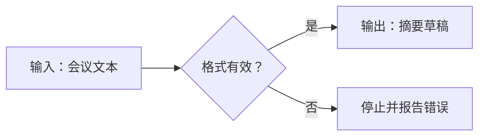
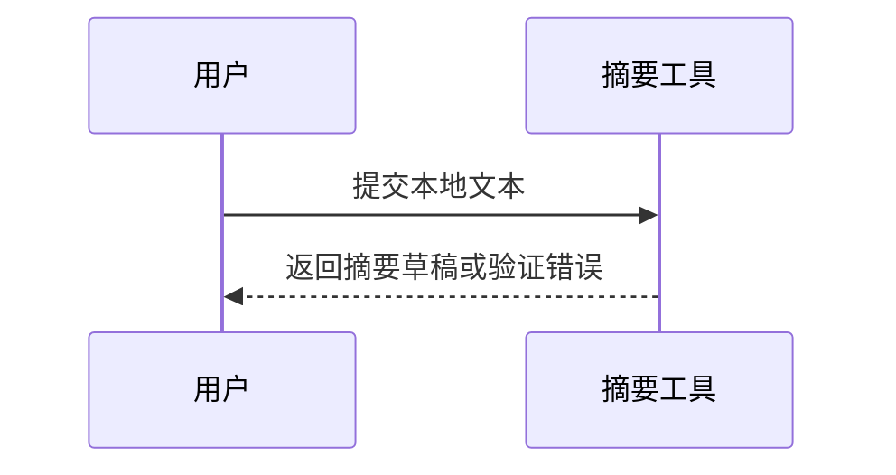

# 综合写作练习与 Mermaid 排错

## 本节目标

通过一组短任务把前五课连起来，并能从“源文本—解析规则—渲染器”三层排查问题。本课要求先独立完成，再对照验收清单；遇到陌生语法时查阅 [[Markdown/Markdown 教程|Markdown 完整教程]]，不要靠反复试字符碰运气。

## 练习一：把杂乱说明变成结构

原文：

```text
启动服务。需要Python。先创建环境。安装依赖。运行app.py。失败时看日志。不要提交.env。
```

改写要求：

- 一级标题是文档名称；正文最高从二级标题开始。
- 增加“前置条件、步骤、验证、失败处理、安全”五节。
- 命令使用带 `powershell` 语言标记的围栏。
- 文件名和变量用行内代码。
- “不要提交 `.env`”写成明确安全规则，不藏在段落末尾。

完成后仅看源文件，检查层级是否仍清楚；再看阅读视图，检查列表与代码块是否连续。

## 练习二：列表、任务与表格

写一份三阶段检查单：准备、执行、验收。每阶段至少三个任务，其中一个任务再嵌套两项。随后用表格记录：检查项、负责人、证据、状态。

常见错误：

- 列表前没有空行，某些渲染器把它接进段落；
- 嵌套缩进不一致；
- 表格分隔行列数与标题不一致；
- 单元格中的 `|` 未转义，导致意外拆列；
- 用空格手工对齐正文，换字体后失效。

## 练习三：链接策略

为一篇知识笔记设计三类链接：

1. vault 内部笔记：使用文件夹限定 wikilink，避免多个 `00-目录` 产生歧义；
2. 外部规范：使用 `[描述文本](https://...)`；
3. 图片或 PDF 嵌入：使用 Obsidian embed，并确认目标文件真实存在。

链接文字要说明目标内容，不要连续使用“点击这里”。修改或移动文件后重新验证路径。

## 练习四：代码与输出

工程文档应区分命令、输出和占位符：

```powershell
python --version
```

```text
Python 3.x.y
```

上方 `3.x.y` 表示读者机器上的实际版本，不是声称已验证的固定版本。命令若未执行，应写“预期”而不是“运行结果”。不要在代码块中放真实 token、cookie 或内部地址。

## 练习五：最小 Mermaid 图

先画三节点流程：输入、验证、输出。每次只增加一个结构，避免一开始使用大量样式。节点文字含括号或标点时加引号，并在阅读视图验证。

图适合表达关系和流程；精确参数、长解释与可复制命令仍应放在正文或表格中。

先完成流程图：



再把同一任务改写成最小时序图，体会“步骤流”与“参与者交互”的区别：



完成标准不是“图越复杂越好”，而是读者能回答：谁提供输入、何时停止、谁接收结果。先阅读 [[Markdown/参考资料、版本与兼容性说明#Mermaid 大型教程的兼容提醒|Mermaid 兼容提醒]]，再按需查阅 [[Markdown/Mermaid|Mermaid 完整教程]]。

## 练习六：Properties、链接与嵌入

新建一篇练习笔记，要求：

1. frontmatter 使用 `title`、`tags`、`aliases`，每个键只出现一次；
2. 用完整路径 wikilink 指向本库目录；
3. 用标题链接指向 [[Markdown/03-Obsidian链接、附件与嵌入#链接到标题与块|链接到标题与块]]；
4. 写一个可折叠的 `[!example]-` callout；
5. 解释链接与 embed 的差异，但不创建虚假附件。

不要把 token、账号、内部服务器地址写进 Properties；隐藏显示不等于加密。

## 渲染排错顺序

1. 缩小到最小失败片段。
2. 检查围栏是否成对、反引号数量是否匹配。
3. 检查列表前空行和嵌套缩进。
4. 检查表格中的 `|`、换行与内联代码。
5. 检查 wikilink 或 embed 的真实目标。
6. 区分是 CommonMark 语法、GFM 扩展还是 Obsidian 专用语法。
7. 在实际阅读视图复核，而不是只相信编辑器高亮。

若问题只出现在 Mermaid：

1. 先把图缩成“图类型 + 两个节点 + 一条边”；
2. 确认代码块语言是 `mermaid`，围栏成对；
3. 节点文字含括号、冒号、斜杠或尖括号时先加双引号；
4. 检查 `subgraph` 是否有 `end`、节点 ID 是否重复；
5. 再逐段加回原内容，定位第一处失败增量；
6. 最后到当前 Obsidian 阅读视图复核，因为宿主内置版本可能落后于 Mermaid 官网。

> [!warning] 嵌套代码围栏
> 要在一个 Markdown 代码块里展示另一个三反引号代码块，外层必须使用四个或更多反引号，或改用波浪线。相同长度的围栏会提前闭合外层。

## 练习验收

- [ ] 文档源文本在不渲染时也能读懂。
- [ ] 标题没有跳级，列表层次清楚。
- [ ] 命令和输出分别标记，未把预期冒充实测。
- [ ] 内外部链接形式正确且目标可访问。
- [ ] Mermaid 图表达了流程，而不是重复整段正文。
- [ ] 同一任务改写成流程图和时序图后，能解释两者各自回答的问题。
- [ ] Properties 键唯一、值类型清楚，内部链接使用真实完整路径。
- [ ] 没有真实凭据、未解释的危险命令或模糊占位。

可以按 0～2 分给每项打分：0 表示缺失，1 表示存在但仍需口头解释，2 表示另一位初学者仅看文件即可复核。总分低于 12 分时，先修结构和证据，不先做视觉装饰。

## 自测与来源

1. 为什么源文件清晰和渲染美观都重要？
2. 何时使用 wikilink，何时使用标准 Markdown 链接？
3. 代码围栏为什么要标语言？
4. Mermaid 图不能替代哪些信息？
5. 为什么外层与内层代码围栏不能使用相同长度？
6. Mermaid 官网能渲染但 Obsidian 不能渲染时，应如何判断问题边界？

上一节：[[Markdown/05-面向Agent工程的结构化技术写作|面向 Agent 工程的结构化技术写作]]。  
下一步：[[Markdown/07-知识库运行手册项目与自测|知识库运行手册项目与自测]]。

获取日期：**2026-07-14**。

- [CommonMark Specification](https://spec.commonmark.org/0.31.2/)
- [Obsidian：Basic formatting syntax](https://obsidian.md/help/syntax)
- [Mermaid：Flowcharts](https://mermaid.js.org/syntax/flowchart.html)
- [Mermaid：Sequence diagrams](https://mermaid.js.org/syntax/sequenceDiagram.html)
