# Mermaid 完整教程：用 Markdown 文本画流程图、架构图和项目图

Mermaid 是一种“用文本描述图形”的绘图语法。它可以直接嵌入 Markdown 文档中，通过代码块自动渲染为流程图、时序图、类图、状态图、甘特图等。它特别适合写技术文档、项目架构说明、深度学习模型结构图、代码调用关系图和论文/综述中的方法流程图。

> [!warning] 版本与宿主边界
> 本文是保留的既有大型参考教程。Mermaid 上游与 Obsidian/GitHub 捆绑版本会变化；平台启用条件、子图方向、时序箭头、类图关系和实验性图类型的当前勘误，以 [[Markdown/参考资料、版本与兼容性说明#Mermaid 大型教程的兼容提醒|Mermaid 兼容提醒]] 为准。

---

## 1. Mermaid 是什么

Mermaid 的核心思想是：不用手动画线，而是用代码描述节点、关系和方向。

例如下面这段代码：

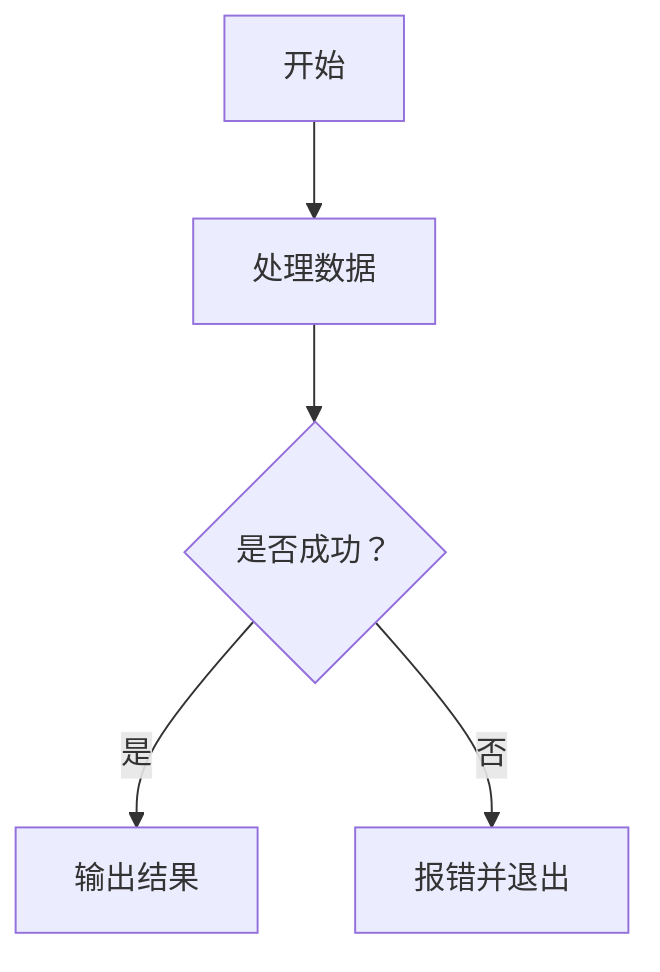

它会被渲染成一个流程图：

- `flowchart TD` 表示画流程图，方向是从上到下。
- `A[开始]` 表示一个节点，节点 ID 是 `A`，显示文本是“开始”。
- `A --> B` 表示从 A 指向 B。
- `C{是否成功？}` 表示判断节点。
- `-->|是|` 表示带文字的箭头。

Mermaid 最适合画“结构关系清晰”的图，例如流程图、模块图、训练流程、调用流程、类关系、状态转换、项目计划等。

---

## 2. 在 Markdown 中使用 Mermaid

Mermaid 通常写在 Markdown 代码块中。

标准格式如下：

````markdown
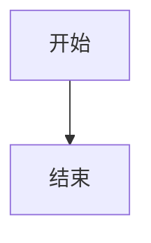
````

在支持 Mermaid 的编辑器中，这段代码会自动渲染成图。

常见支持环境包括：

- Obsidian
- GitHub Markdown
- Typora
- VS Code + Mermaid 插件
- GitLab
- Notion 部分场景
- MkDocs / Docusaurus / VitePress 等文档站点
- Mermaid Live Editor

如果某个平台不能正常显示，通常不是语法问题，而是该平台没有启用 Mermaid 渲染。

---

## 3. 流程图 flowchart

流程图是 Mermaid 最常用的图类型，适合画算法流程、模型结构、模块关系、训练流程等。

### 3.1 基本语法

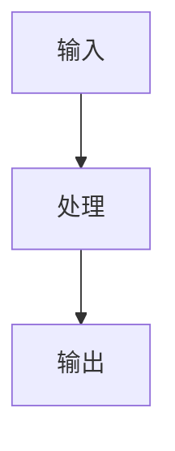

代码解释：

```markdown
flowchart TD
```

表示创建流程图，方向为 `TD`，即从上到下。

常见方向如下：

| 写法 | 含义 |
|---|---|
| `TD` | Top Down，从上到下 |
| `TB` | Top Bottom，从上到下，和 TD 类似 |
| `BT` | Bottom Top，从下到上 |
| `LR` | Left Right，从左到右 |
| `RL` | Right Left，从右到左 |

例如从左到右：


---

## 4. 节点写法

Mermaid 中，节点通常由“节点 ID + 节点形状”组成。

### 4.1 矩形节点


代码：

```markdown
A[普通矩形节点]
```

### 4.2 圆角矩形节点


代码：

```markdown
A(圆角节点)
```

### 4.3 圆形节点


代码：

```markdown
A((圆形节点))
```

### 4.4 判断节点


代码：

```markdown
A{是否满足条件？}
```

判断节点常用于 if/else 分支、是否成功、是否结束训练等场景。

### 4.5 数据库节点

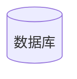

代码：

```markdown
A[(数据库)]
```

适合表示数据库、数据文件、向量库、缓存、结果表等。

### 4.6 平行四边形节点


代码：

```markdown
A[/输入或输出/]
```

常用于表示输入、输出、人工输入、文件输出等。

### 4.7 子程序节点


代码：

```markdown
A[[子程序 / 模块]]
```

适合表示函数、模块、组件、子流程。

---

## 5. 连接线写法

### 5.1 普通箭头

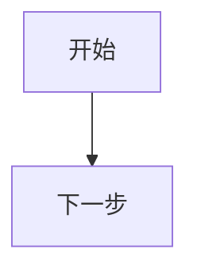

### 5.2 带文字的箭头

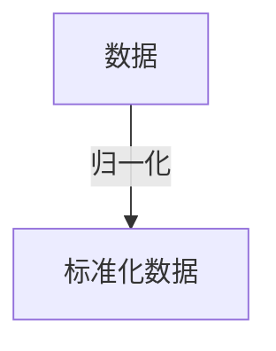

箭头文字写在 `|文字|` 中。

### 5.3 无箭头连接线

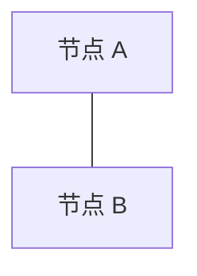

### 5.4 虚线箭头

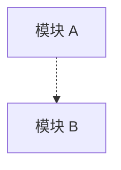

适合表示可选关系、辅助关系、弱依赖、参考关系。

### 5.5 粗箭头

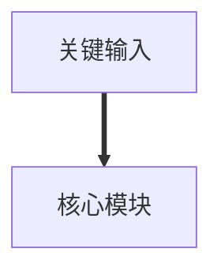

适合强调主路径。

### 5.6 带文字的虚线箭头

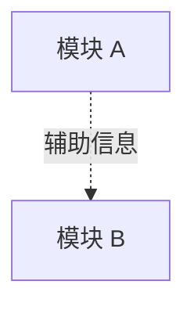

---

## 6. 多节点连续连接

Mermaid 可以把多个步骤写成一行：

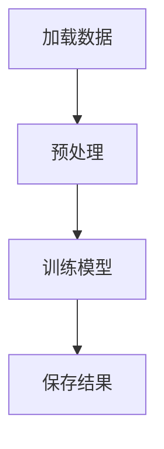

也可以拆成多行：


复杂图建议拆成多行，方便修改和排错。

---

## 7. 节点换行

节点内容较长时，可以使用 `<br/>` 换行。

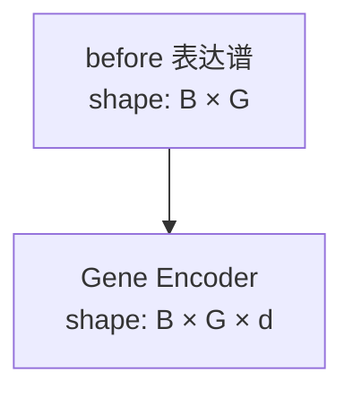

适合深度学习架构图中标注张量维度。

---

## 8. 子图 subgraph

当图比较复杂时，可以用 `subgraph` 把节点分组。

```mermaid
flowchart TD
    subgraph Data[数据处理模块]
        A[原始数据] --> B[归一化]
        B --> C[特征构造]
    end

    subgraph Model[模型模块]
        D[编码器] --> E[预测头]
    end

    C --> D
    E --> F[输出结果]
```

基本结构：

```markdown
subgraph 显示名称
    节点和连接
end
```

或者：

```markdown
subgraph ID[显示名称]
    节点和连接
end
```

推荐第二种写法，因为可以给子图一个稳定 ID。

---

## 9. 子图方向

子图内部也可以设置方向：

```mermaid
flowchart TD
    subgraph Encoder[编码器模块]
        direction LR
        A[输入] --> B[MLP] --> C[输出]
    end

    C --> D[预测头]
```

这里外层是从上到下，子图内部是从左到右。

---

## 10. 注释

Mermaid 中可以用 `%%` 写注释。

```mermaid
flowchart TD
    %% 这里是注释，不会显示在图中
    A[输入] --> B[输出]
```

注释适合说明复杂图中的设计意图。

---

## 11. 样式设置

Mermaid 可以给节点设置颜色、边框和字体样式。

### 11.1 使用 style 设置单个节点

```mermaid
flowchart TD
    A[输入] --> B[核心模块] --> C[输出]

    style B fill:#f9f,stroke:#333,stroke-width:2px
```

含义：

- `fill`：填充色
- `stroke`：边框色
- `stroke-width`：边框宽度

### 11.2 使用 classDef 定义样式类

```mermaid
flowchart TD
    A[输入] --> B[编码器] --> C[预测头] --> D[输出]

    classDef core fill:#e8f4ff,stroke:#1f77b4,stroke-width:2px
    class B,C core
```

`classDef core` 定义一个样式类，`class B,C core` 把这个样式应用到 B 和 C。

### 11.3 推荐用法

在技术文档中，不建议过度使用颜色。Mermaid 图的核心价值是结构清晰，颜色只用于区分关键模块即可。

---

## 12. 流程图完整示例：训练流程

```mermaid
flowchart TD
    A[读取配置文件] --> B[加载数据集]
    B --> C[构建 Dataset / DataLoader]
    C --> D[初始化模型]
    D --> E[前向传播]
    E --> F[计算 Loss]
    F --> G[反向传播]
    G --> H[更新参数]
    H --> I{达到最大 epoch？}
    I -->|否| E
    I -->|是| J[保存模型和日志]
```

这个图适合放在深度学习项目文档中，用来说明训练主流程。

---

## 13. 深度学习架构图示例

```mermaid
flowchart TD
    A[before 表达谱<br/>B × G] --> C[Gene-wise Feature Builder]
    B[after 表达谱<br/>B × G] --> C

    C --> D[Gene Encoder<br/>MLP / Transformer / GNN]
    D --> E[expression tokens<br/>B × G × d]

    E --> F[Gene Selection<br/>Top-k / Attention / Sparse Gate]
    F --> G[Sample Pooling<br/>Attention Pooling / Set Pooling]
    G --> H[sample vector<br/>B × d]

    H --> I[Prediction Head]
    I --> J[扰动响应预测]
```

写深度学习架构图时，建议包含：

- 输入数据
- 张量维度
- 核心模块
- 信息流方向
- 输出目标

不要只写模块名，否则图看起来很空；也不要把每个节点写得太长，否则图会非常乱。

---

## 14. 复杂模型结构图示例

```mermaid
flowchart TD
    subgraph Input[输入]
        A1[before 表达谱<br/>B × G]
        A2[扰动信息<br/>drug / target / dose]
        A3[基因先验<br/>pathway / GO / network]
    end

    subgraph GeneEncoding[基因级编码]
        B1[表达值编码]
        B2[基因嵌入]
        B3[表达-基因融合]
    end

    subgraph SampleEncoding[样本向量构建]
        C1[重要基因筛选]
        C2[Set / Attention Pooling]
        C3[sample vector<br/>B × d]
    end

    subgraph Prediction[预测模块]
        D1[扰动条件融合]
        D2[响应预测头]
        D3[uncertainty head]
    end

    A1 --> B1
    A3 --> B2
    B1 --> B3
    B2 --> B3
    B3 --> C1 --> C2 --> C3
    A2 --> D1
    C3 --> D1 --> D2
    D1 --> D3
```

这类图适合项目设计文档、架构说明、论文方法图草稿。

---

## 15. 时序图 sequenceDiagram

时序图适合表示“谁调用谁”，例如用户调用 Codex、程序调用模块、服务间通信。

### 15.1 基本示例

```mermaid
sequenceDiagram
    participant User as 用户
    participant App as 应用
    participant Server as 服务器
    participant DB as 数据库

    User->>App: 点击查询
    App->>Server: 发送请求
    Server->>DB: 查询数据
    DB-->>Server: 返回结果
    Server-->>App: 返回响应
    App-->>User: 展示结果
```

### 15.2 箭头类型

| 写法 | 含义 |
|---|---|
| `->>` | 实线箭头 |
| `-->>` | 虚线返回箭头 |
| `-)` | 异步消息 |
| `--x` | 失败或中断 |

### 15.3 带判断的时序图

```mermaid
sequenceDiagram
    participant User as 用户
    participant System as 系统
    participant Model as 模型

    User->>System: 提交输入
    System->>Model: 调用预测

    alt 预测成功
        Model-->>System: 返回结果
        System-->>User: 展示预测结果
    else 预测失败
        Model-->>System: 返回错误
        System-->>User: 提示失败原因
    end
```

---

## 16. 类图 classDiagram

类图适合表示代码中的类、属性、方法和类之间关系。

```mermaid
classDiagram
    class Dataset {
        +load_data()
        +normalize()
        +get_item()
    }

    class Model {
        +forward()
        +encode()
        +predict()
    }

    class Trainer {
        +train()
        +evaluate()
        +save_checkpoint()
    }

    Dataset --> Trainer
    Model --> Trainer
```

### 16.1 类之间关系

| 写法 | 含义 |
|---|---|
| `A --> B` | A 使用 B |
| <code>A &lt;&#124;</code>`-- B` | B 继承 A |
| `A *-- B` | 组合关系 |
| `A o-- B` | 聚合关系 |
| `A ..> B` | 依赖关系 |

继承示例：

```mermaid
classDiagram
    class BaseModel
    class TransformerModel
    class GNNModel

    BaseModel <|-- TransformerModel
    BaseModel <|-- GNNModel
```

---

## 17. 状态图 stateDiagram

状态图适合描述程序状态、训练状态、任务状态、工作流状态。

```mermaid
stateDiagram-v2
    [*] --> 初始化
    初始化 --> 训练中
    训练中 --> 验证中
    验证中 --> 保存模型
    保存模型 --> 训练中
    验证中 --> 结束: 达到最大 epoch
    结束 --> [*]
```

状态图中的 `[ * ]` 表示开始或结束状态。

---

## 18. 甘特图 gantt

甘特图适合做项目计划、论文写作计划、实验计划。

```mermaid
gantt
    title 综述写作计划
    dateFormat  YYYY-MM-DD

    section 文献整理
    整理已有论文 :a1, 2026-04-29, 3d
    补充新论文 :a2, after a1, 5d

    section 正文写作
    写第一版正文 :b1, after a2, 7d
    修改和润色 :b2, after b1, 3d
```

常用字段：

- `title`：标题
- `dateFormat`：日期格式
- `section`：分组
- `任务名 :任务ID, 开始时间, 持续时间`
- `after a1`：表示在任务 a1 之后开始

---

## 19. 饼图 pie

饼图适合表示比例。

```mermaid
pie title 数据集划分
    "训练集" : 70
    "验证集" : 15
    "测试集" : 15
```

饼图比较简单，不适合表达复杂分析，只适合展示比例关系。

---

## 20. Git 图 gitGraph

Git 图适合展示分支、提交、合并流程。

```mermaid
gitGraph
    commit
    branch dev
    checkout dev
    commit
    commit
    checkout main
    merge dev
    commit
```

适合写开发流程、版本演进、实验分支管理。

---

## 21. ER 图 erDiagram

ER 图适合表示数据库实体关系。

```mermaid
erDiagram
    USER ||--o{ ORDER : places
    ORDER ||--|{ ORDER_ITEM : contains
    PRODUCT ||--o{ ORDER_ITEM : included_in

    USER {
        int id
        string name
        string email
    }

    ORDER {
        int id
        int user_id
        date created_at
    }

    PRODUCT {
        int id
        string name
        float price
    }
```

关系符号含义大致如下：

| 符号 | 含义 |
|---|---|
| <code>&#124;&#124;</code> | 一个且只有一个 |
| <code>o&#124;</code> | 零个或一个 |
| `o{` | 零个或多个 |
| <code>&#124;{</code> | 一个或多个 |

---

## 22. Mindmap 思维导图

有些环境支持 Mermaid 的 mindmap。

```mermaid
mindmap
  root((Mermaid))
    流程图
      flowchart
      subgraph
    时序图
      sequenceDiagram
    代码结构
      classDiagram
    项目管理
      gantt
```

注意：不同平台对 mindmap 的支持程度可能不同。如果不能渲染，建议改用 flowchart。

---

## 23. Mermaid 常用模板

### 23.1 普通流程模板

```mermaid
flowchart TD
    A[开始] --> B[执行步骤 1]
    B --> C[执行步骤 2]
    C --> D{是否满足条件？}
    D -->|是| E[执行成功流程]
    D -->|否| F[执行失败流程]
    E --> G[结束]
    F --> G
```

### 23.2 模块架构模板

```mermaid
flowchart TD
    subgraph Input[输入模块]
        A[输入数据]
    end

    subgraph Processing[处理模块]
        B[预处理]
        C[特征提取]
        D[特征融合]
    end

    subgraph Output[输出模块]
        E[预测头]
        F[输出结果]
    end

    A --> B --> C --> D --> E --> F
```

### 23.3 深度学习训练模板

```mermaid
flowchart TD
    A[加载配置] --> B[加载数据]
    B --> C[构建 DataLoader]
    C --> D[初始化模型]
    D --> E[forward]
    E --> F[loss]
    F --> G[backward]
    G --> H[optimizer step]
    H --> I{结束训练？}
    I -->|否| E
    I -->|是| J[保存 checkpoint]
```

### 23.4 推理流程模板

```mermaid
flowchart TD
    A[输入样本] --> B[加载模型权重]
    B --> C[特征预处理]
    C --> D[模型推理]
    D --> E[后处理]
    E --> F[输出预测结果]
```

### 23.5 Codex / Agent 工作流模板

```mermaid
flowchart TD
    A[用户任务] --> B[读取项目文档]
    B --> C[读取代码仓库]
    C --> D[分析当前实现]
    D --> E[查阅相关资料]
    E --> F[提出设计方案]
    F --> G[修改代码或生成文档]
    G --> H[总结改动和后续建议]
```

---

## 24. 写技术架构图的建议

### 24.1 先确定图的目的

画图前先明确：这张图是为了说明什么？

常见目的有：

- 说明整体系统结构
- 说明模型前向传播流程
- 说明训练流程
- 说明模块之间的数据依赖
- 说明代码类之间的关系
- 说明实验流程
- 说明论文方法的核心思想

目的不同，图的粒度也不同。

例如：

- 给自己看：可以细到每个函数、每个张量变换。
- 给论文读者看：保留核心模块即可。
- 给 Codex 分析项目：可以写得更细，便于模型定位代码逻辑。
- 给团队协作看：强调输入、输出、依赖和责任边界。

### 24.2 主路径要清晰

复杂图中最重要的是主路径。建议用从上到下或从左到右的一条主线串起来：

```markdown
输入 → 编码 → 融合 → 预测 → 输出
```

辅助信息可以用虚线连接，避免干扰主线。

```mermaid
flowchart TD
    A[输入表达谱] --> B[编码器] --> C[预测头] --> D[输出]

    E[基因先验信息] -.-> B
    F[训练配置] -.-> C
```

### 24.3 不要让一个节点太长

不推荐：

```markdown
A[这里进行表达谱归一化、差异表达计算、基因嵌入拼接、mask 处理、dropout 和多层 MLP 编码]
```

推荐拆分：

```mermaid
flowchart TD
    A[表达谱归一化] --> B[差异表达计算]
    B --> C[基因嵌入拼接]
    C --> D[MLP 编码]
```

### 24.4 复杂图要分层

复杂项目建议分为三类图：

第一类是总览图，只画主要模块。

第二类是模块细节图，单独展开一个模块。

第三类是数据流图，重点标注张量维度和输入输出。

不要试图用一张图表达所有内容，否则图会变得难以阅读。

---

## 25. Mermaid 在 Obsidian 中的使用

在 Obsidian 中，可以直接写：

````markdown
```mermaid
flowchart TD
    A[开始] --> B[结束]
```
````

然后切换到阅读模式或实时预览，即可看到图。

### 25.1 Obsidian 中的建议

如果是项目笔记，建议把 Mermaid 图放在专门的架构文档中，例如：

````markdown
# 当前模型架构

## 总览图

```mermaid
flowchart TD
    A[输入] --> B[模型] --> C[输出]
```

## 样本编码模块

```mermaid
flowchart TD
    A[表达谱] --> B[基因编码] --> C[样本向量]
```
````

### 25.2 图太宽怎么办

如果图太宽，可以：

- 把 `LR` 改成 `TD`
- 减少节点文字
- 拆成多个子图
- 用 `subgraph` 分模块
- 把细节单独放到下一张图

---

## 26. Mermaid 在 GitHub 中的使用

GitHub Markdown 支持 Mermaid。可以直接在 README.md 中写：

````markdown
```mermaid
flowchart TD
    A[Clone Repo] --> B[Install Dependencies]
    B --> C[Run Training]
```
````

适合在仓库 README 中展示：

- 项目结构
- 使用流程
- 模型架构
- 数据处理流程
- 训练与评估流程

注意：GitHub 的 Mermaid 版本可能不是最新版本，一些新语法可能无法渲染。

---

## 27. Mermaid Live Editor

Mermaid 官方提供在线编辑器 Mermaid Live Editor。

常见用途：

- 快速测试语法
- 导出 SVG / PNG
- 调整图的布局
- 检查报错位置

建议复杂图先在 Live Editor 中调好，再复制回 Markdown 文档。

---

## 28. 常见错误和排查方法

### 28.1 节点文本中包含特殊字符

有些字符可能导致解析失败，例如括号、冒号、尖括号、斜杠等。

如果节点文本复杂，可以用引号包起来：

```mermaid
flowchart TD
    A["input: before/after expression"] --> B["output: sample vector"]
```

### 28.2 中文一般可以正常使用

中文通常没有问题：

```mermaid
flowchart TD
    A[输入表达谱] --> B[样本编码器] --> C[预测结果]
```

但如果混合特殊符号，建议加引号：

```mermaid
flowchart TD
    A["表达谱 shape: B × G"] --> B["tokens shape: B × G × d"]
```

### 28.3 缩进不一致

Mermaid 对缩进没有 Python 那么严格，但在 `subgraph`、`sequenceDiagram`、`gantt` 中，良好缩进能减少错误。

推荐：

```mermaid
flowchart TD
    subgraph A[模块 A]
        A1[步骤 1] --> A2[步骤 2]
    end
```

不推荐所有内容挤在一起。

### 28.4 子图忘记 end

错误示例：

```markdown
subgraph A[模块 A]
    A1 --> A2
```

正确示例：

```markdown
subgraph A[模块 A]
    A1 --> A2
end
```

### 28.5 节点 ID 重复导致图混乱

节点 ID 是节点的唯一标识。下面这样会把两个 A 当成同一个节点：

```mermaid
flowchart TD
    A[输入] --> B[处理]
    A[另一个输入] --> C[处理]
```

建议用更明确的 ID：

```mermaid
flowchart TD
    Input1[输入 1] --> B[处理]
    Input2[输入 2] --> C[处理]
```

---

## 29. Mermaid 图的命名习惯

建议节点 ID 使用英文或简短缩写，显示文本可以用中文。

推荐：

```mermaid
flowchart TD
    Input[输入表达谱] --> Encoder[编码器]
    Encoder --> Output[输出结果]
```

不推荐：

```mermaid
flowchart TD
    输入表达谱[输入表达谱] --> 编码器[编码器]
```

原因是中文 ID 在多数环境也能工作，但在复杂图中更容易遇到兼容性问题。

---

## 30. 面向 Codex 的 Mermaid 生成提示词

如果要让 Codex 根据代码生成 Mermaid 图，可以这样说：

```text
请根据当前仓库代码生成 Mermaid 架构图，输出为 Markdown 文件。要求：
1. 使用 flowchart TD。
2. 先给出整体模型总览图，再分别给出数据处理、样本编码、预测头、训练流程的细节图。
3. 图中标注关键张量维度，例如 [B,G]、[B,G,d]、[B,d]。
4. 使用 subgraph 划分模块。
5. 主路径使用实线箭头，辅助配置、先验信息、mask 等使用虚线箭头。
6. 不要只画粗略模块，要尽量展开到主要操作级别，但避免把每一行代码都画成节点。
7. 图后用简短文字解释每张图的含义和对应代码位置。
```

如果希望 Codex 修改已有图：

```text
请检查当前 Mermaid 架构图是否与代码实现一致。重点检查：
1. 模块是否缺失。
2. 数据流方向是否正确。
3. 张量维度是否正确。
4. 是否存在图中有但代码中没有的模块。
5. 是否存在代码中有但图中没有的关键模块。
请直接给出修正后的 Mermaid 图，并说明主要修正点。
```

---

## 31. Mermaid 和手绘图的区别

Mermaid 的优点：

- 适合版本管理，可以放进 Git。
- 修改方便，不需要重新拖拽。
- 很适合技术文档。
- 能和 Markdown、Obsidian、GitHub 结合。
- 对 Codex / ChatGPT 友好，模型可以直接生成和修改。

Mermaid 的缺点：

- 布局自由度不如 draw.io、Figma、PPT。
- 复杂美观图不如专业绘图工具。
- 不适合画非常精细的视觉图、论文最终排版图。
- 不同平台支持的 Mermaid 版本可能不同。

建议：

- 项目文档、代码架构、实验流程：优先 Mermaid。
- 论文最终发表图、商业展示图：可以先用 Mermaid 生成结构草图，再用 BioRender、draw.io、Figma 或 PPT 美化。

---

## 32. Mermaid 学习路线

如果只是日常项目使用，优先掌握：

1. `flowchart TD / LR`
2. 节点形状
3. 箭头和箭头文字
4. `subgraph`
5. `<br/>` 换行
6. `sequenceDiagram`
7. `classDiagram`
8. `gantt`

对于深度学习、代码项目和论文综述，最常用的是：

- `flowchart`：画模型结构、数据流、训练流程。
- `sequenceDiagram`：画调用流程、Agent 工作流、服务通信。
- `classDiagram`：画代码类结构。
- `gantt`：画写作计划、实验计划。

---

## 33. 最推荐的深度学习项目 Mermaid 图组合

对于一个深度学习项目，建议至少准备下面几张图：

### 33.1 总体架构图

展示输入、核心模块、输出。

```mermaid
flowchart TD
    A[输入数据] --> B[编码模块]
    B --> C[融合模块]
    C --> D[预测模块]
    D --> E[输出结果]
```

### 33.2 数据处理流程图

展示原始数据如何变成训练样本。

```mermaid
flowchart TD
    A[原始数据] --> B[清洗]
    B --> C[归一化]
    C --> D[构建样本对]
    D --> E[划分训练/验证/测试集]
```

### 33.3 模型细节图

展示每个模块内部逻辑。

```mermaid
flowchart TD
    A[表达谱] --> B[逐基因编码]
    B --> C[基因 token]
    C --> D[注意力池化]
    D --> E[样本向量]
    E --> F[预测头]
```

### 33.4 训练流程图

展示训练循环。

```mermaid
flowchart TD
    A[加载 batch] --> B[forward]
    B --> C[计算 loss]
    C --> D[backward]
    D --> E[更新参数]
    E --> F{结束？}
    F -->|否| A
    F -->|是| G[保存模型]
```

### 33.5 评估/推理流程图

展示模型如何用于预测。

```mermaid
flowchart TD
    A[输入新样本] --> B[加载预处理参数]
    B --> C[构建模型输入]
    C --> D[加载 checkpoint]
    D --> E[模型推理]
    E --> F[输出预测结果]
```

---

## 34. 写 Mermaid 图的实用原则

1. 先画主路径，再补辅助路径。
2. 节点文字尽量短。
3. 复杂模块用 `subgraph`。
4. 数据维度写在关键节点里。
5. 不要在一张图中塞太多内容。
6. 主路径用实线，辅助关系用虚线。
7. 图的方向要稳定：模型结构常用 `TD`，系统结构常用 `LR`。
8. 先保证图正确，再考虑美观。
9. 每张图最好只表达一个核心问题。
10. Mermaid 图适合维护，不一定适合作为最终发表级图片。

---

## 35. 快速速查表

### 35.1 图类型

| 图类型 | 写法 | 用途 |
|---|---|---|
| 流程图 | `flowchart TD` | 流程、架构、数据流 |
| 时序图 | `sequenceDiagram` | 调用关系、交互流程 |
| 类图 | `classDiagram` | 代码结构、类关系 |
| 状态图 | `stateDiagram-v2` | 状态转换 |
| 甘特图 | `gantt` | 项目计划 |
| 饼图 | `pie` | 比例展示 |
| Git 图 | `gitGraph` | 分支和提交 |
| ER 图 | `erDiagram` | 数据库关系 |
| 思维导图 | `mindmap` | 知识结构 |

### 35.2 流程图方向

| 写法 | 含义 |
|---|---|
| `TD` | 从上到下 |
| `TB` | 从上到下 |
| `BT` | 从下到上 |
| `LR` | 从左到右 |
| `RL` | 从右到左 |

### 35.3 常用节点

| 写法 | 效果 |
|---|---|
| `A[文本]` | 矩形 |
| `A(文本)` | 圆角矩形 |
| `A((文本))` | 圆形 |
| `A{文本}` | 判断 |
| `A[(文本)]` | 数据库 |
| `A[[文本]]` | 子程序 |
| `A[/文本/]` | 平行四边形 |

### 35.4 常用连接

| 写法 | 含义 |
|---|---|
| `A --> B` | 普通箭头 |
| <code>A </code>`-->`<code>&#124;文字&#124; B</code> | 带文字箭头 |
| `A --- B` | 无箭头连接 |
| `A -.-> B` | 虚线箭头 |
| `A ==> B` | 粗箭头 |
| <code>A </code>`-.->`<code>&#124;文字&#124; B</code> | 带文字虚线箭头 |

---

## 36. 结论

Mermaid 的核心价值是把图变成可维护的文本。对于技术学习、项目文档、代码说明和深度学习架构设计，它比手动画图更方便，也更适合和 Git、Markdown、Obsidian、Codex、ChatGPT 配合使用。

实际使用时，优先掌握 `flowchart`、`subgraph`、`sequenceDiagram` 和 `classDiagram`。对于深度学习项目，最实用的是用 `flowchart TD` 画模型架构和训练流程，并在关键节点标注张量维度。复杂项目不要追求一张图画完所有内容，而是拆成总览图、模块细节图、训练流程图和推理流程图。
