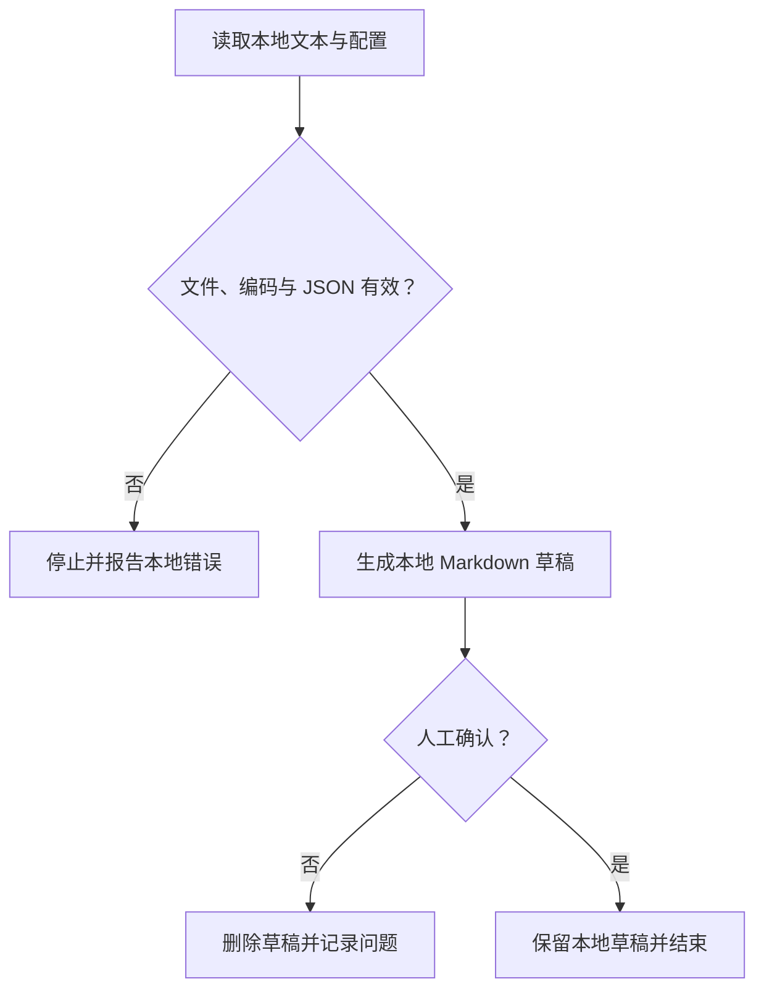

# 本地会议摘要脚本运行手册（参考答案）

> [!warning] 教学情境
> 本文演示运行手册结构。当前知识库没有 `summarize_meeting.py`，下列命令未执行，输出均标为预期。不要把本文当成可运行软件交付。

## 目标与非目标

本手册说明如何在 Windows 11 和 PowerShell 7 中运行一个**虚构的**本地脚本：读取 UTF-8 会议文本与本地 JSON 配置，生成 Markdown 摘要草稿。

边界：

- 不连接会议平台或外部 API；
- 不发送邮件、消息或日历邀请；
- 不读取录音；
- 不处理真实客户、患者、学生或账号数据；
- 输出必须人工确认，不能直接变成执行指令。

## 前置条件

读者需要一个教学项目目录，其中假定存在 `summarize_meeting.py`。用自己的安全练习路径替换下面字符串：

```powershell
$ProjectRoot = 'C:\path\to\meeting-summary-demo'
Set-Location -LiteralPath $ProjectRoot
python --version
Test-Path -LiteralPath '.\summarize_meeting.py' -PathType Leaf
```

预期：

- `python --version` 显示本机 Python 3 版本；
- `Test-Path` 返回 `True`；
- 任一条件不满足就停止，不从网络随意下载同名脚本。

本文未执行这些命令，也未确认某个固定 Python 小版本。

## 输入输出契约

| 文件 | 格式与必填内容 | 敏感级别 | 保留策略 |
| --- | --- | --- | --- |
| `meeting.txt` | UTF-8 文本；至少一行虚构会议内容 | 仅允许虚构数据 | 练习结束可删除 |
| `config.json` | JSON 对象；`language`、`max_bullets` | 非敏感教学配置 | 与练习一起保留 |
| `summary.md` | Markdown 草稿；标题和行动项列表 | 由输入决定，本练习仅虚构 | 人工检查后决定 |

最小 `meeting.txt`：

```text
示例会议：小王在 2026-07-20 前整理纯虚构的演示清单。
```

最小 `config.json`：

```json
{
  "language": "zh-CN",
  "max_bullets": 5
}
```

预期 `summary.md`：

```markdown
# 会议摘要草稿

## 行动项

- 负责人：小王；任务：整理演示清单；日期：2026-07-20。
```

上述人名和任务完全虚构。

## 操作步骤

### 1. 确认当前目录和输入文件

```powershell
Get-Location
Get-Item -LiteralPath '.\meeting.txt', '.\config.json' | Select-Object Name, Length
```

预期：两个文件都存在且大小大于 `0`。文件缺失或路径不在教学目录时停止。

### 2. 只验证 JSON 语法

```powershell
python -m json.tool '.\config.json' > $null
if ($LASTEXITCODE -ne 0) { throw 'config.json is invalid JSON' }
```

预期：退出码为 `0`。这只证明 JSON 语法可解析，不证明字段值满足业务约束。

### 3. 运行虚构脚本

```powershell
python '.\summarize_meeting.py' --input '.\meeting.txt' --config '.\config.json' --output '.\summary.md'
```

预期：退出码为 `0` 并创建非空 `summary.md`。本课程没有该脚本，因此没有实际运行结果。

### 4. 本地人工确认

```powershell
Get-Item -LiteralPath '.\summary.md' | Select-Object Name, Length
Get-Content -LiteralPath '.\summary.md' -Encoding utf8
```

人工核对负责人、任务和日期；发现臆造、遗漏或敏感内容时，删除草稿并记录问题。没有任何自动发送步骤。

## 控制流



图中没有网络、发送或外部写入分支。

## 故障排查

| 可观察现象 | 可能原因 | 诊断 | 安全恢复 |
| --- | --- | --- | --- |
| `meeting.txt` 不存在 | 目录错误或未创建输入 | `Test-Path`、`Get-Location` | 停止；回到教学目录 |
| 出现解码错误 | 文件不是 UTF-8 | 检查编辑器保存编码；不打印真实全文 | 用虚构数据重新保存为 UTF-8 |
| `json.tool` 报错 | 逗号、引号或括号错误 | 阅读行列错误；不输出敏感配置 | 修正副本后再次验证 |
| `summary.md` 不存在或为空 | 脚本失败、输入为空或输出路径错误 | 检查退出码和文件长度 | 停止；不把空文件当成功 |

不要用无限重试掩盖确定性输入错误，也不要通过管理员权限“解决”普通路径问题。

## 验收记录

| 检查 | 当前状态 | 证据 |
| --- | --- | --- |
| 文档结构完整 | 已检查 | 本页包含边界、契约、步骤、故障与验收 |
| 内部链接存在 | 已静态检查 | 返回课程和目录的目标存在 |
| 示例数据为虚构 | 已检查 | 本页明确标注教学内容 |
| 命令可实际运行 | 未验证 | 仓库中不存在虚构脚本 |
| Obsidian 阅读视图 | 需人工复核 | 静态文本检查不能代替 UI |

## 变更与来源

- 2026-07-14：建立教学参考答案；未执行虚构脚本；未进行网络调用。
- PowerShell 命令语法参考 [Microsoft PowerShell documentation](https://learn.microsoft.com/powershell/)。
- JSON 语法验证参考 [Python `json` documentation](https://docs.python.org/3/library/json.html)。
- Markdown 结构参考 [CommonMark 0.31.2](https://spec.commonmark.org/0.31.2/)。

返回 [[Markdown/07-知识库运行手册项目与自测|知识库运行手册项目与自测]] 或 [[Markdown/00-目录|Markdown 目录]]。

