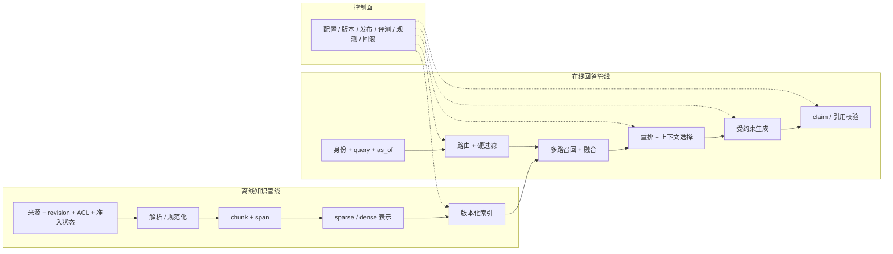

# 系统边界与完整管线

## 本节目标

- 理解 RAG 为什么是系统问题，不是单个模型调用；
- 分清离线知识管线、在线回答管线与控制面；
- 为每层定义稳定 ID、版本、输入输出和失败行为；
- 从最小可测基线逐层升级，而不是一次堆满组件。

## 先建立直觉

普通 LLM 主要依赖训练后固化在参数中的知识。RAG 增加一个外部、可更新的非参数知识源：给定问题 `x`，先检索证据 `z`，再生成回答 `y`。可以把它粗略理解为：

$$
p(y\mid x)=\sum_z p(z\mid x)\,p(y\mid x,z)
$$

这个式子只表达两个机会，也表达两个故障点：

1. `p(z\mid x)`：系统有没有找对证据；
2. `p(y\mid x,z)`：生成器有没有正确使用证据。

真实工程还多出解析、权限、时效、预算、引用和依赖故障。只看最终回答，无法知道是哪一层错了。

## 三个平面



*图 1　RAG 的离线知识、在线回答与控制面。文字替代：带版本和权限的来源经解析、切分、表示进入索引；在线请求先做身份与硬过滤，再召回、重排、组装、生成和引用校验；控制面为关键阶段提供配置、发布、评测、观测与回滚。图依据本节端到端契约以及 Lewis 等 RAG 原始论文的检索—生成边界重新组织；Mermaid 源码即再生成方式。*

### 1. 离线知识管线

```text
来源登记 → 下载/接入 → canonical revision → parse/element → chunk
        → sparse/dense 表示 → staged generation → 完整性/权限/墓碑检查 → 原子发布
```

它回答“哪些知识可被检索”。关键产物不是只有向量，而是可追溯记录：

| 字段 | 作用 |
| --- | --- |
| source_id / document_id | 稳定定位原始资料；不能只用会变化的标题或 URL |
| source owner / trust tier / admission record | 说明谁以什么规则允许该 revision 入库；派生链不自动证明资料真实或适合当前用途 |
| source_revision | 说明引用的是哪一版 |
| canonical/parse revision | 区分原始内容、规范化文本与解析器/config 产物 |
| element/chunk ID / exact span | 定位证据范围并回到声明的 coordinate space |
| tenant / ACL / lifecycle | 约束谁在何时可见；访问元数据必须随每个可检索 chunk/entry 传播 |
| parser/chunker revision | 复现文本如何产生 |
| retrieval hash / embedding/index revision | 防止检索表示和索引混用 |
| snapshot/tombstone/auth revision | 阻止旧快照在撤权或删除后重新发布 |
| index generation / entry-set manifest | 证明本次查询使用哪批完整派生产物 |

来源进入索引前也有一个安全决策：**已发现**的文件不等于**已准入**的知识。连接器、来源所有者、许可/分类、内容校验、恶意内容隔离与审批记录决定某一 revision 能否发布；后续 `raw → canonical → parse → chunk → index` 只说明它怎样派生。哈希或派生链有助于发现与预期字节不一致，却不能单独证明作者身份、内容正确性或当前用户有权阅读它。

### 2. 在线回答管线

```text
认证与 query → 路由 → 硬过滤 → 多路召回 → 融合/重排
             → 上下文选择 → 受约束生成 → claim/引用校验 → 输出
```

注意顺序：tenant、ACL、状态和有效期应先于相关性打分。否则候选分数、缓存或错误日志都可能接触越权资料。

### 2.1 访问决策至少在两处生效

“先过滤”在工程上不是把全库 top-k 取回后再删掉几个结果。应由可信身份、服务端策略与可信时钟在**查询时**限定可搜索集合（例如索引层 filter、隔离 namespace 或物理分区），并在证据进入上下文、引用被渲染前按当前策略或明确的请求快照再次检查。若向量服务不能在搜索边界实施该限制，先检索全库再后过滤既会损害 recall，也会让分数、日志和错误路径成为泄露面；应改用能实施该边界的检索设计，或保守拒答。

缓存同样是一个知识副本而不是性能细节。缓存候选、上下文或最终回答时，缓存命中范围至少要绑定其语义所依赖的身份/tenant、授权或策略 revision、知识快照或 generation、路由与输出模式，并随撤权、墓碑和高风险来源更新失效。只用标准化 query 作 key 的跨用户回答缓存，既可能泄露资料，也可能绕过后来收紧的权限。

### 3. 控制面

控制面保存配置、版本、发布、评测、观测和回滚策略，例如：

- 哪个索引别名指向哪一版 generation，以及它绑定的 source snapshot、tombstone state 与 authorization revision；
- retrieval/reranker/prompt/model 的发布版本；
- 每层超时、重试、候选数和上下文预算；
- 哪些 query 切片允许自动回答；
- 发生回归时回滚哪一个组件。

没有控制面，线上一次错答很难复现。

## 端到端契约

建议让每次请求至少携带一个 `trace_id`，并在各层记录：

| 阶段 | 必留字段 | 不应直接对用户暴露 |
| --- | --- | --- |
| 路由 | original query、route、route revision | 系统指令、内部规则细节 |
| 过滤 | 可信 tenant/groups、`authorization_revision`、as_of、内部过滤决策 | 被拒文档的数量、原因、标题、ID、正文 |
| 召回 | generation/entry/chunk、通道、rank、score、index revision | 未授权候选 |
| 重排 | 输入窗口、前后 rank、model revision、fallback | 第三方服务敏感原文 |
| 上下文 | selected/dropped reason、顺序、字符/token 数 | 不必要的私有全文 |
| 生成 | prompt revision、model revision、结构化输出状态 | 密钥、隐藏指令 |
| 引用 | claim → source locator/span/canonical/parse/chunk/entry；受保护 trace 再绑定 generation | 用户无权打开的来源、全局私有语料计数 |

这里必须是两套契约：生产公共响应只返回稳定状态、答案、授权后引用和不可承载身份/权限语义的 opaque `trace_id`；受保护审计轨迹才记录全局 generation、过滤计数、候选、版本和 fallback。即使不列标题和 ID，`acl_denied=2` 或随私有文档变化的全局 generation ID 也可能成为存在性侧信道。日志中的原文要按最小必要原则脱敏、限权和设定保留期；“为了排障”不是无限保存数据的理由。本库离线项目为了快照测试使用可复算的教学 `trace_id`，不是生产随机不透明 ID。

`trace_id` 只把一次执行关联起来，不能替代来源证明或访问决策。把 trace、citation、artifact 交给另一个服务时，还要单独约定其 schema、受保护传输、消费者身份和可验证的可信绑定；“字段里有 SHA-256”只有在消费者持有可信的预期值并实际比较时才可以检测篡改。

## RAG 能做什么，不能做什么

| 能改善 | 不能自动保证 |
| --- | --- |
| 使用训练后新增或变更的知识 | 来源本身真实、无偏、未被投毒 |
| 给回答附上可回查来源 | 引用一定支持相邻主张 |
| 让内部知识可按版本更新 | 删除和权限变更已传播到所有副本 |
| 减少部分脱离资料的生成 | 模型完全不使用参数记忆 |
| 用检索 trace 帮助诊断 | 高召回必然带来高回答质量 |

遇到高风险决策，RAG 通常只是证据准备层，仍需要确定性规则、受控工具或人工审批。

## 从最小基线开始

推荐按以下顺序建设，每次只改变一个主要因素并保留回归集：

1. Keyword/BM25 → top passages → 抽取式或严格证据回答 → source IDs；
2. 加入 qrels，先测 Recall@k、MRR/nDCG 和权限正确性；
3. 加入 dense retrieval，与 sparse 分开记录；
4. 加入融合，再加入有限窗口 reranker；
5. 加入上下文预算、canonical 去重和相邻段；
6. 加入真实 LLM、结构化 claim 和引用校验；
7. 加入 query 改写、路由、缓存与故障降级；
8. 最后再评估自适应检索、多跳或 Agentic RAG。

这样做的价值不是“保守”，而是让收益、成本和故障能归因。

## 一个可验证的设计题

为“公司制度问答”画两条管线，并写下：

1. 原始 PDF 更新后，哪些版本必须变化？
2. 员工离职后，哪些缓存、索引和日志需要失效或限权？
3. Dense 服务超时时，keyword fallback 是否仍使用相同 ACL 集合？
4. 回答引用了旧制度时，需要查看哪些 trace 字段？
5. 模型不可用时，系统是拒答、返回原文片段，还是转人工？为什么？

完成后，用[[RAG/examples/offline_cited_qa.py|离线项目]]的 trace 字段对照你的设计。

## 常见错误

- **只保存最终 top-3**：丢失召回、重排和裁剪前的证据，无法定位哪层漏掉 gold。
- **版本只写“latest”**：数据、索引与模型变化后无法重放。
- **把权限交给 LLM 判断**：相关性模型不是访问控制系统。
- **所有错误都 fallback 到自由生成**：依赖失败时最容易产生无证据却流畅的回答。
- **一开始就加入多查询、多模型和 Agent**：组件同时变化，实验没有可解释性。

## 自测

1. 离线管线与在线管线分别决定什么？
2. 为什么 chunk ID、source revision 和 index revision 都需要保留？
3. RAG 原论文证明了哪些实验结果，为什么不能据此声称你的业务回答一定更可靠？
4. 若 gold chunk 已进入候选但未进入 prompt，应检查哪一层？
5. 控制面缺失会怎样影响回滚和事故复现？
6. 为什么回答缓存不能只以 normalized query 为 key？至少还要绑定哪些授权和知识状态？

## 小结与下一步

RAG 的基本单位不是一次模型调用，而是一条有版本、有权限、有证据和有故障语义的管线。下一节将先决定一个问题是否应该进入这条管线：[[RAG/02-Query理解路由与改写|Query 理解、路由与改写]]。

## 参考资料

- Lewis et al., [Retrieval-Augmented Generation for Knowledge-Intensive NLP Tasks](https://arxiv.org/abs/2005.11401)
- Karpukhin et al., [Dense Passage Retrieval for Open-Domain Question Answering](https://arxiv.org/abs/2004.04906)
- [W3C PROV Overview](https://www.w3.org/TR/prov-overview/) 与 [PROV-O](https://www.w3.org/TR/prov-o/)：来源、活动、主体与派生关系的通用词汇。
- [OWASP LLM08:2025 Vector and Embedding Weaknesses](https://genai.owasp.org/llmrisk/llm082025-vector-and-embedding-weaknesses/)：permission-aware store、多租户隔离与投毒边界。
- [OWASP RAG Security Cheat Sheet](https://cheatsheetseries.owasp.org/cheatsheets/RAG_Security_Cheat_Sheet.html)：chunk 级访问元数据、来源准入、缓存和输出验证的生产控制面；它是实践指引，不是某一实现的合规认证。
- [SLSA Build Provenance v1.2](https://slsa.dev/spec/v1.2/build-provenance/)：用于说明派生产物绑定输入与构建定义的类比；RAG provenance 不等同于软件供应链证明。

来源获取日期：2026-07-22。公式是理解管线的简化表示，不代替具体实现或业务验收。
