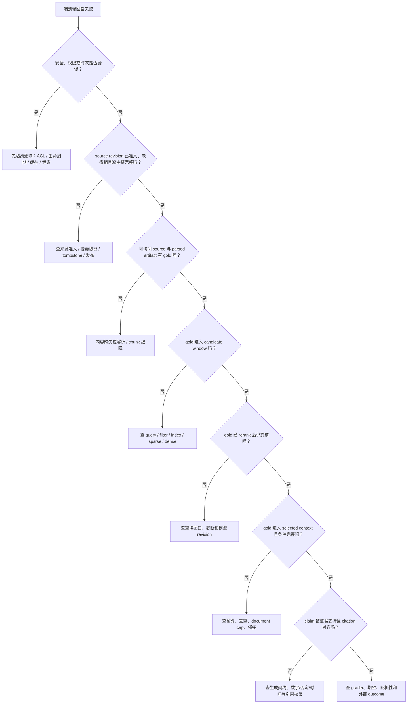

# 失败分类与系统排查

## 本节目标

- 把“回答错了”拆成可验证的上游与下游故障；
- 用固定版本重放同一请求；
- 根据 candidate、selected context、claim 和 citation trace 定位根因；
- 把事故样本转为最小回归测试。

## 失败地图



*图 1　RAG 失败回溯树。文字替代：先排除权限与时效风险，再确认来源 revision 已准入且未撤销，随后依次确认 gold 是否存在于语料、候选、重排结果和最终上下文，最后检查生成主张、引用与外部 outcome；每个“否”都指向不同责任层。图由本节失败分类与 BEIR/RAG 的检索—生成分层抽象绘制；Mermaid 源码即再生成方式。*

| 层 | 典型失败 | 需要的证据 | 修复方向 |
| --- | --- | --- | --- |
| 来源准入/发布 | 未审来源、投毒 revision、墓碑复活、派生产物未完整发布 | admission/owner/许可记录、source hash、tombstone、release manifest | 隔离、撤销、重新构建与发布 |
| 来源内容 | 原文缺失、错误、互相冲突 | source snapshot、owner、revision | 内容治理 |
| 解析 | 表格行列丢失、OCR 错字 | 原文件与 parsed artifact | parser/OCR |
| Chunk | 答案与条件被切开 | chunk/span/邻接 | 边界、overlap |
| 索引 | 新文档未入库、删除未传播 | sync watermark、index revision | 增量/删除链 |
| 权限 | 越权候选或过度拒绝 | 可信 identity、filter decision | ACL/tenant |
| Query | 指代、否定、时间改错 | original/rewrite/router revision | 路由/澄清 |
| 召回 | gold 未进候选 | 全候选、channel、qrels | 表示/检索 |
| 重排 | gold 进入但被压低 | before/after rank | reranker/窗口 |
| 上下文 | gold 前排却被裁掉/去重错 | selected/dropped reason、预算 | selection |
| 生成 | 无视证据、合并出新事实 | exact prompt、model output | 契约/模型 |
| 引用 | 引错 source、span 不支持 | claim-source 对齐 | validator |
| 服务 | 超时、429、5xx、部分分片失败 | stage latency、attempt、fallback | 容量/依赖 |

这张表的关键是“对应证据”。没有保存中间状态，就只能猜。

## 标准排查顺序

### 1. 冻结复现条件

收集 trace_id、时间、可信身份范围、original query、route、source/index/retrieval/reranker/prompt/model revision 和功能开关。不要用“当前 latest”重放旧事故。

### 2. 先查安全与时效

确认：

- 用户是否应该看到该来源；
- source 是否有效、已发布、未删除；
- 过期副本和缓存是否仍可见；
- 缓存命中是否仍绑定当前主体、授权 revision 与知识 generation；
- trace 是否向用户泄露被过滤资料。

安全问题优先于相关性调优。

### 2.1 再查来源准入与派生链

确认命中的 source revision 是否真的经过当前 connector/owner/许可与内容校验后发布，是否被撤销、替换或 tombstone；再确认 raw、canonical、parse、chunk 与 index entry 是否属于同一条已发布链。provenance 记录“它从哪里、经什么活动而来”，并不自动证明正文真实、无投毒或适合当前业务；来源可信度和冲突仍需要内容治理与责任人判断。

### 3. 直接查语料

搜索 gold 事实是否存在于 source 与 parsed/chunk artifact。若语料根本没有答案，检索模型无法修复内容缺失。

### 4. 看 candidate window

- Gold 不在任何通道：查 query、chunk、表示、索引和过滤；
- Gold 在 sparse 不在 dense：查 Embedding/语义；
- Gold 在 dense 不在 sparse：可能是词汇不匹配，不一定是故障；
- Gold 被 filter：查权限、有效期或用户期望是否错误。

### 5. 看 rerank 与 selected context

- Gold 在候选但 rerank 下降：查输入截断、hard negatives、模型版本；
- Gold 重排靠前但没 selected：查预算、canonical 去重、document cap；
- Gold selected 但条件段缺失：查邻接与 chunk。

### 6. 最后查生成和引用

若完整证据已进入上下文：

- Claim 是否超出原文；
- 数字、否定、时间和对象是否改变；
- 模型是否把两个来源合成第三个结论；
- Citation 是否指向支持该 claim 的 span；
- Schema 重试是否无意改变答案。

不要在 gold 从未进入上下文时先调 prompt。

## 症状到检查点

| 症状 | 第一检查点 | 后续 |
| --- | --- | --- |
| 回答用了旧制度 | filter effective window | 删除传播、缓存、source revision |
| 引用正确文档但结论错 | claim/span | 邻接、生成、条件丢失 |
| 偶发无答案 | stage timeout/fallback | 分片、队列、p99 |
| 只在多轮对话错 | original/rewrite/session | 指代和状态范围 |
| 管理员能答、普通用户空 | ACL 是否预期 | qrels 按角色切片 |
| 相同 query 结果漂移 | 所有 revision/随机参数 | 索引增量、模型服务 |
| 相关候选很多但回答差 | selected context | 重复、顺序、长上下文利用 |

## 无答案要分两种

1. **Corpus no-answer**：当前可访问语料确实没有支持证据；
2. **Retrieval miss**：语料有答案，但候选链没有找到。

测试集需要 source-level gold，才能区分二者。若只看最终拒答，两种情况表面相同，修复方向完全不同。

## 事故闭环

每个确认事故至少产出：

- 匿名化或合成的最小 query；
- 锁定 source 与系统 revision；
- 期望 route、候选、证据、status 与 forbidden sources；
- 能在正常和 `-O` 模式运行的回归测试；
- 修复前后指标与风险说明；
- owner、发布日期和必要回滚。

用户反馈不能未经审查直接成为 gold；它可能错误、恶意或含敏感数据。

## 动手排障

案例：“普通员工问退款时间，回答引用了已过期的‘当天到账’。”

至少验证以下五个假设：

1. 旧 source 的 `effective_to` 缺失或解析失败；
2. Filter 使用客户端时间或时区错误；
3. 旧 chunk 已从主库删除但向量索引未删除；
4. 缓存 key 未包含 source/index revision；
5. 生成器凭参数记忆说“当天”，引用却挂到新文档。

为每个假设写出所需 trace/文件证据，不只写修复建议。

然后运行故障模拟：

```powershell
$env:PYTHONDONTWRITEBYTECODE = '1'  # 禁止排障练习产生 __pycache__，保持目录干净。
$script = '.\docs\RAG\examples\offline_cited_qa.py'  # 保存可重复使用的离线 RAG 脚本路径。
$fixture = '.\docs\RAG\examples\rag-fixture.json'  # 保存同一份可审计 fixture，避免换输入掩盖故障差异。

python -B $script --fixture $fixture inspect --query-id Q-refund --failure retrieval_error --operator-view  # 模拟召回依赖失败，检查是否拒答并保留诊断原因。
python -B $script --fixture $fixture inspect --query-id Q-refund --failure reranker_error --operator-view  # 模拟重排失败，检查是否回退到相同安全候选窗。
python -B $script --fixture $fixture inspect --query-id Q-refund --failure generation_error --operator-view  # 模拟生成失败，检查是否不输出未校验草稿。
```

在 `response` 与受保护 `audit_trace` 两层解释三种结果为何不同。`--operator-view` 只是本地教学确认，不是身份认证；生产诊断入口必须先完成 operator 授权。

## 常见错误

- 只记录最终 answer，不记录候选和版本；
- 用当前索引重放历史事故；
- 把 no-answer 全归因于检索；
- 修改多个组件后宣称某一项有效；
- 只修 happy path，不给 fallback 增加测试；
- 排障日志保存完整私有原文和凭据。

## 自测

1. Gold 不在候选与 gold 被 context 裁掉如何区分？
2. 为什么先查 source 和权限，再查 prompt？
3. 同一 query 昨天对今天错，至少需要比较哪些 revision？
4. Corpus no-answer 与 retrieval miss 各该修什么？
5. 一条用户差评为何不能直接变成训练标签？
6. “来源未获准入/已撤销”与“已准入来源中没有 gold”分别应如何处理？

## 小结与下一步

RAG 排障从可复现版本与上游证据开始，逐层缩小到生成和引用。下一节把这些观察点变成离线、线上和发布指标：[[RAG/07-端到端评测与监控|端到端评测与监控]]。

## 参考资料

- Lewis et al., [Retrieval-Augmented Generation for Knowledge-Intensive NLP Tasks](https://arxiv.org/abs/2005.11401)
- Thakur et al., [BEIR](https://arxiv.org/abs/2104.08663)
- [OWASP RAG Security Cheat Sheet](https://cheatsheetseries.owasp.org/cheatsheets/RAG_Security_Cheat_Sheet.html)：来源投毒、chunk 级 ACL、缓存与来源归因的排障/控制面。

来源获取日期：2026-07-22。
