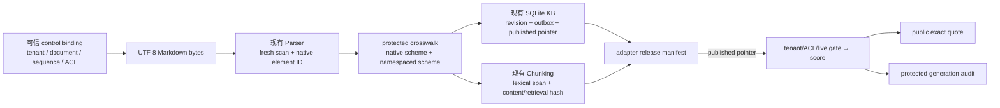
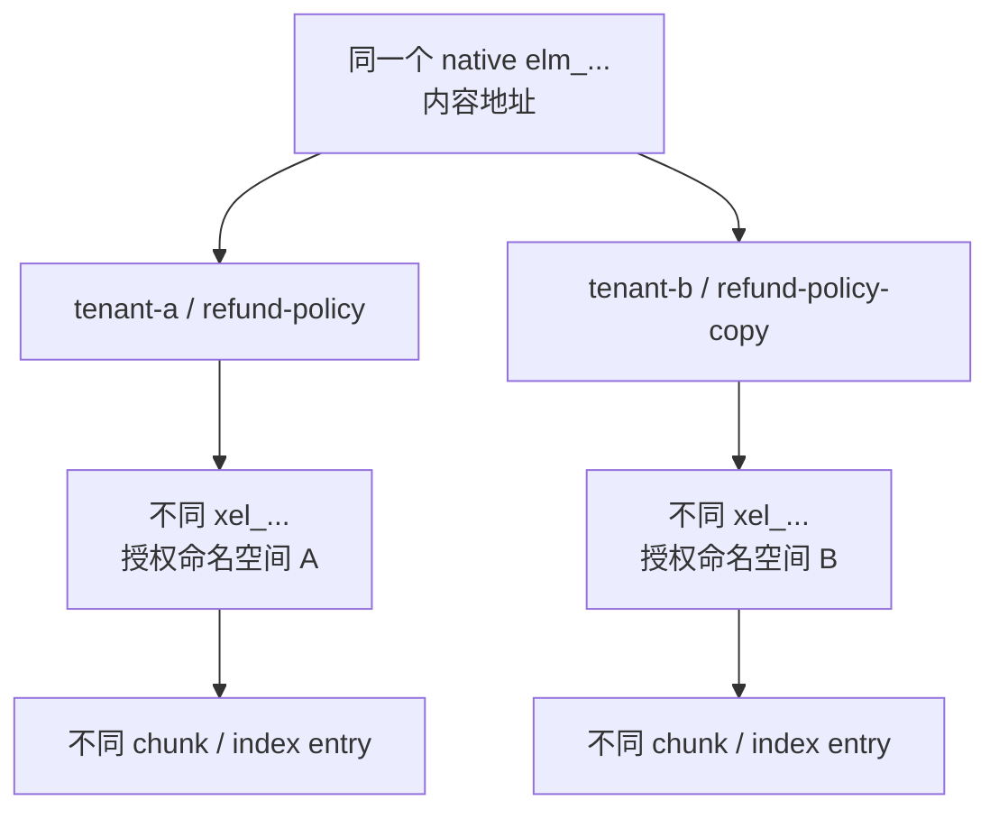
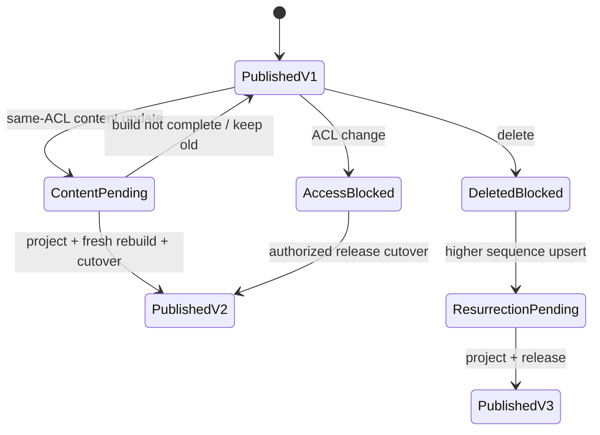

# 项目：跨模块来源适配与原子发布

## 项目目标

第 9 课用一个独立 reference model 证明了“来源到引用”应满足哪些不变量，但明确没有把已有四个项目直接拼接。本课实现下一步：fresh 调用现有[[文档解析/00-目录|文档解析]]、[[知识库构建/00-目录|知识库构建]]和[[Chunking策略/00-目录|Chunking]]模块，用一个版本化 adapter 补齐逻辑身份、坐标 crosswalk、发布代际和查询门禁，再生成诚实的 extractive citation。



> [!important] 这不是“字段改名器”
> 三个原生模块对 identity、坐标和发布的定义不同。adapter 会重新读取、重新解析、重新 chunk 并复算 ID；任何 artifact 不能只凭自己携带的 hash 获得信任。fixture 是离线 connector 与 control-plane binding 的教学替身，不是生产消息协议。

## 先审计真实契约

本课实现前对四个已有项目进行了只读审计，并分别运行了 `26 + 31 + 32 + 62 = 151/151` 项测试。结论是各项目局部自洽，但没有安全的 wire contract：

| 层 | 原生合同 | 不能直接连接的原因 |
| --- | --- | --- |
| Parser | raw bytes SHA-256；`normalized-text-lines-1-based-inclusive-v1`；`elm_...` | manifest 没有 tenant、逻辑 document、sequence、ACL 或完整 canonical text；相同 bytes 可得到相同 element ID |
| Knowledge Store | `SourceRecord`、SQLite 整数 revision、outbox、published pointer | revision 主键不具备跨数据库内容身份；记录会丢失 raw/parser lineage |
| Chunking | 元素内 lexical-unit `[start, end)`；content/retrieval 双表示 | 没有输出 schema 或 corpus-wide generation；heading 不是 body kind；元素 ID 被当作全局 key |
| 第 9 课 provenance | LF+NFC 全文 Python-char `[start, end)`；独立 generation | 会自行重解析和重切分；其 `chk_/idx_` preimage 与 Chunking 项目不同 |

因此，本课不根据 `elm_`、`chk_` 或 `idx_` 前缀判断身份。citation 与 crosswalk 中可跨模块解释的对象引用保存 `{scheme, value}`；本地 SQLite locator、旧 capture 行和本课 v1 audit 中仍存在仅在其所属 schema 内有意义的裸值。前缀相同但 scheme 或 preimage 不同，就是不同对象；不能把 v1 的局部字段误写成已经统一的全局 wire identity。

## control plane 与 data plane 分工

Parser 的内容地址不能回答“这是谁的文档、谁可以读”。fixture 中每个来源显式提供：

- `tenant_id + document_id + source_sequence`；
- `source_uri + source_version`；
- `connector + upstream_event_id + run_id`；
- `media_type + relative_path + root_section_path`；
- 已排序、唯一、非空的 `allowed_groups`；
- 仅为离线演示内嵌的 UTF-8 Markdown `content`。

这些控制字段不从文档正文、文件名或 parser manifest 猜测。adapter v1 只接受无 BOM 的 strict UTF-8 Markdown；保留调用方给出的 absolute source root，在任何 `resolve()` 前逐级拒绝 root/source/parent 中检查时已存在的 symlink，再验证解析后 containment；也不把一份文件默认 fan-out 到多个逻辑对象。Python 3.11 的这项门禁只覆盖 symlink，不把 NTFS junction/reparse point 或 hard link 误写成已验证边界。

> [!warning] fixture 不是通用 source event schema
> 为了单文件离线运行，fixture 同时携带 control binding 与正文。生产 connector 应把不可变 blob、事件 envelope、授权快照和运行审计分离，并对消息真实性、重放、保留期与密钥建立独立控制。

adapter 的 fixture boundary 在语义校验前还限制为 2,000,000 UTF-8 bytes、64 层 JSON 容器嵌套；拒绝重复 key、非有限数值、浮点数和 JSON 转义的孤立 surrogate。`content` 另限制为 100,000 UTF-8 bytes，读取错误只报告错误类型，不回显本机路径。这些数值只服务于离线教学的 fail-closed 行为，不能当作生产吞吐、队列或解压预算。

## 原生 ID 冲突与 namespaced crosswalk

Parser element ID 的 preimage 包含内容、位置和 parse revision，却不包含 tenant 或逻辑 document。fixture 故意让 tenant A 与 tenant B 各有一份 byte-identical 文档：两者原生 parser element ID 相同，这是内容寻址的合理结果，却不能作为授权对象身份。

adapter 另派生：

```text
xsrc = H(id_scheme + tenant_id + document_id)

xel = H(id_scheme + tenant_id + document_id
        + knowledge_revision_fingerprint + native_parser_element_id)
```

标题保留在 crosswalk 中，关系是 `context_only`；段落、列表项和代码块投影为 `projected_as_body`。正文没有 parser `section_path` 时，才使用可信 control binding 中的 `root_section_path`，不会静默发明章节。发布清单同时保存本地 SQLite revision locator 与可跨数据库复算的 KB revision fingerprint，并绑定 control/crosswalk hash、raw/parser record、chunk/index entry set 和 pipeline fingerprint；不能把自增主键误当成内容身份。



## 坐标转换必须诚实

三套坐标不能无损直转：

- Parser：规范文本行号，1-based、两端包含；
- Chunking：parser element 内 lexical unit，0-based、右开；
- 第 9 课 provenance：LF+NFC 全文 Python 字符，0-based、右开。

Markdown parser 会去掉 heading/list/fence 标记并折叠多行段落空白，所以“行号 → 全文字符 offset”通常不是函数。本课 citation 同时保存：

- 原生 parser line locator；
- namespaced element 内的 lexical-unit `[unit_start, unit_end)`；
- 可从 immutable parser element 重构的 `exact + prefix + suffix` 与 hash；
- `canonical_char_mapping.mapping_status = unavailable`；
- 原因 `parser_projection_is_not_one_exact_canonical_span`。

`exact/prefix/suffix` 的设计受 W3C `TextQuoteSelector` 启发；W3C 还定义了 0-based、右开的 `TextPositionSelector`，并提醒位置选择器对文档变化脆弱。本课没有输出 W3C JSON-LD，也不声称 conformance。只有将 parser 投影验证为 canonical source 的精确 slice 后，未来版本才能把 mapping 升为 `verified`。

## 发布代际，而不是分层即时可见

KB 是逐文档 published pointer，Chunking 本身没有 generation。adapter 因此建立 corpus-wide release manifest 和单一 published pointer：



查询每次都从 published release pointer 开始，并在打分前重新检查 KB live state：

| 变化 | adapter 查询行为 |
| --- | --- |
| 相同 ACL 的内容更新尚未投影 | 继续服务旧 release |
| KB 已切到新 revision、adapter 尚未发布 | 旧 release 对该文档不可见，防止 split-brain |
| ACL 变化 | KB `access_blocked` 立即使旧 release fail closed |
| delete | `deleted + access_blocked` 立即使旧 release fail closed |
| resurrection 尚未完整发布 | 保持不可见 |
| stale capture | 不允许切换 release pointer |

这仍是 `offline-single-process-no-concurrent-readers` 教学实现。生产 cutover 需要事务、CAS 或等价同步原语，不能把 Python 内存赋值当作分布式原子发布。

## 公共响应与受保护审计

公共响应只包含 `query_id/status/claims/trace_id`。每个 extractive claim 有一个 citation，记录文档版本、raw/parser/KB/chunk/index 身份、原生行 locator、element lexical span 与 quote selector。全局 generation、selected entry IDs、授权版本、逐层过滤计数和故障只在 `protected audit` 中出现。v1 fixture 的 `source_uri` 是已批准的教学 locator；真实 URI/connector locator 可能含私有路径、查询参数或上游身份，必须先完成分类、最小化与脱敏，未经批准不得原样进入 public citation。第 11 课把这类 raw locator 置于 host-owned protected audit，作为迁移方向。

未授权文档在 score 前被移除；改变另一 tenant 或主体无权访问的来源，不应改变同一授权查询的公共响应。`retrieval_unavailable` 产生 `dependency_unavailable`，不会被伪装成“没有答案”。评测器从可信 runtime query 和当前发布状态重新运行检索，不能相信 audit 自报的 selected set 或 failure。

> [!important] 能力标签
> release manifest 固定声明 `evidence_level: document-revision-bridge` 与 `external_chunk_to_citation_verified: false`。本课的 extractive citation 能回到受保护的 parser element、line locator 与 lexical quote，但第 9 课 provenance 引擎仍是独立重解析分支；它尚不能导入本课外部 chunk artifact。二者不能因都使用 `chk_/idx_` 前缀而被描述成同一证据对象。

`export_external_provenance_bundle()` 会在 fresh generation validation 后导出完整受保护载荷，供下一课[[RAG/11-项目-External-Provenance-Artifact-v2|External Provenance Artifact v2]]跨 strict JSON boundary 导入。consumer 会从传输证据重算本课的 producer document snapshot；由于 bundle 没有携带包含本地 KB locator 的完整 producer release manifest，其摘要只能标为 `opaque-producer-reference-only`，不能冒充 consumer 已验证的 closure。这个新消费者证明的是 bundle round-trip、route closure 与本地发布状态机，并不是第 9 课 reference engine 的 importer；因此上述 v1 manifest 能力标签保持不变，也不会把 `unavailable` canonical mapping 静默升级。

## 项目文件

| 文件 | 作用 |
| --- | --- |
| [[RAG/examples/integration/cross_layer_adapter.py\|cross_layer_adapter.py]] | 导入真实 Parser/KB/Chunking、fresh rebuild、crosswalk、release、检索、citation、审计、评测 CLI 与 protected v2 exporter |
| [[RAG/examples/integration/cross-layer-fixture.json\|cross-layer-fixture.json]] | 两 tenant、byte-identical 来源、公开/受限 ACL 与独立 oracle |
| [[RAG/examples/integration/cross-layer-eval-artifact.schema.json\|cross-layer-eval-artifact.schema.json]] | 本课本地 evaluation artifact 的结构合同；它不是当前 LLMOps 示例的 wire input，也不验证真实性 |
| [[RAG/examples/integration/test_cross_layer_adapter.py\|test_cross_layer_adapter.py]] | 37 项 strict JSON/资源边界、路径/symlink、跨层重建、授权、sidecar replay/checkpoint、篡改、生命周期、故障与 CLI 回归 |

## 运行项目

从项目根目录运行：

```powershell
$env:PYTHONDONTWRITEBYTECODE = '1'  # 禁止跨模块适配器运行留下 __pycache__。
$env:PYTHONIOENCODING = 'utf-8'  # 固定 CLI 的 UTF-8 输出编码，方便复核中文 JSON。
$script = '.\docs\RAG\examples\integration\cross_layer_adapter.py'  # 保存真实三模块适配器脚本路径。

python -B -W error $script demo  # 运行内置跨层案例并输出公共聚合摘要。
python -B -W error $script ask --query-id q-tenant-a-refund  # 执行 tenant-a 的公共回答路径。
python -B -W error $script inspect --query-id q-tenant-a-refund --operator-view  # 在本地教学中查看受保护 crosswalk/trace。
python -B -W error $script manifest --operator-view  # 查看待发布与已发布 generation 的受保护清单。
python -B -W error $script evaluate --operator-view  # 运行 fresh rebuild 与发布前可信评测。
python -B -W error $script evaluate --operator-view --failure retrieval_unavailable  # 模拟检索不可用，确认发布门返回 BLOCK。
```

正常 `evaluate` 输出 `PASS` 并返回 `0`。故障注入输出 `BLOCK` 并返回 `1`；这是预期的发布阻断，不是脚本崩溃。`ask` 与 `demo` 只输出 public projection/聚合摘要；`inspect`、`manifest` 和 `evaluate` 都必须显式给出 `--operator-view`，因为后两者含 release 或离线 oracle 诊断。该开关只是教学防误用，不是 AuthN/AuthZ。

运行四种解释器模式回归：

```powershell
$tests = '.\docs\RAG\examples\integration'  # 指向 adapter 的相邻 unittest 目录。

python -B -m unittest discover -s $tests -p 'test_cross_layer_adapter.py' -v  # 正常模式详细执行 37 项跨层适配器回归。
python -O -B -m unittest discover -s $tests -p 'test_cross_layer_adapter.py'  # 优化模式检查不依赖裸 assert。
python -B -W error -m unittest discover -s $tests -p 'test_cross_layer_adapter.py'  # 严格 warning 模式发现隐性运行期问题。
python -O -B -W error -m unittest discover -s $tests -p 'test_cross_layer_adapter.py'  # 组合模式覆盖最严格解释器环境。
```

验收基线为 37/37；发布前伪造但内部自洽的 parser record 必须被 fresh reparse 拒绝，且旧 pointer、旧 generation 状态与 generation 集合均不改变。`revision_inputs` 以 KB revision 的 sequence/URI/version/content/ACL/run binding 定位；checkpoint/noop/stale candidate 不得覆盖或删除旧 published revision 的 protected sidecar。

## 如何读评测结果

正常 artifact 同时绑定 raw fixture SHA-256、类型化 fixture model SHA-256、pipeline fingerprint、KB capture、index generation、release manifest 和 harness revision。它是本课的 protected evaluation 输出，不应作为请求者 API 响应；其中的 expected/forbidden oracle 字段有助于复核，却可能泄露评测切片。它也不是当前 [[LLMOps/03-项目与自测/08-离线发布门项目与自测|LLMOps 发布门]] 的 wire input：两者的摘要 profile、字段与可信重算边界尚未通过版本化 adapter 对齐。JSON Schema 只做跨语言结构检查；可信的 `evaluate()` 路径会重新运行当前 pipeline，fresh rebuild 原生 parser/chunk ID、数据库 body/ACL/search projection、citation quote 与 trace，再生成 artifact。`validate_artifact()` 只验证既有 artifact 的形状、计数、重复 query 与自哈希一致性；攻击者若同步改写结果并重算无密钥 hash，它不能独立恢复 fixture oracle。三者不能互相替代，自哈希也不是 MAC、签名或 provenance 真实性证明。

重点验收问题包括：

- byte-identical 跨 tenant 文档原生 element ID 相同，但 adapter element/chunk/index ID 不同；
- heading 作为 `context_only` 保留，不能在转换中消失；
- line、lexical unit 和 canonical char 三种 coordinate scheme 不混写；
- tenant、live state 与 ACL 在相关性评分前执行；
- 未授权语料变化不改变 public projection；
- content/retrieval/chunk/index/crosswalk/KB/search/generation 任一篡改均不能只靠同步修改自报 hash 通过；
- same-ACL pending update 保活旧 release，ACL/delete 立即 deny，resurrection 等待新 release；
- fixture oracle 不进入 runtime query；故障 gate 必须 `BLOCK`。

## 当前没有验证什么

- PDF、Office、HTML、OCR、表格或视觉区域的 page/bbox/DOM/byte locator；
- 第 9 课 provenance engine 的 external parsed/chunk artifact importer；
- Embedding、ANN、reranker 或 LLM claim entailment；
- 分布式 outbox、并发 reader、跨进程 cutover、缓存失效和重建回滚；
- 对手并发替换路径时的 TOCTOU 防护；生产需要 handle-relative no-follow/openat 类原语，而非“先检查再打开”；
- Windows NTFS junction/reparse point、mount redirect 与 hard-link 边界；Python 3.11 没有 `Path.is_junction()`，生产应升级并显式拒绝 reparse/junction，或把来源放入独占、不可被低信任主体改写的临时 root；
- 真实 IdP、token audience、deny/ABAC、策略决策点与授权证明；
- manifest 的 MAC、数字签名、透明日志、密钥轮换或硬件 attestation；
- 离开可信 fixture/pipeline 后，仅凭 artifact 自哈希识别恶意重写；
- 备份、对象存储、日志和第三方索引中的物理删除。

## 生产化扩展顺序

1. 将 fixture control binding 拆为签名 source event、immutable blob 与 authorization snapshot，并定义 delete union。
2. 将 protected revision input、parser crosswalk、chunk artifact 和 release manifest 序列化到不可变存储；所有 ID 都保留 scheme。
3. 为媒体类型定义 locator union 与验证器；只有 exact source slice 通过时才发布 verified char/page/bbox mapping。
4. 给 provenance 引擎增加 external artifact importer，验证 parser/chunk/citation round-trip 后再提升能力标签。
5. 用 transactional outbox + isolated builder + CAS pointer 完成并发安全 cutover；ACL/delete 走独立 live deny plane。
6. 将 sparse/dense/graph/cache 各自的 entry set、删除确认、回滚和抽样对账纳入 release gate。
7. 对跨信任边界 manifest 加签并管理密钥；canonicalization 协议必须锁版本与测试向量。

## 主要参考资料

- [W3C Web Annotation Data Model](https://www.w3.org/TR/annotation-model/)：`TextQuoteSelector` 的 `exact/prefix/suffix` 与 `TextPositionSelector` 的 0-based、右开位置语义；本课仅借鉴 selector 思路，不声称 JSON-LD conformance。
- [W3C PROV-O](https://www.w3.org/TR/prov-o/)：entity、activity、generation 与 derivation 的来源建模词汇；本课使用哈希派生链表达局部一致性，不声称完整 PROV-O 序列化。
- [RFC 8785: JSON Canonicalization Scheme](https://www.rfc-editor.org/rfc/rfc8785.html)：这是一份 Informational RFC，用于解释为什么哈希/签名需要稳定表示。本项目只实现受限 JSON 域，**不是**完整 JCS 实现。
- [JSON Schema Draft 2020-12](https://json-schema.org/draft/2020-12)：evaluation artifact 的可交换结构合同。

来源核验日期：2026-07-22。W3C Web Annotation Data Model 仍是稳定 Recommendation；实现仍应锁定本项目 schema、normalizer、parser、chunker 和 canonicalization revision，并运行本地迁移/篡改测试。
