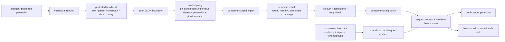
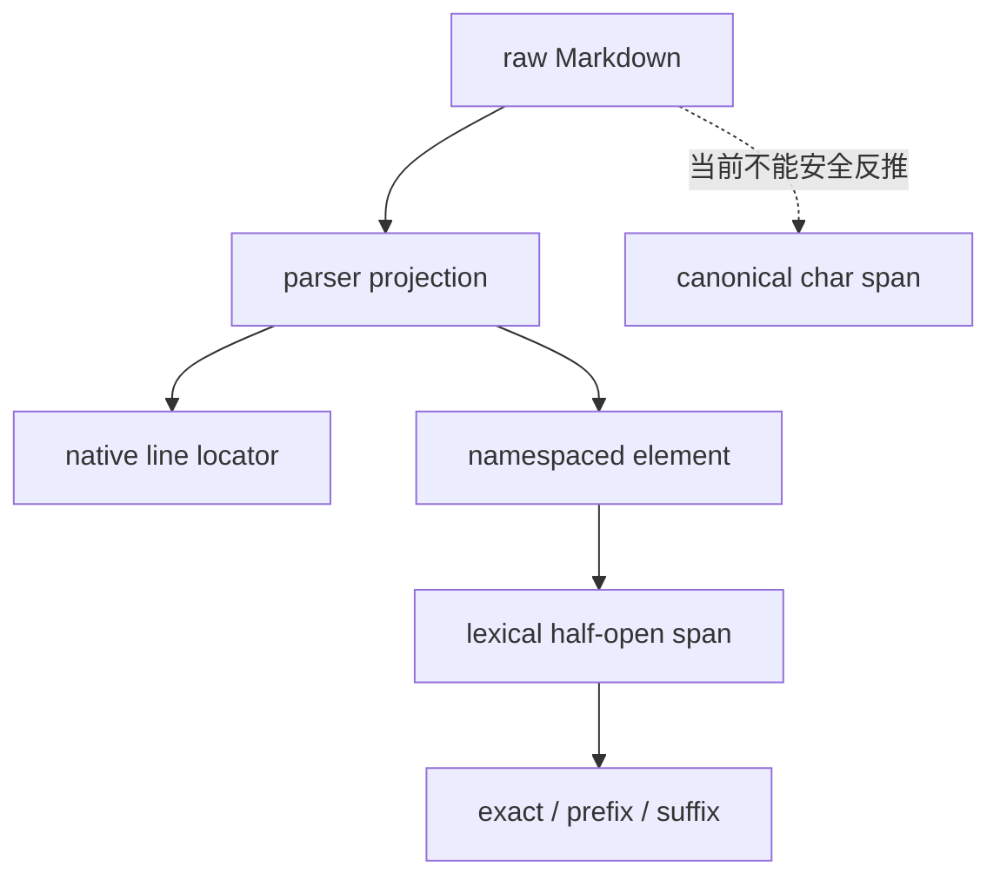
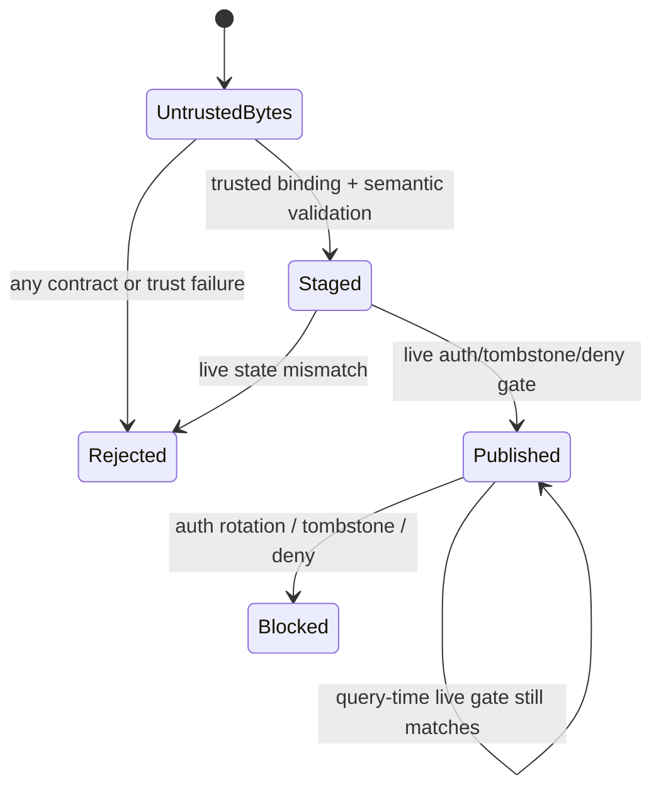

# 项目：External Provenance Artifact v2

## 项目目标

第 9 课建立独立的 source-to-citation reference model，第 10 课 fresh 调用真实 Parser、Knowledge Store 与 Chunking 模块；但它们的 CLI manifest 都只是摘要，不足以让另一个进程独立重建证据关系。本课补上明确的跨边界合同：生产端导出完整受保护 bundle，消费者经过 strict JSON、带外可信绑定、语义重建和 live deny 后，才能切换自己的本地发布指针。



这里最重要的结论不是“多加一个 SHA-256”，而是把四种不同问题分开：

1. wire text/bytes 是否符合可解析的版本化结构；
2. artifact 内部关系能否从正文和版本化算法重建；
3. 解析后的 canonical JSON value 是否正是可信控制面批准的对象；
4. 即使过去获批，当前授权、撤权和删除是否仍允许本地发布与查询。

任何一层通过，都不能替代其余三层。

## 为什么 v1 manifest 不能直接导入

| 既有产物 | 已绑定内容 | 缺失的跨进程载荷 |
| --- | --- | --- |
| 第 9 课 generation manifest | snapshot、tombstone、auth、pipeline、entry set 摘要 | 完整 source/canonical/element/chunk/index rows |
| 第 9 课 eval artifact v2 | fixture、harness、case verdict 与自哈希 | 不是发布 artifact，也不携带可重建正文 |
| 第 10 课 release manifest | document、crosswalk、parser、KB、entry set 的摘要 hash | raw/canonical text、parser record、crosswalk rows、chunk 与 entry payload |
| 第 10 课 capture | KB document/outbox/tombstone 状态 | parser sidecar、跨坐标映射、chunk 正文与检索表示 |

因此，不能从这些摘要“补猜”缺失字段，也不能仅把已有 `chk_`、`idx_` 加入一个 JSON 数组后称为 wire contract。前缀不是 identity scheme；同样的前缀在不同 preimage 下仍是不同对象。

## 三层验证与一个 live gate

| 层 | 本项目怎样验证 | 能证明什么 | 不能证明什么 |
| --- | --- | --- | --- |
| 结构与自洽 | strict JSON、精确字段、类型/上限、payload 自哈希 | 解析值在本 schema 和受限 canonical JSON 域内自洽 | producer 身份、来源真实性、批准状态 |
| 可信外部绑定 | `TrustedImportPolicy` 带外固定 canonical bundle-value digest、generation、pipeline、auth | 当前语义对象与可信控制面批准对象一致 | 原始 wire-byte 表示或签名者身份，除非另有 transport digest/签名/CAS/透明日志 |
| 语义重建 | 重算 raw/canonical/parser/KB/element/chunk/index 身份和完整 coverage | artifact 内的派生关系符合当前接受的算法合同 | 真实 connector、IdP、物理删除或人类 oracle 正确 |
| live gate | 本地发布和每次 query 复核 auth revision、tombstone 与 blocked documents | 旧 artifact 不能绕过当前撤权/删除 | 分布式一致性，除非真实存储使用事务/CAS |

> [!warning] 自哈希不是 attestation
> bundle 固定写入 `attestation.mode: none` 与 `trust_scope: self-consistency-only`。攻击者若能改写 artifact，也能同步重算无密钥 hash。本项目通过测试传入的 trusted canonical bundle-value digest 演示“带外绑定”接口；pretty/compact JSON 若解析成同一值会得到同一 digest，这不是精确 wire-byte pin。项目没有实现签名、MAC、DSSE、证书、密钥轮换或透明日志；测试进程内构造 policy 也不等于真实跨组织信任。

## Bundle 根合同

`external-provenance-bundle-v2` 是受保护产物，不是用户可见 citation，也不是 eval report。根对象严格包含：

| 字段 | 作用 |
| --- | --- |
| `schema_version` | 锁定 major wire contract；未知版本和降级默认拒绝 |
| `canonicalization_revision` | 锁定本项目受限 canonical JSON 域；不是 RFC 8785 完整实现 |
| `producer_contract` | parser、normalizer、mapping、chunk、index、ID 与坐标 scheme |
| `authorization_contract` | auth revision、ACL-before-score 与 consumer live-check 要求 |
| `documents[]` | source event、inline raw/canonical、ACL snapshot、parser record、KB revision、adapter elements 与 crosswalk |
| `chunks[]` | 完整 chunk 表示、双哈希、overlap、section、ACL 与 element spans |
| `index_entries[]` | tenant/document/source/revision/chunk/index/retrieval/access 的显式路由 |
| `release` | generation、capture/tombstone/auth/pipeline、document/entry closure 与 publication mode；缺少原文的 producer manifest 仅保留显式 `opaque-producer-reference-only` 引用 |
| `integrity` | payload 自哈希和诚实的无 attestation 声明 |

JSON Schema 2020-12 为跨语言消费者提供结构合同，Python importer 再执行排序、关系、hash preimage、fresh parser/chunk rebuild 与状态机等 JSON Schema 不擅长表达的语义检查。二者都必须通过。

`strict_json_loads()` 先以严格 UTF-8 bytes、32 MB 和 64 层容器边界读取 wire text，再拒绝 duplicate key、非标准/浮点数，以及 JSON 转义后才出现的孤立 surrogate（包括 object key）。随后才计算可信 canonical bundle-value digest；因此 malformed text 不会在 hash、排序或日志阶段变成裸 `UnicodeEncodeError`。这些边界仅约束教学 consumer，不代替生产端的连接大小、流式解析、解压与队列预算。

## 文档、元素与 crosswalk

每个 document 同时保存三类身份：

```text
logical_source_id = {scheme: ai-agent-engineer/logical-source/v1, value: xsrc_...}
parser element    = {scheme: document-inspector/element/v2, value: elm_...}
adapter element   = {scheme: ai-agent-engineer/namespaced-parser-element/v1,
                     value: xel_...}
```

byte-identical 文档可以共享 native `elm_...`，但 tenant/document/KB revision 不同，namespaced `xel_...`、chunk 与 entry 也必须不同。consumer 不根据前缀猜 scheme，并验证唯一的：

```text
entry → chunk → adapter element → crosswalk → parser element → document
```

路径上 tenant、document、logical source、KB revision、ACL snapshot 和 retrieval hash 任一不一致都拒绝整个 staged artifact；parser record、crosswalk、adapter element 的顺序也必须逐项一致，不能只比较集合。这样即使攻击者交换两个 entry 的 route 字段并保持正文与原 ID 不变，或重排元素后重建全部下游 hash，也不能改变当前查询的路由和语义顺序。

`source_event` 与 inline raw text 仍是教学 connector 表示。consumer 会在隔离临时目录中按 `relative_path` fresh parse，并比较完整 parser record；路径必须满足受限 portable `.md` 合同，拒绝 absolute/drive/stream、反斜杠、traversal、Windows 设备名、危险结尾与超长 segment。写入前后都验证解析路径仍在临时根目录内，并以 exclusive create 物化；I/O 失败统一转为结构化拒绝。JSON Schema 只做第一层语法过滤，containment 仍必须由每个实现检查；这也不等于生产对象存储的签名事件、immutable blob resolver 或完整 TOCTOU 防护。

## 坐标不能因传输成功而升级

第 10 课的 Markdown parser 会删除语法标记并折叠部分空白，所以当前 artifact 只拥有：

- `normalized-text-lines-1-based-inclusive-v1` 原生行 locator；
- `element-lexical-unit-0-based-half-open-v1` 元素内 lexical span；
- 由不可变 parser element 复算的 `exact + prefix + suffix` quote selector；
- `canonical_mapping.status: unavailable`。

consumer 会校验 lexical bounds、exact hash 和 quote context，却不会虚构 canonical char span。`release.evidence_level` 因而继续是 `document-revision-bridge`；只有未来 importer 证明 parser projection 是 canonical source 的精确 slice，才可发布另一个明确命名的能力级别。



quote selector 的字段设计受 W3C Web Annotation 启发；本项目没有输出 JSON-LD，也不声称 W3C conformance。

## producer published 不等于 consumer published

消费者状态机只有三类可用状态：



artifact 自带的 `publication_mode: producer-published-consumer-must-stage` 是状态边界，不是装饰字段。没有 `TrustedImportPolicy` 时不得构造 staged generation；`StagedExternalBundle` 与 `PublishedExternalBundle` 的公开构造器会拒绝手工伪造，发布函数还检查 importer 私有 marker。没有 consumer live state 时不得发布；未发布前调用 query 必须失败。这里的 marker 只防止同一可信 Python 进程内绕开正常 API，不是抵御能够读取进程内存或任意执行代码的攻击者。生产系统还应使用事务或 CAS 切换本地 pointer，并将失败 artifact 留作受保护审计，而不是覆盖最后一个可用版本。

### 查询身份不能来自 query body

`query_id/query/top_k` 可以来自调用请求，但 tenant、groups 与 authorization revision 不可以。教学 consumer 将 principal grant 放在 host-owned `ConsumerLiveState` 中，由宿主在完成身份认证后签发绑定到该 live-state snapshot 的 `TrustedRequestContext`；每次签发还生成 128-bit 随机 request nonce，用于把 trace/audit 绑定到一次请求而不把 principal 放进可枚举的公开 trace preimage。query body 若夹带 `tenant_id` 或 `subject_groups` 会因未知字段被拒绝，从另一个 live-state snapshot 复用 context 也会失败。这样“把自己声明为 oncall”不能升级权限，相同结果的两个合法主体也不会争用同一个 trace ID。

这仍不是 AuthN 实现：示例没有验证 bearer token、session、mTLS、audience 或 IdP group membership。真实服务必须让认证中间件持有 live state/context issuance 能力，不能把 `issue_request_context(principal_id)` 暴露给未认证客户端；进程内任意代码执行也不在本教学 marker 的防护范围内。

## 公共投影与受保护审计

导入后的 query 仍先做 tenant、live deny 与 ACL 过滤，再计算 lexical score。公共 API 只返回本次回答的 claim、quote、类型化 logical source/element/chunk/entry/KB identity 与诚实坐标；原始 `source_uri` 和 `source_version` 只写入 host-owned protected audit sink。受保护审计还保存 consumer bundle、global generation、selected entry set、authorization revision、principal、evidence level 和过滤计数；普通 requester 不会收到第二个 audit 返回值，审计写入失败时回答也不返回。

下列内容不得进入公共投影：

- 未授权 document 或 entry ID；
- 全局 document/entry 清单；
- `allowed_groups`、subject group membership 或 tombstone 集合；
- producer capture、pipeline manifest 与整包 digest；
- 原始 source URI、connector locator 或其中可能携带的私有查询参数；
- 被 ACL 或 live deny 移除的候选数量明细（若会泄露语料存在性）。

公共投影与 protected audit 使用不同 schema 和不同交付通道；“同一个 Python tuple 同时返回两份 dict”或“先生成全部信息，再删除敏感 key”都不是可靠的接口边界。示例的 `InMemoryProtectedAuditSink.read()` 仅供可信宿主测试和诊断，不应暴露为用户 endpoint。

## 负向测试为何比 happy path 更重要

| 篡改或错误 | 期望结果 |
| --- | --- |
| duplicate JSON key、NaN、浮点数、转义孤立 surrogate、unknown field、数组冒充 ID、超长文本 | strict contract 拒绝，不抛裸 `TypeError` / `UnicodeEncodeError` |
| 超深 JSON、不可物化路径、drive/stream 路径逃逸 | 在递归 decoder 或文件写入前结构化拒绝 |
| 修改正文、parser、chunk、entry 后只重算 payload 自哈希 | trusted canonical bundle-value digest 不匹配 |
| 同步重算完整 artifact value 且误配 generation/pipeline/auth policy | trusted policy 拒绝 |
| 相同 `chk_` 前缀但错误 scheme | identity scheme mismatch |
| 交换 tenant/document/source route | document binding mismatch |
| `unavailable` 静默改为 `verified` | evidence-level overclaim |
| crosswalk orphan、重复 element/span、coverage 缺口 | crosswalk/coverage mismatch |
| 重排 parser crosswalk 或 adapter elements 并重建下游产物 | order mismatch；集合相同也拒绝 |
| chunk 跨 source/revision/ACL | chunk binding mismatch |
| entry retrieval/index/ACL 与 chunk 不一致 | entry binding mismatch |
| release 漏 document/entry、重复引用或 entry-set hash 漂移 | generation closure mismatch |
| producer 标记 published 后直接 query | consumer 尚未发布，拒绝 |
| 手工构造 staged/published/context，或 query body 自报 oncall group | factory/marker/host context gate 拒绝 |
| 两个合法主体以相同问题得到相同 claims | host-issued nonce 派生不同 trace，protected audit 不冲突或误归属 |
| 合法但含私有 locator 的长 `source_uri` | schema/importer 接受受保护字段，公共投影不输出 |
| auth/tombstone/live blocked document 变化 | publish 或 query fail closed |

测试同时在 normal、`-O`、warnings-as-errors 和组合模式运行，确保关键 gate 不依赖 `assert`，也不让 warning 隐藏契约漂移。

## 从 v1 迁移到 v2

当前实现只提供“第 10 课 adapter → v2 consumer”的可执行路径；第 9 课 reference model 尚未获得 v2 exporter。迁移顺序应是：

1. 冻结 v1 reader 与已发布 citation verifier，不原地改写旧 ID。
2. 从可信 raw/KB/parser 状态 fresh 导出 v2，不能从旧摘要补猜载荷。
3. 用显式 scheme 包装旧 ID；若旧 preimage 缺 tenant/document binding，应派生新的 v2 binding ID，而非只加 scheme。
4. 双写 v1/v2，shadow 对比公共 claims；只有 evidence level 相同才比较 locator。
5. consumer 成功 staged、live gate 和回归评测后，CAS 切换 v2 pointer。
6. 回滚只切 pointer，不修改不可变 bundle；保留期结束后再停 v1 reader。
7. 一旦对象已迁 v2，拒绝未知 canonicalization、未知 scheme 或静默降级回 v1。

第 9 课可以迁为 `canonical-span-verified`，因为它从 LF+NFC canonical text 直接派生字符 span；第 10 课当前只能保持 `document-revision-bridge`。这两个能力等级不能通过迁移脚本合并。

## 项目文件

| 文件 | 作用 |
| --- | --- |
| [[RAG/examples/integration/cross_layer_adapter.py\|cross_layer_adapter.py]] | fresh 验证当前 producer generation 并导出完整 protected v2 bundle |
| [[RAG/examples/provenance/external_provenance_v2.py\|external_provenance_v2.py]] | strict JSON importer、trusted policy、语义重建、staged/published 状态机与查询双投影 |
| [[RAG/examples/provenance/external-provenance-bundle-v2.schema.json\|external-provenance-bundle-v2.schema.json]] | JSON Schema 2020-12 结构合同；不替代 Python 语义验证或真实性证明 |
| [[RAG/examples/provenance/test_external_provenance_v2.py\|test_external_provenance_v2.py]] | 42 项 trust、identity、route、path、order、coordinate、coverage、authorization、trace、发布、审计交付与非泄露红队回归 |

## 运行项目

从同时包含 `docs/` 与 `.website/` 的项目根目录运行：

```powershell
$env:PYTHONDONTWRITEBYTECODE = '1'  # 禁止跨 JSON boundary 测试留下字节码缓存。
$env:PYTHONIOENCODING = 'utf-8'  # 确保 consumer/producer 的诊断文本在 Windows 下保持 UTF-8。
$tests = '.\docs\RAG\examples\provenance'  # 外部 bundle consumer 与其测试位于 provenance 目录。

python -B -m unittest discover -s $tests -p 'test_external_provenance_v2.py' -v  # 正常模式详细执行 42 项 producer/consumer 边界测试。
python -O -B -m unittest discover -s $tests -p 'test_external_provenance_v2.py'  # 优化模式验证验证器不依赖裸 assert。
python -B -W error -m unittest discover -s $tests -p 'test_external_provenance_v2.py'  # 将 warning 升级为错误，防止忽略资源或兼容性问题。
python -O -B -W error -m unittest discover -s $tests -p 'test_external_provenance_v2.py'  # 同时覆盖优化与 warnings-as-errors。
```

项目没有网络、凭据、Embedding、ANN 或 LLM 依赖。42 项测试先让真实第 10 课 engine 生成 bundle，再序列化为 JSON text，并由不持有 engine 对象的 consumer 重建；不能用共享 Python object identity 冒充跨进程传输。测试覆盖 normal、`-O`、warnings-as-errors 及组合模式。

## 当前没有验证什么

- RAG 第 9 课 v1 artifact 的自动迁移、old-ID crosswalk 或 downgrade reader；
- 真实 connector 事件签名、immutable object store、blob resolver 或 source authenticity；
- JCS/RFC 8785 完整 canonicalization、DSSE/in-toto envelope、SLSA provenance conformance；
- MAC、数字签名、PKI、KMS/HSM、key rotation、透明日志或硬件 attestation；
- 真实 IdP、token audience、subject/group membership、PDP/PEP 或 ABAC policy proof；
- 多进程 builder、事务 outbox、并发 reader、CAS cutover、缓存失效与灾难恢复；
- PDF/Office/HTML/OCR 的 byte/page/bbox/DOM locator；
- sparse/dense/vector/graph 外部索引中的删除传播和物理删除证明；
- 检索质量、reranker、LLM entailment、答案完整性或业务正确性。

因此，本项目证明的是“在明确算法与可信 policy 下，完整 artifact 可以跨 JSON boundary 保持可重建关系并 fail closed”，不是“来源已经被第三方认证”或“生产 RAG 已经安全”。

## 生产化扩展顺序

1. 把 inline raw 换成 immutable blob reference + digest + 受限 resolver；下载和解压在隔离进程中完成。
2. 为 artifact 定义正式 attestation predicate，使用 DSSE 或等价 envelope；签名验证策略与业务授权策略分开管理。
3. 将 trusted digest、generation pointer 与 policy revision 放入受保护控制面，并用 CAS/事务发布。
4. 接入实时 deny plane；授权轮换、删除、legal hold 与恢复都留下可重放事件和确认信号。
5. 为 parser/chunker/index 加跨实现测试向量；版本升级采用 dual-read/dual-write 与 shadow comparison。
6. 对每种媒体定义 locator union 和 evidence level；禁止用一个布尔 `verified` 覆盖不同证明强度。
7. 将 bundle、eval artifact、trace、release verdict 与回滚指针串到同一 operation/release identity，但继续保持公共与受保护投影分离。

## 主要参考资料

- [in-toto Attestation Framework：Statement v1](https://github.com/in-toto/attestation/blob/main/spec/v1/statement.md)：用 digest 绑定 immutable subjects，并用 predicate type 区分声明语义。本项目只借鉴 subject/predicate 分层，不声称 in-toto conformance。
- [SLSA v1.2 Provenance](https://slsa.dev/spec/v1.2/provenance) 与 [Verifying artifacts](https://slsa.dev/spec/v1.2/verifying-artifacts)：区分 producer 声明、builder identity、输入依赖与 verifier policy。本项目是 RAG 教学 artifact，不是 build provenance，也不具备 SLSA level。
- [DSSE protocol](https://github.com/secure-systems-lab/dsse/blob/master/protocol.md)：说明签名 envelope 为什么需要显式 payload type 与无歧义编码。本项目未实现 DSSE。
- [W3C Web Annotation Data Model：Selectors](https://www.w3.org/TR/annotation-model/#selectors)：`TextQuoteSelector` 与位置 selector 的建模来源；本项目不输出 JSON-LD。
- [RFC 8785: JSON Canonicalization Scheme](https://www.rfc-editor.org/rfc/rfc8785.html)：解释签名输入需要稳定表示；本项目只实现整数/字符串/布尔/null/数组/字符串键对象的受限域，不是完整 JCS。
- [JSON Schema Draft 2020-12](https://json-schema.org/draft/2020-12)：跨语言结构合同；排序、hash preimage、route closure 与 live state 仍由语义 verifier 处理。

来源核验日期：2026-07-22。规范、SDK 与签名生态会变化；采用前应固定版本、威胁模型、算法、key policy 和测试向量。
