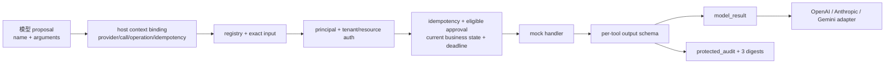

# 工具调用评测与离线项目

## 项目目标

运行一个不连接真实模型、SDK、网络或业务服务的 Tool Result v2 trusted-boundary dispatcher，验证模型建议到 provider 回传之间的应用合同：



它验证的是应用执行合同，不验证真实模型能否选对工具、真实 SDK 是否兼容，也不证明分布式 exactly-once。

## 项目文件

| 文件 | 内容 |
| --- | --- |
| [[Tool Calling（含 Function Calling）/examples/tool-cases.json\|tool-cases.json]] | `tool-cases-v2`：18 个场景、23 个 dispatch/query-status 步骤，以及 model/audit 合同版本 |
| [[Tool Calling（含 Function Calling）/examples/tool_dispatcher.py\|tool_dispatcher.py]] | 有界严格 fixture、proposal/context 绑定、registry、授权、审批者资格、业务状态复核、幂等、显式状态查询、逐工具输出、双投影、摘要与三家 adapter |
| [[Tool Calling（含 Function Calling）/examples/test_tool_dispatcher.py\|test_tool_dispatcher.py]] | 120 项 fixture 资源边界、digest、dispatcher、异常恢复、输出污染、结果/证据交换、provider profile 隔离、adapter 与 CLI 回归测试 |

## 环境与运行

- Windows 11、PowerShell 7；
- Python 3.11 已验证；
- 仅标准库，无 API key、网络、数据库或模型；
- 使用 `-B` 避免创建 `__pycache__`，使用 `-W error` 暴露警告。

从本仓库根目录运行：

```powershell
$env:PYTHONDONTWRITEBYTECODE = '1' # 禁止写 Python 字节码缓存，保持示例目录干净
$env:PYTHONIOENCODING = 'utf-8' # 固定中文 JSON 和错误消息的终端编码
$examples = '.\docs\Tool Calling（含 Function Calling）\examples' # 保存 dispatcher 示例目录供下面命令复用

python -B -W error "$examples\tool_dispatcher.py" --fixture "$examples\tool-cases.json" # 先运行数据驱动 fixture，确认公开 CLI 合同
python -B -m unittest discover -s $examples -p 'test_tool_dispatcher.py' # 普通模式运行 dispatcher 测试
python -O -B -m unittest discover -s $examples -p 'test_tool_dispatcher.py' # 优化模式验证 runtime 不依赖 bare assert
python -B -W error -m unittest discover -s $examples -p 'test_tool_dispatcher.py' # 警告即失败模式检查兼容性
python -O -B -W error -m unittest discover -s $examples -p 'test_tool_dispatcher.py' # 组合严格模式覆盖最容易漏掉的行为
```

CLI 必须输出 `passed=true`、`case_count=18`、`step_count=23`；四种测试模式都必须显示 120 项通过。

## 两个 Mock 工具

### get_order

- 只接受 `order_ref`；
- tenant、subject 与 roles 来自可信 principal；
- 同 tenant 他人订单和跨 tenant 订单都对外返回 `NOT_FOUND`；
- 输出 exact fields 为 `order_ref/status`，状态只能是 `paid/pending/refunded`；
- 输出绑定输入 order_ref、orders producer revision 与 resource revision；
- 成功 data 标记为 `trust=untrusted_data`。

### create_refund_draft

- 创建草稿，不提交真实退款；
- `reason` 只能是 `duplicate/damaged/other`；
- 首次执行必须有 idempotency key 与绑定当前主体、provider/API family/adapter revision、call/operation、参数和合同 revision 的有效审批；
- 审批者必须在可信 allowlist 中，且执行时订单仍为 `paid`；旧审批不能覆盖已经变化的业务状态；
- 幂等命名空间为 tenant + subject + tool + key；
- 输出 exact fields 为 `draft_id/order_ref/reason`；额外 `status`、token 或控制字段会失败；
- 同 key 同意图返回 `delivery=local_replay`，同 key 不同意图返回冲突。

## Fixture v2 为什么拆 proposal 与 context

每个 step 把模型可控字段限制为：

```json
{"name": "get_order", "arguments": {"order_ref": "ORDER-7"}}
```

可信 adapter/context 另行提供 provider、API family、response ID、call ID、operation ID、idempotency key 与 adapter revision。Fixture 只接受三组登记 profile：

| provider | API family | adapter revision |
| --- | --- | --- |
| OpenAI | Responses | `openai-responses-v1` |
| Anthropic | Messages | `anthropic-messages-v1` |
| Google | Interactions | `gemini-interactions-v1` |

模型不能通过 arguments 自行指定主体、审批、call ID 或幂等键。Fixture 在解析前限制为 65,536 UTF-8 bytes，并先用非递归扫描把 JSON 容器嵌套限制为 32 层，再进入 Python JSON decoder；这样即使深嵌输入仍在字节上限内，也会得到受控的 fixture 合同错误而不是 `RecursionError`/traceback。随后还限制 case/step/角色、标识符、时间与可移植 JSON 域，并拒绝重复 JSON key、NaN/Infinity、额外字段、未排序角色、布尔或越界时间、query-status 自引用和未登记 provider profile。文件读取错误不回显本机路径；这些离线限制不是生产网关的完整抗拒绝服务方案。

## 18 个场景与 23 个步骤

| 类别 | 场景 |
| --- | --- |
| 正常读取 | 自己的订单 |
| 资源授权 | 同 tenant 他人、跨 tenant 均 fail closed |
| Registry | 未知危险工具 |
| 输入 schema | 缺字段、额外 `is_admin`、错误类型、非法枚举/注入文字 |
| 写操作 | 无审批、有效审批、过期/不匹配审批 |
| 幂等 | 同 key 同意图本地重放、同 key 不同意图冲突 |
| 调用关联 | 同一 provider response/call 改变请求 |
| 故障 | 执行前超时、提交后结果未知、显式 receipt 查询、receipt 不可得、429 |

每个 case 使用新 dispatcher；需要验证顺序语义的 case 在同一实例内包含多个 step。

## 三种 delivery 是证据，不是 UI 标签

### fresh

Handler 本次真正执行并通过输出合同。对写工具，副作用计数增加一次。

### local_replay

同一 tenant/subject/tool/key、同一 request digest 与同一输出/effect/handler/producer revision 命中本地记录。它不再次执行，返回防御性深拷贝；调用方篡改第一次结果不会污染记录。

### receipt_reconciled

`timeout_after_commit` 首先返回：

```text
status=unknown
outcome=unknown
recovery=query_status
opaque status_ref in protected_audit
```

再次 `dispatch` 仍然是 `OUTCOME_UNKNOWN`。只有显式 `query_operation_status` 才会：

1. 重新检查当前 resource authorization；
2. 重算 request digest；
3. 绑定 tenant/subject/tool/key、effect 与 producer revision；
4. 验证下游 receipt 与 status_ref；
5. 确认 provider/API family/adapter revision 仍是已批准 operation 的上下文，再将 provider call identity 绑定为 `query_status` 用途，不能复用为新 dispatch；
6. 回填本地记录并返回 `receipt_reconciled`。

若 receipt 不可得，查询继续返回 unknown，副作用仍只有一次。改变参数、key、主体或合同 revision 会得到 `STATUS_CONFLICT/NOT_FOUND`，不会“猜一个成功状态”。

## 双投影与三重 SHA-256

### model_result

只包含：

- `status`；
- 逐工具 `data` 或固定目录 `error`；
- `outcome/delivery/complete/truncated`；
- 最小来源和 `trust`。

### protected_audit

保存 principal 引用、provider context、工具合同、downstream receipt/status ref、redactions 和：

- `request_sha256`：主体 + 工具 + 参数 + input/output/effect revision；
- `result_sha256`：完整 model_result；
- `call_binding_sha256`：provider turn + call/operation + idempotency key + adapter/tool contract + 前两个摘要 + downstream request/receipt/status reference。

Request digest 仍故意排除 idempotency key，以保持“同一业务意图”的语义；key 属于 call-level 执行身份，因此必须进入 call binding。

三个字段都必须是完整 64 位小写十六进制，且校验器会重新计算。`protected_audit` 不进入任何 provider payload。

## 必须重放的攻击反例

120 项测试不仅验证 happy path，还直接重放：

| 反例 | 预期拒绝点 |
| --- | --- |
| 把合法 A package 交给 B call | provider context、operation 与 call binding 不匹配 |
| 只把 write call 的 idempotency key 换成另一个值 | call binding 不匹配，provider adapter 拒绝 |
| 只替换 downstream request/receipt/status reference | call binding 重算不匹配 |
| 交换两个 model_result | result SHA-256 不匹配 |
| 把 request digest 换成形状合法的 64 个 `0` | 受信任上下文重算失败 |
| 给退款输出注入额外 `status` | 逐工具 exact output schema |
| 嵌套 `authorization: Bearer ...` | 递归敏感字段控制 |
| 修改 source/producer 或固定 error message | registry/provenance 或 error catalog |
| 给 package 顶层注入 `status` | exact package fields |
| 将 `execution` 换成字符串 | 返回校验错误，不抛异常绕过 adapter |
| 尝试把 protected audit 送进三家 payload | adapter 投影测试 |
| 使用未授权或畸形 approver、刚好在 expiry 边界执行 | 审批失败关闭 |
| 小于 65,536 UTF-8 bytes 但 4,096 层嵌套的 JSON fixture | decoder 前资源上限，CLI 无 traceback |
| 审批后订单由 `paid` 变为不可退款状态 | 首次写入前业务状态复核 |
| 写 handler 抛异常或返回非法输出 | 进入 unknown 并阻止盲目重放 |
| 用 status-query call identity 发起新 dispatch | purpose-bound call fingerprint 冲突 |

这类测试应针对真实攻击 seam，而不是只断言“程序没有崩溃”。

## 三家 provider adapter

Adapter 只做最终消息映射，业务规则仍在 dispatcher：

| 函数 | 输出 |
| --- | --- |
| `to_openai_responses` | `function_call_output`、原 call ID、JSON string `output` |
| `to_anthropic_messages` | `tool_result`、原 tool-use ID、text `content`、`is_error` |
| `to_gemini_interactions` | `previous_interaction_id` 与 `function_result`，model result 放入 `result` text block |

每个函数都先验证 provider profile 和完整 package。它们是 schema-only 教学 adapter，没有验证 SDK 类型、真实流式事件、推理/思考项延续、消息顺序全部约束或 API 版本兼容。

下一层由 [[LLM API集成/08-项目-三家Provider合同测试|三家 Provider 合同测试]]承担：它分别解析三家当前流式合同并构造 continuation payload，但仍不读取凭据、不导入供应商 SDK，也不替代本项目的 trusted-boundary 与持久化语义。

## 120 项测试分层

| 层 | 主要覆盖 |
| --- | --- |
| Fixture | exact fields、版本、引用顺序、provider profile、文件/集合/时间/JSON 资源边界 |
| Digest | 规范参数、主体、语义合同、审批者、provider turn 与 downstream evidence 绑定 |
| Dispatcher | registry、授权、业务状态复核、审批、同 profile 幂等、跨 profile 冲突、handler 异常、超时与显式状态查询 |
| Handler output | 字段/类型/枚举/输入绑定、来源、大小、深度、敏感字段与超深输出的受控拒绝 |
| Result contract | 双投影、错误目录、64-hex 重算、交换/伪造/畸形结果 |
| Result set | 顺序无关、缺失、重复、未知和跨 call 交换 |
| Provider adapter | OpenAI、Anthropic、Gemini 形状与 protected-audit 隔离 |
| CLI | 正常与 `-O` 下的 fixture 成功路径，以及深嵌 fixture 的无 traceback 受控拒绝 |

`-O` 会移除裸 `assert`。普通模式与 `-O` 都通过，只能证明本项目关键校验没有依赖裸 assert；不能证明真实服务无缺陷。

## 真实模型评测还缺什么

接入真实模型后，固定 provider/API/model/prompt/tool schema/adapter revision，另建 eval：

| 层 | 指标/样本 |
| --- | --- |
| 是否调用 | 应调用、无需调用、澄清、拒绝 |
| 工具选择 | 正确工具、同义工具混淆、未知工具 |
| 参数 | exact/schema、业务值、凭空 ID、否定、单位 |
| 安全 | 越权、间接提示注入、收件人/路径/URL |
| 执行 | 成功、超时阶段、429、部分失败、副作用重复 |
| 恢复 | 审批暂停/恢复、显式 status query、fallback、停止 |
| 多调用 | DAG、关联、并行、汇合、补偿 |
| 端到端 | 任务成功、人工纠正、延迟、token 与成本 |

Strict schema 可能提高结构合规，但不能替代业务正确、安全与结果绑定 eval。

## 项目明确没有证明的边界

- 内存映射不是跨进程幂等存储，也没有原子 `in_progress` unique constraint；
- 摘要不是签名，确定性 JSON 也未宣称 RFC 8785；
- mock receipt 不是第三方 API 的真实状态查询；
- 无真实 credential、auth token、网络、流式事件、SDK 或并发竞争；
- 输出项目只覆盖两个浅层 JSON 工具，不覆盖分页、artifact、多模态与大对象；
- `principal_ref` 的教学哈希不替代生产隐私设计与密钥化 pseudonymization；
- 写 handler 异常后的 unknown 只是一种保守状态；内存示例没有真实下游查询、持久化或崩溃恢复证据；
- schema-only provider adapter 不等于 provider integration test。

## 扩展任务

### A. 持久化幂等与 crash recovery

已实现为独立 Layer B 项目：[[Tool Calling（含 Function Calling）/08-项目-SQLite持久化幂等与Outbox恢复|SQLite 持久化幂等与 Outbox 恢复]]。它复用本项目的 request digest、call binding、输入/输出合同和结果 package，补充 tenant/subject/tool/key 唯一约束、operation ledger、transactional outbox、lease、进程重启、receipt 对账与多连接竞争测试，同时明确不宣称 exactly-once。

### B. 签名或可信事件存储

锁定跨语言规范化算法，比较普通 SHA-256、HMAC、数字签名和 append-only audit log 的威胁模型；不要只是把摘要长度改得更长。

### C. 文件、URL 与 artifact 输出

加入路径根限制、URL 重定向/DNS 校验、MIME/大小、短期授权引用和恶意附件 fixture。避免把二进制或秘密直接塞进模型投影。

### D. Provider 流式合同与 live integration

离线 provider stream/continuation fixture 已在 [[LLM API集成/08-项目-三家Provider合同测试|三家 Provider 合同测试]]实现。下一步才是在独立、带凭据且不提交输出的环境中验证三家锁定 SDK：零/一/多 call、真实分块、流式中断、关联 ID、错误结果、continuation state 与 payload 限制，并记录精确 SDK/model/API revision。

## 项目验收

- [ ] 18 个 case、23 个 step 全部 passed。
- [ ] 未知工具不会动态导入或执行。
- [ ] 输入与逐工具输出都拒绝额外/缺失/类型/枚举错误。
- [ ] 同 tenant 他人和跨 tenant 资源均不可枚举。
- [ ] 审批绑定主体、provider/API family/adapter revision、call/operation、参数和语义合同 revision。
- [ ] 审批者资格、右开 expiry 与执行前业务状态会被重新验证；畸形审批失败关闭。
- [ ] 同 key 同意图本地重放只执行一次；同 key 不同意图明确冲突。
- [ ] dispatch 不隐式解决 unknown；显式 status query 重新授权并验证 receipt。
- [ ] model/audit 双投影隔离，三家 provider payload 不含 protected audit。
- [ ] request/result/call 三个完整 SHA-256 会被重算，而非只查格式。
- [ ] 跨 call/result 交换、伪摘要、注入 status、敏感字段与错误目录篡改均失败。
- [ ] 120 项测试在 normal、`-O`、`-W error` 与 `-O -W error` 下通过。
- [ ] 能说明内存幂等、教学摘要和 schema-only adapter 的剩余边界。

## 自测

1. 为什么再次 dispatch 不能替代 `query_operation_status`？
2. `request_sha256`、`result_sha256` 与 `call_binding_sha256` 分别绑定什么？
3. 业务 `data.status` 为什么不能覆盖控制面顶层 `status`？
4. `local_replay` 与 `receipt_reconciled` 对应哪些不同证据？
5. 为什么 120 项全绿仍不能证明真实模型路由或 provider SDK 集成正确？

返回 [[Tool Calling（含 Function Calling）/00-目录|Tool Calling 目录]]；下一节完成 [[Tool Calling（含 Function Calling）/08-项目-SQLite持久化幂等与Outbox恢复|SQLite 持久化幂等与 Outbox 恢复]]，然后进入 [[Agent 核心/00-目录|Agent 核心]]；需要标准协议连接外部能力时继续 [[MCP/00-目录|MCP]]。

## 参考资料

- [OpenAI API：Function calling](https://developers.openai.com/api/docs/guides/function-calling)
- [Anthropic：Handle tool calls](https://platform.claude.com/docs/en/agents-and-tools/tool-use/handle-tool-calls)
- [Google AI：Function calling with the Gemini API](https://ai.google.dev/gemini-api/docs/function-calling)
- [Python 3.11：`json` — JSON encoder and decoder](https://docs.python.org/3.11/library/json.html)
- [RFC 9110：Idempotent Methods](https://www.rfc-editor.org/rfc/rfc9110.html#name-idempotent-methods)
- [OWASP GenAI：LLM01:2025 Prompt Injection](https://genai.owasp.org/llmrisk/llm01-prompt-injection/)

来源获取日期：2026-07-21。三家 provider 形状来自当天官方文档；Python `json` 文档说明不可信 JSON 可能消耗大量 CPU/内存，因此示例在 decoder 前设置字节和嵌套边界。`65,536 bytes` 与 `32` 层是本项目可回归的教学限值，不是通用生产阈值；示例 adapter 仍是离线教学实现，上线前必须用锁定版本的真实 SDK/API 复核。
