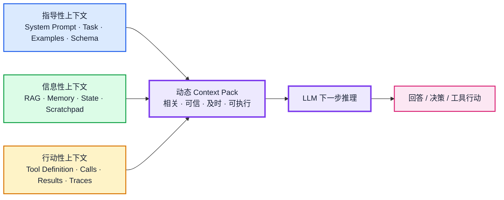
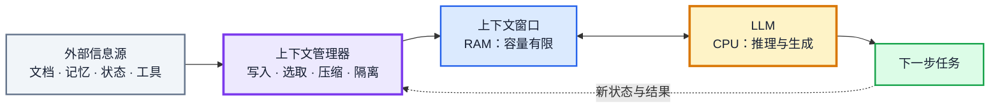
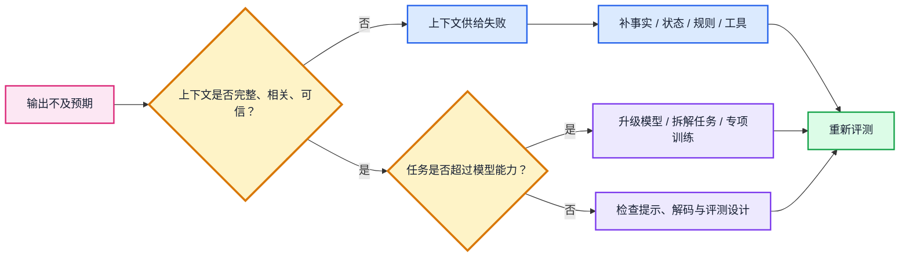
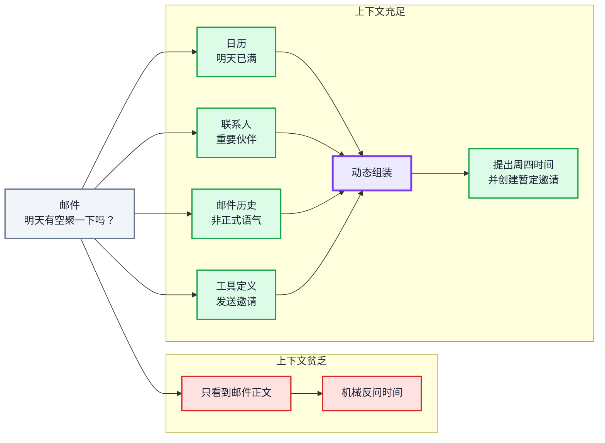
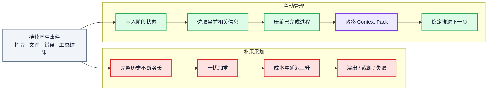
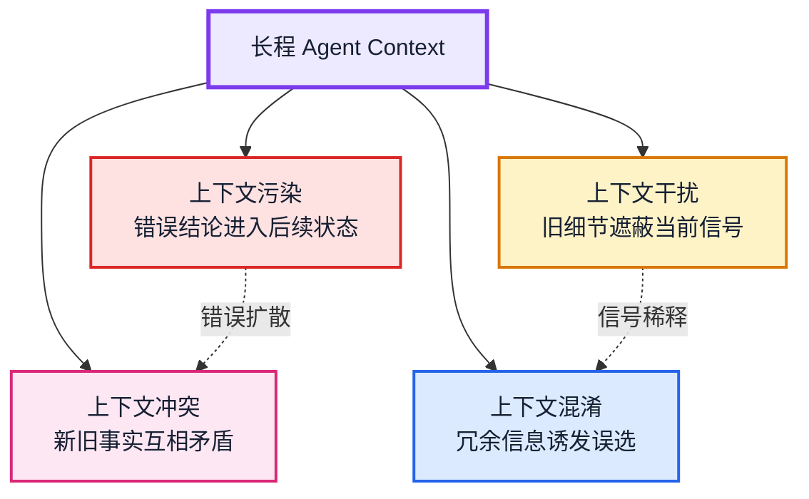
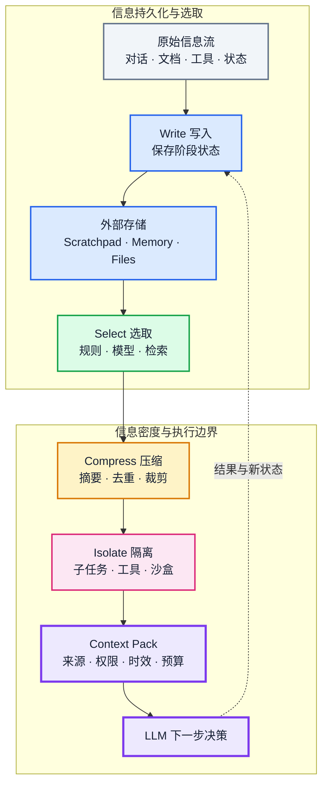
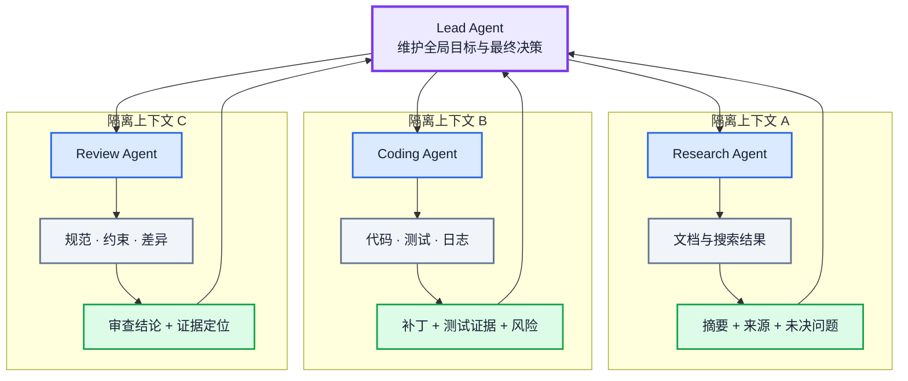

# Context Engineering，一篇就够了

> [!source] 来源与改写边界
> 本文按 Duo Huang 的[知乎文章](https://zhuanlan.zhihu.com/p/1938967453951571269)及[作者个人站原文](https://huangduo.me/2025/08/15/context-engineering/)的 What—Why—How 主线进行结构化整理与改写，保留核心概念、案例关系、四类实践和参考资料，但不逐字转载。正文图示依据文中概念重新设计为可编辑的 Mermaid 图，不复制第三方图像。个人站原文发表于 2025-08-15，并标注 CC BY-NC-SA 4.0；产品行为和工程判断会随模型与工具变化，实践时请结合本知识库其他章节及最新官方资料复核。

> “多数 AI Agent 的失败，并非模型能力的失败，而是上下文工程的失败。”

## 导读：从一句好 Prompt 转向一套信息供给系统

Context Engineering（上下文工程）之所以受到关注，不只是因为出现了一个新术语，而是因为 Agentic System 从演示走向生产后，工程师面对的问题已经改变：单次提示写得漂亮，并不能保证长程任务中的每一步都拥有足够、相关、可信且不过载的信息。

这篇文章围绕三个问题展开：

- **What**：上下文工程是什么？它与 Prompt Engineering、RAG 有何关系？
- **Why**：为什么仅靠更强模型或更多上下文仍不够？
- **How**：如何用写入、选取、压缩与隔离管理上下文？

文章的核心立场是：上下文工程不是“更复杂的 Prompt Engineering”，也不是“把 RAG 结果尽量塞入窗口”，而是一套面向动态系统的工程准则。系统需要在 Agent 的每一步重新判断：此刻应给模型什么、从哪里取、以什么结构提供、哪些内容应移出或隔离。

## 1. What：什么是 Context Engineering

### 1.1 Context 的范围远大于聊天记录

在这里，Context 指模型为了完成**下一步推理或生成**所能看到的全部信息，而不只是历史消息。原文把它分为三类：

| 上下文类型 | 要回答的问题 | 典型组成 |
| --- | --- | --- |
| 指导性上下文（Guiding Context） | 要做什么、怎样做 | System Prompt、任务说明、Few-shot 示例、输出 Schema |
| 信息性上下文（Informational Context） | 为完成任务需要知道什么 | RAG 证据、短期与长期记忆、结构化状态、Scratchpad |
| 行动性上下文（Actionable Context） | 能做什么、行动后发生了什么 | Tool Definition、Tool Call、Tool Result、执行轨迹 |

三类信息共同决定模型下一步的行为。[[提示词工程/00-目录|Prompt Engineering]]主要优化指导性上下文；RAG 主要提供动态的信息性上下文；工具和 MCP 则连接行动性上下文与部分信息性上下文。

*图 1：三类上下文汇入动态 Context Pack，并驱动下一步推理与行动（Mermaid 重绘）。*

### 1.2 上下文工程是一套动态组装机制

可把上下文工程理解为：**设计、构建并维护一个动态系统，使它能在 Agent 执行任务的每一步，为下一次模型调用组装恰当的上下文组合。**“恰当”至少包含相关性、可信度、时效性、权限、结构、Token 预算和当前任务阶段。

一个有用的类比是把 LLM 看作 CPU，把上下文窗口看作容量有限的 RAM。上下文工程扮演内存管理器：它不追求把窗口填满，而是决定什么信息应加载、保留、换出、压缩或提高优先级。目标不是“更多”，而是让下一步决策所需的信号足够清晰。

*图 2：LLM as OS 类比——上下文工程承担有限窗口的调度与管理（Mermaid 重绘）。*

### 1.3 与 Prompt Engineering、RAG 的关系

三者不是相互替代的竞争概念，而是不同层级的组成关系：

- **Prompt Engineering** 面向指令、角色、示例和输出契约，通常聚焦一次或一类交互。
- **RAG** 从外部知识源检索证据，是构造信息性上下文的重要手段。
- **Context Engineering** 负责整个信息供给系统：检索什么、何时检索、怎样与指令和状态组合、如何控制预算，以及检索失败时改用什么路径。

因此，Prompt Engineering 可以视为上下文工程的子集，RAG 是其动态选取信息的一种关键技术。成熟系统也可能在某一步不调用 RAG，而使用内存、文件、数据库、搜索工具或确定性规则取得信息。

## 2. Why：为什么需要上下文工程

### 2.1 先区分模型能力问题与上下文问题

当结果不符合预期时，可以先从两个方向诊断：

1. **模型能力不足**：即使提供了完整、清晰、可信的输入，模型仍无法完成任务。
2. **上下文供给失败**：模型缺少关键事实、规则、状态、权限或可用工具，只能猜测。

在基础模型能力已经达到可用阈值的场景中，许多失败更接近第二类。直接换模型可能掩盖问题，却无法修复错误检索、过期记忆、工具结果丢失或状态传递不完整。

*图 3：输出异常时，先排查上下文供给，再判断是否触及模型能力边界（Mermaid 重绘）。*

### 2.2 示例一：上下文缺失让 Agent 无法推进任务

假设助手收到一封“明天能否见面”的简短邮件。若它只有邮件正文，最多只能反问时间；如果系统还能获得日历、联系人关系、历史沟通风格，并知道如何创建邀请，它就能识别明天没有空档，提出替代时间并生成待确认邀请。

两次回应的差异未必来自模型智力，而是来自调用前组装的上下文：

- 日历数据提供可用时间；
- 联系人信息决定优先级；
- 邮件历史决定语气；
- 工具定义提供下一步行动能力。

这说明“回答一句话”和“真正推进任务”之间的鸿沟，往往由上下文系统填补。

*图 4：同一封邮件在贫乏上下文与充足上下文下产生不同的行动能力（Mermaid 重绘）。*

### 2.3 示例二：上下文过多同样会失败

另一个极端是把所有内容不断累加。设想一个持续数天、跨多个文件的大型编码任务：系统在每轮都附上全部用户指令、文件读取、编译错误、失败重试和工具结果。初期这似乎能避免遗忘，随后却会形成失败级联：

1. 已解决的错误和旧路径持续干扰当前步骤，信噪比下降；
2. 输入 Token 随历史线性增长，成本与延迟上升；
3. 上下文最终溢出，被硬截断或直接触发 API 失败；
4. 旧结论与新状态并存时，模型更容易选择错误依据。

所以，上下文是一种必须主动管理的有限资源。“缺少”与“过量”都可能破坏任务，单纯追求更长窗口不能代替管理。

*图 5：无限累加会走向干扰、成本和溢出；主动管理则保留高价值工作状态（Mermaid 重绘）。*

## 3. How：问题模式与四类实践

### 3.1 四种上下文退化

除 RAG 漏检带来的信息缺失外，长程 Agent 还要面对四种常见退化：

| 失效模式 | 含义 | 典型后果 |
| --- | --- | --- |
| 上下文污染（Context Poisoning） | 幻觉、错误结论或不可信内容进入后续上下文 | 错误被反复引用并扩散 |
| 上下文干扰（Context Distraction） | 大量历史细节遮蔽当前任务信号 | 模型偏离当前目标或忽略自身已有能力 |
| 上下文混淆（Context Confusion） | 冗余或无关信息与任务混在一起 | 选择错误工具、证据或执行路径 |
| 上下文冲突（Context Clash） | 新旧状态、不同来源或早期错误答案互相矛盾 | 输出不稳定，难以判断应信任哪一项 |

这些模式经常同时出现。更系统的测试方法见 [[上下文工程/07-长上下文失效模式与评测|长上下文失效模式与评测]]。

*图 6：污染、干扰、混淆和冲突会相互耦合（Mermaid 重绘）。*

### 3.2 写入（Write）

写入是把当前窗口中的有价值信息保存到窗口之外，以便未来按需取回：

- **会话内写入**：把计划、阶段结果、临时数据和未决问题保存到 Scratchpad 或工作文件中；任务结束后可丢弃。
- **持久化写入**：把跨会话仍有价值的事实、用户偏好和稳定结论写入 Memory、数据库、向量库或知识图谱。

关键不是保存全部轨迹，而是定义写入条件、结构、来源、有效期和更新方式。把子流程结果写入文件也能减少多次口头转述造成的信息损失，但文件内容仍需在重新加载时接受信任、权限和时效检查。

### 3.3 选取（Select）

选取是在每次模型调用前，从所有可用信息源中提取与当前子任务最相关的部分。常见方式有：

- **确定性选取**：按预设规则固定加载项目说明、策略文件或当前状态；可预测且易测试。
- **模型驱动选取**：让模型在大量工具、记忆或候选资料中做语义筛选；灵活但需要防止误选。
- **检索式选取**：通过关键词、向量相似度、混合检索或重排，从知识库、记忆和工作文件中取得候选证据。

选取不应只看相关性，还应同时处理来源可信度、时效、权限、去重和 Token 预算。对应的确定性实现可参考 [[上下文工程/08-Context Pack项目与自测|Context Pack 项目与自测]]。

### 3.4 压缩（Compress）

压缩是在信息进入窗口前，用更少 Token 保留核心信号。它可以是抽取关键字段、结构化摘要、阶段总结、去重、裁剪工具输出，也可以在接近窗口上限时进行 compaction。

压缩必然涉及取舍：摘要可能漏掉约束，硬截断会丢失语境，自动 compaction 可能错误判断“什么最重要”。因此应保留可追溯的原始来源、明确摘要覆盖范围，并通过回归测试检查承诺、错误、未决事项、引用和状态是否被遗漏。详见 [[上下文工程/06-裁剪、摘要、压缩与缓存|裁剪、摘要、压缩与缓存]]。

*图 7：Write、Select、Compress 与 Isolate 共同生成可验证的 Context Pack（Mermaid 重绘）。*

### 3.5 隔离（Isolate）

隔离是在系统架构层面对信息流设置边界。子流程在自己的上下文中读取和处理大量原始资料，只把经过筛选和压缩的结论交给主流程。典型形式包括子 Agent、工具调用边界、沙盒、按任务拆分的工作区以及独立的检索—总结链路。

隔离能降低主 Agent 的认知负担，减少不同任务之间的污染与冲突，但它并不自动保证正确：子流程可能压缩掉关键证据，也可能产生相互不一致的结论。交接内容应带上来源、置信边界、未决问题和可验证产物。

可这样区分压缩与隔离：

- **压缩**主要作用于单条信息流，提高其内部信息密度；
- **隔离**主要管理多条信息流之间的边界，并通过只传递关键结果实现广义压缩。

*图 8：子流程在隔离上下文中工作，只向 Lead Agent 交付带证据的压缩结论（Mermaid 重绘）。*

### 3.6 Prompt Engineering 在四步框架中的位置

“写、选、压、隔”主要描述动态信息的流动；System Prompt、任务契约和输出 Schema 则更像相对稳定的核心配置。它们仍属于上下文，只是在运行时通常通过“选取”被固定加载，再与动态证据、状态和工具结果组合。因而，四步框架没有排除 Prompt Engineering，而是把它放进更大的上下文生命周期中。

## 4. 结论：上下文工程是 Agent 的系统工程

上下文工程代表工作重心的一次迁移：从寻找一句“完美 Prompt”，转向设计一个能为模型每一步可靠供给信息的系统。这个系统必须同时处理内容来源、信任边界、权限、时效、状态、工具、预算和退化测试。

MCP 在其中承担基础设施角色：它把外部工具和数据源通过标准接口暴露给 Agent，从而帮助系统构造行动性上下文与部分信息性上下文。但 MCP 本身不会决定哪些信息应进入窗口，也不会替代选取、压缩和验证。

最终，无论使用 Prompt、RAG、Memory、MCP 还是多 Agent，目标都相同：**让模型在做出下一步决策前，看到一份足够、相关、可信且可操作的上下文。**

## 原文参考资料

以下列表保留原文的资料路径，未在本次整理中逐条复核其当前内容：

- [Tobi Lütke：关于 Context Engineering 的推文](https://x.com/tobi/status/1935533422589399127)
- [Andrej Karpathy：关于 Context Engineering 的推文](https://x.com/karpathy/status/1937902205765607626)
- [Context Engineering 101 cheat sheet](https://x.com/lenadroid/status/1943685060785524824)
- [Philipp Schmid：The New Skill in AI is Not Prompting, It's Context Engineering](https://www.philschmid.de/context-engineering)
- [LlamaIndex：Context Engineering - What it is, and techniques to consider](https://www.llamaindex.ai/blog/context-engineering-what-it-is-and-techniques-to-consider)
- [LangChain：The rise of “context engineering”](https://blog.langchain.com/the-rise-of-context-engineering/)
- [Andrej Karpathy：Software Is Changing (Again)](https://www.youtube.com/watch?v=LCEmiRjPEtQ&t=620s)
- [12-factor-agents：Own your context window](https://github.com/humanlayer/12-factor-agents/blob/main/content/factor-03-own-your-context-window.md)
- [Lance Martin：Context Engineering for Agents](https://rlancemartin.github.io/2025/06/23/context_engineering/)
- [Cognition：Don’t Build Multi-Agents](https://cognition.ai/blog/dont-build-multi-agents#principles-of-context-engineering)
- [Drew Breunig：How Long Contexts Fail](https://www.dbreunig.com/2025/06/22/how-contexts-fail-and-how-to-fix-them.html)

## 延伸到本知识库

- [[上下文工程/03-选择、相关性与来源|选择、相关性与来源]]
- [[上下文工程/05-对话历史、状态与记忆|对话历史、状态与记忆]]
- [[上下文工程/06-裁剪、摘要、压缩与缓存|裁剪、摘要、压缩与缓存]]
- [[上下文工程/07-长上下文失效模式与评测|长上下文失效模式与评测]]
- [[上下文工程/08-Context Pack项目与自测|Context Pack 项目与自测]]
