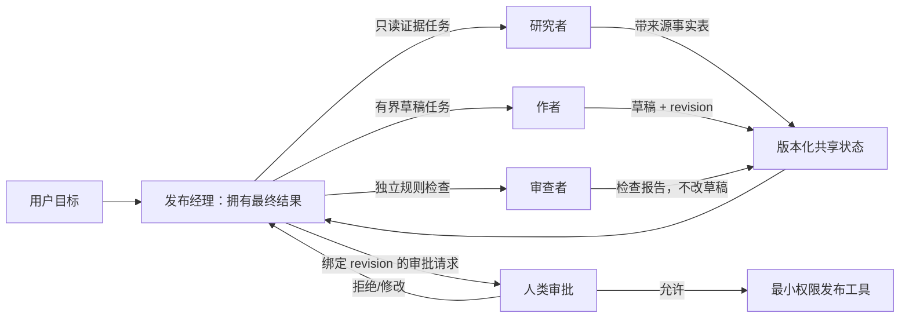

# 角色、拓扑与职责边界

## 本节目标

理解“拓扑”是 Agent 之间控制权与消息连接的结构；能为角色写出单一职责、能力、权限和退出条件。

## 先定义角色合同

每个角色至少回答七个问题：

1. 它拥有哪个结果？
2. 接受哪些输入，产出什么结构？
3. 可以使用哪些工具和数据？
4. 不能做什么？
5. 谁验收它，失败交给谁？
6. 什么时候必须停止或请求人工决定？
7. 它以哪个运行时主体访问哪个租户/信任域，权限由谁在执行边界复验？

若两个角色都声称“负责最终正确性”，边界通常不清。可以让研究者负责证据清单、作者负责草稿、审查者负责规则检查，但最终发布权只属于经理或人类。

## 常见拓扑

### 经理—专家

经理保留用户会话和最终答案，把有界子任务调用为“专家工具”。OpenAI Agents SDK 将此称为 agents as tools。优点是控制权集中、共享护栏易实施；缺点是经理可能成为上下文和延迟瓶颈。

### 交接

分类/分诊 Agent 把控制权移交给专家，专家直接继续会话。SDK 中 handoff 与调用专家工具不同：接收的上下文和谁拥有后续会话都会变化。适合领域路由，不适合经理必须统一最终答案的场景。

以 OpenAI Agents SDK 为例，`input_type` 只约束交接这个工具调用的元数据；它不替换接收者看到的主输入，也不负责在多个目的地间作授权路由。接收者的历史要通过 `input_filter` 或显式上下文策略裁剪。该 SDK 还明确说明：交接链的输入 guardrail 只作用于链首、输出 guardrail 只作用于最终输出；若每次工具或写操作都需要检查，应在工具/执行边界另设 guardrail 与授权复验，不能把一次路由当成持续授权。[OpenAI Agents SDK：Handoffs](https://openai.github.io/openai-agents-python/handoffs/)（访问于 2026-07-22）

### 流水线

研究 → 起草 → 审查 → 发布，每步输入输出稳定。它本质上更接近工作流；只有某一步内部需要开放决策时才由 Agent 执行。

### 扇出—汇总

多个互不依赖的专家并行工作，再由汇总器合并。并行只能缩短非关键依赖；汇总器还需处理重复、矛盾和来源强弱。

### 对等/网络

Agent 彼此发现能力并交换任务。适合跨组织、异构系统，但身份、认证、协议版本、超时和责任追踪更难。A2A 规范试图为不暴露内部状态的 Agent 间协作提供公共任务与消息模型。

### 层级与群体

多层经理可控制大规模任务，但每层摘要可能丢失证据。无中心“群体”在研究中常见，在生产中若缺少确定停止、仲裁和事实源，最难验证。

## 拓扑选择清单

- 最终答案是否必须由一个主体负责？
- 专家需要完整会话，还是只需最小任务包？
- 子任务能否真正并行？
- 数据和工具是否需要权限隔离？
- 冲突由谁仲裁？
- 是否跨进程、供应商或组织边界？
- 失败后从哪一层恢复？

优先选择边数更少、控制权更清晰的拓扑。完全连接的 n 个 Agent 最多有 n(n-1) 条有向通信关系，角色增加会快速扩大测试面。

## 示例：发布助手

*图 1　经理式协作中的任务与状态所有权。文字替代：发布经理拥有最终结果，研究者、作者和审查者只拥有各自有界产物；所有产物进入版本化共享状态，审查者不能修改被审对象，最终发布还需绑定状态版本的人类审批和最小权限工具。图依据本节职责合同、A2A task/message/artifact 边界和所引框架编排资料抽象绘制；Mermaid 源码即再生成方式。*

| 角色 | 拥有结果 | 权限 | 禁止 |
| --- | --- | --- | --- |
| 研究者 | 带来源的事实表 | 只读检索 | 写文件、发布 |
| 作者 | 基于事实表的草稿 | 草稿区写入 | 添加无来源事实 |
| 审查者 | 规则检查报告 | 只读草稿 | 修改草稿 |
| 发布经理 | 最终版本 | 经审批后发布 | 跳过审查 |

这里不是四个 Agent 自由聊天，而是一个带责任分离的有向流程。

## 练习与自测

为“自动修复代码并提交”画两种拓扑：经理—专家与流水线。标出测试、代码写入、Git 提交的权限。自测：审查者能否直接修代码？若可以，如何防止“自己审自己”？

## 下一步

继续 [[多Agent协作/01-基础与架构/03-任务分解与委派合同|任务分解与委派合同]]。

## 参考资料

- [OpenAI Agents SDK：Agent orchestration](https://openai.github.io/openai-agents-python/multi_agent/)（访问于 2026-07-22）
- [OpenAI Agents SDK：Handoffs](https://openai.github.io/openai-agents-python/handoffs/)（访问于 2026-07-22）
- [A2A Protocol Specification](https://a2a-protocol.org/latest/specification/)（访问于 2026-07-22）
