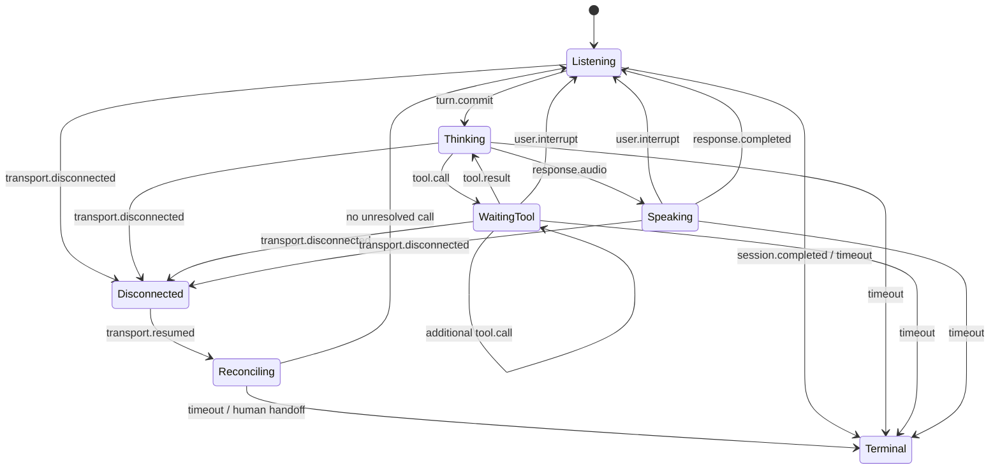

# 会话、事件与传输边界

## 为什么需要

“已连接”只证明某条通道存在，不证明音频顺序、业务会话、工具结果或用户看到的播放状态一致。选错边界会让浏览器长期持有服务端密钥、让 WebSocket 承担它没有提供的媒体能力，或把 SIP 信令误当音频传输。

## 怎样实现

### 先按职责选连接

| 边界 | 适合 | 本身不保证 |
| --- | --- | --- |
| WebRTC | 浏览器/移动端交互媒体；需要媒体 track、协商与实时播放 | 业务 event schema、工具幂等、应用 checkpoint |
| WebSocket | 服务端已经拿到原始媒体；需要双向有序消息通道 | codec 协商、NAT 媒体穿透、自适应 jitter buffer |
| SIP | 电话会话的建立、修改、路由和终止 | 音频媒体本身；常需媒体网关与 [RTP](https://datatracker.ietf.org/doc/html/rfc3550) 等媒体路径 |

[W3C WebRTC](https://www.w3.org/TR/webrtc/)定义浏览器实时通信 API；[Media Capture and Streams](https://www.w3.org/TR/mediacapture-streams/)定义本地设备请求、`MediaStreamTrack`、权限与生命周期。[RFC 6455](https://datatracker.ietf.org/doc/html/rfc6455)定义 WebSocket 协议。[RFC 3261](https://datatracker.ietf.org/doc/html/rfc3261)明确 SIP 是创建、修改和终止会话的应用层控制/信令协议。

### 再定义供应商无关事件

每个事件至少有 `event_id`、`type`、单调时间或排序信息、严格 `payload`。业务关联分别使用：

- `turn_id`：一次用户语义输入；
- `response_id`：一次 Agent 输出尝试；
- `call_id`：一次工具意图/结果；
- `session_id`：应用会话，不等于某条 socket ID。

> **图 1：实时会话的应用状态边界。** 文字替代：会话从监听进入思考，可进入工具等待或播放；等待工具时还可声明额外调用，直到所有调用都有结果才回到思考；用户可打断等待中的 response。任意活动阶段可能断线或超时。重连先进入副作用核对，只有没有未决调用才能回到监听；超时或无法安全核对则进入终态/人工交接。依据：W3C WebRTC/Media Capture 的连接与媒体生命周期、RFC 6455/3261 的协议职责，以及本课程的应用事件合同。许可状态：本图为本知识库原创且未复制第三方图形；仓库当前未在发布策略中声明一份适用于全部原创正文的独立许可证，因此不擅自新增授权，公开使用范围由项目所有者最终确认。再生成：Obsidian 或 Quartz 直接渲染本页 Mermaid 源码。

客户端和服务端都要把未知事件、未知字段、错误类型和越界序号视为合同错误；不要悄悄忽略后继续执行。精确重复的同一 `event_id` 可幂等忽略，同 ID 不同内容必须报警。**恢复通道重新建立不授权新工作**：若 checkpoint 有 `pending`/`unknown` 写调用，runtime 只能接收其查询/receipt、再次断线或超时事件；直到每个调用得到可审计结论，才接受新 turn、response 或工具意图。

本课离线状态机把工具调用视为**阻塞当前 response 的输出**：`WaitingTool` 期间只接受额外 `tool.call`、匹配的 `tool.result`、用户打断、断线或超时，拒绝新的音频帧、输出音频和 response 完成。真实全双工产品若允许“工具仍在执行时继续采集或播放”，就不能沿用这个单一 `phase`；应把 capture、playout 和 side-effect 各自建成可并存状态，并重新定义打断、背压、授权和恢复测试。

## 常见失败

- 把 provider connection ID 当业务 `session_id`，重连后丢失审批和工具 receipt。
- 把音频二进制帧、控制事件与敏感凭据塞进同一不分级日志。
- 用到达顺序替代序号；重试后重复追加 audio 或 transcript。
- SIP 呼叫已接通就标记任务成功，忽略媒体和业务终态。
- 浏览器保存长期服务端凭据，或让不可信前端自行扩大工具权限。

## 怎样验证

用合同测试注入未知字段、重复 ID、乱序帧、断线、重连和迟到事件。传输测试与业务测试分开：前者证明媒体可达，后者要证明 turn/response/call 关联、旧输出停止、checkpoint 恢复和最终外部状态。

## 实践任务

为一个浏览器语音 Agent 画媒体面、控制面、状态面三张表：数据所有者、通道、ID、顺序、保留期、重试和终态。再说明若改成电话接入，SIP/媒体网关会放在哪一层。

## 动态实现样例与下一步

[OpenAI Realtime 概览](https://developers.openai.com/api/docs/guides/realtime) 在 2026-07-18 的文档中按浏览器/移动端、服务端媒体管线和电话场景分别展示 WebRTC、WebSocket、SIP；这是产品当日接口，不是通用规范。[Google Live session management](https://ai.google.dev/gemini-api/docs/live-api/session-management)展示另一种连接时限、恢复 handle 和即将断开事件设计。接入时重新核对。下一步：[[实时多模态交互/03-VAD轮次与用户打断|VAD、轮次与用户打断]]。
