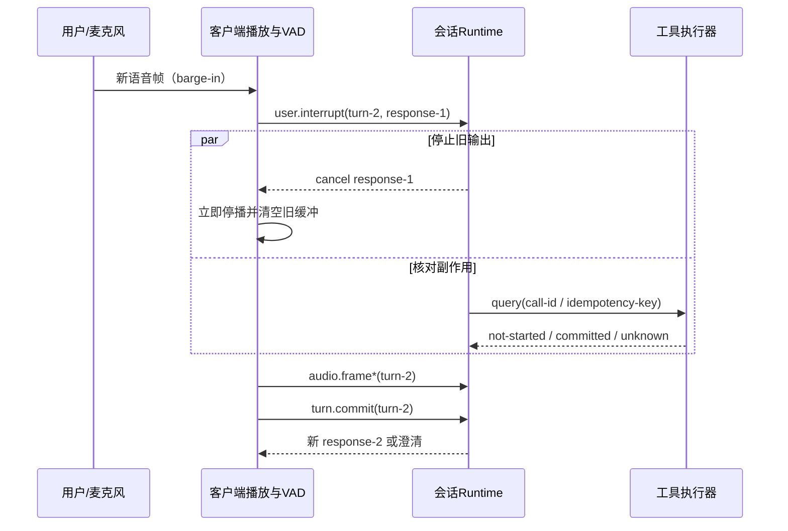

# VAD、轮次与用户打断

## 为什么需要

VAD（Voice Activity Detection）回答“现在像不像有人在说话”，不回答“用户的语义是否完整”。把短暂停顿当结束会抢话；等待太久又让系统迟钝。用户打断还会与正在生成的音频、客户端播放队列和已经发起的工具调用形成竞态。

## 怎样实现

把轮次拆成四层信号：

1. 音频活动：speech start/end、噪声、echo；
2. endpointing：静音阈值、最大 turn 长度、手动提交；
3. 语义轮次：句法/意图是否足以行动；
4. 控制事件：`turn.commit`、`user.interrupt`、`response.cancel`。

> **图 2：用户打断的双轨处理。** 文字替代：客户端检测新语音后，立即取消并清空旧 response 的播放；同时 runtime 独立查询旧工具调用究竟未开始、已提交还是未知，随后才处理新 turn。依据：[Google Live capabilities](https://ai.google.dev/gemini-api/docs/live-api/capabilities) 对 VAD/打断及未决 function call 的当前行为说明、[Full-Duplex-Bench](https://arxiv.org/abs/2503.04721) 的轮次/打断评测问题，以及 Agent 幂等原则。许可状态：本图为本知识库原创且未复制第三方图形；仓库当前未在发布策略中声明一份适用于全部原创正文的独立许可证，因此不擅自新增授权，公开使用范围由项目所有者最终确认。再生成：直接渲染本页 Mermaid 源码。

barge-in 的完成条件不是“发出 cancel”而是：旧 response 进入不可恢复的 canceled 终态、客户端不再播放旧 chunk、迟到旧 chunk 被 response ID 丢弃、工具状态已核对或显式标成 unknown。麦克风回声、背景说话和短促反馈词要单独作为切片测试。

## 常见失败

- VAD 一触发就提交 turn，咳嗽或键盘声导致模型行动。
- 服务端取消了生成，但客户端仍播放已缓冲的几百毫秒旧音频。
- 复用旧 `response_id`，迟到音频在新 turn 中“复活”。
- 把 interrupt 当事务回滚；实际写工具可能已经提交。
- 只测安静单人录音，不测 echo、串话、重叠和自我修正。

## 怎样验证

记录 speech start/end、commit、首个输出、interrupt、最后旧音频实际播放、工具 receipt 等单调时间。评测打断检出 precision/recall、误打断率、从用户开口到停止旧播放的延迟、打断后的任务恢复，以及迟到 chunk 泄漏次数。阈值按设备/语言/噪声切片，不使用单一全局平均。

## 实践任务

为以下四种音频写预期事件序列：自然停顿、句中犹豫、用户主动纠正、扬声器回声。明确哪些只更新 VAD，哪些 commit，哪些 cancel，以及工具已提交时如何回应。

## 依据与下一步

[Full-Duplex-Bench](https://arxiv.org/abs/2503.04721)把 pause、backchannel、turn-taking 和 interruption 作为独立实时行为；它是研究评测框架，不等于生产验收全集。产品行为以目标版本为准。下一步：[[实时多模态交互/04-低延迟背压与抖动|低延迟、背压与抖动]]。
