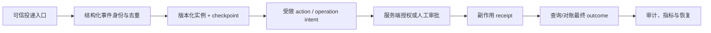

# 工作流自动化

> [!info] 资料边界
> 本库协议与运行边界核验于 2026-07-22。Open Workflow Specification 官网当前标注 **1.0.3**；CloudEvents 仓库列出的稳定发布仍为 **1.0.2**，主线另有 WIP；OpenTelemetry Semantic Conventions 页面为 **1.43.0**，其中消息语义约定仍标注 Development。课程不会把某个产品的默认值写成通用保证，实际采用产品前应再次核对其版本文档。

## 知识库简介

工作流自动化把“何时开始、按什么顺序做什么、失败后如何继续”变成可检查的执行合同。它适合订单履约、文档处理、数据管道、审批和 Agent 外壳等路径可预先约束的过程。

工作流不是把一串函数按顺序调用那么简单。可靠工作流还要面对重复事件、进程崩溃、并发领取、下游超时、未知执行结果、版本升级和人工等待。学习重点因此是：**显式状态、有限重试、持久恢复、幂等副作用、可补偿动作、可审计审批和可观测运行**。

> [!important] 与 Agent 的边界
> 确定性工作流负责允许的节点、状态迁移、预算、审批和提交；Agent 或 LLM 只在某个有输入/输出合同的节点内提出候选结果。模型输出必须先经过 schema、业务规则和权限检查，不能直接决定任意下一步或执行未授权副作用。

> [!warning] 事件身份不是权限
> `source + event_id`、`trace_id` 和模型给出的 tenant 字段可帮助关联、去重或诊断，但都不是可信身份。入口先验证发送者/签名与回放窗口，执行前再由服务端按当前 actor、策略和资源 ACL 授权；任一环节不满足即 fail closed。

## 在总路线中的位置

本库位于“单 Agent 与工具”阶段的工程收束点：

- [[Tool Calling（含 Function Calling）/00-目录|Tool Calling（含 Function Calling）]]定义单个动作的参数与返回合同。
- [[Agent 核心/00-目录|Agent 核心]]解释动态决策循环、预算和终止条件。
- 本库把动作和有限决策放进可恢复、可审批、可审计的业务流程。
- 后续 [[MLOps/00-目录|MLOps]]、[[LLMOps/00-目录|LLMOps]]与[[运行监控/00-目录|运行监控]]负责持续交付、模型运行和生产监控。

## 学习目标

完成后应能：

- 判断简单脚本、确定性工作流与开放式 Agent 各自适合的边界。
- 将需求表示为触发器、步骤、条件、并行、汇合和终止状态。
- 为事件和步骤设计版本化数据合同，并区分结构验证与业务验证。
- 设计调度时区、超时层级、有限重试、抖动、重试预算和背压。
- 从检查点恢复长流程，并用幂等记录处理重复与“结果未知”。
- 区分事件身份、业务 `operation_id`、执行 `attempt_id`、回执与最终 outcome，不把诊断 ID 当作授权或成功证明。
- 区分技术重试、业务补偿、人工审批和人工修复。
- 用事件、日志、指标和 trace 定位单次故障与系统性退化。
- 编写运行手册，安全发布工作流新版本并处置积压与补偿失败。

## 前置知识

- 能读 Python 函数、异常、JSON 文件和基本测试。
- 理解 [[API/03-认证状态码与凭据安全|API 认证与凭据安全]]、HTTP 请求/响应和状态码的基本概念。
- 能阅读 [[JSON/05-JSON Schema基础契约|JSON Schema 基础契约]]，并知道结构校验不等于业务授权。
- 知道 Tool Calling 是“请求执行工具”的结构化协议，不等于可靠执行。
- 不要求先懂消息队列、数据库事务或分布式系统；课程会先解释术语。

## 推荐学习顺序

1. [[工作流自动化/01-触发器、步骤与DAG|触发器、步骤与 DAG]]：先把业务过程建模，并确定工作流与 Agent 的责任边界。
2. [[工作流自动化/02-数据契约与版本演进|数据契约与版本演进]]：让事件和步骤通过可验证、可升级的合同通信。
3. [[工作流自动化/03-条件、并行与汇合|条件、并行与汇合]]：明确分支、并行安全和部分失败语义。
4. [[工作流自动化/04-调度、超时、重试与背压|调度、超时、重试与背压]]：控制何时运行、等多久、重试多少以及过载怎么办。
5. [[工作流自动化/05-持久状态、恢复与幂等|持久状态、恢复与幂等]]：在进程中断和重复投递后继续，而不重复逻辑副作用。
6. [[工作流自动化/06-补偿、审批与人工处理|补偿、审批与人工处理]]：处理跨系统副作用、知情批准和无法自动恢复的实例。
7. [[工作流自动化/07-可观测性、测试与发布|可观测性、测试与发布]]：用轨迹、故障注入、发布门槛和运行手册验收生产能力。
8. [[工作流自动化/08-离线DAG工作流项目|离线 DAG 工作流项目]]：实现并验证一个可暂停、恢复、重试、补偿和去重的离线订单流程。

## 动手实践与项目入口

项目入口是 [[工作流自动化/08-离线DAG工作流项目|离线 DAG 工作流项目]]：

- [workflow_engine.py](%E5%B7%A5%E4%BD%9C%E6%B5%81%E8%87%AA%E5%8A%A8%E5%8C%96/examples/workflow_engine.py)：标准库实现的教学型编排器。
- [workflow.json](%E5%B7%A5%E4%BD%9C%E6%B5%81%E8%87%AA%E5%8A%A8%E5%8C%96/examples/workflow.json)：版本化工作流定义。
- [test_workflow_engine.py](%E5%B7%A5%E4%BD%9C%E6%B5%81%E8%87%AA%E5%8A%A8%E5%8C%96/examples/test_workflow_engine.py)：74 项定义、触发、时间 profile、身份冲突、重试、审批、恢复、补偿和安全边界离线测试。

项目不连接云服务、不读取密钥、不创建仓库内持久产物。演示运行使用临时目录；生产系统仍需事务型状态库、持久幂等表、消息系统、密钥管理和真正的权限控制。

## 掌握标准

- [ ] 能把一个真实流程画成 DAG，并标出触发器、分支、汇合、等待和终止状态。
- [ ] 能说明为何“至少一次处理”要求业务幂等，而不能靠进程内字典声称 exactly-once。
- [ ] 能为暂时错误、永久错误、未知结果和业务拒绝分别设计处理路径。
- [ ] 能解释重试为何不能替代补偿，补偿为何也不保证回到原始物理状态。
- [ ] 能验证审批绑定了实例、步骤、载荷指纹、定义版本、状态版本和有效期。
- [ ] 能从检查点恢复已暂停流程，且已提交副作用不会重复产生。
- [ ] 能写出覆盖重复触发、崩溃窗口、补偿失败、审批过期和版本不兼容的测试。
- [ ] 能用运行手册安全执行部署、暂停、排空、回滚定义和人工处置。

## 与其他知识库的关系

- [[Tool Calling（含 Function Calling）/00-目录|Tool Calling（含 Function Calling）]]定义单步工具输入、输出和执行边界；本库把这些步骤放进可恢复流程。
- [[Agent 核心/00-目录|Agent 核心]]负责开放式决策循环；工作流负责把状态、预算、审批和终止条件固定为可审计合同。
- [[运行监控/00-目录|运行监控]]、[[LLMOps/00-目录|LLMOps]]与[[AI治理/00-目录|AI治理]]分别承接生产观测、模型变更和责任证据。

## 事实、实现与建议如何区分

- **规范事实**：来自 CloudEvents、JSON Schema、RFC 等规范；笔记会写明版本。
- **产品事实**：例如 Temporal 通过事件历史与重放恢复工作流，这是该产品的实现合同，不代表所有编排器都相同。
- **工程建议**：例如日志字段 allowlist、两阶段发布、重试预算，是本库给出的设计策略；应结合业务风险验证。

## 主要参考资料

- [Open Workflow Specification](https://serverlessworkflow.io/)（官网当前标注 1.0.3，访问于 2026-07-22）
- [CloudEvents Specification](https://github.com/cloudevents/spec)（稳定发布 1.0.2；主分支含下一版草案，访问于 2026-07-22）
- [JSON Schema Draft 2020-12](https://json-schema.org/draft/2020-12)（访问于 2026-07-22）
- [Temporal Platform Documentation](https://docs.temporal.io/)（产品实现参考，访问于 2026-07-22）
- [OpenTelemetry Semantic Conventions 1.43.0](https://opentelemetry.io/docs/specs/semconv/)（访问于 2026-07-22）
- [RFC 3339：Date and Time on the Internet](https://www.rfc-editor.org/info/rfc3339/)（RFC 9557 对其有更新）
- [RFC 9110：HTTP Semantics](https://www.rfc-editor.org/rfc/rfc9110.html)
- [Sagas, Garcia-Molina 与 Salem, 1987](https://doi.org/10.1145/38713.38742)（原始论文）
- [Microsoft Azure Architecture Center：Compensating Transaction](https://learn.microsoft.com/en-us/azure/architecture/patterns/compensating-transaction)（访问于 2026-07-22）
- [NIST SP 800-218：Secure Software Development Framework 1.1](https://csrc.nist.gov/pubs/sp/800/218/final)
- [RFC 9421：HTTP Message Signatures](https://www.rfc-editor.org/rfc/rfc9421)（签名覆盖、nonce 和回放边界，访问于 2026-07-22）
