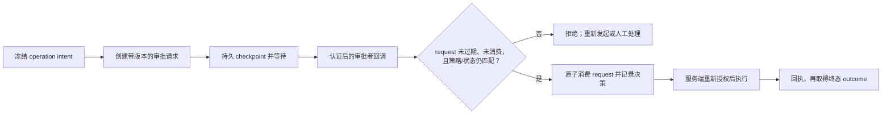

# 补偿、审批与人工处理

## 本节目标

区分重试、补偿、业务拒绝和人工修复，为跨系统副作用设计可恢复、可授权、可审计的失败路径。

## 四种处理不要混用

| 情况 | 动作 | 例子 |
| --- | --- | --- |
| 暂时技术故障 | 有限重试 | 支付服务短暂 503 |
| 已成功副作用需抵消 | 业务补偿 | 释放已预留库存 |
| 输入或业务规则不允许 | 拒绝/终止 | 库存不足、审批拒绝 |
| 自动信息不足或补偿失败 | 人工处理 | 下游无法确认是否扣款 |

重试是再次尝试原动作；补偿是一个新的业务动作。退款不是“删除扣款历史”，撤回通知也不一定能让接收者忘记内容。

## Saga 与补偿事实

Garcia-Molina 与 Salem 1987 年的原始 Sagas 论文讨论把长事务拆成一系列可交错的子事务，并在需要时执行补偿。现代工作流常借用这一思想处理跨服务的一致性。

补偿不是数据库回滚的通用替代：

- 补偿逻辑依赖业务语义；
- 补偿自身也可能失败，需要持久恢复；
- 不一定能恢复到最初物理状态；
- 顺序不一定严格是原动作的逆序，可能要优先修复高风险资源；
- 某些补偿可并行，但必须证明相互独立。

最后两点也在 Microsoft Compensating Transaction 模式中明确说明，因此“补偿栈一律逆序”只是常见默认，不是规范。

## 补偿记录需要什么

主动作成功后立即持久化：

- 原步骤与结果引用；
- 补偿 handler 与版本；
- 补偿所需最小参数；
- 独立幂等键与意图哈希；
- 依赖/优先级；
- attempt、错误码与人工升级规则。

不要为纯读取或尚未确认成功的动作注册补偿。若主动作结果未知，先查询/对账；贸然补偿可能产生“没有扣款却退款”的新错误。

## 审批不是一个布尔值

可靠审批记录至少绑定：

- workflow instance 和 step；
- 即将执行的 `operation_id` 与动作/目标资源的最小意图摘要；
- 即将执行动作的结构化摘要；
- 参数/载荷指纹；
- 工作流定义、策略和状态版本；
- 从经验证 session/token 派生的审批者身份、角色和权限范围（不能信任回调 body 自带的 `user_id`）；
- `approve/reject` 决策、理由和时间；
- 到期时间与一次性 request ID。

进入等待前持久化检查点并释放 worker。审批回调先验证其发送者和原始消息完整性，再从服务端会话/令牌取得 actor，检查 request 是否未消费、未过期、仍是当前状态版本，并在同一条件更新中消费一次性 request。恢复后重新验证资源、策略、参数和审批有效期；任何关键参数变化都应生成新请求。Microsoft Durable Task 的人工交互示例也使用持久等待与 durable timer 处理超时，这是**产品示例**，而不是审批安全标准。

签名、时间戳和 nonce 可以帮助识别被重放的**投递**，但它们不自动证明这个 actor 仍有权批准这个资源；反过来，应用的 `request_id` 去重也不证明回调来自可信发送方。两道检查都需要，且审批请求的消费与状态迁移应由持久存储的 compare-and-set/事务保护。

## 高风险 Agent 动作如何审批

审批页面展示实际结构化动作，而不是只展示模型的说服性说明：

- 将写入/发送/删除什么；
- 目标资源和影响范围；
- 数据来源、关键差异和不可逆部分；
- 成本与权限；
- 拒绝后流程如何终止或回退。

批准应授权这一个指纹，而非给 Agent 一段时间的无限权限。工具执行前仍要做服务端授权，`allowed-tools` 或提示中的限制不能替代真实权限边界。

模型、审批 UI 或 webhook 都只能提交候选动作。执行服务必须从可信身份和当前资源状态重新导出租户、角色、额度和可访问对象，并把高风险动作的 `operation_id`、决策、receipt 与最终 `outcome` 分开审计；若下游只返回“已接收”，流程仍处于待对账而非已成功。单个工具的输入/输出与服务端执行边界可复习 [[Tool Calling（含 Function Calling）/00-目录|Tool Calling（含 Function Calling）]]。

## 人工处理队列

操作员需要看见：失败步骤、已成功副作用、未知结果、补偿进度、错误分类、定义版本和安全裁剪后的证据。允许的动作应是受控命令：

- 查询/对账；
- 重试某个安全步骤；
- 执行或重试补偿；
- 在受限字段上修正数据；
- 跳过（需风险理由和更高权限）；
- 终止或迁移实例。

每个操作仍需权限、幂等和审计。不要让值班人员直接修改数据库状态为 `success` 而没有相应业务证据。

## 安全原则

- worker 使用每个依赖所需的最小权限，不共享管理员凭据；
- 凭据来自密钥管理，不进入工作流定义、日志和检查点；
- 高风险动作采用职责分离，审批者不能通过伪造回调绕过服务端验证；
- 外部回调防重放，绑定 request ID、有效期和载荷指纹；
- 审批者身份与资源授权来自服务端验证；回调字段、trace context 和 LLM 输出均不授予权限；
- 供应链、工作流定义和发布产物有来源与完整性检查；
- 按 NIST SSDF 1.1 把安全实践纳入开发与发布，而非上线后补充。

## 练习

为“预留库存—扣款—创建运单—发通知”制作补偿表：

1. 每个动作的补偿是什么，是否真正可逆？
2. 扣款成功但运单失败时补偿顺序是什么，为什么？
3. 通知已发后如何表达“无法撤销”？
4. 补偿失败转人工时必须展示哪些证据？
5. 审批发出后金额变化，旧批准如何失效？

## 自测

1. 补偿为什么不一定严格逆序？
2. 主动作结果未知时为什么不应立即补偿？
3. 审批绑定载荷指纹和状态版本分别防什么？
4. 人工跳过步骤为什么仍需要幂等与审计？

## 下一步

继续 [[工作流自动化/07-可观测性、测试与发布|可观测性、测试与发布]]。

## 参考资料

- [Sagas, Garcia-Molina 与 Salem, 1987](https://doi.org/10.1145/38713.38742)
- [Microsoft：Compensating Transaction Pattern](https://learn.microsoft.com/en-us/azure/architecture/patterns/compensating-transaction)（访问于 2026-07-22）
- [Microsoft Durable Task：Human Interaction Pattern](https://learn.microsoft.com/en-us/azure/durable-task/common/durable-task-human-interaction)（访问于 2026-07-22）
- [NIST SP 800-218：SSDF 1.1](https://csrc.nist.gov/pubs/sp/800/218/final)
- [RFC 9421：HTTP Message Signatures](https://www.rfc-editor.org/rfc/rfc9421)（签名覆盖、nonce 与时间边界，访问于 2026-07-22）
- [OWASP Business Logic Security Cheat Sheet](https://cheatsheetseries.owasp.org/cheatsheets/Business_Logic_Security_Cheat_Sheet.html)（服务端状态机与逐次授权，访问于 2026-07-22）
