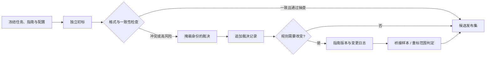

# 质检、复审与裁决

## 本节目标

组合格式、独立一致性、gold 准确性与分层审计，设计可发现系统性错误的复审和裁决流程，而不是只在末尾抽一个总体比例。

## 质量来自流程设计

仅在结尾抽查 1% 无法发现系统性指南问题。质量控制应贯穿：试标发现歧义、格式校验阻止无效提交、重叠标注测一致性、盲审检查正确性、裁决沉淀新规则。

## 四种互补证据

- **格式有效性**：必填、枚举、跨度边界、理由长度。
- **一致性**：多名标注者对同一样本是否一致。
- **参考答案准确性**：对少量经过专家确认的 gold 样本表现如何。
- **分层审计**：按标注者、类别、来源、时间、难度和模型建议分组抽查。

一致性高可能是所有人共同误解；gold 题高分也可能只会做已知题。因此需要组合证据。

gold 样本也会老化或泄露。应限制重复曝光、轮换题组、记录版本，并用未提前告知的随机审计验证；gold 的专家答案同样需要证据和复核。

## 重叠标注与盲审

高风险、长尾和随机样本应由多人独立标注。独立意味着首次判断看不到他人答案、模型置信度或裁决结论。否则容易产生锚定和从众。

审查抽样不能只挑短样本或高置信度样本。可以混合随机抽样、风险分层、低一致样本和新标注者样本，并明确各自分母。

## 裁决

裁决者依据指南和证据给出最终标签，同时记录：原始标签、冲突原因、裁决标签、规则引用、是否需要更新指南。若大量冲突集中在同一边界，应暂停批量标注先修规则。

裁决应是追加事件，而不是把初标原地改成“正确答案”。在不妨碍核对证据的前提下，向裁决者隐藏标注者身份、模型建议与产量信息，降低权威/从众偏差；是否展示先前标签及其顺序也应写进协议。两名标注者分歧没有多数票，最终标签必须来自指南证据或升级规则，而不是随意选择一方。

## 指南变更后的桥接与重标

指南的 major 变化会改变测量对象，不能把新旧标签混为同一总体。保留一组覆盖高频、长尾和争议边界的**桥接样本**：在旧/新指南下分别记录标签、证据和裁决差异，用它确定哪些历史 batch 需要重标、哪些仅能带版本并列报告。桥接样本用于理解版本断点，不是让团队挑选“更好看”的规则；若没有可比证据，应停止纵向比较并在报告中明确断点。

最小裁决记录包括 `adjudication_id`、`sample_id`、初标记录 ID、可见证据范围、指南版本、规则引用、裁决标签/理由、裁决者角色、时间、是否触发指南变更和受影响重标范围。人员身份可在受控系统中单独保存，公开数据只保留必要的匿名角色标识。

## 避免错误激励

速度、产量和一致率都不能单独成为绩效目标。只追速度会跳过证据，只追一致会压制合理弃权。质量问题优先修任务与指南，再考虑人员培训。

## 练习

设计 1000 条 RAG 相关性标注的质检方案：重叠比例、随机审计、长尾分层、gold 样本、暂停阈值和裁决产物各是什么？

## 掌握检查

- [ ] 我能区分格式有效性、一致性、gold 准确性和代表性审计。
- [ ] 首次判断对他人答案、模型置信度和裁决结论保持盲态。
- [ ] 裁决记录原始标签、证据、规则引用、最终标签和是否更新指南。
- [ ] 抽样报告含各层分母，不以总体高分掩盖长尾/高风险失败。
- [ ] 我会把裁决作为追加记录，并在指南 major 变更后用桥接样本决定重标与指标比较边界。

下一步：[[数据标注/05-一致性指标|一致性指标]]。

## 参考资料

资料核验日期：2026-07-22。当前 Label Studio 文档仍区分 task、annotation 与不同导出格式；工具功能不会替代独立标注、盲审和版本化裁决协议。

- [Label Studio: Data labeling documentation](https://labelstud.io/guide?hsLang=en)
- [Label Studio: Export annotations and data](https://labelstud.io/guide/export.html)
