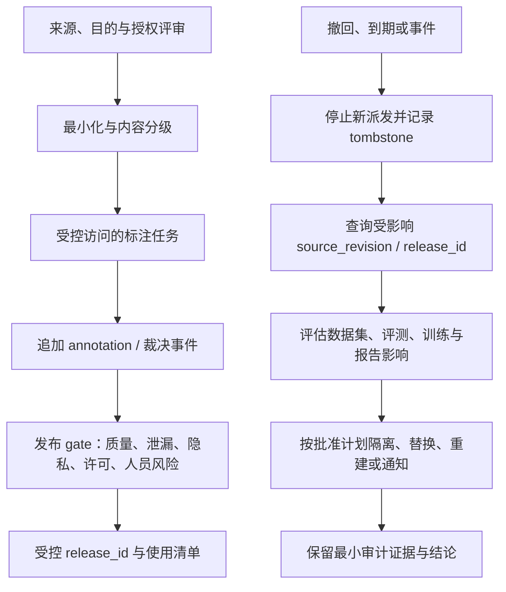

# 数据治理、隐私、许可与劳动安全

## 本节目标

把标注视为一次受控的数据处理和劳动安排：在任务派发前确认来源、目的、最小化、访问、内容风险、许可、留存与责任；在问题出现时能够停止、分诊、撤回并评估下游影响。

本节给出工程控制清单，不提供任何司法辖区的法律结论。个人信息、敏感数据、劳动关系、合同、版权/数据库权利和跨境处理都需要由有权限的组织角色按实际来源与适用要求确认。

## 派发前的最小治理门

| 门 | 要留下的证据 | 不能由它证明 |
| --- | --- | --- |
| 目的与必要性 | 任务卡、用途、受影响方、最小字段和责任人 | 目的合理就可无限收集 |
| 来源与权限 | 来源类型、许可/合同/同意/组织授权的受控引用、可用范围 | “公开可访问”就可训练或再发布 |
| 敏感性与最小化 | 分类、字段白名单、去标识/遮蔽规则、禁止字段、残余风险 | 删除姓名或哈希后必然匿名 |
| 安全访问 | `access_scope`、角色、最小权限、受控环境、下载/复制限制和审计 | 有一个链接就已经安全授权 |
| 人员与内容风险 | 内容分级、告知、退出/升级、暴露限制、支持与申诉路径 | 标注者“点了同意”即无风险 |
| 留存与撤回 | `retention_class`、到期/删除流程、来源撤回联络、下游清单 | 删除入口文件就自动从所有下游消失 |

先将原始材料与标注任务分离：标注者只获得完成当前判断所需的最小上下文，敏感原件、身份映射、授权文档和完整审计日志留在受控系统。不要把原文、密钥、个人信息、私有 URL 或截图复制进指南、公开 issue、自由文本理由或外部模型提示。

## 许可与来源不是一个布尔字段

同一数据可能有来源条款、合同用途限制、个人信息处理要求、模型服务条款、保密义务和再发布限制。为每个来源/发布范围保存**受控引用**与状态，而不是写一个无法复核的 `licensed: true`：

- 来源/提供者与取得时间；
- 允许的用途（试标、内部训练、评测、研究、公开发布等）和地域/期限；
- 所需 attribution、署名、保留通知和下游限制；
- 负责人、例外、复核日期和撤回/到期处理；
- 输入、工具服务和导出产物是否跨越同一范围。

“开源”“网页可见”“合成”“已去标识”均不自动给出任意训练、再发布或向外部服务传输的许可。来源状态未知或审查待决时，候选应隔离或阻止更广的派发/发布，而不是由数据团队自行补推结论。

## 隐私与安全：最小化优先于事后清理

脱敏是降低暴露面的一个控制，不是可逆性、匿名化或合规性的万能证明。组合准标识符、稀有文本、时间/地点、图片、音频和模型输出仍可能重新识别个人。应在入池前最小化字段，采用角色隔离、短期凭证、受控查看环境和按需审计；对高风险任务用合成/替代样本先验证指南。

标注项目还要明确：是否允许下载、复制、截屏、调用外部工具、导出原始内容和在理由中复述敏感文本。默认不把敏感样本送往无批准的第三方 API，也不把无访问权限的标注者作为“人工审核”兜底。进一步的技术边界见 [[隐私计算/00-目录|隐私计算]]；数据资产、供应商与审批责任见 [[AI治理/00-目录|AI 治理]]。

## 标注者的安全、尊严与申诉

有害、暴力、仇恨、性内容、儿童相关内容或个人困境材料可能造成心理、社会或安全风险。风险评估应由任务类型和人员情境决定，至少包括：

1. 在分派前提供可理解的内容警示、任务目的、数据处理边界和报酬/绩效规则；对高暴露任务提供自愿选择或等效替代工作，而非把拒绝/弃权当低绩效。
2. 设置按风险调整的访问、批量大小、连续暴露时长、休息/轮换、双人或专家升级和紧急停止机制；不要以纯产量压缩判断与恢复时间。
3. 提供保密的报告、反骚扰和申诉渠道，明确由谁处理恶意内容、平台/客户施压、错误扣款或工具故障；保留必要审计但尽量减少对标注者的监控数据。
4. 将培训、支持资源和事故响应与实际风险配套；不能把“已阅读警告”当作对伤害的充分控制。

ILO 将数字化/平台工作中的职业安全、心理社会风险、算法管理与工人参与列为需要主动治理的议题。本课据此将人员安全列为工程 gate；具体保护和劳动责任仍须由雇主、平台、合同方和适用制度决定。

## 撤回、删除与下游影响

`tombstone` 表示某来源/版本不可再被新流程消费，并触发影响查询；它不保证模型已“遗忘”，也不等于擅自删除所有审计记录。对已训练模型、派生特征、评测集、缓存和已发布报告，应按其可追溯关系评估隔离、重建、重新训练、通知或保留要求，并记录谁批准了处置。

可以在受控账本中为每个样本/发布物保存 `access_scope`、`license_or_authorization_ref`、`retention_class`、`content_risk`、`worker_safety_plan_ref` 和 `deletion_request_ref`。这些字段指向证据或流程，不应被误解为机器自动作出的法律/隐私判决。

## 发生问题时

若发现未经授权内容、疑似敏感信息泄露、严重有害内容、标注者安全事件或来源撤回：停止继续派发/复制，保留必要的受控事件引用，不要为了排查把内容扩散到聊天、截图或公共日志；按既定事件响应、隐私/安全/劳动负责人和发布撤回流程分诊。必要时把受影响样本转为 `exclude` 或冻结待审，但不要把“已删除”写成未经证明的下游清除结论。

## 练习

为一个“审核 Agent 失败轨迹”的任务写一页治理附录：目标数据的来源范围、禁止字段、三个 `access_scope`、一个高暴露内容的退出/升级路径、最小留存类别、一个来源撤回后需要查询的 `release_id` 清单，以及哪些结论仍需组织内合格人员确认。

## 掌握检查

- [ ] 我能区分来源/授权证据、访问权限、隐私风险和发布资格，而不把它们压缩成一个布尔字段。
- [ ] 我会让标注者只接触最小必要内容，不把原始敏感数据复制到指南、理由或外部工具。
- [ ] 我能为有害内容设计告知、退出、暴露限制、支持、报告和升级，而不以产量惩罚弃权。
- [ ] 我知道撤回需要查询 `source_revision → release_id → 下游用途`，并且 tombstone 不是模型遗忘证明。

下一步：[[数据标注/09-版本、发布与生产反馈|版本、发布与生产反馈]]。

## 参考资料

资料核验日期：2026-07-22。

- [NIST Privacy Framework](https://www.nist.gov/privacy-framework)
- [NIST AI RMF Core：治理、第三方数据、人工监督与持续监控](https://airc.nist.gov/airmf-resources/airmf/5-sec-core/)
- [W3C PROV-O：entity、activity、agent 与 derivation](https://www.w3.org/TR/prov-o/)
- Gebru et al. (2021). [Datasheets for Datasets](https://arxiv.org/abs/1803.09010)
- [ILO：AI 与数字化工作中的职业安全健康](https://www.ilo.org/publications/revolutionizing-health-and-safety-role-ai-and-digitalization-work)
