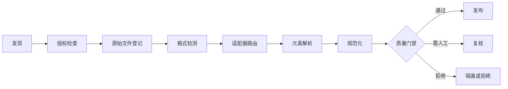

# 格式识别与解析流水线

## 本节目标

从零建立一个不会“看后缀就开文件”的解析流程。学完后，你能解释检测信号的证据强弱，给每一阶段定义输入、输出和失败状态，并为未信任文档设置最小安全边界。

## 从一个错误下载开始

用户保存了 `report.pdf`，实际内容却是网站返回的 HTML 登录页。如果程序只看 `.pdf`，PDF 解析器会报一个难懂异常；更糟时，攻击者可以用伪装扩展名把危险容器送入高权限解析器。

“格式”至少涉及三件事：

- **声明格式**：文件名扩展名或上传者声称的类型；
- **传输格式**：HTTP `Content-Type` 等上游元数据；
- **检测格式**：文件签名、内容特征，必要时还有容器内部结构。

它们都是证据，不是绝对真相。Apache Tika 官方文档也把 magic、资源名、已知 `Content-Type` 与容器感知检测分开：扩展名可被重命名，magic 对 ZIP/OLE 等容器又不足以判断内部究竟是哪种文档。

## 多信号决策表

| 情况 | 决策 | 原因 |
| --- | --- | --- |
| `.pdf` + `%PDF-` | 登记为 PDF，再交给受控 PDF 适配器验证结构 | 头部匹配仍不证明文件完整 |
| `.pdf` + `<!doctype html>` | 隔离并记 `media_type_mismatch` | 很可能是错误页或伪装文件 |
| `.docx` + ZIP 签名 | 只能初步认为是 OOXML 容器 | 必须检查容器条目才能确认；本项目不展开 |
| `.txt` + 无 BOM 的合法 UTF-8 | 可按允许清单进入严格文本解码 | 扩展名证据弱，但解析器能力边界明确 |
| 未知扩展名 + “看起来像文本” | 进入拒绝/人工路由，不猜解析器 | fail closed 比静默误解析更可审计 |

检测规则应输出 `extension_media_type`、`detected_media_type`、`detection_method` 和冲突原因。不要只保留最终标签，否则无法解释为什么某个文件被隔离。

## 可重放流水线

每个箭头都是契约：

| 阶段 | 最小输入 | 最小输出 | 典型失败 |
| --- | --- | --- | --- |
| 原始登记 | bytes、来源、权限 | `source_id`、SHA-256、大小、获取状态 | 下载不完整、超上限 |
| 格式检测 | 前缀 bytes、扩展名、上游类型 | 候选类型、方法、冲突 | 未知、伪装、容器不明 |
| 解析 | 固定源版本、适配器、配置 | 元素、位置、警告 | 损坏、加密、超时、零元素 |
| 规范化 | 原始元素、规则版本 | 审计文本、检索文本 | 丢字、语义变化 |
| 验收 | 解析产物、gold set、阈值 | `pass/review/fail` | 空页、乱序、表格漂移 |
| 发布 | 已通过版本、权限策略 | 可检索版本与回滚指针 | 权限映射缺失 |

原始文件、解析配置和结果都要版本化。相同的 `raw_sha256 + parser_version + config_sha256` 应能重放；源文件变化时不能覆盖旧结果。

## 身份、幂等与错误分类

路径会变化，所以不要把 `D:\docs\a.pdf` 当永久内容 ID。可以用原始 bytes 的 SHA-256 标识内容版本，再给业务来源分配稳定 `document_id`。二者含义不同：同一个业务文档可以有多个内容版本，相同内容也可能来自不同权限域。

错误至少分为：

- `rejected`：类型冲突、越权、超资源预算、严格解码失败；修正输入后才能重试；
- `external_adapter_required`：当前组件没有该格式能力，不是假失败，也不是解析成功；
- `transient_failure`：隔离服务暂时不可用或超时，可按策略重试；
- `quality_review`：技术解析完成，但顺序、表格或 OCR 质量未过门禁。

错误信息不要带全文、真实凭据或不必要的绝对路径。哈希能帮助去重与变更检测，但不是访问控制、真实性证明或恶意内容扫描。

## 未信任文件的安全边界

OWASP 的文件上传指南建议采用允许清单、不要信任 `Content-Type`、随机化存储名、限制大小、授权访问，并在适用时使用杀毒或内容消毒。对解析流水线还要补充：

- 文件数、单文件大小、总大小、页数、解压后大小、CPU、内存和墙钟时间上限；
- 对 URL/上传文件名先做解码与规范化，再检查允许扩展名；双扩展名、保留名称和异常路径段应拒绝。`stat()` 只是预检查，实际读取仍要以有界文件句柄再次执行字节预算；
- 不执行宏、JavaScript、嵌入程序、外部链接或文档中的命令；
- 不直接在高权限主进程加载复杂第三方解析器；
- ZIP 条目必须防 `../` 路径穿越、绝对路径、符号链接和压缩炸弹；
- 解析日志仅记录最小诊断信息，原文按权限保存；
- 文档中的提示词属于不可信数据，进入 Agent 上下文前仍需 [[AI安全/00-目录|AI 安全]] 治理。

本库项目拒绝符号链接、不展开容器、限制文件数与字节数，但它只是教学实现，不等于 OS 级沙箱或恶意软件扫描器。

## 常见错误与排查

- **“解析器没报错，所以类型正确”**：许多解析器会容错；应比较声明和检测信号并验收输出。
- **“所有格式先转 PDF”**：转换会丢标题语义、批注、单元格和可访问性信息。
- **“ZIP magic 就能证明是 DOCX”**：DOCX、PPTX、XLSX 和普通 ZIP 共享容器签名。
- **“失败就无限重试”**：格式损坏、密码保护和权限拒绝通常是永久错误。
- **“把原文件名写入公开日志没问题”**：文件名也可能含姓名、项目或病历信息。

## 练习

1. 为“`.pdf` + HTML 内容”“无扩展名 + PDF 头”“`.docx` + 普通 ZIP”“合法 PDF 但加密”分别写出状态、错误码和下一步。
2. 为 100 MB、10,000 页、嵌套 ZIP、目录符号链接设计 fail-closed 规则。
3. 修改 [[文档解析/examples/test_inspect_documents.py|回归测试]]，加入 PNG 伪装成 `.txt` 的案例；先写失败测试，再实现预期。
4. 画出你自己的 `source_id`、业务 `document_id`、解析版本和发布版本关系。

## 自测

- [ ] 我能解释后缀、`Content-Type`、magic 和容器检测各自的不足。
- [ ] 我能区分“需要适配器”与“已经解析成功”。
- [ ] 我能为每个阶段保存可重放输入和错误状态。
- [ ] 我能列出至少五个未信任文件风险及对应门禁。

## 参考资料与下一步

- [IANA Media Types registry](https://www.iana.org/assignments/media-types/media-types.xhtml)
- [Apache Tika: Content Detection](https://tika.apache.org/3.3.1/detection.html)
- [OWASP File Upload Cheat Sheet](https://cheatsheetseries.owasp.org/cheatsheets/File_Upload_Cheat_Sheet.html)
- [Python `pathlib`](https://docs.python.org/3.11/library/pathlib.html)

来源获取日期：2026-07-22。下一步：[[文档解析/02-编码文本与规范化|编码、文本与规范化]]。
