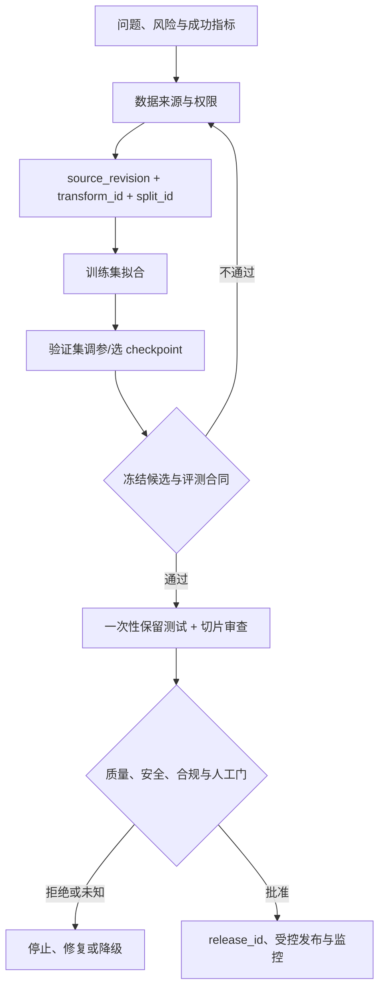

# 深度学习：工程实践与现代化路线

## 内容与证据边界

本页是面向 AI Agent Engineer 的**原创学习与工程综合**，核验日期为 **2026-07-22**。它不替代目录中获 Apache-2.0 许可的 D2L 正文：D2L 用来建立数学、训练与架构直觉；本页补充当前框架安装、实验合同、评测、发布与安全边界。涉及 PyTorch 的版本、设备支持和具体 API 时，以执行当天的官方文档和实际环境为准。

不要把以下三件事混为一谈：

- 能读懂网络结构，不等于能在当前框架中复现历史 notebook；
- 一次训练损失下降，不等于模型对未见数据、不同人群或线上流量有效；
- 一次离线测试通过，不等于模型、数据、权限和业务决策可以安全发布。

## 按目标选择，而不是顺序刷完 140 篇

| 目标 | 建议先掌握 | 可以后置 |
| --- | --- | --- |
| 调用 LLM、构建 Agent 或 RAG | [[机器学习/00-目录\|机器学习]]的数据划分与指标；本库的张量、泛化、注意力和 Transformer 直觉 | 从零训练 CNN、分布式训练、所有 RNN 推导 |
| 做 Embedding、重排或小型分类/微调 | 自动微分、训练/验证边界、损失与优化、BERT/Transformer | 大规模预训练、参数服务器 |
| 做视觉或多模态项目 | 卷积、迁移学习、检测/分割的任务与指标，再进入[[多模态AI/00-目录\|多模态 AI]] | 旧 Kaggle 下载流程与历史 MXNet 实现 |
| 训练或适配较大模型 | 数值稳定性、混合精度、AdamW、检查点、数据并行与恢复 | 先假定多 GPU 一定加速或可线性扩展 |



图中每一箭头是**需要记录和验证的决策**，不是模型自动完成的保证。测试集、审批或监控缺失时，应把结论写成“未知”而不是“已证明”。

## 训练运行的最小合同

| 字段/证据 | 它回答的问题 | 它不能单独证明什么 |
| --- | --- | --- |
| `source_revision` | 训练时采用的是哪一版允许使用的来源数据 | 来源许可、当前访问权限或数据内容正确 |
| `transform_id` | 哪次清洗、标注、切分前处理产生了输入 | 处理无偏、无泄漏或可复现 |
| `split_id` 与样本/组映射 | train/validation/test 是否可区分、可复查 | 时间、实体或语义近重复已经被正确隔离 |
| `candidate_id` | 哪个冻结的训练/评测候选正在接受门禁 | 已被批准发布或可供生产消费 |
| 模型/代码/依赖/硬件引用 | 哪个候选实际被训练 | 在另一平台、另一框架版本可得到完全相同数值 |
| 验证集指标与 checkpoint 选择理由 | 为什么选择该候选 | 对保留测试或线上用户有效 |
| 保留测试、切片和错误样本 | 候选在约定离线合同下表现如何 | 公平、安全、授权和真实业务收益均已解决 |
| `release_id`、审批与回滚计划 | 哪个已审候选被允许发布 | 发布后不会漂移、滥用或泄露数据 |

`source_revision`、`transform_id`、`split_id`、`candidate_id` 和已发布后的 `release_id` 都应是稳定的身份引用；不要按字符串大小猜版本先后，也不要用 `latest`、文件名或口头描述替代可追溯证据。`candidate_id` 只标识尚待质量、治理和人工门审查的候选；只有外部审批/发布记录才产生 `release_id`。元数据记录能帮助调查，不能替代数据授权、人工审查、哈希/签名校验或真实访问控制。

## 四个经常漏掉的边界

1. **评测边界**：验证集用于调参和选择 checkpoint；保留测试集只在候选冻结后使用。若反复根据测试分数修改模型，它已变成验证集，必须如实重新命名或准备新保留集。
2. **运行模式边界**：`model.eval()` 切换会受训练/评估模式影响的层（如 Dropout、BatchNorm）的行为；`torch.no_grad()`/`torch.inference_mode()` 解决的是梯度跟踪和内存开销。二者通常都需要，但不互相替代。
3. **数值边界**：混合精度可能提升吞吐，却会引入 underflow、overflow 和 `NaN/Inf` 风险。应记录 dtype、loss/梯度异常、裁剪/缩放行为和回退条件，不能只因显存占用下降就宣布训练正确。
4. **产品边界**：模型分数不是授权、事实证据或行动许可。尤其是涉及人员、医疗、金融、内容审核或自动化决策时，输入权限、失败处理、人工升级、日志最小化和撤回/删除路径属于系统职责。

## 与 Agent / RAG 的连接

- Transformer 解释注意力层怎样混合表示；它不解释 Prompt、工具权限、MCP 身份、检索时效性或 Agent 失败恢复。相关系统边界分别见 [[LLM API集成/00-目录|LLM API 集成]]、[[Tool Calling（含 Function Calling）/00-目录|Tool Calling]] 与 [[MCP/00-目录|MCP]]。
- BERT 一类编码器模型常用于理解、分类和向量表示；自回归生成模型的掩码、目标和推理方式不同。不要因为都叫 Transformer 就把它们当作可互换的训练或部署方案。
- Embedding 是表示，不是知识库或证据。RAG 还必须处理来源、权限、切分、索引版本、引用和拒答；参见 [[Embedding/00-目录|Embedding]]、[[语义搜索/00-目录|语义搜索]] 与 [[RAG/00-目录|RAG]]。
- 微调/适配会改变模型行为，但不会自动修复提示注入、越权工具调用、个人信息泄露或错误行动。发布门与线上观测应分别进入 [[MLOps/00-目录|MLOps]]、[[LLMOps/00-目录|LLMOps]]、[[评测体系/00-目录|评测体系]] 和 [[AI安全/00-目录|AI 安全]]。

## 离线练习：先审计实验，再相信曲线

[[深度学习/examples/training_run_audit.py|training_run_audit.py]] 是零依赖的教学审计器：它检查 split 是否重叠、是否用测试集选模型、关键谱系字段是否缺失、指标是否有限，以及 `candidate_id` 是否是可变别名。它刻意不产生或验证 `release_id`，因为那需要外部质量、治理与发布审批证据。测试在 [[深度学习/examples/test_training_run_audit.py|test_training_run_audit.py]]。

从仓库根目录运行：

```powershell
$exampleDir = (Resolve-Path '.\docs\深度学习\examples').Path
python -B (Join-Path $exampleDir 'training_run_audit.py')
python -B -W error -m unittest discover -s $exampleDir -p 'test_*.py' -v
python -B -O -W error -m unittest discover -s $exampleDir -p 'test_*.py' -v
```

这个脚本不读取真实数据、不训练模型、不访问网络，也不验证引用对象或权限；它只是把最常见的实验合同错误变成可重复的离线检查。真实训练仍应在隔离环境、受控数据和项目级评测合同中完成。

## 回到课程正文的推荐顺序

1. [[深度学习/05-02-预备知识/02-02.1-数据操作|张量与形状]] → [[深度学习/05-02-预备知识/06-02.5-自动微分|自动微分]] → [[深度学习/07-04-多层感知机/05-04.4-模型选择、欠拟合和过拟合|模型选择与泛化]]。
2. [[深度学习/07-04-多层感知机/09-04.8-数值稳定性和模型初始化|数值稳定性]] → [[深度学习/07-04-多层感知机/10-04.9-环境和分布偏移|分布偏移]] → [[深度学习/14-11-优化算法/11-11.10-Adam算法|Adam / AdamW]]。
3. [[深度学习/13-10-注意力机制/08-10.7-Transformer|Transformer]] → [[深度学习/17-14-自然语言处理：预训练/09-14.8-来自Transformers的双向编码器表示(BERT)|BERT]] → 按需要学习 Embedding、RAG 或微调。
4. 只有模型/显存/吞吐成为实际瓶颈时，再读 [[深度学习/15-12-计算性能/06-12.5-多GPU训练|多 GPU 训练]] 和相邻章节；先测量单卡基线、数据输入与恢复需求。

## 核心来源

核验日期：**2026-07-22**。

- [PyTorch Start Locally](https://docs.pytorch.org/get-started/locally/)
- [PyTorch: no_grad](https://docs.pytorch.org/docs/stable/generated/torch.no_grad.html) 与 [Module training/evaluation mode](https://docs.pytorch.org/docs/stable/generated/torch.nn.Module.html)
- [PyTorch AMP](https://docs.pytorch.org/docs/stable/amp.html) 与 [Reproducibility](https://docs.pytorch.org/docs/stable/notes/randomness.html)
- [PyTorch DistributedDataParallel](https://docs.pytorch.org/docs/stable/generated/torch.nn.parallel.DistributedDataParallel.html) 与 [FullyShardedDataParallel](https://docs.pytorch.org/docs/stable/fsdp.html)
- [Attention Is All You Need](https://arxiv.org/abs/1706.03762)、[BERT](https://arxiv.org/abs/1810.04805)、[Decoupled Weight Decay Regularization](https://arxiv.org/abs/1711.05101)
