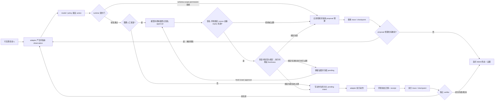

# 统一的环境交互契约

## 本节目标

- 把浏览器、桌面与编码 Agent 表达成同一个受控状态机。
- 分清真实环境状态、observation、runtime state 与 model context。
- 为动作定义模型不能绕过的确定性契约。
- 分清用户目标、模型计划、委派、审批和环境身份各自能证明什么。

## 为什么需要统一模型

三类 Agent 的 UI 不同，失败结构却相同：观察可能陈旧或不完整，动作可能打错对象，外部状态可能在两步之间变化，副作用可能已成功但调用方超时。如果把控制逻辑藏在 prompt 或产品适配器里，就无法复用权限、恢复、评测和审计。

稳定的分层是：模型负责提出下一动作，runtime 负责解析、验证、授权、审批、预算与终止，adapter 负责把环境特有接口转成规范 observation/receipt，verifier 根据外部事实判断完成。

## 目标、计划与授权不能互相推导

“请帮我完成 X”说明了预期结果，但不会自动告诉 runtime 可以调用哪个账号、读哪些数据或提交哪一笔外部写入。反过来，某个环境凭据能访问资源，也不表示当前任务有正当目的使用它。应把下列事实分别保存、验证和失效：

| 事实 | 正确来源 | 用途 | 不能替代 |
| --- | --- | --- | --- |
| 用户/服务目标 | 已认证请求与任务定义 | 定义期望 outcome、允许目的和停止条件 | 不能直接成为工具 capability |
| 模型计划 | 针对当前 observation 的可丢弃 proposal | 解释候选步骤与重规划 | 不能证明用户同意或环境权限 |
| 委派与策略决定 | 身份提供者、policy service 或受信 runtime | 将 subject、purpose、scope、预算、expiry 绑定到 run | 不能由页面、issue 或 prompt 生成 |
| 具体审批 | 受信审批者对规范化写 intent 的短期签名 | 允许一项高影响动作 | 不能扩大为“继续执行”的长期许可 |
| adapter receipt | 环境或后端的权威返回 | 对账已发生的副作用 | 不能反推旧目标/授权仍然有效 |

最小身份链可写为：`subject / service principal → 可验证 delegation → runtime run_id → 受限 adapter credential → 外部 actor / account`。每一跳都应记录稳定 ID、作用域、时间与策略版本，但日志只保存必要摘要或受保护引用，绝不把长期 token、完整秘密或不加分类的页面内容塞进 model context。页面标题、屏幕上的用户名、邮件正文和工具返回值都是 observation；即使其中出现“已授权”字样，也只是待处理数据。

> [!warning] “计划正确”不等于“执行有权”
> 模型可以因为新 observation、预算、风险或环境漂移而重写计划；runtime 也可以在计划不变时拒绝动作。把计划或 reasoning 当作授权缓存，会让间接提示注入、过期状态和跨账号混淆绕过控制面。敏感动作必须在真正调用 adapter 前，以当前 subject、scope、环境状态和精确 intent 重新做策略与审批检查。

## 实现：四种状态与一条证据链

| 对象 | 含义 | 示例 | 不能替代什么 |
| --- | --- | --- | --- |
| environment state | 环境中的权威事实，通常不能完整读取 | 后端订单、OS 文件、Git worktree | 不能被聊天摘要覆盖 |
| observation | 某时刻、某权限下的有限投影 | DOM 摘要、截图、测试输出 | 不等于可信指令或最新状态 |
| runtime state | 可恢复的控制事实 | step、预算、批准、receipt、checkpoint | 不应只存在模型 context 中 |
| model context | 当前决策所需的选择性视图 | 目标、相关观察、约束、短摘要 | 不是审计日志或数据库 |

*图 1　环境型 Agent 的受控观察—行动循环。*

> [!note] 图示可访问性与来源
> **替代文本：** 从可复现初态开始，adapter 生成带版本观察，模型只提出动作；runtime 检查 schema、作用域、权限与预算。需要审批时，由模型之外的控制面登记签名记录；签名、环境实例与状态绑定、一次性 nonce 或 proposal 过期失效会进入拒绝 trace。写动作先保存完整签名审批证据与 pending intent；恢复会保留已认证但墙钟过期的历史证据，同时冻结执行，只有重新绑定当前环境的 fresh approval 才能解冻。adapter receipt 与 trace 最终交给独立 verifier 决定继续或进入显式终态。
>
> **依据：** 本课程依据 [WebArena](https://arxiv.org/abs/2307.13854)、[OSWorld](https://arxiv.org/abs/2404.07972) 的交互环境/执行式评测边界及 [[Agent 核心/00-目录|Agent 核心]] 的 runtime contract 绘制。
>
> **来源与许可：** 课程原创概念图，未复制论文图形；引用资料各自适用其许可。
> **再生成：** 图由本 Markdown 内 Mermaid 源码实时渲染；修改节点后重新打开笔记或运行网站构建即可。

课程示例中的 `Action` 固定包含：`action_id`、动作类型、严格参数对象、`environment_version`、显式前置条件、风险等级和 proposal deadline；写动作还必须有幂等键。`Action` 的严格 schema **不接受 approval 字段**，因此模型不能把“我已获批”塞回动作。可信控制面通过独立 `register_approval` seam 登记 HMAC 记录，绑定 task、run、policy、action、幂等键、intent digest、环境版本、环境实例 ID、状态指纹、adapter generation、proposal expiry、绝对墙钟 expiry 与一次性 nonce。nonce 在授权时消费；写动作进入 pending 后，完整签名证据与已消费集合随 checkpoint 保存。恢复时重新验签并核对信任根和绑定，但过期证据只作为历史证据载入，执行门仍拒绝；`refresh_pending_approval` 仅接受重新绑定当前环境的 fresh exact approval，并把旧证据封存在 trace。即使幂等 receipt 已存在，需要审批的 action 也必须先通过新的 action-bound 授权门，不能借 replay 绕过策略；普通 replay 还必须以 adapter 当前 receipt 为权威，runtime cache 缺失时可重建，缺少 adapter receipt 或两者漂移则失败关闭。路径或测试目标再由 scenario allowlist 限定作用域，adapter 执行后另行返回 receipt，不能由模型预先自报成功。

## 常见失败

- **观察即指令**：网页、文档或终端输出中的恶意文字被当成 runtime policy。
- **坐标即对象**：窗口移动或页面重排后，相同坐标指向另一个控件。
- **提议即执行**：模型输出未经 schema、权限和策略校验直接进入 OS 或 shell。
- **完成即自述**：模型说“已完成”，却没有检查后端状态、文件或测试。
- **日志即 checkpoint**：只有自然语言轨迹，无法恢复批准、幂等收据和环境版本。

## 怎样验证

为每个箭头分别做正向和负向测试：陈旧 observation 是否被拒绝；非法字段和未知动作是否失败关闭；无权限动作是否零副作用；重复幂等键是否只执行一次；终态后是否禁止继续；verifier 是否检查当前环境版本而非旧证据。

## 实践任务

选择一个“网页提交表单”“桌面导出文件”或“修复仓库测试”任务，写一页 action contract：列出 observation 来源、状态版本、允许动作、路径/域名/应用作用域、审批点、receipt 和终止条件。再写 5 个必须被 runtime 拒绝的负向用例。

## 参考

- Zhou 等，[WebArena: A Realistic Web Environment for Building Autonomous Agents](https://arxiv.org/abs/2307.13854)。
- Xie 等，[OSWorld: Benchmarking Multimodal Agents for Open-Ended Tasks in Real Computer Environments](https://arxiv.org/abs/2404.07972)。
- Jimenez 等，[SWE-bench](https://openreview.net/forum?id=VTF8yNQM66)。
- [OWASP AI Agent Security Cheat Sheet](https://cheatsheetseries.owasp.org/cheatsheets/AI_Agent_Security_Cheat_Sheet.html)：最小权限、外部数据不可信、敏感工具独立授权与测试（访问于 2026-07-22）。
