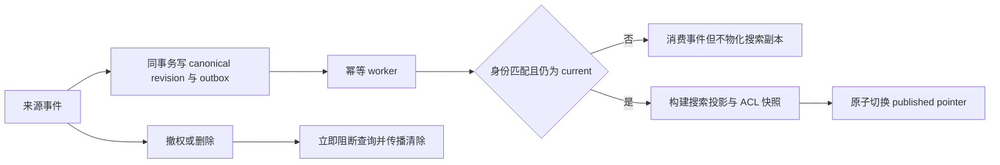

# 知识库构建学习目录

## 知识库简介

面向 AI Agent 的知识库不是“把文件塞进向量数据库”，而是一个持续运行的内容产品：来源可证明、权限可执行、版本可解释、更新和删除能传播、派生索引可重建、发布失败可回滚、质量可量化。

本库从 canonical store（规范事实存储）出发，建立“来源记录 → 版本修订 → 解析/切块/嵌入等派生产物 → 已发布检索投影”的生命周期。具体 Chunking、Embedding 和向量查询留给后续知识库；这里重点回答：什么能入库、哪一版可服务、谁能看到、失败后怎样恢复。

## 在总路线中的位置

先完成 [[文档解析/00-目录|文档解析]]，得到带来源和结构的元素；本库把这些元素纳入可运营的知识生命周期。之后依次学习 [[Chunking策略/00-目录|Chunking 策略]]、[[Embedding/00-目录|Embedding]]、[[向量数据库/00-目录|向量数据库]]、[[语义搜索/00-目录|语义搜索]]、[[Reranking/00-目录|Reranking]] 和 [[RAG/00-目录|RAG]]。

## 学习目标

完成后，你应能：

- 从用户问题、权限、引用和新鲜度要求反推知识对象与 schema；
- 区分业务文档 ID、来源序列、source revision、pipeline revision 和发布版本；
- 设计全量/增量采集、游标、幂等、失败隔离与 transactional outbox；
- 保留来源、处理活动、责任主体与派生关系；
- 让内容更新在新投影成功前继续服务旧版本，同时让 ACL 收紧和删除立即 fail closed；
- 把关键词、向量和图索引视为可重建投影，而非唯一事实；
- 通过墓碑、传播确认、对账和保留策略治理删除；
- 分层评测 ingestion、content、retrieval 和 answer，而不是只看最终回答。

## 前置知识

- 掌握 [[JSON/00-目录|JSON]]、[[API/00-目录|API]] 与 SQLite 基础；
- 理解 [[文档解析/00-目录|文档解析]] 的源哈希、元素和质量门禁；
- 会运行 Python 3.11+ 标准库测试；不要求先会向量数据库。

## 推荐学习顺序

1. [[知识库构建/01-需求边界与Schema|需求、边界与 Schema]]：从用户任务定义 canonical 与派生对象、身份和契约。
2. [[知识库构建/02-采集来源与规范化|采集、来源与规范化]]：设计 connector、增量游标、lineage、幂等和批次门禁。
3. [[知识库构建/03-版本删除与权限|版本、删除与权限]]：安全地发布、撤权、删除、复活与回滚。
4. [[知识库构建/04-索引与增量更新|索引与增量更新]]：用 outbox 驱动可重建投影，并持续对账。
5. [[知识库构建/05-评测运营与增量项目|评测、运营与增量项目]]：运行 SQLite 项目，验证失败发布、ACL 和墓碑传播。

## 动手实践或项目入口

- [[知识库构建/examples/knowledge_store.py|版本化知识库项目]]
- [[知识库构建/examples/test_knowledge_store.py|知识库回归测试]]
- [[知识库构建/examples/source-record.schema.json|来源记录 JSON Schema]]

项目使用 canonical revisions、扁平 ACL 快照、outbox、搜索投影和发布指针。41 项测试验证相同输入 no-op、来源序列乱序拒绝、pipeline 重处理、失败投影保留旧版本、ACL 变化立即阻断、删除墓碑、受控内容清除、输入/候选资源边界、过期事件不物化，以及查询时从 canonical 与 search 的实际正文、ACL 和状态字段重算完整性。worker 在物化前还会验证 event 的 tenant/document 与 revision 一致，且 revision 仍是当前状态；已被更新或删除取代的 event 仍会完成消费，但不会留下搜索副本。在线查询先用 canonical ACL 做候选与 limit 硬过滤，再校验已授权候选的投影正文/ACL；未授权文档不会占用候选窗口，投影单边扩权也不会获得可见性。项目是单进程 SQLite 教学模型，不实现层级/deny/ABAC 权限解析或旧 revision 投影到期清理，也不等于生产身份系统、消息总线、签名证明或物理擦除工具。

## 核心发布不变量

这个图描述的是安全发布关系，不是分布式事务承诺。生产系统仍须定义消息顺序、重试、缓存失效、跨存储删除完成证据与身份提供方的可信边界。

跨 parser element、chunk、index generation、authorization snapshot 与 source-span citation 的目标不变量见[[RAG/09-项目-从来源到引用证据链|来源到引用 reference model]]；实际导入本项目 SQLite revision/outbox/published pointer 的 adapter 见[[RAG/10-项目-跨模块来源适配与发布|跨模块来源适配与原子发布]]；把受保护 revision/parser/chunk/entry 载荷交给另一个消费者，并重新执行 trusted binding、live deny 与 local publish 的边界见[[RAG/11-项目-External-Provenance-Artifact-v2|External Provenance Artifact v2]]。

## 掌握标准

- [ ] 每个知识对象有稳定业务 ID、来源版本/序列、内容哈希、ACL 和生命周期状态。
- [ ] 我能解释 canonical revision、current revision、published revision 和搜索投影的区别。
- [ ] 相同事件可安全重放；旧事件不会覆盖新状态；冲突不会静默处理。
- [ ] 内容更新失败时旧版可继续服务，但 ACL 收紧和删除不会继续暴露旧内容。
- [ ] 删除能传播到 chunk、embedding、关键词/向量投影、缓存和保留策略，并有确认信号。
- [ ] 索引能从 canonical 数据与版本化配置重建，发布前后有数量和抽样对账。
- [ ] 查询在候选生成阶段执行 tenant/ACL 过滤，缓存键包含授权上下文。
- [ ] 查询会把 published pointer 同时连接到 canonical revision 与搜索投影，重算正文/状态 hash 并比较 ACL；不能依赖后台对账稍后发现越权投影。
- [ ] 我能用覆盖率、新鲜度、队列年龄、传播延迟和检索 gold set 验收系统。

## 与其他知识库的关系

- [[文档解析/00-目录|文档解析]]：提供可追溯结构元素，知识库负责其版本与发布。
- [[Chunking策略/00-目录|Chunking 策略]] 与 [[Embedding/00-目录|Embedding]]：是受版本控制的派生步骤。
- [[向量数据库/00-目录|向量数据库]] 与 [[语义搜索/00-目录|语义搜索]]：实现部分检索投影，不应成为唯一事实源。
- [[评测体系/00-目录|评测体系]]：为 ingestion、retrieval 与 answer 建立分层度量。
- [[隐私计算/00-目录|隐私计算]]、[[AI治理/00-目录|AI 治理]]：约束许可、保留、删除、访问与审计。

## 主要参考资料

- [JSON Schema Draft 2020-12](https://json-schema.org/draft/2020-12)
- [W3C PROV-DM](https://www.w3.org/TR/prov-dm/)
- [OWASP Authorization Cheat Sheet](https://cheatsheetseries.owasp.org/cheatsheets/Authorization_Cheat_Sheet.html)
- [NIST SP 800-162: Attribute Based Access Control](https://csrc.nist.gov/pubs/sp/800/162/upd2/final)
- [Microsoft Graph delta query overview](https://learn.microsoft.com/en-us/graph/delta-query-overview)
- [Debezium Outbox Event Router](https://debezium.io/documentation/reference/stable/transformations/outbox-event-router.html)
- [SQLite Transactions](https://www.sqlite.org/lang_transaction.html)
- [SQLite UPSERT](https://www.sqlite.org/lang_upsert.html)
- [SQLite FTS5](https://www.sqlite.org/fts5.html)

来源获取日期：2026-07-22。动态连接器、数据库和授权产品行为应以实施时的官方文档为准。
