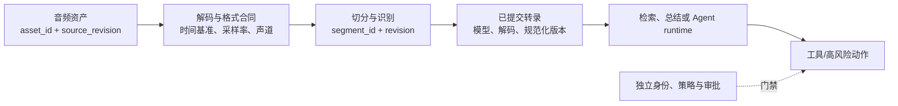

# 语音识别

## 知识库简介

语音识别（Automatic Speech Recognition，ASR）把声音中的语言内容转成文字。Agent 工程中的可用结果通常不只是全文，还包括分段、时间戳、语言、匿名说话人标签、失败原因和音频来源。每次处理应把 `asset_id`、`source_revision`、采集/分析格式、时间基准、模型/解码/规范化版本和 `segment_id + revision` 串成一条证据链；否则“同一段转录”无法复现、纠正或删除。

本知识库面向没有音频或深度学习基础的学习者。动态资料已于 **2026-07-22** 核验；模型命令、支持语言、上传限制和硬件要求会变化，课程不把某个仓库或供应商的当前选项当作永久接口。

## 在总路线中的位置

语音识别位于“扩展应用与复杂协作”阶段，是语音 Agent 的输入通道。识别结果可进入 [[上下文工程/00-目录|上下文工程]]、[[RAG/00-目录|RAG]] 和 [[工作流自动化/00-目录|工作流自动化]]；与 [[语音合成/00-目录|语音合成]] 形成输入/输出模块后，再由 [[实时多模态交互/00-目录|实时多模态交互]] 处理 turn、打断、工具和会话恢复。

图中的转录始终是**不可信的用户输入**：它可用于理解和检索，却不能自行授权工具、副作用或身份判断。实时轮次、打断和动作门禁在 [[实时多模态交互/00-目录|实时多模态交互]] 单独展开。

## 学习目标

- 解释波形、采样率、声道、帧和频谱的最小直觉。
- 区分传统声学/语言模块与端到端 ASR 的职责和边界。
- 设计 VAD、分段、时间戳、说话人和后处理数据契约。
- 区分原始采集格式、模型分析格式与输出字幕/转录格式，并声明时间坐标和修订语义。
- 正确计算 WER/CER，并按环境、语言或群体切片检查质量差异。
- 比较批处理与流式架构，设计背压、未知终态、隐私与人工复核。
- 完成一个完全离线的合成转录评估项目。

## 前置知识

- 建议先学 [[Python基础/00-目录|Python 基础]]、[[JSON/00-目录|JSON]]、[[概率统计/00-目录|概率统计]]。
- 不要求信号处理基础；公式只服务于采样和评测直觉。

## 推荐学习顺序

1. [[语音识别/01-基础与数据/01-声音数字化与ASR全流程|声音数字化与 ASR 全流程]]：认识波形、采样和输出契约。
2. [[语音识别/01-基础与数据/02-声学语言与端到端直觉|声学、语言与端到端直觉]]：理解不同模型路线在做什么。
3. [[语音识别/01-基础与数据/03-数据标注与切分|数据标注与切分]]：建立转写规则和无泄漏数据集。
4. [[语音识别/02-工程与质量/04-VAD分段时间戳与说话人|VAD、分段、时间戳与说话人]]：把连续会议变成可用片段。
5. [[语音识别/02-工程与质量/05-批处理流式与后处理|批处理、流式与后处理]]：设计实时/离线服务和稳定文本层。
6. [[语音识别/02-工程与质量/06-WER-CER与切片评测|WER、CER 与切片评测]]：用一致规则度量错误。
7. [[语音识别/02-工程与质量/07-公平隐私部署与排查|公平、隐私、部署与排查]]：覆盖数据边界和群体差异。
8. [[语音识别/03-项目与自测/08-项目-离线转录评估|项目：离线转录评估]]：运行夹具评测并解释报告。

## 动手实践或项目入口

- 主项目：[[语音识别/03-项目与自测/08-项目-离线转录评估|离线转录评估]]。
- 项目资产：[[语音识别/03-项目与自测/examples/evaluate_transcript.py|评测脚本]]、[[语音识别/03-项目与自测/examples/asr_fixture.json|合成转录夹具]]、[[语音识别/03-项目与自测/examples/test_contract_and_cli.py|合同与 CLI 回归测试]]。
- 项目不读取或生成音频，不下载模型，不需要密钥；它只验证合成的格式/时间基准元数据和已提交转录，不能证明真实媒体的编码、音质或识别质量。

## 掌握标准

- [ ] 能解释采样率、声道、帧、VAD 和说话人分离的含义。
- [ ] 能区分“识别内容”“谁在说话”“说话人身份确认”三个问题。
- [ ] 能为流式识别定义 partial/final 结果与撤回规则。
- [ ] 能手算 WER/CER，并说明规范化、分词和切片对指标的影响。
- [ ] 能设计不记录原始音频正文的运行指标和受控调试流程。
- [ ] 能运行项目、定位时间戳/文本问题，并增加一个匿名切片。

## 与其他知识库的关系

- 音频与图像的联合输入见 [[多模态AI/00-目录|多模态 AI]]。
- 流式 ASR 如何进入可打断的对话状态机、与 TTS 和工具调用关联，见 [[实时多模态交互/00-目录|实时多模态交互]]。
- ASR 文本的清洗、切分和检索分别连接 [[数据清洗/00-目录|数据清洗]]、[[Chunking策略/00-目录|Chunking 策略]] 和 [[语义搜索/00-目录|语义搜索]]。
- 指标门禁和线上告警连接 [[评测体系/00-目录|评测体系]] 与 [[运行监控/00-目录|运行监控]]。

## 主要参考资料

以下资料于 **2026-07-22** 核验：

- [OpenAI Whisper 官方仓库](https://github.com/openai/whisper)（用于理解离线模型、依赖与格式转换的一个实现；当前 README 与模型表应在实际安装前重新核对）
- [Robust Speech Recognition via Large-Scale Weak Supervision（Whisper 原始论文）](https://arxiv.org/abs/2212.04356)
- [OpenAI Speech to text 指南](https://developers.openai.com/api/docs/guides/speech-to-text)（当前产品快照：有界文件转录与实时转录是不同路径；不构成本课程的通用接口合同）
- [NIST OpenASR 2020 Evaluation Plan](https://www.nist.gov/system/files/documents/2021/08/03/OpenASR20_EvalPlan_v1_5.pdf)
- [NIST SCTK 官方仓库](https://github.com/usnistgov/SCTK)（仓库 README 标示 SCTK 2.4.12）
- [Python `wave` 标准库文档](https://docs.python.org/3/library/wave.html)（仅支持未压缩 PCM WAVE）
- [NIST AI Risk Management Framework](https://www.nist.gov/itl/ai-risk-management-framework)

> [!note] 事实与建议的边界
> Whisper、云端转录 API 和实时会话都只是具体实现。关于资产链、切片、日志和复核是本项目的工程建议，需用你的语言、设备、场景、预算与合规要求验证；没有任何模型或转录文本能单独证明说话人的现实身份或同意。
