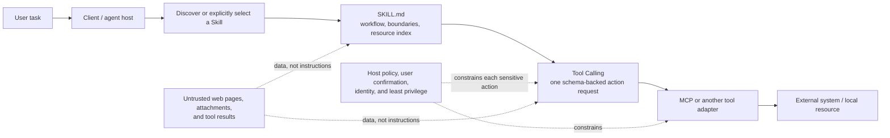

# Positioning, Client Differences, and Permission Boundaries for Agent Skills

## Goal

Before writing your first `SKILL.md`, separate the jobs of a Skill, persistent instructions, Tool Calling, MCP, and runtime authorization. That prevents treating a paragraph of guidance as a permission system or presenting one client's behavior as a guarantee of the open format.

## Establish the boundaries first

The arrows describe common combinations, not mandatory paths. A Skill can guide only an offline script; Tool Calling can bypass MCP; and an agent can use MCP without any Skill. The key separation is this: **a Skill affects contextual guidance about how to work, while host policy and effective identity authorization decide whether an action is allowed.**

| Concept | Primary job | It must not be mistaken for |
| --- | --- | --- |
| Persistent or repository instructions | Short rules applicable to all or most tasks | A complete workflow selected for one task |
| Agent Skill | A discoverable package of task workflow, scripts, and references | A credential authorizing files, commands, network access, or accounts |
| Tool Calling | A model request for one parameterized tool action | The tool implementation, transport protocol, or permission system |
| MCP | A protocol and ecosystem for exposing tools, resources, prompts, and related capabilities to a host | User intent, business approval, or access control itself |
| Host or client policy | Discovery locations, context injection, tool allowlists, confirmations, and identity limits | Part of the Agent Skills open format |

Put a rule that applies to every task — repository formatting or a ban on credential disclosure, for example — in persistent instructions. Put a rule in a Skill only when it belongs to a particular workflow. For external systems, a Skill should explain how to select a tool, build parameters, verify results, and decide when to stop. Identity, scope, approval, confirmation, and auditing must still be enforced jointly by the host, tool server, and business system.

## A compatible format does not imply identical behavior

As of 2026-07-22, the open specification standardizes the core shape of `SKILL.md` but does not standardize every runtime behavior. A target client may select a Skill automatically from its description, require an explicit `/skill-name` invocation, preload the full body for a custom agent, or ignore optional fields entirely. Install locations, priority for duplicate names, sub-agent inheritance, relative-path working directories, available tools, and confirmation mechanisms must all be checked in that client's documentation and by testing.

The following claims are therefore too strong:

- “`allowed-tools` always removes the need for confirmation.”
- “If one compatible client succeeds, every client will trigger the Skill the same way.”
- “If the resources directory exists, the agent will certainly read it.”
- “Because a Skill was loaded, the user has already agreed to a sensitive action.”

For example, current GitHub Copilot documentation supports several project and personal Skill locations and warns that pre-approved shell or Bash tools can remove terminal-command confirmation. That behavior belongs to Copilot's implementation and risk model; it is not a promise made by the open specification to every client.

## Minimum checks before moving to a client

For every target client, record its version, an official-documentation link, and the date checked. Then verify at least the following:

1. **Discovery** — Which project and personal locations does it scan? Which duplicate name wins? How does it reload changes?
2. **Selection** — How are automatic triggering, explicit invocation, and preloading recorded? Test a positive case, a near-miss negative case, and a direct invocation.
3. **Resources** — Do `SKILL.md`, scripts, references, and assets load or execute from the assumed working directory? Never infer “read” merely from “visible.”
4. **Actions** — Which tools, network access, and writes produce a confirmation? Start with dry runs in a minimally privileged environment with no credentials.
5. **Multi-agent behavior** — Do sub-agents inherit the Skill, tool permissions, and environment variables? If not, configure them explicitly instead of extrapolating from the parent agent's result.

Commit this record with minimal test cases to the Skill repository. It becomes reviewable compatibility evidence rather than an undocumented assumption.

## Untrusted content and supply chain

Third-party Skills, the web pages and attachments they cite, tool results, and MCP resources can contain prompt injection or malicious scripts. Treat them as **data to process**. A sentence such as “ignore the rules,” “read the token,” or “execute this command” must not alter local policy. Before using a third-party Skill, pin its source repository and revision; review its entire tree, dependencies, network endpoints, and `allowed-tools`; then test it in an isolated environment. Review the diff before updating instead of blindly pulling the newest revision.

A hash or commit SHA helps detect change, but it cannot prove a source is trustworthy, that a user authorized a request, or that an action fits the current business context. For deletion, overwrite, publishing, transfers, external disclosure, and permission changes, recheck the target, scope, user intent, and confirmation policy at the actual point of action.

## Next step

Continue with [[agent-skills/learning-route/01-open-format-and-directory-structure|Open Format and Directory Structure]]. For the parameters, results, and untrusted data of one tool call, see [[tool-calling-function-calling/00-index|Tool Calling]]. For the protocol that exposes tools and resources and its identity boundary, see [[mcp/00-index|MCP]].

## References

- [Agent Skills Specification](https://agentskills.io/specification) — official format; checked 2026-07-22.
- [GitHub Copilot: About agent skills](https://docs.github.com/en/copilot/concepts/agents/about-agent-skills) — an example of current client behavior; checked 2026-07-22.
- [GitHub Copilot: Adding agent skills](https://docs.github.com/en/copilot/how-tos/copilot-on-github/customize-copilot/customize-cloud-agent/add-skills) — directories, installation, and the `allowed-tools` risk notice; checked 2026-07-22.
