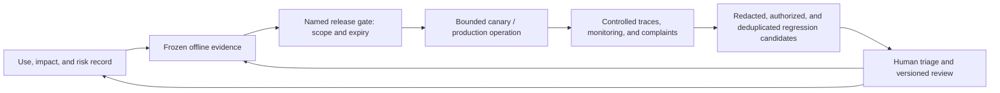

# Documentation, Transparency, and Traceable Evidence

## Goal of this lesson

Give different audiences information they can act on, and make a result traceable to the system, data, configuration, people, and decisions that existed at the time. Transparency does not mean publishing all source code; documentation does not mean filling out a template and leaving it on a shelf.

## Start with what the audience needs to do

| Audience | Information needed | Purpose |
| --- | --- | --- |
| End users and affected people | That they are interacting with AI, its purpose, major limitations, human channels, and ways to appeal or correct an error | Informed use, avoidance of overreliance, and access to redress |
| Operators | Input boundaries, correct interpretation, situations requiring review, prohibited actions, shutdown, and escalation | Safe operation |
| Owners and approvers | Benefits, impact assessment, tests, residual risk, exceptions, monitoring, and rollback | Evidence-based decisions |
| Engineering and operations | Components and versions, data flows, thresholds, runbooks, and incident evidence | Reproduction, remediation, and change |
| Independent review or regulatory interface | Records, controls, and evidence chain within the applicable scope | Verification of claims and response to inquiries |

“The model is very complex” is not meaningful transparency, and “publish every prompt and log” may disclose security controls, personal data, or trade secrets. Provide the minimum sufficient information for the audience, risk, and applicable obligation.

Transparency, explainability, and traceability are not synonyms. Transparency tells an audience the role, limits, and redress available for AI; explainability supports understanding a particular result or decision; traceability supports reconstructing versions, input sources, controls, and responsibility. None requires retaining or disclosing a model's hidden chain of thought. Production investigation should rely on controlled inputs and sources, structured decisions, tool results, policies, and human records.

## Governance documentation set

- **System card or inventory record**: purpose, boundary, owners, affected people, components, status, and limitations.
- **Data statements and model/component cards**: provenance, suitability, version, evaluation, and known gaps.
- **Impact assessment and risk register**: impact paths, controls, evidence, residual risk, and decisions.
- **Evaluation report**: datasets, metrics, subgroups, failure cases, thresholds, environment, and the limits of generalization.
- **Approval and exception record**: exact version approved, conditions, expiry, approver, and review triggers.
- **Change log**: who changed what, when and why, and the validation, release, and rollback outcome.
- **User information and operating manual**: appropriate use, human oversight, complaints, shutdown, and recovery.
- **Incident, hazard, and retirement records**: timeline, impact, evidence, actions, review, and subsequent obligations.

## Traceable runtime records

For each important run, retain enough to reconstruct it: `run_id`, time, trusted identity, system/model/prompt/index/tool version, input-source category, key decisions, human overrides, output or action summary, and error status. Do not retain complete prompts, documents, personal data, keys, or model chain of thought by default. Use references, hashes, redacted summaries, and a controlled evidence store to meet investigation needs.

Evidence needs integrity, access control, retention periods, and deletion rules. A hash proves only byte equality, not that the content is correct; the presence of a log does not make an action appropriate. Periodically trace backward from a user complaint to verify that every version and owner can truly be found.

## Hand evidence to a release gate without copying production content

Governance artifacts need to carry evidence from offline evaluation into release, operation, and regression, but each stage should carry only the references needed for its responsibility. A minimal handoff set can include:

| Handoff item | Governance question it answers | What it cannot prove on its own |
| --- | --- | --- |
| Immutable release unit and `release_id` | Which combination of code, prompt, retrieval, tools, and policy was reviewed? | That the combination is safe, effective, or compliant |
| Complete offline `evidence_sha256` | Which suite/dataset/rubric/grader/harness version supports the conclusion? | That the evidence source, approver, or content is authentic or correct |
| Gate decision, conditions, expiry, and `candidate_gate_evidence_sha256` | Who allowed this release to enter canary or production, and within what scope? | That expansion is permitted indefinitely or that runtime authorization is replaced |
| Controlled trace/log references, time window, and monitoring summary | Can online observations be traced back to the release and gate? | That raw prompts, user inputs, or tool results should be retained broadly |

Production signals may create regression candidates only after redaction, permission checks, deduplication, and human review. They must not automatically modify a frozen evaluation set, scoring threshold, or release conclusion. A complete SHA-256 is useful for controlled handoff and change detection, not as a signature or access token; high-cardinality or personal-data-bearing values must not be metric labels. For the complete lifecycle contract and offline-project boundary, see [[evaluation-framework/methods-and-quality/08-offline-to-online-evidence-handoff-and-regression-loop|Offline-to-Online Evidence Handoff and the Regression Loop]].

### Evidence loop: observation proposes a candidate; people change the baseline

*Figure 1. Governance evidence loop (original synthesis). Runtime observation can propose a candidate for review, but never rewrites the risk register, evaluation baseline, or release conclusion on its own. Only after named people review a new versioned artifact may a candidate feed back into risk and offline evidence.*

## Aligning claims and evidence

Break statements such as “the system is fair, safe, and explainable” into verifiable claims: for whom, in which environment, with which metric and threshold, tested by whom, when, and with which failures. When a version or use changes, prior evidence does not automatically carry over.

An external explanation should state AI's role and human responsibility. “The system generates a list of missing materials; staff verify it and it does not decide eligibility” is more actionable than “AI assistance improves efficiency.” If a person merely rubber-stamps output without the time, information, or authority to understand and overturn it, do not describe that as effective human oversight.

## Exercise and self-check

Choose an Agent run and trace backward from a user complaint: can you identify the model, prompt, knowledge source, tool parameters, human decision, and approval conditions that existed at that time? Design a logging approach that remains investigable without retaining raw sensitive text.

- [ ] Can provide different depths of actionable information to different audiences.
- [ ] Every key claim has versioned evidence and an applicability boundary.
- [ ] Can trace an important result without copying secrets and personal data into ordinary logs.
- [ ] Descriptions of human oversight match actual authority, time, and information.

## Next step and source baseline

Continue with [[ai-governance/02-controls-and-governance/05-release-approval-and-change-management|Release Approval and Change Management]]. Sources were accessed on 2026-07-22. See the transparency, explainability, traceability, and accountability principles in the [OECD AI Principles](https://oecd.ai/en/ai-principles), the [NIST AI RMF Core](https://airc.nist.gov/airmf-resources/airmf/5-sec-core/), and [NIST AI 600-1](https://doi.org/10.6028/NIST.AI.600-1). Specific disclosure obligations vary with role, use, and region and must be checked separately.
