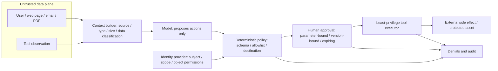

# Assets, Trust Boundaries, and Threat Modeling

## Learning objective

After this lesson, you should be able to draw an Agent as an auditable data flow, distinguish assets, threats, weaknesses, controls, and residual risk, and assign verifiable evidence to every high-risk path.

## What security actually protects

“Make the model more obedient” is not a security goal. Security first protects concrete things:

- **Confidentiality**: private email, keys, and customer data are not visible to unauthorized parties.
- **Integrity**: a knowledge base, memory, tool arguments, and business records cannot be modified silently.
- **Availability**: an attacker cannot disable the service through call loops, oversized input, or resource exhaustion.
- **Human safety and autonomy**: the system must not send email, make payments, or make high-impact decisions for a user without their knowledge.

AI safety, security, privacy, and governance overlap but differ. Security engineering primarily asks whether boundaries remain effective in the face of failure, misuse, or attack. Privacy also asks whether data should be collected and how it is used. Governance determines who may accept risk. No one term covers all of those questions.

## Five basic objects

| Object | Question | Email-drafting Agent example |
| --- | --- | --- |
| Asset | What must not be lost, disclosed, or altered? | Email body, mailbox identity, audit trail |
| Threat actor | Who can cause loss, and what capabilities do they have? | Malicious sender, overprivileged user, compromised connector |
| Trust boundary | At which step does data or permission change its trust level? | Email enters context; model output enters a tool adapter |
| Attack path | How can an attacker reach an asset through multiple steps? | Hidden instruction in email → model selects tool → sensitive data sent out |
| Controls and evidence | Which layer stops it, and how can that be proven? | Tool allowlist, object-level authorization, negative tests, and audit events |

A vulnerability is a weakness that makes a threat path possible. Risk is the potential loss to an asset if that path succeeds. Residual risk is what remains after controls are applied. Do not use these terms interchangeably.

## Build a threat model from scratch

### 1. Freeze the intended use and non-goals

Start with one or two sentences describing the system commitment. For example: “Read one email selected by the user and create a draft; never send automatically.” Then list non-goals: do not scan other email, write long-term memory, or call arbitrary network destinations. The vaguer the intended use, the harder it is to tell whether a capability is excessive.

### 2. List assets and impact

Classifying assets is only a starting point. Also describe the loss: exposing one email, reading across tenants, impersonating a user to send, and losing an audit record affect different people in different ways. Do not merely write “high risk.”

### 3. Draw data and control flows

Include at least the user, model, prompt builder, retrieval or memory, tool adapter, identity provider, external services, logs, and administrators. Label each arrow with data type and direction. Separately mark who determines tool visibility, authorization, and approval. Role text inside model context is not a trusted identity.



*Figure 1. Trust boundaries from untrusted content to an external side effect. Text alternative: external content and tool observations are first classified by source and data type; the model then proposes an action. A deterministic policy combines the real identity with schema, permission, and destination checks. High-impact actions also need parameter-bound, expiring approval. Only then may a least-privilege executor affect an asset. Both denials and execution enter the audit trail. The diagram is synthesized from this lesson's threat paths and the risk-analysis boundaries in NIST AI 600-1 and MITRE ATLAS; its Mermaid source is the regeneration method.*

### 4. Mark trust boundaries

External web pages, email, PDFs, OCR, and tool results can all be untrusted data; model output is likewise an untrusted proposal. A common critical boundary is:

```text
External content ──> Prompt/context ──> Model output ──> Deterministic policy ──> Tool executor
    data plane                              control boundary        permission boundary
```

At each boundary, ask whether source, type, identity, object permission, destination, data classification, and state version are checked. Does failure deny by default?

For every path that can create a side effect, also draw the policy decision point (PDP) and the policy enforcement point (PEP) that actually denies or permits execution. At minimum, an authorization binds trusted-channel facts about the authenticated caller; the delegated user and tenant; the workload identity; the action; object; purpose or environment; and object state or version. The model may propose an action and business arguments, but it must not generate or override those authorization facts. If any fact is absent, expired, or inconsistent, deny or require human review instead of guessing from the prompt.

### 5. Write attack paths, not just vulnerability names

A good path includes preconditions, steps, assets, and an end state:

> A malicious sender places instructions in an email body. The system mixes the body with trusted instructions in one context. The model proposes the send tool. A shared service identity has `mail.send`. The executor does not check user authorization. The email content is sent to an attacker-controlled address.

STRIDE—spoofing, tampering, repudiation, information disclosure, denial of service, and elevation of privilege—can help check for omissions, but cannot replace paths specific to the system. For Agents, explicitly inspect prompt injection, memory or context poisoning, tool abuse, and changes in the model or data supply chain.

### 6. Write verification evidence for controls

“Add a guardrail” is not an acceptance criterion. Replace it with statements such as: external email cannot alter the tool allowlist; an unknown recipient produces a specific denial; an approval token binds normalized parameters and expires after five minutes; a cross-tenant object ID must fail. Every control also needs an owner, status, residual risk, and review trigger.

## Risk-register template

| Field | Example |
| --- | --- |
| Asset and impact | Private email is sent externally, affecting the user and organization |
| Attack path | Untrusted email → context → send tool |
| Preconditions | The Agent can see the send tool and uses a shared identity |
| Preventive controls | Remove the send tool; use a short-lived read-only identity; deny destinations by default |
| Detection and response | Tool-denial events, unusual-destination alerts, emergency shutdown |
| Verification | Indirect-injection negative test, scope diff, approval-replay test |
| Residual risk and owner | The model can still produce an incorrect draft; accepted by the product owner |

## Common mistakes

- Treating the system prompt as a secret or security boundary. It can leak and cannot perform authorization.
- Drawing only the model, not identities, connectors, memory, and the operational control plane.
- Analyzing only malicious users while ignoring poisoned documents, dependencies, or tool output.
- Assigning risk levels without impact statements, or controls without repeatable verification.
- Skipping review of this system's configuration, permissions, and data flows because “the vendor is certified.”

## Exercise and self-check

For an Agent that “reads a shared-drive document and creates a ticket”:

1. Write its intended use and three non-goals.
2. List at least five assets, four trust boundaries, and three types of threat actor.
3. Write one complete path from a malicious document to an unauthorized ticket.
4. Assign one preventive, one detective, and one response control to the path, then write a negative test.

- [ ] Can explain the difference among an asset, vulnerability, threat, risk, and residual risk.
- [ ] Can treat both model output and external content as untrusted input.
- [ ] Can derive the minimum capability from the intended use instead of inferring the use from existing tools.
- [ ] Can give machine-checkable or exercisable evidence for every key control.

## Next step

Continue with [[ai-safety/01-foundations-and-risks/02-prompt-injection-and-indirect-injection|Prompt Injection and Indirect Injection]], then turn attack paths into tool and identity boundaries.

## References

- [NIST AI Risk Management Framework](https://www.nist.gov/itl/ai-risk-management-framework) (accessed 2026-07-21)
- [NIST AI 600-1, Generative AI Profile](https://doi.org/10.6028/NIST.AI.600-1) (published July 2024; accessed 2026-07-21)
- [MITRE ATLAS](https://atlas.mitre.org/) (a continuously updated knowledge base of AI adversarial tactics and techniques; accessed 2026-07-21)
