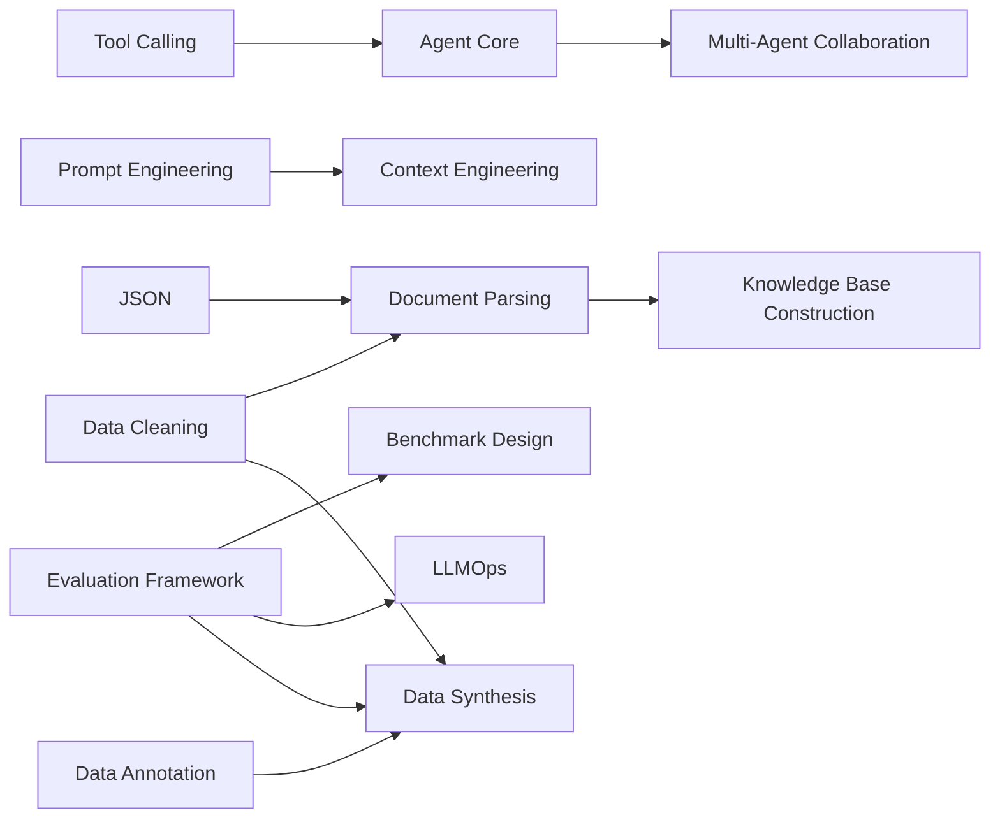
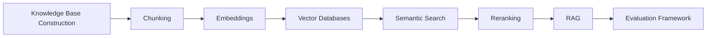
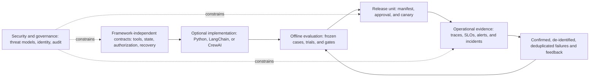

# AI Agent Engineer Learning Roadmap

This is a course map, not a pipeline that everyone must complete from start to finish. Choose a role path by your goal first, then return to the course map for prerequisites. A course is complete when you can deliver and verify its outcome, not merely when you have read its pages.

> [!info] Roadmap status
>
> This roadmap was checked against the current courses, example tests, and public-site rules on 2026-07-21. For volatile material such as protocols, SDKs, model catalogs, and regulation, use each course's `source_checked` date, stable/experimental status, and current official sources.
>
> All 57 top-level courses have been migrated to verifiable v2 IDs, knowledge domains, catalog order, hard prerequisites, and role-track order. The legacy `ai_learning_stage/order` fields now drive only the local, checkable Dataview stage map; the public homepage and course navigation use v2 fields. Personal completion state stays local and is removed from the public build. See [[maintenance-records/learning-route-metadata-v2-standard|Learning Route Metadata v2 Standard]] for the field contract.

## Course map

<!-- AI_LEARNING_CATALOG:START -->
| Knowledge domain | Learning focus |
| --- | --- |
| Engineering and mathematical foundations | [[ai-foundations/00-index\|AI Foundations Learning Path]] · [[python-fundamentals/00-index\|Python Fundamentals]] · [[data-structures/00-index\|Data Structures Fundamentals]] · [[json/00-index\|JSON Learning Index]] · [[api/00-index\|API Learning Path]] · [[markdown/00-index\|Markdown]] · [[git/00-index\|Git Learning Path]] · [[linux-commands/00-index\|Linux Commands]] · [[regular-expressions/00-index\|Regular Expressions]] · [[probability-and-statistics/00-index\|Probability and Statistics]] · [[linear-algebra/00-index\|Linear Algebra]] · [[calculus/00-index\|Calculus Fundamentals]] · [[machine-learning/00-index\|Machine Learning]] · [[deep-learning/00-index\|Deep Learning]] |
| Models and context | [[modern-llm-capabilities-and-model-selection/00-index\|Modern LLM Capabilities and Model Selection]] · [[prompt-engineering/00-index\|Prompt Engineering]] · [[context-engineering/00-index\|Context Engineering Learning Path]] · [[llm-api-integration/00-index\|LLM API Integration Learning Path]] |
| Retrieval and data | [[vector-fundamentals/00-index\|Vector Fundamentals]] · [[data-cleaning/00-index\|Data Cleaning]] · [[data-annotation/00-index\|Data Annotation Learning Path]] · [[document-parsing/00-index\|Document Parsing]] · [[knowledge-base-construction/00-index\|Knowledge Base Construction]] · [[chunking-strategies/00-index\|Chunking Strategies]] · [[embeddings/00-index\|Embeddings]] · [[vector-databases/00-index\|Vector Databases]] · [[semantic-search/00-index\|Semantic Search Learning Path]] · [[reranking/00-index\|Reranking]] · [[rag/00-index\|RAG Learning Path]] |
| Multimodal systems | [[multimodal-ai/00-index\|Multimodal AI Learning Path]] · [[ocr/00-index\|OCR]] · [[speech-recognition/00-index\|Speech Recognition]] · [[text-to-speech/00-index\|Text to Speech]] · [[real-time-multimodal-interaction/00-index\|Real-Time Multimodal Interaction]] · [[image-generation/00-index\|Image Generation Learning Path]] · [[video-generation/00-index\|Video Generation Learning Path]] |
| Agent runtime | [[tool-calling-function-calling/00-index\|Tool Calling (including Function Calling)]] · [[mcp/00-index\|MCP]] · [[agent-core/00-index\|Agent Core]] · [[environmental-agents/00-index\|Environment-based Agents]] · [[agent-skills/00-index\|Agent Skills Learning Path]] · [[agentic-design-patterns/00-index\|Agentic Design Patterns]] · [[workflow-automation/00-index\|Workflow Automation Learning Path]] · [[multi-agent-collaboration/00-index\|Multi-Agent Collaboration Learning Path]] |
| Framework practice | [[langchain/00-index\|LangChain]] · [[crewai/00-index\|CrewAI Learning Index]] |
| Evaluation and reliability | [[data-visualization/00-index\|Data Visualization]] · [[evaluation-framework/00-index\|Evaluation Framework Learning Path]] · [[benchmark-design/00-index\|Benchmark Design Learning Path]] · [[data-synthesis/00-index\|Synthetic Data]] |
| Safety and governance | [[ai-safety/00-index\|AI Safety Learning Path]] · [[privacy-computing/00-index\|Privacy-Enhancing Technologies Learning Path]] · [[ai-governance/00-index\|AI Governance Learning Path]] |
| Production operations | [[mlops/00-index\|MLOps Learning Path]] · [[runtime-monitoring/00-index\|Runtime Monitoring Learning Path]] · [[llmops/00-index\|LLMOps Learning Path]] |
| Frontier and reference | [[a2a/00-index\|A2A Protocol]] |
<!-- AI_LEARNING_CATALOG:END -->

## Four role-based paths

| Path | Suggested progression | Primary learning artifact | Evidence of mastery |
| --- | --- | --- | --- |
| Agent application development | AI foundations → fill engineering foundations as needed → modern LLMs/prompting/context/API → [[#early-safety-and-evaluation-milestone\|early milestone]] → Tool Calling/Agent Core → runtime and frameworks as needed → workflow → data and complete evaluation → LLMOps → safety/privacy → optional multi-agent/A2A | A stateful, approvable, recoverable single agent | Offline tests cover authorization, idempotency, termination, adversarial observations, and failure recovery; can explain when to fall back to a deterministic workflow |
| RAG and knowledge bases | AI foundations → LLM application foundations → [[#early-safety-and-evaluation-milestone\|early milestone]] → data quality/document parsing/knowledge bases → chunking/vectors/embeddings/retrieval/reranking → RAG → visualization and complete evaluation → safety/privacy; multimodal ingestion and LangChain are optional branches | A two-pipeline RAG system with ACLs, citations, updates, and diagnosable failures | Reports ingestion, retrieval, generation, and end-to-end metrics separately; can trace an error sample to the responsible layer |
| Agent platform and reliability | AI foundations → LLMs and Agent Core → runtime/frameworks as needed → workflow → data quality/evaluation/synthesis/benchmarking → MLOps/LLMOps/monitoring → safety/privacy/governance → multi-agent collaboration → A2A interoperability as needed | An operating platform with traces, release gates, canaries, rollback, and incident drills | Repeated trials have comparable initial and final state; side effects, cost, latency, safety, and recovery all have gates and audit evidence |
| Multimodal and real-time interaction | AI foundations → modern LLMs → multimodal AI → OCR (recommended) and ASR/TTS (core) → Tool Calling/Agent Core → data and real-time interaction → complete evaluation/safety/privacy → optional generative media and multi-agent systems | An interruptible real-time prototype that can call tools and retain conversational state | Measures time to first token/audio and turn latency, interruption success, and recovery; can explain the trade-offs between cascaded and end-to-end speech designs |

The table is a readable summary. The v2 list below is the verifiable snapshot of each course's order and core/recommended/optional placement. An arrow means recommended progression, not that every intermediate course must be completed in full. The [[#early-safety-and-evaluation-milestone|early safety and evaluation milestone]] is a small early quality gate assembled from existing chapters, not an invented course, and it does not require completing all of AI Safety or the evaluation framework in advance. Before production release, still complete the remaining safety, evaluation, and governance work proportionate to system risk. Add MCP only when you need standardized connections to external capabilities or context; add A2A only when independent agent applications need cross-framework or cross-organization interoperability. Choose LangChain/LangGraph, CrewAI, or ordinary Python from state, recovery, collaboration, and control needs; none is a hard prerequisite for every project.

## Machine-verifiable role paths

The following list is generated from the v2 track metadata at the 57 course entries and is checked byte-for-byte in the public build. Order expresses learning progression in the role path; recommended and optional do not automatically become full-course hard prerequisites.

<!-- AI_LEARNING_ROLE_TRACKS:START -->
### Agent application development

32 courses: 9 core, 13 recommended, and 10 optional.

| Order | Course | Placement |
| ---: | --- | --- |
| 1 | [[ai-foundations/00-index\|AI Foundations Learning Path]] | Core |
| 2 | [[python-fundamentals/00-index\|Python Fundamentals]] | Recommended |
| 3 | [[json/00-index\|JSON Learning Index]] | Recommended |
| 4 | [[data-structures/00-index\|Data Structures Fundamentals]] | Recommended |
| 5 | [[api/00-index\|API Learning Path]] | Recommended |
| 6 | [[markdown/00-index\|Markdown]] | Recommended |
| 7 | [[git/00-index\|Git Learning Path]] | Recommended |
| 8 | [[linux-commands/00-index\|Linux Commands]] | Optional |
| 9 | [[regular-expressions/00-index\|Regular Expressions]] | Optional |
| 10 | [[probability-and-statistics/00-index\|Probability and Statistics]] | Recommended |
| 11 | [[machine-learning/00-index\|Machine Learning]] | Recommended |
| 12 | [[modern-llm-capabilities-and-model-selection/00-index\|Modern LLM Capabilities and Model Selection]] | Core |
| 13 | [[prompt-engineering/00-index\|Prompt Engineering]] | Core |
| 14 | [[context-engineering/00-index\|Context Engineering Learning Path]] | Core |
| 15 | [[llm-api-integration/00-index\|LLM API Integration Learning Path]] | Core |
| 16 | [[tool-calling-function-calling/00-index\|Tool Calling (including Function Calling)]] | Core |
| 17 | [[agent-core/00-index\|Agent Core]] | Core |
| 18 | [[mcp/00-index\|MCP]] | Optional |
| 19 | [[environmental-agents/00-index\|Environment-based Agents]] | Optional |
| 20 | [[agent-skills/00-index\|Agent Skills Learning Path]] | Optional |
| 21 | [[agentic-design-patterns/00-index\|Agentic Design Patterns]] | Optional |
| 22 | [[langchain/00-index\|LangChain]] | Optional |
| 23 | [[crewai/00-index\|CrewAI Learning Index]] | Optional |
| 24 | [[workflow-automation/00-index\|Workflow Automation Learning Path]] | Core |
| 25 | [[data-annotation/00-index\|Data Annotation Learning Path]] | Recommended |
| 26 | [[data-visualization/00-index\|Data Visualization]] | Recommended |
| 27 | [[evaluation-framework/00-index\|Evaluation Framework Learning Path]] | Recommended |
| 28 | [[llmops/00-index\|LLMOps Learning Path]] | Recommended |
| 29 | [[ai-safety/00-index\|AI Safety Learning Path]] | Core |
| 30 | [[privacy-computing/00-index\|Privacy-Enhancing Technologies Learning Path]] | Recommended |
| 31 | [[multi-agent-collaboration/00-index\|Multi-Agent Collaboration Learning Path]] | Optional |
| 32 | [[a2a/00-index\|A2A Protocol]] | Optional |

### RAG and knowledge bases

35 courses: 17 core, 12 recommended, and 6 optional.

| Order | Course | Placement |
| ---: | --- | --- |
| 1 | [[ai-foundations/00-index\|AI Foundations Learning Path]] | Core |
| 2 | [[python-fundamentals/00-index\|Python Fundamentals]] | Recommended |
| 3 | [[json/00-index\|JSON Learning Index]] | Core |
| 4 | [[data-structures/00-index\|Data Structures Fundamentals]] | Optional |
| 5 | [[api/00-index\|API Learning Path]] | Recommended |
| 6 | [[markdown/00-index\|Markdown]] | Recommended |
| 7 | [[git/00-index\|Git Learning Path]] | Recommended |
| 8 | [[linux-commands/00-index\|Linux Commands]] | Optional |
| 9 | [[regular-expressions/00-index\|Regular Expressions]] | Recommended |
| 10 | [[probability-and-statistics/00-index\|Probability and Statistics]] | Recommended |
| 11 | [[linear-algebra/00-index\|Linear Algebra]] | Recommended |
| 12 | [[machine-learning/00-index\|Machine Learning]] | Recommended |
| 13 | [[modern-llm-capabilities-and-model-selection/00-index\|Modern LLM Capabilities and Model Selection]] | Core |
| 14 | [[prompt-engineering/00-index\|Prompt Engineering]] | Core |
| 15 | [[context-engineering/00-index\|Context Engineering Learning Path]] | Core |
| 16 | [[llm-api-integration/00-index\|LLM API Integration Learning Path]] | Core |
| 17 | [[multimodal-ai/00-index\|Multimodal AI Learning Path]] | Optional |
| 18 | [[data-cleaning/00-index\|Data Cleaning]] | Core |
| 19 | [[ocr/00-index\|OCR]] | Optional |
| 20 | [[speech-recognition/00-index\|Speech Recognition]] | Optional |
| 21 | [[document-parsing/00-index\|Document Parsing]] | Core |
| 22 | [[knowledge-base-construction/00-index\|Knowledge Base Construction]] | Core |
| 23 | [[chunking-strategies/00-index\|Chunking Strategies]] | Core |
| 24 | [[vector-fundamentals/00-index\|Vector Fundamentals]] | Recommended |
| 25 | [[embeddings/00-index\|Embeddings]] | Core |
| 26 | [[vector-databases/00-index\|Vector Databases]] | Core |
| 27 | [[semantic-search/00-index\|Semantic Search Learning Path]] | Core |
| 28 | [[data-annotation/00-index\|Data Annotation Learning Path]] | Recommended |
| 29 | [[reranking/00-index\|Reranking]] | Core |
| 30 | [[rag/00-index\|RAG Learning Path]] | Core |
| 31 | [[data-visualization/00-index\|Data Visualization]] | Recommended |
| 32 | [[langchain/00-index\|LangChain]] | Optional |
| 33 | [[evaluation-framework/00-index\|Evaluation Framework Learning Path]] | Core |
| 34 | [[ai-safety/00-index\|AI Safety Learning Path]] | Core |
| 35 | [[privacy-computing/00-index\|Privacy-Enhancing Technologies Learning Path]] | Recommended |

### Agent platform and reliability

38 courses: 14 core, 16 recommended, and 8 optional.

| Order | Course | Placement |
| ---: | --- | --- |
| 1 | [[ai-foundations/00-index\|AI Foundations Learning Path]] | Core |
| 2 | [[python-fundamentals/00-index\|Python Fundamentals]] | Recommended |
| 3 | [[json/00-index\|JSON Learning Index]] | Recommended |
| 4 | [[data-structures/00-index\|Data Structures Fundamentals]] | Recommended |
| 5 | [[api/00-index\|API Learning Path]] | Recommended |
| 6 | [[markdown/00-index\|Markdown]] | Recommended |
| 7 | [[git/00-index\|Git Learning Path]] | Recommended |
| 8 | [[linux-commands/00-index\|Linux Commands]] | Recommended |
| 9 | [[regular-expressions/00-index\|Regular Expressions]] | Optional |
| 10 | [[probability-and-statistics/00-index\|Probability and Statistics]] | Recommended |
| 11 | [[machine-learning/00-index\|Machine Learning]] | Recommended |
| 12 | [[modern-llm-capabilities-and-model-selection/00-index\|Modern LLM Capabilities and Model Selection]] | Core |
| 13 | [[prompt-engineering/00-index\|Prompt Engineering]] | Core |
| 14 | [[context-engineering/00-index\|Context Engineering Learning Path]] | Core |
| 15 | [[llm-api-integration/00-index\|LLM API Integration Learning Path]] | Core |
| 16 | [[tool-calling-function-calling/00-index\|Tool Calling (including Function Calling)]] | Core |
| 17 | [[agent-core/00-index\|Agent Core]] | Core |
| 18 | [[mcp/00-index\|MCP]] | Optional |
| 19 | [[environmental-agents/00-index\|Environment-based Agents]] | Optional |
| 20 | [[agent-skills/00-index\|Agent Skills Learning Path]] | Optional |
| 21 | [[agentic-design-patterns/00-index\|Agentic Design Patterns]] | Optional |
| 22 | [[langchain/00-index\|LangChain]] | Optional |
| 23 | [[crewai/00-index\|CrewAI Learning Index]] | Optional |
| 24 | [[workflow-automation/00-index\|Workflow Automation Learning Path]] | Core |
| 25 | [[data-cleaning/00-index\|Data Cleaning]] | Recommended |
| 26 | [[data-annotation/00-index\|Data Annotation Learning Path]] | Recommended |
| 27 | [[data-visualization/00-index\|Data Visualization]] | Recommended |
| 28 | [[evaluation-framework/00-index\|Evaluation Framework Learning Path]] | Core |
| 29 | [[data-synthesis/00-index\|Synthetic Data]] | Recommended |
| 30 | [[benchmark-design/00-index\|Benchmark Design Learning Path]] | Core |
| 31 | [[mlops/00-index\|MLOps Learning Path]] | Recommended |
| 32 | [[llmops/00-index\|LLMOps Learning Path]] | Core |
| 33 | [[runtime-monitoring/00-index\|Runtime Monitoring Learning Path]] | Core |
| 34 | [[ai-safety/00-index\|AI Safety Learning Path]] | Core |
| 35 | [[privacy-computing/00-index\|Privacy-Enhancing Technologies Learning Path]] | Recommended |
| 36 | [[ai-governance/00-index\|AI Governance Learning Path]] | Core |
| 37 | [[multi-agent-collaboration/00-index\|Multi-Agent Collaboration Learning Path]] | Recommended |
| 38 | [[a2a/00-index\|A2A Protocol]] | Optional |

### Multimodal and real-time interaction

29 courses: 10 core, 13 recommended, and 6 optional.

| Order | Course | Placement |
| ---: | --- | --- |
| 1 | [[ai-foundations/00-index\|AI Foundations Learning Path]] | Core |
| 2 | [[python-fundamentals/00-index\|Python Fundamentals]] | Recommended |
| 3 | [[json/00-index\|JSON Learning Index]] | Recommended |
| 4 | [[data-structures/00-index\|Data Structures Fundamentals]] | Optional |
| 5 | [[api/00-index\|API Learning Path]] | Recommended |
| 6 | [[markdown/00-index\|Markdown]] | Recommended |
| 7 | [[git/00-index\|Git Learning Path]] | Recommended |
| 8 | [[linux-commands/00-index\|Linux Commands]] | Optional |
| 9 | [[regular-expressions/00-index\|Regular Expressions]] | Optional |
| 10 | [[probability-and-statistics/00-index\|Probability and Statistics]] | Recommended |
| 11 | [[linear-algebra/00-index\|Linear Algebra]] | Recommended |
| 12 | [[machine-learning/00-index\|Machine Learning]] | Recommended |
| 13 | [[deep-learning/00-index\|Deep Learning]] | Recommended |
| 14 | [[modern-llm-capabilities-and-model-selection/00-index\|Modern LLM Capabilities and Model Selection]] | Core |
| 15 | [[multimodal-ai/00-index\|Multimodal AI Learning Path]] | Core |
| 16 | [[ocr/00-index\|OCR]] | Recommended |
| 17 | [[speech-recognition/00-index\|Speech Recognition]] | Core |
| 18 | [[text-to-speech/00-index\|Text to Speech]] | Core |
| 19 | [[tool-calling-function-calling/00-index\|Tool Calling (including Function Calling)]] | Core |
| 20 | [[agent-core/00-index\|Agent Core]] | Core |
| 21 | [[data-annotation/00-index\|Data Annotation Learning Path]] | Recommended |
| 22 | [[data-visualization/00-index\|Data Visualization]] | Recommended |
| 23 | [[real-time-multimodal-interaction/00-index\|Real-Time Multimodal Interaction]] | Core |
| 24 | [[evaluation-framework/00-index\|Evaluation Framework Learning Path]] | Core |
| 25 | [[ai-safety/00-index\|AI Safety Learning Path]] | Core |
| 26 | [[privacy-computing/00-index\|Privacy-Enhancing Technologies Learning Path]] | Recommended |
| 27 | [[image-generation/00-index\|Image Generation Learning Path]] | Optional |
| 28 | [[video-generation/00-index\|Video Generation Learning Path]] | Optional |
| 29 | [[multi-agent-collaboration/00-index\|Multi-Agent Collaboration Learning Path]] | Optional |
<!-- AI_LEARNING_ROLE_TRACKS:END -->

## Early safety and evaluation milestone

This milestone reuses only required chapters from existing courses. Before letting a model read untrusted external content, connect to remote capabilities, or execute tools, complete at least this small loop:

| Quality gate | Reused chapters | Completion evidence |
| --- | --- | --- |
| Early safety | [[ai-safety/01-foundations-and-risks/01-assets-trust-boundaries-and-threat-modeling\|Assets, Trust Boundaries, and Threat Modeling]] → [[ai-safety/01-foundations-and-risks/02-prompt-injection-and-indirect-injection\|Prompt Injection and Indirect Injection]] → [[ai-safety/01-foundations-and-risks/03-tool-overreach-and-data-exfiltration\|Tool Overreach and Data Exfiltration]] → [[ai-safety/02-controls-and-governance/04-identity-least-privilege-and-supply-chain\|Identity and Least Privilege]] | A threat model showing untrusted inputs, protected assets, identities, authorization points, and the largest possible side effect |
| Evaluation foundations | [[evaluation-framework/foundations-and-design/01-evaluation-objectives-and-basic-units\|Evaluation Objectives and Basic Units]] → [[evaluation-framework/foundations-and-design/02-cases-datasets-and-stratification\|Cases, Datasets, and Stratification]] → [[evaluation-framework/methods-and-quality/03-deterministic-assertions-metrics-and-scoring-rules\|Deterministic Assertions, Metrics, and Scoring Rules]] | A minimal evaluation card stating the objective, typical/boundary/failure cases, and at least one deterministic assertion |

Completion evidence here only permits a learner to begin controlled practice. It is not production security, comprehensive evaluation, penetration testing, or release approval. The full courses remain [[ai-safety/00-index|AI Safety]] and [[evaluation-framework/00-index|Evaluation Framework]].

## Machine-verifiable hard prerequisites

The following diagram shows only **hard prerequisites at full-course scope**. It does not disguise track recommendation order, the early milestone, or “recommended to learn first” as a dependency. The website build checks prerequisite existence, acyclicity, visibility in the same role, earlier order, and core closure.

| Relationship | Evidence boundary |
| --- | --- |
| [[json/00-index\|JSON]] + [[data-cleaning/00-index\|Data Cleaning]] → [[document-parsing/00-index\|Document Parsing]] | The Document Parsing entry explicitly requires both first; both are core and earlier in the RAG track |
| [[document-parsing/00-index\|Document Parsing]] → [[knowledge-base-construction/00-index\|Knowledge Base Construction]] | The Knowledge Base Construction entry explicitly requires Document Parsing first |
| [[prompt-engineering/00-index\|Prompt Engineering]] → [[context-engineering/00-index\|Context Engineering]] | The Context Engineering entry uses strong “complete first” language; Embeddings/RAG are later connections, not hard prerequisites |
| [[tool-calling-function-calling/00-index\|Tool Calling]] → [[agent-core/00-index\|Agent Core]] | A hard prerequisite for the two Agent main lines and the multimodal tool path |
| [[evaluation-framework/00-index\|Evaluation Framework]] → [[llmops/00-index\|LLMOps]] | A hard prerequisite for LLMOps release gates and regression evidence |
| [[evaluation-framework/00-index\|Evaluation Framework]] → [[benchmark-design/00-index\|Benchmark Design]] | The Benchmark Design entry explicitly requires case, grader, and regression contracts |
| [[data-cleaning/00-index\|Data Cleaning]] + [[data-annotation/00-index\|Data Annotation]] + [[evaluation-framework/00-index\|Evaluation Framework]] → [[data-synthesis/00-index\|Data Synthesis]] | The Data Synthesis entry uses strong “learn first” language; all three are visible and earlier in the platform track |
| [[agent-core/00-index\|Agent Core]] → [[multi-agent-collaboration/00-index\|Multi-Agent Collaboration]] | The multi-agent entry explicitly requires Agent Core first. Workflow is recommended order and individual frameworks are optional |

Every other course uses `hard_prerequisites: []` to mean that page-by-page review found no universal, course-level hard prerequisite. Role tracks then represent recommended progression. All 57 entries have received that decision: “recommended to learn first,” a local capability, or a step that normally comes earlier in a project is not silently upgraded to a full-course dependency.

### RAG role order is not a hard-dependency graph

Chunking, embeddings, vector databases, semantic search, and reranking have been reviewed page by page and included in the RAG track. They have a stable system-integration order, but each course entry only asks learners to review relevant capabilities as needed; courses can be learned independently, implementations can be swapped, and work can proceed in parallel. They are therefore not elevated to hard edges requiring a learner to complete the entire preceding course.

> [!note] Arrows in this diagram represent recommended order in the RAG role path; they do not enter the course-level hard-prerequisite DAG. Real projects often iterate chunking, representation, recall, reranking, and evaluation in parallel, and a learner may enter any one module for specialized engineering.

## Content levels

| Level | Use | Current representative material |
| --- | --- | --- |
| Core courses | Build transferable Agent-engineering contracts; learn first | Modern LLM Capabilities and Model Selection, Prompt Engineering, Context Engineering, LLM APIs, Tool Calling, Agent Core, Evaluation Framework, AI Safety |
| Advanced courses | Choose around role or system boundary | Full RAG pipeline, MCP, Environment-based Agents, Workflow Automation, LLMOps, Runtime Monitoring, multi-agent systems, multimodal and real-time interaction |
| Frontier topics | Record the standards baseline, adoption status, and compatibility strategy; not stable prerequisites | A2A 1.0 is an optional course; MCP extensions and Apps, experimental Tasks, AG-UI, and new benchmark designs remain at the observation layer |
| Practical projects | Turn concepts into runnable evidence | Offline projects, fixtures, negative tests, and evaluation graphs at the end of each course |
| Reference material | Consult as needed without drowning the original learning path | Complete historical Python/deep-learning tutorials, framework and official-documentation reference layers, and specialist material for generative modalities |

## Content provenance and status

This knowledge base uses `content_origin` to distinguish original explanations, curated material, and third-party material, and `content_status` to distinguish validated, dynamic, review-pending, and frozen reference content. A missing field means a historical page has not yet been classified; it **does not** mean original or validated by default. Definitions, license boundaries, and the deep-review process are in [[maintenance-records/content-quality-and-source-labeling-standard|Content Quality and Source Labeling Standard]].

For product/API snapshots in courses, also consult `source_checked`, versions, and actual test reading. Where full third-party reproduction has no public redistribution evidence, preserve it only in the local reference layer and publish a source-notice page instead of the body.

## Learning loop

When completing a course, leave at least five kinds of evidence:

1. A diagram that makes the system boundary, state, or data flow clear, or an equivalent structural explanation.
2. A small but real implementation with explicit inputs, outputs, permissions, and failure semantics.
3. At least one expected-failure case, not merely a successful demo.
4. Reproducible validation commands and a record of their results.
5. A decision boundary explaining when the technology should not be used.

If a course entry has stricter mastery criteria, use those. Frameworks, vendors, and models are implementation examples only; the core judgment should transfer to other implementations.

## Evidence loop from framework to production feedback

A framework is only an optional implementation layer that expresses existing contracts in code: choosing ordinary Python, LangChain, or CrewAI does not remove responsibility for tool authorization, state recovery, evaluation, release, or operations. The diagram shows how a project turns one implementation into a traceable long-term improvement loop. It is not a course-level hard-prerequisite graph and does not imply that any framework automatically supplies security, correctness, or production reliability.

*Figure 3. Evidence loop from framework to production feedback. Text alternative: first define tools, state, authorization, and recovery as framework-independent contracts; then implement with Python or an optional framework. Frozen offline cases, trials, and gates support a traceable release unit. After canary deployment, traces, SLOs, alerts, and incidents supply observation evidence. Only confirmed, de-identified, deduplicated, and versioned failures feed back into evaluation. Security and governance constrain contracts, release, and operations. The Mermaid source is the regeneration method.*

Start the implementation layer with [[tool-calling-function-calling/00-index|Tool Calling]] and [[agent-core/00-index|Agent Core]], then select [[langchain/00-index|LangChain]] or [[crewai/00-index|CrewAI]] by control needs. Learn fields, summaries, and human handoff from evaluation through operations in [[evaluation-framework/methods-and-quality/08-offline-to-online-evidence-handoff-and-regression-loop|Offline-to-Online Evidence Handoff and Regression Loop]], then deepen through [[llmops/00-index|LLMOps]] and [[runtime-monitoring/00-index|Runtime Monitoring]]. [[ai-safety/00-index|AI Safety]] and [[ai-governance/00-index|AI Governance]] constrain the entire chain rather than adding a checklist only at the end of deployment.

## Advanced and research directions

| Direction | When to learn it | Boundary |
| --- | --- | --- |
| Model adaptation and private deployment | Prompting, RAG, tools, and model selection still cannot meet quality, privacy, or cost constraints | Establish task-level evaluation and a reversible baseline before comparing fine-tuning, LoRA, quantization, and inference serving |
| Alignment and reinforcement learning | You need to study preference optimization, model training, or behavior control | Not a prerequisite for ordinary Agent application development |
| Protocol and systems frontier | You can distinguish stable specifications, extensions, and candidate versions and can take responsibility for compatibility validation | Record version, implementation support, and adoption evidence; do not present drafts as stable conclusions |
| AGI/general-systems research | As research perspective | Maintain it separately from deliverable Agent-engineering courses |

Stage-audit and trade-off records:

- [[maintenance-records/2026-07-18-content-audit-and-restructuring-record|2026-07-18 Content Audit and Restructuring Record]]
- [[maintenance-records/2026-07-19-phase-2-content-deep-review-record|2026-07-19 Phase 2 Content Deep Review Record]]
- [[maintenance-records/2026-07-19-phase-3-framework-recovery-and-learning-route-metadata-record|2026-07-19 Phase 3 Framework Recovery and Learning-Route Metadata Record]]
- [[maintenance-records/2026-07-19-phase-4-rag-evaluation-safety-and-production-evidence-chain-record|2026-07-19 Phase 4 RAG, Evaluation, Safety, and Production Evidence-Chain Record]]
- [[maintenance-records/2026-07-19-phase-5-provenance-mcp-and-tool-result-evidence-chain-record|2026-07-19 Phase 5 Provenance, MCP, and Tool-Result Evidence-Chain Record]]
- [[maintenance-records/2026-07-19-phase-6-cross-module-transport-and-persistence-evidence-chain-record|2026-07-19 Phase 6 Cross-Module Transport and Persistence Evidence-Chain Record]]
- [[maintenance-records/2026-07-19-phase-7-external-provenance-artifact-and-route-portability-record|2026-07-19 Phase 7 External Provenance, Artifact, and Route-Portability Record]]
- [[maintenance-records/2026-07-19-phase-8-three-provider-contract-and-streaming-state-machine-record|2026-07-19 Phase 8 Three-Provider Contract and Streaming State-Machine Record]]
- [[maintenance-records/2026-07-20-phase-9-dynamic-material-publication-gates-and-runtime-audit-record|2026-07-20 Phase 9 Dynamic-Material Publication Gates and Runtime-Audit Record]]
- [[maintenance-records/2026-07-20-phase-10-source-license-route-metadata-and-openai-dynamic-pages-record|2026-07-20 Phase 10 Source, License, Route-Metadata, and OpenAI Dynamic-Pages Record]]
- [[maintenance-records/2026-07-21-phase-11-retrieval-provenance-mcp-and-route-metadata-record|2026-07-21 Phase 11 Retrieval Provenance, MCP, and Route-Metadata Record]]
- [[maintenance-records/2026-07-21-phase-12-full-route-metadata-and-consumer-convergence-record|2026-07-21 Phase 12 Full Route-Metadata and Consumer-Convergence Record]]
- [[maintenance-records/2026-07-21-phase-13-a2a-course-and-safety-evaluation-production-deep-review-record|2026-07-21 Phase 13 A2A Course and Safety/Evaluation Production Deep Review Record]]
- [[maintenance-records/2026-07-21-phase-14-agent-runtime-and-context-trusted-control-plane-deep-review-record|2026-07-21 Phase 14 Agent Runtime and Context Trusted-Control-Plane Deep Review Record]]
- [[maintenance-records/2026-07-21-phase-15-prompt-api-and-retrieval-state-contract-deep-review-record|2026-07-21 Phase 15 Prompt, API, and Retrieval State-Contract Deep Review Record]]
- [[maintenance-records/2026-07-21-phase-16-tool-protocol-and-rag-lifecycle-deep-review-record|2026-07-21 Phase 16 Tool Protocol and RAG Lifecycle Deep Review Record]]
- [[maintenance-records/2026-07-21-phase-17-framework-runtime-and-production-feedback-loop-deep-review-record|2026-07-21 Phase 17 Framework Runtime and Production Feedback-Loop Deep Review Record]]
- [[maintenance-records/2026-07-22-phase-18-decision-evidence-retrieval-control-plane-and-collaboration-recovery-deep-review|2026-07-22 Phase 18 Decision Evidence, Retrieval Control Plane, and Collaboration Recovery Deep Review]]
- [[maintenance-records/2026-07-22-phase-19-ingestion-data-multimodal-and-realtime-contract-deep-review|2026-07-22 Phase 19 Ingestion, Data, Multimodal, and Real-Time Contract Deep Review]]
- [[maintenance-records/2026-07-22-phase-20-protocol-media-machine-learning-and-workflow-contract-deep-review|2026-07-22 Phase 20 Protocol, Media, Machine Learning, and Workflow Contract Deep Review]]
- [[maintenance-records/2026-07-22-phase-21-deep-learning-speech-data-annotation-and-provider-api-contract-deep-review|2026-07-22 Phase 21 Deep Learning, Speech, Data Annotation, and Provider API Contract Deep Review]]
- [[maintenance-records/2026-07-22-phase-22-realtime-environment-and-multi-agent-control-plane-deep-review|2026-07-22 Phase 22 Real-Time, Environment, and Multi-Agent Control Plane Deep Review]]
- [[maintenance-records/2026-07-22-phase-23-safety-governance-and-production-evidence-chain-deep-review|2026-07-22 Phase 23 Safety/Governance Control, Offline Evaluation, Release Gate, and Runtime Monitoring Evidence-Chain Deep Review]]
- [[maintenance-records/2026-07-22-phase-24-retrieval-tool-and-agent-runtime-deep-review|2026-07-22 Phase 24 Retrieval Evidence, Agent Skills, MCP/Tool Calling, Agent Runtime, and LangChain/LangGraph Contract Deep Review]]

Source-notice pages do not contain the body or assets of excluded documents. This statement does not replace the original author's copyright and license files and is not legal advice.
