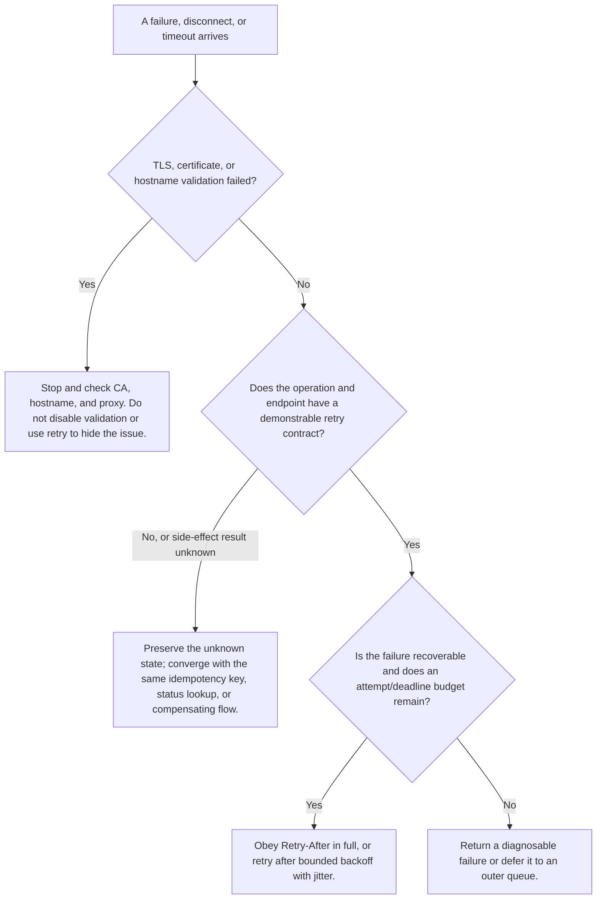

# Timeouts, Retries, Backoff, and Idempotency

## Objective

Understand why a timeout can leave an operation's result unknown. Retry automatically only for suitable operations and failures; set connection/read timeouts, maximum attempts, exponential backoff, jitter, and `Retry-After`; and reduce duplicate-create risk with a server-supported idempotency key.

## A timeout is not one number

One request can involve DNS, TCP/TLS connection establishment, request transmission, waiting for the first byte, and continuously reading a response. Requests commonly separates connection and read timeout with a tuple:

```python
response = requests.get(url, timeout=(3.05, 20))  # Bound connection and idle read waits separately; this is not the total deadline for a business operation.
```

- **Connection timeout**: how long connection establishment may wait.
- **Read timeout**: how long the underlying socket may receive no data after connection before failing.

Requests `timeout` is not an absolute deadline for the full business operation. A long response can continue receiving bytes and take more than 20 seconds; DNS, system scheduling, retries, and backoff accumulate too. An Agent task also needs an outer deadline or cancellation mechanism, for example “this tool call has at most 45 seconds in total.”

### Why a timeout must be explicit

Without a timeout, a failed connection can occupy a worker for a long time and eventually overload the queue. Nor should values be arbitrarily short: normal tail latency can be misclassified as failure, then retries further amplify load. Choose values from the endpoint's real latency distribution and user experience, distinguishing interactive requests from batch work.

## The result can be unknown after timeout

A client read timeout does not prove the server did not execute. For example:

1. The client sends “create order.”
2. The server creates it successfully.
3. The response is lost in transit.
4. The client sees a timeout and sends another POST.
5. Without deduplication, two orders exist.

Therefore, “catch Timeout and retry immediately” is often acceptable for a read, but dangerous for a create operation with side effects.

## Decide the operation before the error

RFC 9110 defines GET, HEAD, OPTIONS, PUT, and DELETE as idempotent methods; POST and PATCH are not idempotent by default. That is protocol semantics, not a guarantee that every business implementation obeys it, nor a guarantee that every PUT or DELETE is appropriate for automatic retry under every condition.

A conservative starting matrix:

| Operation/failure | Connection failure confirmed before send | Read timeout/connection interruption | 429 | 500/502/503/504 | Other 4xx |
| --- | --- | --- | --- | --- | --- |
| GET/HEAD | Retry within a finite budget | Retry within a finite budget | Follow documentation and `Retry-After` | Retry within a finite budget | Usually do not retry |
| PUT/DELETE | Retry after checking API semantics | Check concurrency control and idempotency semantics | Same as at left | Same as at left | Usually do not retry |
| Create POST | Still cautious even when a library can classify the request as unsent | Do not retry automatically by default | Only when the service supports an idempotency key or recovery lookup | Same as at left | Correct the request |

This is not a mandated standard policy; it is an engineering starting point. The target API documentation, business loss, and server-side deduplication determine the final decision.



This is an engineering decision tree, not a rule to retry on every exception. In Requests, `SSLError` is a subclass of `ConnectionError`; a client with an overly broad exception branch can misclassify an identity-validation failure as a transient fault.

## Attempt counts, backoff, and jitter

If the base wait after the first failure is `b`, the wait for retry number `n` can be:

$$
d_n = \min(d_{max}, b \times 2^{n-1})
$$

When many clients fail together, identical waits make them retry together. Add jitter to spread the requests, for example full jitter:

$$
wait_n \sim U(0, d_n)
$$

Always set all of these:

- a maximum attempt count;
- a per-attempt connection/read timeout;
- a maximum backoff delay;
- an overall task deadline; and
- a global retry budget so retries in an SDK, client, queue, and workflow do not multiply each other.

For example, three SDK retries plus three outer-task retries can produce nine rather than three calls in the worst case. Decide which layer owns the primary retry policy.

## Prefer `Retry-After`, but keep a bound

`Retry-After` can be an ASCII decimal count of seconds or an HTTP date. Responses such as 429 and 503 can use it, but its presence is service-dependent. Parse both forms correctly, and treat negatives, non-ASCII digits, and arbitrary text as invalid. If a valid wait exceeds the remaining deadline or wait budget, fail quickly or defer to a queue; do not silently shorten 120 seconds to 2 seconds and retry early.

## What an idempotency key solves

Some APIs let a client send a unique key in a create request:

```python
from uuid import uuid4  # Import a random UUID generator to create a unique key for one new logical create operation.

idempotency_key = str(uuid4())  # Reuse this one key across every retry of the same logical operation.
response = requests.post(  # Call a create endpoint whose official contract confirms idempotency-key support.
    f"{base_url}/jobs",  # Add the jobs resource path to a controlled base address.
    headers={"Idempotency-Key": idempotency_key},  # Identify the same operation through the server-supported header.
    json={"task": "index-document", "document_id": "doc-42"},  # Send the canonical business payload bound to this key.
    timeout=(3.05, 30),  # Bound connection and read phases without interpreting an unknown result as not executed.
)
```

Key principles:

- **Use only when official documentation declares support**. Header name, retention window, and conflict behavior are not universal.
- Reuse one key for retries of the same logical operation; create a new key for a new operation.
- The key and normalized request parameters participate in deduplication; the same key with a different payload should be a conflict.
- An idempotency key does not replace business uniqueness constraints, status queries, or compensating flows.
- The key itself must not contain user data or business secrets.

When an API does not support an idempotency key, consider a client-generated resource ID, business uniqueness key, post-submission lookup by business identifier, or a server-side transaction designed to resist exactly-once illusions. Without a verifiable mechanism, a POST read timeout enters an “outcome unknown” state; it is not safe to call it a definite failure.

## Concurrency control and conditional requests

Idempotency does not prevent overwriting another client's update. If two clients PUT at the same time, the later write can overwrite the earlier one. An API that supports ETag can require:

```http
If-Match: "version-7"
```

If the version has changed, the server can return 412; the client rereads and decides how to merge. RFC 6585 also defines 428 for a server that requires conditional requests. This prevents lost updates, which is different from preventing duplicate creation.

## Where retries live in Requests

Requests can mount an adapter on a `Session` and use urllib3 `Retry`. Explicitly decide allowed methods, statuses, backoff, `Retry-After`, and maximum counts; do not indiscriminately add POST to every retry.

```python
from requests import Session  # Import an HTTP session that can share connections and adapter configuration.
from requests.adapters import HTTPAdapter  # Import the adapter that binds a Retry policy to a protocol prefix.
from urllib3.util import Retry  # Import the retry-policy object from Requests' underlying urllib3.

retry = Retry(  # Define a finite, explicit lower-layer retry contract that covers safe methods only.
    total=3,  # Permit at most three retries; including the initial request, that can mean four attempts.
    connect=3,  # Connection-stage failures can consume up to three retry budget units.
    read=2,  # Permit only two read retries to reduce unknown-side-effect risk.
    status=2,  # Retry a status in status_forcelist at most twice.
    allowed_methods=frozenset({"GET", "HEAD", "OPTIONS"}),  # Automatically retry only the side-effect-free read methods selected for this example.
    status_forcelist={429, 500, 502, 503, 504},  # Treat common transient statuses as candidates; parameter and permission 4xx errors are excluded.
    backoff_factor=0.5,  # Supply the base factor for exponential backoff; check the exact current library algorithm for a real service.
    respect_retry_after_header=True,  # Prefer a valid server-provided Retry-After when one exists.
)

session = Session()  # Create a session and connection pool that this code is responsible for closing.
session.mount("https://", HTTPAdapter(max_retries=retry))  # Mount the retry policy only for HTTPS; HTTP does not inherit it automatically.
```

Here, `Retry(total=3)` means at most three **retries**, which can mean four attempts with the initial request. That differs from the course project's `max_attempts=3`, which is three total attempts. Establish one counting convention before configuring retries at multiple layers.

Library behavior can change by version. Check current Requests and urllib3 documentation and write tests. The integrated project uses an explicit loop for teaching so every decision remains visible.

## Common mistakes

- Set only a retry count, with no per-attempt timeout or overall deadline.
- Automatically retry 400, 401, 403, 404, or 422, which usually do not self-heal while the request is unchanged.
- Retry every POST and create duplicate charges or tasks.
- Use unbounded backoff, no jitter, or ignore a valid `Retry-After`.
- Give SDK, HTTP client, queue, and workflow each a retry layer without calculating the total attempts.
- Record a read-timeout operation as “failed” while ignoring that the server may have succeeded.
- Generate a new idempotency key for every retry, preventing the server from recognizing one logical operation.

## Exercises and self-check

1. Calculate the capped values for the first six exponential-backoff retries with `base=0.5` and an 8-second maximum.
2. Write a retry decision and rationale for “read weather,” “create payment,” “delete temporary file,” and “submit LLM batch.”
3. Draw the three possible outcomes after a POST timeout: not received, received but not executed, and executed with lost response. Can the client distinguish them from Timeout alone?
4. Modify the adapter example so a test can assert that POST is not retried automatically.

- [ ] I understand the difference between connection/read timeout and a total deadline.
- [ ] I decide whether an operation is repeatable before deciding whether an error is transient.
- [ ] I configure a maximum count, cap, jitter, `Retry-After`, and total budget.
- [ ] I can explain when an idempotency key is reused and when it is new.

## References

- [RFC 9110: Idempotent Methods](https://www.rfc-editor.org/rfc/rfc9110.html#name-idempotent-methods)
- [RFC 9110: Retry-After](https://www.rfc-editor.org/rfc/rfc9110.html#name-retry-after)
- [RFC 6585: 428 and 429](https://www.rfc-editor.org/rfc/rfc6585.html)
- [Requests Advanced Usage](https://docs.python-requests.org/en/stable/user/advanced/)
- [urllib3 `Retry` API](https://urllib3.readthedocs.io/en/stable/reference/urllib3.util.html#urllib3.util.Retry)

Retrieved on 2026-07-22. Next: [[api/error-classification-logging-and-troubleshooting|Error classification, logging, and troubleshooting]].

