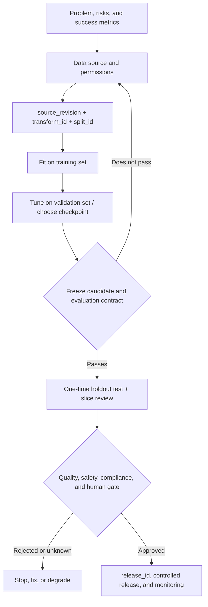

# Deep Learning: Engineering Practice and a Modern Workflow

## Content and evidence boundary

This page is an **original learning-and-engineering synthesis** for AI Agent Engineers, checked on **2026-07-22**. It does not replace the Apache-2.0-licensed D2L text in this course: D2L builds intuition for mathematics, training, and architectures; this page adds current framework installation, experiment contracts, evaluation, release, and safety boundaries. For PyTorch versions, device support, and particular APIs, use the official documentation and actual environment current on the day of execution.

Do not conflate these three claims:

- Understanding a network architecture does not mean you can reproduce a historical notebook in a current framework.
- A lower training loss from one run does not show that the model works for unseen data, different populations, or live traffic.
- Passing one offline test does not show that the model, data, permissions, and business decision are safe to release.

## Choose by goal, not by completing 140 pages in order

| Goal | Learn first | Can wait |
| --- | --- | --- |
| Call LLMs; build an Agent or RAG system | Data splits and metrics from [[machine-learning/00-index\|Machine Learning]]; the tensor, generalization, attention, and Transformer intuitions in this course | Training CNNs from scratch, distributed training, and every RNN derivation |
| Build embeddings, rerankers, or small classifiers / fine-tunes | Autodiff, training/validation boundaries, loss and optimization, BERT/Transformer | Large-scale pretraining and parameter servers |
| Build vision or multimodal projects | Convolution, transfer learning, detection/segmentation tasks and metrics; then [[multimodal-ai/00-index\|Multimodal AI]] | Historical Kaggle download workflows and legacy MXNet implementations |
| Train or adapt larger models | Numerical stability, mixed precision, AdamW, checkpoints, data parallelism, and recovery | Assuming multiple GPUs always accelerate work or scale linearly |



Every arrow in this diagram is a **decision that must be recorded and verified**, not a guarantee completed automatically by a model. If a test set, approval, or monitoring is absent, write the conclusion as “unknown,” not “proven.”

## The minimum contract for a training run

| Field / evidence | Question it answers | What it cannot prove by itself |
| --- | --- | --- |
| `source_revision` | Which revision of permitted source data was used for training | Source license, current access permission, or correctness of the data |
| `transform_id` | Which cleaning, annotation, splitting, or preprocessing run produced the input | That processing is unbiased, leak-free, or reproducible |
| `split_id` and sample/group mapping | Whether train/validation/test can be distinguished and reviewed | That temporal, entity, or semantic near-duplicates were correctly isolated |
| `candidate_id` | Which frozen training/evaluation candidate is undergoing gates | That it is approved for release or production consumption |
| Model/code/dependency/hardware references | Which candidate was actually trained | Identical numbers on another platform or framework version |
| Validation metrics and checkpoint-selection rationale | Why that candidate was selected | That it works on a holdout test or live users |
| Holdout test, slices, and error samples | How the candidate performs under the agreed offline contract | That fairness, safety, authorization, and real business value are resolved |
| `release_id`, approval, and rollback plan | Which approved candidate may be released | That post-release drift, misuse, or data leakage will not occur |

`source_revision`, `transform_id`, `split_id`, `candidate_id`, and post-release `release_id` should all be stable identity references. Do not infer version order from a string, or substitute `latest`, a filename, or an oral description for traceable evidence. A `candidate_id` identifies only a candidate awaiting quality, governance, and human-gate review; only an external approval/release record creates a `release_id`. Metadata helps investigation; it does not replace data authorization, human review, hash/signature verification, or actual access control.

## Four boundaries often missed

1. **Evaluation boundary:** use validation data for tuning and checkpoint selection; use the holdout test only after the candidate is frozen. If you repeatedly modify the model from test scores, that set has become validation data. Rename it honestly or prepare a new holdout set.
2. **Execution-mode boundary:** `model.eval()` changes the behavior of layers affected by training/evaluation mode, such as Dropout and BatchNorm. `torch.no_grad()` / `torch.inference_mode()` control gradient tracking and memory cost. Both are usually needed, but neither replaces the other.
3. **Numerical boundary:** mixed precision can improve throughput but introduces underflow, overflow, and `NaN/Inf` risks. Record dtype, loss/gradient anomalies, clipping/scaling behavior, and fallback conditions. Lower memory use alone does not prove training is correct.
4. **Product boundary:** a model score is not authorization, factual evidence, or permission to act. Especially for people-related, medical, financial, content-moderation, or automated-decision scenarios, input permissions, failure handling, human escalation, log minimization, and withdrawal/deletion paths are system responsibilities.

## Connections to Agent / RAG work

- Transformer explains how attention layers mix representations; it does not explain prompts, tool permissions, MCP identity, retrieval freshness, or Agent failure recovery. See [[llm-api-integration/00-index|LLM API Integration]], [[tool-calling-function-calling/00-index|Tool Calling]], and [[mcp/00-index|MCP]] for those system boundaries.
- Encoder models such as BERT are often used for understanding, classification, and vector representations. Autoregressive generative models differ in masking, objective, and inference. Do not treat them as interchangeable training or deployment choices merely because both are called Transformers.
- An embedding is a representation, not a knowledge base or evidence. RAG must also handle sources, permissions, chunking, index versions, citations, and refusal. See [[embeddings/00-index|Embeddings]], [[semantic-search/00-index|Semantic Search]], and [[rag/00-index|RAG]].
- Fine-tuning/adaptation changes model behavior, but it does not automatically fix prompt injection, unauthorized tool use, personal-data exposure, or incorrect actions. Release gates and online observability belong separately in [[mlops/00-index|MLOps]], [[llmops/00-index|LLMOps]], [[evaluation-framework/00-index|Evaluation Framework]], and [[ai-safety/00-index|AI Safety]].

## Offline exercise: audit the experiment before trusting the curve

[[deep-learning/examples/training_run_audit.py|training_run_audit.py]] is a zero-dependency teaching auditor. It checks split overlap, use of the test set for model selection, missing lineage fields, finite metrics, and whether `candidate_id` is a mutable alias. It deliberately does not produce or validate a `release_id`, because that needs external quality, governance, and release-approval evidence. Tests are in [[deep-learning/examples/test_training_run_audit.py|test_training_run_audit.py]].

Run from the repository root:

```powershell
$exampleDir = (Resolve-Path '.\docs-EN\deep-learning\examples').Path
python -B (Join-Path $exampleDir 'training_run_audit.py')
python -B -W error -m unittest discover -s $exampleDir -p 'test_*.py' -v
python -B -O -W error -m unittest discover -s $exampleDir -p 'test_*.py' -v
```

This script reads no real data, trains no model, accesses no network, and does not validate referenced objects or permissions. It merely turns common experiment-contract errors into repeatable offline checks. Real training still belongs in an isolated environment, with controlled data and a project-level evaluation contract.

## Recommended return path into the course text

1. [[deep-learning/upstream-references/chapter-05-02/reference-02-02-1|Tensors and shapes]] → [[deep-learning/upstream-references/chapter-05-02/reference-06-02-5|Automatic differentiation]] → [[deep-learning/upstream-references/chapter-07-04/reference-05-04-4|Model selection and generalization]].
2. [[deep-learning/upstream-references/chapter-07-04/reference-09-04-8|Numerical stability]] → [[deep-learning/upstream-references/chapter-07-04/reference-10-04-9|Distribution shift]] → [[deep-learning/upstream-references/chapter-14-11/adam|Adam / AdamW]].
3. [[deep-learning/upstream-references/chapter-13-10/transformer|Transformer]] → [[deep-learning/upstream-references/chapter-17-14/bert|BERT]] → learn embeddings, RAG, or fine-tuning as needed.
4. Only when model size, memory, or throughput becomes an actual bottleneck, read [[deep-learning/upstream-references/section-15-12/gpu-47870103|Multi-GPU training]] and nearby chapters. First measure a single-device baseline, data input, and recovery needs.

## Core sources

Checked on **2026-07-22**.

- [PyTorch Start Locally](https://docs.pytorch.org/get-started/locally/)
- [PyTorch: no_grad](https://docs.pytorch.org/docs/stable/generated/torch.no_grad.html) and [Module training/evaluation mode](https://docs.pytorch.org/docs/stable/generated/torch.nn.Module.html)
- [PyTorch AMP](https://docs.pytorch.org/docs/stable/amp.html) and [Reproducibility](https://docs.pytorch.org/docs/stable/notes/randomness.html)
- [PyTorch DistributedDataParallel](https://docs.pytorch.org/docs/stable/generated/torch.nn.parallel.DistributedDataParallel.html) and [FullyShardedDataParallel](https://docs.pytorch.org/docs/stable/fsdp.html)
- [Attention Is All You Need](https://arxiv.org/abs/1706.03762), [BERT](https://arxiv.org/abs/1810.04805), and [Decoupled Weight Decay Regularization](https://arxiv.org/abs/1711.05101)
