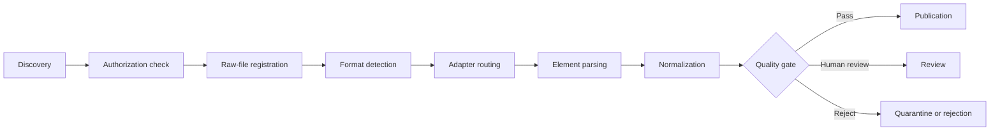

# Format identification and the parsing pipeline

## Goal

Build, from first principles, a parsing process that does not “open a file because its extension says so.” After this lesson, you can explain the evidentiary strength of detection signals, define the inputs, outputs, and failure states for each stage, and establish a minimal security boundary for untrusted documents.

## Start with a bad download

A user saves `report.pdf`, but its actual content is an HTML login page returned by a website. If a program looks only at `.pdf`, the PDF parser raises an opaque exception. Worse, an attacker can use a disguised extension to send a dangerous container to a high-privilege parser.

“Format” involves at least three things:

- **declared format**: the filename extension or type claimed by the uploader;
- **transport format**: upstream metadata such as HTTP `Content-Type`; and
- **detected format**: a file signature, content features, and, when necessary, the structure inside a container.

All are evidence, not absolute truth. Apache Tika’s documentation likewise distinguishes magic, resource names, known `Content-Type`, and container-aware detection: extensions can be renamed, while magic alone cannot identify which document type is inside a ZIP or OLE container.

## A multi-signal decision table

| Situation | Decision | Rationale |
| --- | --- | --- |
| `.pdf` + `%PDF-` | Register as PDF, then have a controlled PDF adapter validate its structure | A matching header still does not prove that the file is complete. |
| `.pdf` + `<!doctype html>` | Quarantine it with `media_type_mismatch` | It is likely an error page or disguised file. |
| `.docx` + ZIP signature | Treat it only as a possible OOXML container | Inspect container entries to confirm it; this project does not expand containers. |
| `.txt` + valid UTF-8 without a BOM | Permit strict text decoding through the allowlist | Extension evidence is weak, but the parser’s capability boundary is explicit. |
| Unknown extension + “looks like text” | Route to rejection or human review; do not guess a parser | Failing closed is more auditable than silently misparsing. |

Detection rules should emit `extension_media_type`, `detected_media_type`, `detection_method`, and the reason for a conflict. Do not keep only the final label, or you cannot explain why a file was quarantined.

## A replayable pipeline

Every arrow is a contract:

| Stage | Minimum input | Minimum output | Typical failure |
| --- | --- | --- | --- |
| Raw registration | bytes, provenance, permissions | `source_id`, SHA-256, size, acquisition status | incomplete download, over budget |
| Format detection | prefix bytes, extension, upstream type | candidate type, method, conflict | unknown type, disguise, unknown container |
| Parsing | fixed source version, adapter, configuration | elements, locations, warnings | corruption, encryption, timeout, zero elements |
| Normalization | raw elements, rule version | auditable text, retrieval text | lost characters, semantic change |
| Acceptance | parsing output, gold set, thresholds | `pass/review/fail` | empty page, wrong order, table drift |
| Publication | accepted version, permission policy | retrievable version and rollback pointer | missing permission mapping |

Version the raw file, parsing configuration, and result. The same `raw_sha256 + parser_version + config_sha256` should be replayable; a changed source file must not overwrite an old result.

## Identity, idempotency, and error classification

Paths change, so do not treat `D:\docs\a.pdf` as a permanent content ID. Use the SHA-256 of raw bytes to identify a content version, then assign a stable `document_id` to the business source. They have different meanings: one business document can have multiple content versions, and identical content can originate from different permission domains.

At minimum, classify errors as:

- `rejected`: type conflict, unauthorized access, resource-budget excess, or strict-decoding failure; retry only after correcting the input;
- `external_adapter_required`: the current component lacks this format capability; this is neither a false failure nor a parsing success;
- `transient_failure`: an isolated service is temporarily unavailable or timed out; retry according to policy; and
- `quality_review`: technical parsing completed, but order, table, or OCR quality did not pass the gate.

Error messages must not contain full document text, real credentials, or unnecessary absolute paths. Hashes help deduplicate and detect changes, but they are not access control, proof of authenticity, or malicious-content scanning.

## Security boundaries for untrusted files

OWASP’s file-upload guidance recommends an allowlist, not trusting `Content-Type`, randomized storage names, size limits, authorized access, and, where appropriate, antivirus or content sanitization. A parsing pipeline also needs:

- limits for file count, single-file size, total size, page count, decompressed size, CPU, memory, and wall-clock time;
- decoding and normalization of URL/upload filenames before an allowlisted-extension check; reject double extensions, reserved names, and abnormal path components. `stat()` is only a precheck: bounded file handles must enforce byte budgets again while reading;
- no execution of macros, JavaScript, embedded programs, external links, or document commands;
- no direct loading of complex third-party parsers in a high-privilege main process;
- ZIP-entry defenses against `../` traversal, absolute paths, symbolic links, and decompression bombs;
- logs containing only minimal diagnostics, with source text stored under its permissions; and
- treating prompts inside documents as untrusted data that still requires [[ai-safety/00-index|AI Safety]] controls before entering an agent context.

This course’s project rejects symbolic links, does not expand containers, and limits file count and bytes. It is a teaching implementation, not an OS-level sandbox or malware scanner.

## Common mistakes and troubleshooting

- **“The parser did not error, so the type is correct.”** Many parsers recover from errors; compare declared and detected signals, then validate the output.
- **“Convert every format to PDF first.”** Conversion loses heading semantics, annotations, cells, and accessibility information.
- **“ZIP magic proves that it is DOCX.”** DOCX, PPTX, XLSX, and ordinary ZIP files share a container signature.
- **“Retry forever on failure.”** Format corruption, password protection, and permission denial are usually permanent errors.
- **“It is fine to put the original filename in a public log.”** A filename can contain names, projects, or medical-record information.

## Exercises

1. For “`.pdf` + HTML content,” “no extension + PDF header,” “`.docx` + ordinary ZIP,” and “valid but encrypted PDF,” write the state, error code, and next action.
2. Design fail-closed rules for 100 MB, 10,000 pages, nested ZIPs, and a directory symbolic link.
3. Modify the [[document-parsing/examples/test_inspect_documents.py|regression tests]] to add a PNG disguised as `.txt`; write the failing test first, then implement the expected result.
4. Draw the relationship among your `source_id`, business `document_id`, parsing version, and publication version.

## Self-check

- [ ] I can explain the limitations of an extension, `Content-Type`, magic, and container detection.
- [ ] I can distinguish “an adapter is required” from “parsing already succeeded.”
- [ ] I can preserve replayable inputs and error states for every stage.
- [ ] I can name at least five untrusted-file risks and their corresponding gates.

## References and next step

- [IANA Media Types registry](https://www.iana.org/assignments/media-types/media-types.xhtml)
- [Apache Tika: Content Detection](https://tika.apache.org/3.3.1/detection.html)
- [OWASP File Upload Cheat Sheet](https://cheatsheetseries.owasp.org/cheatsheets/File_Upload_Cheat_Sheet.html)
- [Python `pathlib`](https://docs.python.org/3.11/library/pathlib.html)

Sources retrieved on 2026-07-22. Next: [[document-parsing/02-encoding-text-and-normalization|Encoding, text, and normalization]].
