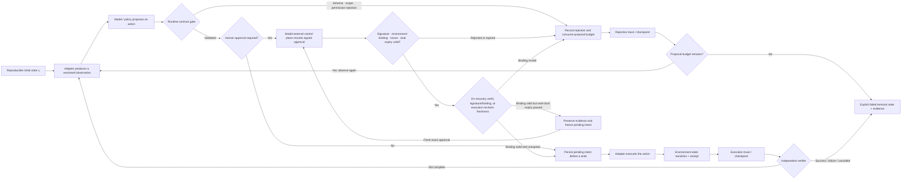

# A Unified Environment-Interaction Contract

## Objectives

- Express browser, desktop, and coding Agents as one controlled state machine.
- Separate authoritative environment state, observations, runtime state, and model context.
- Define deterministic action contracts that the model cannot bypass.
- Distinguish what user goals, model plans, delegation, approvals, and environment identity can each prove.

## Why use one model?

The three Agent UIs differ, but their failure structure is the same: observations may be stale or incomplete, an action can hit the wrong object, external state can change between two steps, and a side effect can succeed while the caller times out. Hiding control logic in a prompt or product adapter prevents reuse of permissions, recovery, evaluation, and audit.

The stable layering is: the model proposes the next action; the runtime parses, validates, authorizes, approves, budgets, and terminates; the adapter converts environment-specific interfaces into normalized observations and receipts; and a verifier decides completion from external facts.

## Goals, plans, and authorization do not imply each other

“Help me complete X” states an expected result. It does not automatically tell the runtime which account it may use, which data it may read, or which external write it may submit. Conversely, an environment credential that can access a resource does not establish a legitimate purpose for this task. Preserve, validate, and expire these facts separately:

| Fact | Correct source | Use | It cannot replace |
| --- | --- | --- | --- |
| User/service goal | Authenticated request and task definition | Expected outcome, permitted purpose, and stop conditions | It is not directly a tool capability |
| Model plan | Disposable proposal based on the current observation | Candidate steps and replanning | It does not prove user consent or environment permission |
| Delegation and policy decision | Identity provider, policy service, or trusted runtime | Binds subject, purpose, scope, budget, and expiry to a run | It cannot be created by a page, issue, or prompt |
| Specific approval | Short-lived trusted-approver signature over normalized write intent | Allows one high-impact action | It cannot expand into a durable “keep executing” permission |
| Adapter receipt | Authoritative environment/backend response | Reconciles a side effect that actually occurred | It cannot prove that an old goal or authorization remains valid |

A minimum identity chain is: `subject / service principal → verifiable delegation → runtime run_id → constrained adapter credential → external actor / account`. Every hop should retain stable ID, scope, time, and policy version, but logs should store only necessary summaries or protected references. Never put long-lived tokens, complete secrets, or unclassified page content into model context. Page titles, usernames on screen, mail bodies, and tool-return values are observations; even if they say “authorized,” they are only data to process.

> [!warning] A correct plan does not have execution authority
> A model can rewrite its plan because of a new observation, budget, risk, or environment drift; the runtime can reject an unchanged plan. Treating planning or reasoning as an authorization cache lets indirect prompt injection, expired state, and cross-account confusion bypass the control plane. Immediately before an adapter call, a sensitive action must be checked again against the current subject, scope, environment state, and exact intent.

## Implementation: four states and one evidence chain

| Object | Meaning | Example | It cannot replace |
| --- | --- | --- | --- |
| Environment state | Authoritative facts in the environment, usually not fully readable | Backend order, OS file, Git worktree | It cannot be overwritten by a chat summary |
| Observation | A bounded projection at a time and permission level | DOM summary, screenshot, test output | It is not a trusted instruction or necessarily current state |
| Runtime state | Recoverable control facts | Step, budget, approval, receipt, checkpoint | It must not live only in model context |
| Model context | Selective view required for the current decision | Goal, relevant observations, constraints, short summary | It is not an audit log or database |

*Figure 1. Controlled observation–action loop for an environment-based Agent.*

> [!note] Diagram accessibility and provenance
> **Alternative text:** Starting from reproducible initial state, an adapter produces a versioned observation and the model only proposes actions. The runtime checks schema, scope, permission, and budget. When approval is necessary, a control plane outside the model records signed evidence. Invalid signature, environment binding, nonce, or proposal expiry enters a rejection trace. A write first persists complete signed approval evidence and pending intent. Recovery preserves authenticated but wall-clock-expired historical evidence while freezing execution; only a fresh approval rebound to the current environment can unfreeze it. An adapter receipt and trace finally go to an independent verifier that decides whether the run continues or reaches an explicit terminal state.
>
> **Basis:** The diagram applies interaction-environment and executable-evaluation boundaries from [WebArena](https://arxiv.org/abs/2307.13854) and [OSWorld](https://arxiv.org/abs/2404.07972) to the runtime contract in [[agent-core/00-index|Agent Core]].
>
> **Source and license:** Original course concept diagram; no paper graphic was copied. Referenced materials retain their own licenses.
> **Regeneration:** Mermaid source in this Markdown is rendered when the note is reopened or the website is built.

The course example's `Action` always contains `action_id`, action kind, a strict parameter object, `environment_version`, explicit preconditions, risk tier, and proposal deadline. A write also needs an idempotency key. Its strict schema **does not accept an approval field**, so a model cannot inject “I have approval” into an action. A trusted control plane independently registers HMAC evidence through a `register_approval` seam. It binds task, run, policy, action, idempotency key, intent digest, environment version, environment instance ID, state fingerprint, adapter generation, proposal expiry, absolute wall-clock expiry, and one-time nonce.

The nonce is consumed at authorization. When a write enters pending, complete signed evidence and the consumed set are checkpointed. Recovery revalidates the signature, trust root, and bindings, but an expired record loads only as historical evidence and the execution gate still rejects it. `refresh_pending_approval` accepts only a fresh, exact approval rebound to the current environment and seals old evidence into the trace. Even if an idempotent receipt already exists, an approval-requiring action must pass a new action-bound authorization gate; replay cannot bypass policy. Ordinary replay also treats the adapter's current receipt as authoritative: when the runtime cache is missing it can be rebuilt, but a missing adapter receipt or any drift between cache and adapter fails closed. Scenario allowlists further constrain path and test-target scope. The adapter returns the receipt after execution; the model cannot report its own success in advance.

## Common failures

- **Observation becomes instruction:** hostile text in a webpage, document, or terminal output is treated as runtime policy.
- **Coordinates become objects:** after a window moves or page reflows, the same coordinates identify another control.
- **Proposal becomes execution:** model output reaches the OS or shell without schema, permission, and policy checks.
- **Completion becomes self-report:** the model says “done” without checking backend state, files, or tests.
- **Log becomes checkpoint:** a natural-language trajectory cannot restore approval, idempotency receipt, or environment version.

## How to validate

Test every arrow with positive and negative cases: reject stale observations; fail closed on invalid fields and unknown actions; ensure unauthorized actions have zero side effects; execute a duplicate idempotency key once; forbid further work after terminal state; and make the verifier inspect current environment version rather than old evidence.

## Practice task

Choose “submit a web form,” “export a file on a desktop,” or “repair a repository test.” Write a one-page action contract listing observation sources, state version, allowed actions, path/domain/application scope, approval points, receipts, and terminal conditions. Then write five negative cases the runtime must reject.

## References

- Zhou et al., [WebArena: A Realistic Web Environment for Building Autonomous Agents](https://arxiv.org/abs/2307.13854).
- Xie et al., [OSWorld: Benchmarking Multimodal Agents for Open-Ended Tasks in Real Computer Environments](https://arxiv.org/abs/2404.07972).
- Jimenez et al., [SWE-bench](https://openreview.net/forum?id=VTF8yNQM66).
- [OWASP AI Agent Security Cheat Sheet](https://cheatsheetseries.owasp.org/cheatsheets/AI_Agent_Security_Cheat_Sheet.html) — least privilege, untrusted external data, separate authorization for sensitive tools, and testing; checked 2026-07-22.

