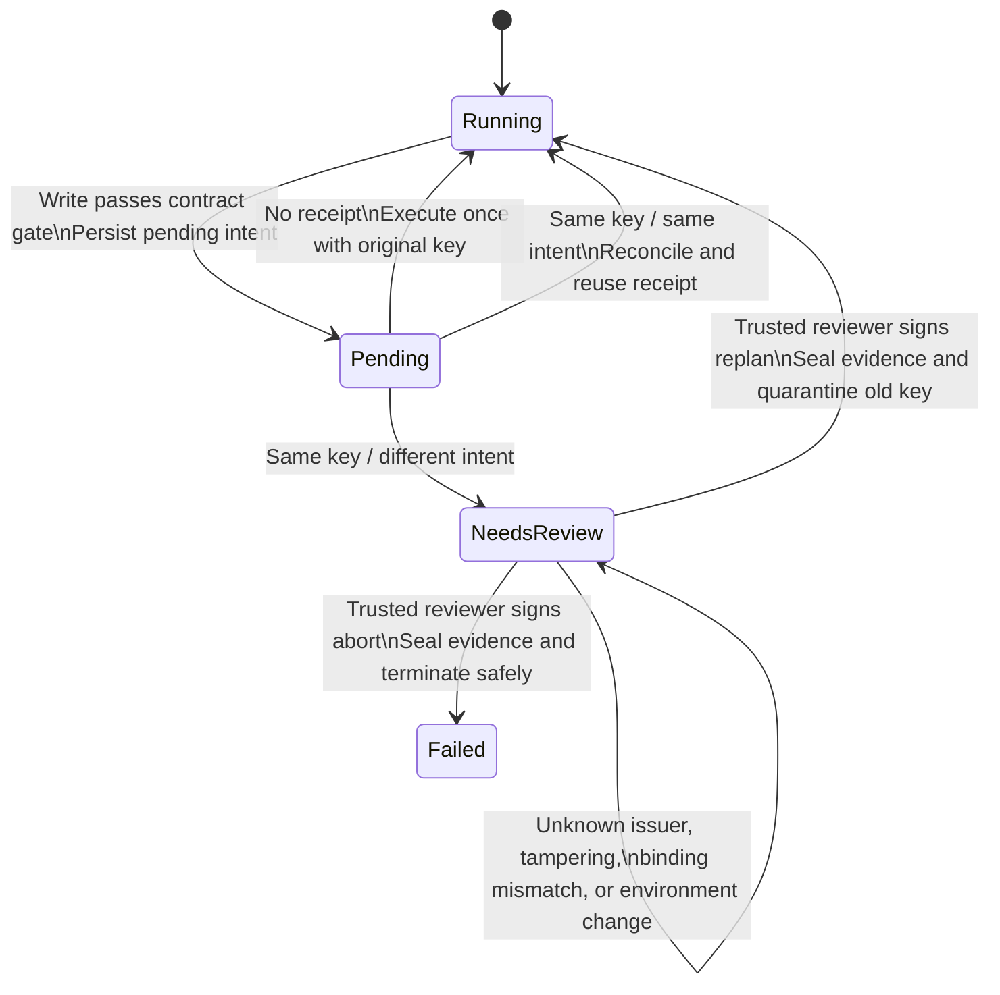

# Long-running Task Checkpoints and Idempotent Recovery

## Objectives

- Design checkpoints that recover environment tasks across processes.
- Handle the crash window between a side effect and its checkpoint.
- Use idempotency keys, intent digests, and receipts to prevent duplicate execution.

## Why chat history cannot recover a long task

Long tasks encounter process exit, browser restart, machine sleep, network timeout, human waiting, and environment changes by other actors. A chat may say “clicked” or “edited,” but cannot prove that an external side effect occurred or preserve exact approval, budget, environment version, and idempotency receipt. Replaying natural-language steps during recovery can duplicate an order/send or overwrite a newer file.

## How to implement it

A checkpoint should contain at least:

- `run_id`; external task/version and policy/version fingerprints; explicit phase and stop reason;
- current plan cursor and spent proposal/step/time/cost budgets;
- environment instance ID, state fingerprint, adapter generation, and last observation version—without pretending to save the entire real world;
- normalized intent digest, risk, environmental prestate, and complete signed approval evidence for a pending action;
- idempotency key, full external receipt identity/fingerprint, and result summary for completed writes;
- allowed scope, identity, policy version, and preconditions to recheck before recovery;
- the environment version associated with verifier evidence.

An ordinary SHA-256 checksum detects accidental corruption only. It does not prove a checkpoint came from a trusted runtime: an attacker who can change the payload can recompute a checksum. The course example therefore also uses standard-library HMAC-SHA256. The signing key is managed outside the checkpoint by the caller and is never saved in a checkpoint or printed. Recovery must be given the external fixed scenario and verify schema, task/version, policy/version, permission, allowlist, initial state, and the fingerprint expected by the verifier.

**HMAC proves authenticity and integrity, not freshness.** An old checkpoint still has a valid HMAC; signature alone cannot block rollback to earlier state. The example keeps a monotonic high-water mark in an external `CheckpointGenerationStore` for `(task_id, run_id, environment_instance_id)`. The checkpoint first validates the current Sandbox/RunState schema, cross-object invariants, and JSON serializability, then advances generation. Recovery accepts only a version exactly equal to the external high-water mark and fails closed if the store is absent.

That store is still an in-memory teaching substitute. A production implementation needs independent durable access-controlled storage with atomic compare-and-set. It must design checkpoint-content persistence and high-water-mark commit as one atomic protocol, or a process can crash between them and lose the most recent recovery point. HMAC also cannot resist key compromise or compromise of the trusted signing process; production still needs key rotation, access control, and audit.

### Concurrent recovery also needs run ownership

An external generation high-water mark prevents an old checkpoint from overwriting a newer one, but it does not decide which of two recovery processes may continue execution. A production runtime should also use [[agent-core/05-long-running-agent-checkpoints-recovery-and-idempotency#lease-and-concurrent-recovery|Agent Core leases and concurrent recovery]]: durably record `owner_worker`, `lease_version`, `expires_at`, and `state_version`; after acquiring the lease, revalidate it before every checkpoint advance or adapter call; and commit atomically with `(expected_state_version, expected_lease_version)`. A late checkpoint from an old worker must be rejected. When an adapter supports conditional writes or operation tokens, pass a monotonic lease/revision as a commit fence. Otherwise, a lease avoids much duplicate scheduling but cannot prove mutual exclusion of writes across environments.

The course's in-memory runtime deliberately implements neither a cross-process lease nor durable compare-and-set. Its 103 tests prove a single-process control contract and failure paths, not concurrent safety between recovery workers. Before moving to a real browser, desktop, shell, or coding adapter, add integration tests for two-worker contention, old results arriving after lease expiry, adapter rejection of expired tokens, and reconciliation of the same receipt.

When recovering into an external environment, equal version does not mean equal state. The example first requires matching environment instance ID, then accepts only the checkpoint's exact state or a state deterministically derived by one committed pending write. Different file/receipt with the same version, same content in a different instance, and multi-step drift not provable from pending intent all fail closed. A real adapter should use its own authoritative revision/etag, business-object ID, and transaction log rather than copying in-memory fingerprints.

### Typical crash windows

| Crash location | Known fact | Recovery action |
| --- | --- | --- |
| Before proposal | Previous checkpoint is complete | Observe again before deciding |
| Before action persistence | Intent exists; no side-effect evidence | Execute or query with the same idempotency key |
| External success, receipt not persisted | Outcome is uncertain | Query by key/business ID first; do not retry blindly |
| Receipt persisted, state not advanced | Success evidence exists | Replay deterministic state transition; do not repeat side effect |

Bind idempotency cache to `(idempotency_key, intent_digest)`: same key and same intent returns the old receipt; same key and different intent is a conflict. An adapter receipt is authoritative; runtime cache is a rebuildable copy. Recovery can proceed when cache is absent but adapter receipt is complete. It cannot claim replay success when the adapter receipt is missing or any cache/adapter namespace, version, receipt ID, digest, or result differs. Comparing only action ID is insufficient because a new process can create a new ID; comparing only key quietly treats wrong parameters as an old request.

Approval expiry and checkpoint corruption are different problems. Recovery must still verify and load expired approval evidence so an operator can inspect pending state, trace, and receipt; but uncommitted pending work must remain frozen rather than execute automatically. The course runtime's minimal liveness path obtains a fresh trusted approval exactly bound to the same action/key/intent and current environment instance/fingerprint/generation. `refresh_pending_approval` verifies it, replaces active evidence, and seals old evidence into the trace. If a receipt proves that the write committed before the crash, reconcile only—do not perform the side effect again.

There is one deliberately explicit trust boundary: the in-memory `Sandbox` is a trusted, synchronous, same-process adapter substitute. Therefore “exact one-step poststate plus same-intent adapter receipt” is treated as evidence that the runtime's call committed. Its receipt has no approval fingerprint, adapter-side authorization decision, or trusted commit timestamp. It cannot prove that a call bypassing the runtime happened before approval expired. A real asynchronous or multi-caller adapter must bind approval/capability summary, commit time, and business-object identity into its authoritative receipt and enforce expiry itself. Missing fields or commit time later than the approval boundary must enter human review, not use this example's automatic reconciliation branch.

## Receipt conflict is not an ordinary exception

If the adapter returns “same idempotency key, different intent digest,” the runtime cannot automatically know whether an old caller reused a key, the external service mixed calls, storage is corrupt, or the recovering action itself is wrong. The course runtime therefore does not pop pending intent and continue. It enters explicit `needs_review`, freezes new proposals and pending execution, and preserves original action/intent, the full conflicting receipt with adapter namespace/version/receipt ID/result, its normalized fingerprint, environment version, and trace.

*Figure 1. Freeze-and-human-reconciliation state machine for receipt intent conflict.*

> [!note] Diagram accessibility, provenance, and regeneration
> **Alternative text:** A write first enters Pending. With no receipt, execute once; with the same key and intent, reuse the receipt. With the same key but a different intent, the runtime enters NeedsReview and freezes. Only a trusted reviewer signature that binds current task, run, policy, action, key, both digests, full receipt fingerprint, and environment version—and only after the runtime rereads the same authoritative receipt before committing the decision—can choose replan or abort. All other records remain frozen.
>
> **Source and license:** Original course diagram from the deterministic state machine in this directory's `environment_runtime.py`; no external graphic was copied.
> **Regeneration:** Mermaid source renders from this Markdown when the note is reopened or the site is built.

`replan` does not mean “trust one receipt.” It quarantines the conflicting key, seals full pending/receipt/human-decision evidence in a review case, then returns to `running` only after re-observation and planning with a new key. `abort` enters `failed` while preserving the same three evidence sets. A model-external reviewer HMAC-signs the human decision and binds current environment version and full receipt fingerprint. Before consuming it, the runtime rereads the adapter's authoritative receipt; any drift leaves it frozen. Open review cases, complete approval evidence, and consumed approval/reviewer nonces enter the checkpoint. Restoring state with that evidence requires the corresponding trust roots again or fails closed.

After recovery, observe the external environment anew. Changed page URL, window focus, file hash, base commit, or account identity can invalidate old locator, approval, and verifier. Pause, replan, or hand off to a person.

## Common failures

- A checkpoint contains only model messages, not policy version, permission, receipts, or state validation.
- A valid HMAC is mistaken for the newest checkpoint; without an external monotonic high-water mark, rollback can replay old state.
- High-water generation advances before schema/cross-state/serialization checks, creating an unrecoverable checkpoint or invalidating the last good version too early.
- Expired approval is treated as authentication failure so evidence cannot be read; or, conversely, it loads and executes automatically.
- Runtime cache hides a deleted adapter receipt or drift in complete fields and fabricates `replayed=true`.
- Only environment version is bound, not instance and state fingerprint, allowing old approval against another same-version environment or bypass-modified state.
- An external write executes before a random idempotency key exists, so restart cannot correlate the old request.
- Every retry gets a new key, making nominal idempotency meaningless.
- Same key with different parameters returns success, masking caller error.
- Same key/different intent logs one error and deletes pending, losing reconciliation evidence and letting the Agent continue writing.
- A human clicks “continue” without binding full receipt fingerprint, both conflict digests, environment version, and one-time nonce; or the runtime does not reread authoritative receipt after issuance, allowing old decisions to replay across tasks or overwrite reconciliation drift.
- Recovery replays coordinates/commands without checking page, focus, file, or commit.
- Runtime invariants use `assert`, so `python -O` removes the checks.

## How to validate

Inject failure in every crash window, then reconcile write count and external final state after recovery. Verify that random corruption, tampering followed by recomputing an ordinary checksum, wrong HMAC key, stale checkpoint generation, missing external high-water mark, unknown fields, and external task/policy-version change all fail closed; an invalid current state must not advance the high-water mark.

Also test same-version/different-state, same-state/different-instance, and an approved pending write whose wall clock expires: evidence remains recoverable but execution stays forbidden until fresh exact approval unfreezes it. Test same-key/same-intent replay separately from same-key/different-intent conflict. The former still needs new approval where policy requires it, and missing adapter receipt or cache/adapter full-field drift cannot replay. The latter must retain pending and enter `needs_review`; every new proposal and direct execution must be rejected. Verify unknown reviewer, tampered signature, environment change after issuance, and full-receipt drift all remain frozen. A trusted `replan` with a new key can revalidate and complete; trusted `abort` can terminate while checkpoint preserves evidence. Completion evidence must bind to the version after the final environment change and expose a passing verifier event for that same version in the trace.

## Practice task

Run [environment_runtime.py](environmental-agents/examples/environment_runtime.py). Start with `test_approved_committed_write_recovers_with_signed_evidence`: it injects a crash after an approved write commits in the adapter but before the runtime persists its receipt. Recovery validates approval trust root, environment transition, and receipt while proving `write_count` remains 1. Then read `test_external_high_water_mark_rejects_checkpoint_rollback`, `test_receipt_drift_invalidates_signed_reconciliation`, and the trusted `replan/abort` tests to understand rollback, reconciliation races, recovery liveness, and evidence preservation. Finally add a negative case where two recovery processes contend for one generation and explain the atomic compare-and-set required by production storage.

## References

- [[agent-core/05-long-running-agent-checkpoints-recovery-and-idempotency|Long-running Agent Checkpoints, Recovery, and Idempotency]] — general crash-window and receipt model.
- [OSWorld](https://arxiv.org/abs/2404.07972) — task initial state and executable outcome verification show that environment recovery cannot rely only on conversation text.
- [SWE-bench official harness](https://github.com/SWE-bench/SWE-bench) — example of evaluation in a fixed repository environment.

