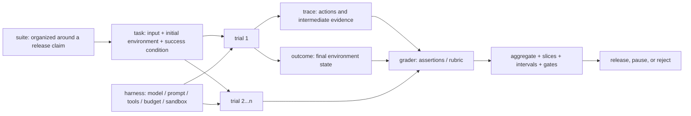

# Evaluation Objectives and Basic Units

## Goal

Work backward from a product decision to a testable claim, and use shared terms to describe one evaluation.

## Intuition

Evaluation is like an acceptance contract: first state what decision it will support, then decide which cases to test and what result to check. If you run a fashionable score first and add a story afterward, the score is likely to be misaligned with the product decision.

## Start by stating what the evaluation will decide

“Evaluate the chatbot” is too broad. An operational claim might be:

> For target users making Chinese order inquiries with the specified tool permissions, the candidate version does not reduce correct order-query rate relative to the current version and must not execute an unauthorized refund. Evidence comes from a frozen offline set, independent repeated trials, and a progressive online-monitoring rollout.

The statement limits the task, users and conditions, candidate and baseline, primary benefit, unacceptable risk, and evidence sources. A score is evidence for a claim, not the claim itself.

## Basic units

*Figure 1. Relationships among Agent evaluation objects. Text alternative: a suite contains tasks; each task runs multiple trials under a fixed harness. A trial produces both a trace and a real outcome, which graders assert against. Aggregation, slices, intervals, and risk gates then support a release decision. The diagram synthesizes this section's terminology, the Map/Measure boundary in NIST AI RMF, and the course's cited first-party evaluation materials; its Mermaid source is the regeneration method.*

| Unit | Meaning | Order-Agent example |
| --- | --- | --- |
| task / case | Input, environment, and success condition | A user asks for order status |
| trial | One independent attempt at a task | The second run with the same configuration |
| assertion | One decidable condition | The query-tool parameter equals the order ID |
| grader | Logic that executes one or more scoring checks | A Python state checker |
| trace / transcript | Intermediate calls and messages | Tool choice, parameters, and results |
| outcome | The real state at task completion | No refund occurred and correct shipping information was returned |
| harness | Prompt, tools, budget, and runtime environment | The Agent loop and sandbox |
| suite | Tasks organized around an objective | Query, cancellation, refund, and escalation |

An Agent saying “the refund succeeded” does not mean the outcome contains an actual refund record. For tasks with side effects, inspect environment state first.

## Three layers of success criteria

1. **Task quality:** correctness, relevance, completeness, and format compliance.
2. **Risk thresholds:** critical failures such as disclosure, unauthorized access, or dangerous actions are often non-negotiable.
3. **Operational constraints:** latency, call count, cost, recovery from failure, and resource use.

Do not simply average these three layers. A 99-point answer-quality score cannot compensate for one real unauthorized action. Define critical gates first, then aggregate tradeable measures.

## System boundaries and the harness

Evaluating a “model” is not the same as evaluating an application. Prompts, retrieval, tools, memory, retry count, timeouts, and context preparation all affect results. A report must record the complete tested-system configuration and budget; if a candidate uses more tools or attempts, the comparison must say so.

## Turn the claim into an evaluation contract

An executable contract freezes at least:

- `claim`: the claim and release decision to support;
- `system_under_test`: model, prompt, retrieval, tools, policy, and harness version;
- `population`: users, tasks, environments, languages, and exclusions;
- `dataset`: split, version, source, coverage, and sample unit;
- `graders`: assertions, rubric, human/model calibration, and treatment of unknowns;
- `gates`: critical-risk priority, overall and slice gates, plus cost and latency limits;
- `reporting`: sample size, intervals, failure evidence, approvers, and expiration.

Freeze the contract before viewing candidate results. A change creates a new version and explains why. Otherwise, changing a threshold only to pass a candidate turns measurement into score chasing.

This course's contract supports a concrete product decision. [[benchmark-design/00-index|Benchmark Design]] further fixes a long-term comparison protocol across systems, while [[runtime-monitoring/00-index|Runtime Monitoring]] observes post-deployment telemetry and SLOs. They may share cases and signals, but answer different questions.

## Common mistakes and diagnostics

- The objective is only “better answers”: add users, environment, baseline, success criteria, and risk conditions.
- Answer text is treated as the outcome: inspect database, file, or sandbox end state for side-effecting tasks.
- The harness is unrecorded: changing tools, retries, or context can change results even when the model is unchanged.

## Exercises

1. Rewrite “RAG answers well” as a claim with users, data scope, correctness, citations, and risk thresholds.
2. For “create a calendar event,” write one trace assertion and one outcome assertion.

## Self-check

Why cannot one trial represent stable performance for a stochastic system? The same input can produce different results because sampling, tools, or the environment vary.

## Summary and next step

Continue to [[evaluation-framework/foundations-and-design/02-cases-datasets-and-stratification|Cases, Datasets, and Stratification]].

## References

- [NIST AI RMF Core: Map and Measure](https://airc.nist.gov/airmf-resources/airmf/5-sec-core/) — checked 2026-07-14.
- [Anthropic: The structure of an evaluation](https://www.anthropic.com/engineering/demystifying-evals-for-ai-agents) — published 2026-01-09; checked 2026-07-14.
- [OpenAI: A shared playbook for trustworthy third-party evaluations](https://openai.com/index/trustworthy-third-party-evaluations-foundations/) — published 2026-05-29; checked 2026-07-14.
