# Offline-to-Online Evidence Handoff and the Regression Loop

## Goal

Connect offline evaluation, release gates, Canary observation, incident response, and regression data into a **one-way, reviewable evidence chain that does not disclose raw content**. The goal is not to let monitoring rewrite a dataset automatically. At every handoff, it should be possible to answer: “Which version and evidence batch supports this conclusion, who approved it, and who owns the next action?”

## An evidence chain, not an automatic write-back pipeline

```mermaid
flowchart LR
    A["Immutable release unit<br/>code, prompt, retrieval, tools, policy"] --> B["Frozen offline evaluation<br/>raw result per case"]
    B --> C["Evaluation evidence digest<br/>full SHA-256"]
    C --> D["Release gate and human approval<br/>Canary / rollback policy"]
    D --> E["Production trace / log / metrics<br/>bound to release and gate evidence"]
    E --> F["Monitoring window / incident evidence<br/>alert, scope, recovery verification"]
    F --> G["Human triage<br/>de-identification, authorization, deduplication, root-cause review"]
    G --> H["New regression candidate<br/>new dataset version"]
    H --> B

    classDef control fill:#E8F1FF,stroke:#3B82F6,color:#0F172A;
    classDef evidence fill:#ECFDF5,stroke:#10B981,color:#064E3B;
    classDef human fill:#FFF7ED,stroke:#F97316,color:#7C2D12;
    class A,D control;
    class B,C,E,F evidence;
    class G,H human;
```

*Figure 1. Offline-to-online evidence loop. Text alternative: a release unit first produces a full digest in frozen offline evaluation. It reaches Canary only through a gate and human approval. Production telemetry is associated with that release and gate evidence. Incidents or drift create regression candidates for human triage only; a candidate joins a new dataset version only after de-identification, authorization, deduplication, and root-cause review. The old frozen set is never edited in place. The diagram synthesizes the NIST, OpenTelemetry, and MLflow materials cited below; its Mermaid source is the regeneration method.*

Arrow direction matters. Monitoring can trigger pause, degradation, or rollback and can discover a new failure mode. It must not automatically change prompts, training data, grading thresholds, or a frozen test set because one production log “looks bad.” Otherwise, production noise, adversarial input, and label bias can contaminate later gates in reverse.

## Four handoff artifacts and identity boundaries

Every handoff artifact needs a human-readable ID and a machine-comparable full digest. The latter must also bind the **digest algorithm, byte representation or normalization rule, and version**; otherwise, “the same JSON” can yield a different digest in different languages or serializers.

1. **Evaluation evidence:** `release_id`, suite/dataset/rubric/grader/harness versions, per-case results, and a complete evaluation digest (the offline project in this repository calls it `evidence_sha256`). It answers, “What result did this candidate produce under which offline contract?”
2. **Release-gate evidence:** candidate and baseline, policy, required tests, rollback checklist, and `candidate_gate_evidence_sha256`. It answers, “Who allowed which release unit into which scope under what rules?”
3. **Operational evidence:** time window, traffic allocation, control group, release manifest, trace/log references, sampling or coverage, and the monitoring audit's full `evidence_sha256`. It answers, “What was observed in production, and is evidence sufficient for an action?” Only when a non-OK condition produces a regression candidate is the same value carried into that candidate as `monitor_evidence_sha256`.
4. **Regression candidate:** minimized phenomenon, severity, version, restricted trace reference, triage state, de-identification/authorization record, and deduplication key. It is **not yet** an evaluation case; only review can make it part of a new dataset version.

A short fingerprint, for example the first 16 hexadecimal characters, is useful in terminals, alert summaries, and human checks. A complete SHA-256 can serve as a cross-file change-detection reference only when the receiver knows and verifies the same algorithm, version, and input-byte representation. Real cross-language hashing or signing needs an explicit exchange of raw bytes or an explicitly adopted and tested specification such as RFC 8785 JSON Canonicalization Scheme (JCS). `python-json-sorted-utf8-v1` is not that standard; do not describe “sorted keys” as universal canonical JSON. Neither digest is a digital signature, authorization token, or proof of source authenticity: an attacker can replace both data and digest. Storage access control, signatures or attestations, approval records, and retention policy remain independently necessary.

## This repository's versioned teaching digest profile

The three offline projects now use `python-json-sorted-utf8-v1` explicitly as a **versioned byte profile for the same Python teaching implementation**, and each locks the same fixed golden vector. It serializes input values as an outer array using `ensure_ascii=False`, `sort_keys=True`, `separators=(",", ":")`, and `allow_nan=False`, encodes the result as UTF-8 bytes, then calculates SHA-256. It is not JCS, a digital signature, or proof of artifact provenance. The relationship of fields is:

| Project | Format declaration or output | Handoff boundary |
| --- | --- | --- |
| [[evaluation-framework/project-and-self-check/08-offline-layered-evaluation-pipeline\|Offline Layered Evaluation Pipeline]] | `evidence_digest_format`, `evidence_sha256`, and a display-only short fingerprint in stdout | Covers evaluator version, dataset, rubric, predictions, and candidate; fixtures do not prove a real executor or artifact origin. |
| [[llmops/project-and-self-check/08-offline-release-gate-project-and-self-check\|Offline Release Gate Project]] | `artifact_digest_format` in the evaluation artifact, `evidence_digest_format` at the top of the observation bundle, and `evidence_digest_format` in the decision | Verifies binding of `candidate_gate_evidence_sha256` and its short fingerprint; it does not read an external artifact body or prove an upstream recomputation actually occurred. |
| [[runtime-monitoring/project-and-self-check/08-offline-monitoring-audit-project-and-self-check\|Offline Monitoring Audit Project]] | `release_evidence.candidate_gate_evidence_digest_format`, the decision's `evidence_digest_format`, and a regression candidate's `monitor_evidence_digest_format` | Retains upstream format references and generates this window's digest; fixture release evidence remains an independent example rather than real gate output. |

The JSON input contracts in all three implementations turn unknown formats, duplicate keys, nonstandard JSON constants, raw invalid UTF-8, lone surrogates, and numbers that cannot become finite `float` values into controlled contract errors. The shared golden vector proves that the restricted profile has not drifted accidentally. It **does not** prove that three fixture digests came from one release, nor that a real system passed upstream bytes through the chain. Equal length, equal algorithm name, or equal JSON objects are insufficient to prove comparability or trust. A real system should pass one verified byte object through controlled artifact storage or an API, or explicitly adopt a versioned normalization specification, instead of manually copying text.

## Trace correlation, metric cardinality, and privacy

`trace_id`, release ID, gate digest, and user input have different purposes:

- A trace or structured log can retain controlled release and evidence references so an incident can drill down to a release decision. `traceparent` propagates correlation only; it must never be treated as authentication or authorization.
- Metric labels may use only finite, preapproved enumerations such as `service`, `environment`, and `status`. If `release` is used, it must be a controlled, finite-lived deployment cohort, not a manifest/hash or indefinitely accumulating release ID. Never put request ID, full SHA-256, user ID, session ID, prompt, URL, or model response in a label; doing so creates high cardinality, uncontrolled cost, or privacy exposure.
- Do not collect raw prompts, outputs, or tool returns by default. When investigation truly needs them, handle minimum fields in an isolated access domain with de-identification, access control, and short retention. Records intended for broad dashboards retain only necessary counts, controlled slices, and opaque references.

OpenTelemetry treats semantic conventions as a contract between instrumentation and analysis tools: dashboards, alerts, and queries rely on field names, units, and stability. The current core SemConv page is 1.43.0, while GenAI conventions moved to an independent repository whose README currently states schema URL `https://opentelemetry.io/schemas/gen-ai/1.42.0`. Those versions **are not interchangeable**. Record the actual schema URL or revision emitted by instrumentation and each signal's stability, then compatibility-test producers and consumers together. “OTel” does not make fields permanently stable.

## A score cannot replace decisions and responsibility

The following table gives minimal responsibility boundaries. One person may hold multiple roles, but the duties and approved object must remain auditable.

| Role | Responsible for | Cannot replace |
| --- | --- | --- |
| Release or product owner | Claim, traffic scope, user impact, and rollback tradeoffs | Cannot label an unknown safety risk acceptable alone |
| Evaluation owner | Data, graders, statistics, and conclusion validity | Cannot use one offline pass to guarantee online success |
| SRE / operations on-call | SLOs, alerts, containment, recovery, and evidence preservation | Cannot declare a monitoring proxy a business truth |
| Security, privacy, and compliance owner | Data boundaries, incident disclosure, exceptions, and retention | Cannot replace access control with trace propagation IDs |
| Human triager or approver | Regression candidates, exceptions, approval scope, and expiry | Cannot leave only `approved=true` without binding evidence and time |

NIST AI RMF's Govern, Map, Measure, and Manage are iterative functions through the lifecycle, not a one-time sequential checklist. NIST SP 800-61 Rev. 3 likewise embeds incident response within organizational risk management: before and after service recovery, preserve scope, containment, and verification evidence. For LLM applications, a successful rollback command does not mean user impact has ended; prior writes, disclosure, or erroneous decisions may still require remediation, notification, or human review.

## How online signals become new regression samples

Use this non-skippable process:

1. Monitoring records the phenomenon, time window, release/gate evidence, controlled trace references, coverage, and sampling or label limits. For high risk, stop expansion or roll back first.
2. A triager checks whether it is missing telemetry, an unequal control group, label delay, external dependency failure, adversarial input, or a real product failure.
3. Only when permissions, de-identification, minimization, and authorization hold, extract reproducible input, initial environment, expected outcome, and severity. Retain a source class rather than copying full production content.
4. Deduplicate repeats or common-source failures by family; write deterministic assertions or human/model rubrics for the candidate case and make unknowns explicit.
5. Create a new dataset/rubric/grader version, rerun baseline and candidate, and mark curve discontinuities at comparison boundaries rather than silently joining new and old definitions.

MLflow's current materials help with product choices, but APIs must not be conflated: `mlflow.models.evaluate()` is for classic ML's `EvaluationMetric` system, whereas GenAI/Agent work uses `mlflow.genai.evaluate()` and `Scorer`; they are non-interoperable. Automatic evaluation asynchronously processes new traces or sessions according to filtering and sampling configuration with an LLM judge; it currently does not support code-based scorers. Creation or enabling of a judge looks back at most one hour, and updating judge configuration alone does not reevaluate an already evaluated trace. Regardless of tool choice, the handoff, version, privacy, and human-responsibility boundaries above remain necessary.

## Common mistakes and diagnostics

- **Keep only a short fingerprint:** retain the full digest; the short value is display-only and must not be treated as authentication.
- **Use a release hash as a metric label:** place it in restricted trace/log data or release metadata and drill down through correlation instead.
- **Overwrite offline scores with online differences:** report frozen offline set, contemporaneous control group, and production-monitoring evidence separately.
- **Automatically add incident logs to training or regression data:** first de-identify, authorize, triage, deduplicate, and check leakage, then create a new version.
- **Close an incident immediately after rollback:** verify user SLIs, external side effects, monitoring health, and data boundaries; close only after remediation is complete.

## Exercises and self-check

1. For a 5% Canary of a RAG customer-service Agent, write a minimum record from offline `evidence_sha256` through `candidate_gate_evidence_sha256` to `monitor_evidence_sha256`, stating what each digest covers.
2. Explain why a full SHA-256 still cannot prove an approver or artifact origin is authentic; list two additional controls.
3. A production quality alert coincides with 30% trace loss and label delay. Which conclusions are confirmed, and which can only form regression candidates?
4. Why is `candidate_gate_evidence_sha256` suitable for trace/log drill-down but not a Prometheus label?

## Summary and next step

A reliable loop is not “monitoring finds a problem and automatically learns.” It connects versioned offline evidence, controlled release, interpretable operational evidence, and human review into a reversible decision chain. Complete [[evaluation-framework/project-and-self-check/08-offline-layered-evaluation-pipeline|the Offline Evaluation Project]], then use [[llmops/project-and-self-check/08-offline-release-gate-project-and-self-check|the Release Gate Project]] and [[runtime-monitoring/project-and-self-check/08-offline-monitoring-audit-project-and-self-check|the Monitoring Audit Project]] to observe the offline, release, and runtime boundaries separately.

## References

- [NIST AI RMF Core](https://airc.nist.gov/airmf-resources/airmf/5-sec-core/) — checked 2026-07-22; Govern, Map, Measure, and Manage run through the lifecycle.
- [NIST SP 800-61 Rev. 3](https://csrc.nist.gov/pubs/sp/800/61/r3/final) — 2025-04; checked 2026-07-22.
- [OpenTelemetry Semantic Conventions 1.43.0](https://opentelemetry.io/docs/specs/semconv/) — checked 2026-07-22; GenAI has moved to an independent repository.
- [OpenTelemetry GenAI semantic conventions](https://github.com/open-telemetry/semantic-conventions-genai) — checked 2026-07-22; the then-current README declares schema URL `gen-ai/1.42.0`, which must not be substituted with the core-SemConv page version.
- [OpenTelemetry Versioning and stability](https://opentelemetry.io/docs/specs/otel/versioning-and-stability/) — checked 2026-07-22; semantic conventions are a contract between instrumentation and analysis tools.
- [MLflow classic model evaluation](https://mlflow.org/docs/latest/ml/evaluation) — checked 2026-07-22; non-interoperable with the GenAI evaluation system.
- [MLflow automatic evaluation](https://mlflow.org/docs/latest/genai/eval-monitor/automatic-evaluations/) — checked 2026-07-22; asynchronous LLM judging for traces and sessions and its sampling boundaries.
- [RFC 8785: JSON Canonicalization Scheme](https://www.rfc-editor.org/rfc/rfc8785.html) — hashing or signing needs invariant bytes; this informational RFC still requires concrete implementation and interoperability testing.
