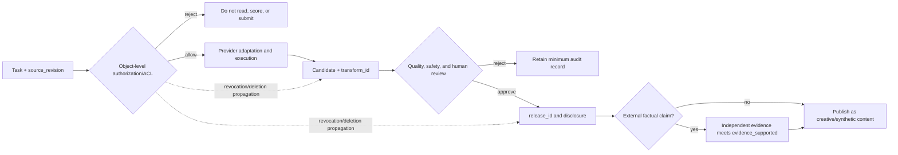

# Workflows and API Boundaries

## Goal of this lesson

Design a generation-service boundary that does not depend on one model name, so requirement review, provider invocation, result storage, and human approval can change independently.

## Use layers instead of calling a provider in business code

Use five layers:

1. **Task layer**: purpose, prompt, input references, risk, budget, and acceptance criteria; freeze the requirement's `source_revision`.
2. **Policy layer**: object-level authorization/ACL, rights, safety, privacy, and approval gates; reject nonconforming input before scoring, preview, or model read.
3. **Adapter layer**: maps a generic task to a provider's current endpoint and parameters.
4. **Execution layer**: timeout, rate limit, retry, status polling, download, and verification; every generation, edit, or post-production transform has `transform_id`.
5. **Review and release layer**: candidate filtering, human approval, `release_id`, disclosure, and audit record; an external factual claim must independently meet `evidence_supported`.

In the OpenAI official documentation checked on 2026-07-22, an individual generation or edit can use the Image API, while conversational multi-turn editing can use image tools in the Responses API. Output size, quality, format, compression, and other options depend on the model. The engineering conclusion is not “always use one endpoint”; it is that the **adapter layer must declare a capability matrix and documentation-check date**.

## Provider-neutral requests

A general object can contain `task_type`, structured prompt, `asset_id`, `source_revision`, and `acl_reference` for input assets, output specifications, maximum candidate count, budget, review rules, `transform_id`, and candidate `release_id`. Object-level ACL, authorization basis, retention period, and a revocation/deletion propagation plan are business-governance data; a provider response must not replace them. Do not hard-code `gpt-image-*`, one provider's seed parameter, or a particular price into the generic schema. An adapter returns:

- an internal job ID after acceptance;
- actual provider and model snapshot, recorded after the response;
- state: `queued/running/succeeded/failed/cancelled`;
- normalized error classification and a redacted summary of the raw error; and
- output hash, provenance record, and usage metadata.

## Timeouts, retries, and idempotency

An image request may return synchronously or wait in a queue. A connection timeout does not mean the provider failed to create the job; blind retry can double-charge and duplicate output. The client should send its own `request_id` and record the local “submission intent → provider ID” mapping. Retry only transient errors with exponential backoff; authentication failure, content refusal, invalid parameters, and insufficient balance should go directly to human or configuration handling.

When downloading, check MIME type, length limit, and hash—never trust an extension. Logs retain only asset IDs and hashes, not private original images, complete prompts, or keys. Temporary inputs and outputs need explicit deletion deadlines. Revocation or deletion cannot only remove the original file; propagate via `asset_id → transform_id → release_id` to candidates, caches, search indexes, and accessible links.

## Capability detection and fallback

Before execution, compare task needs with adapter capability: editing, transparent background, multiple image input, target format, and required ratio. When unsupported, give an explainable fallback, such as “generate the base image first and remove the background in post-production.” Do not silently change a purpose-critical requirement.

## Common errors and diagnosis

- **Retrying forever on 429**: read current rate-limit information and use jitter, a maximum attempt count, and overall deadline.
- **Treating a safety refusal as network failure**: error classification must preserve semantics.
- **Treating successful download as completion**: also perform file validation, quality review, and human approval.
- **Logs expose input**: minimize and control access to faces, customer assets, and prompts. ACL decisions must bind object, purpose, and `source_revision`, not only a project-wide “authorized” flag.
- **No regression for a model upgrade**: freeze a task set and run a small evaluation before changing versions.

## Exercise and self-check

Draw the state machine from “submit task” to “human approval,” and determine a next state for timeout, content refusal, damaged output, and failed review. Why are HTTP retry and creative retry not the same idea?

Next: [[image-generation/02-engineering-and-quality/06-quality-evaluation-and-human-review|Quality Evaluation and Human Review]].

## References

- [OpenAI Image generation guide](https://developers.openai.com/api/docs/guides/image-generation) (checked 2026-07-22)
- [[api/00-index|API]]
