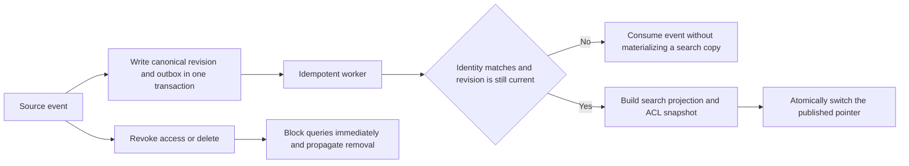

# Knowledge Base Construction

## Course overview

For an AI Agent, a knowledge base is not “put files into a vector database.” It is a continuously operated content product: its sources must be provable, its permissions enforceable, its versions explainable, its updates and deletions propagated, its derived indexes rebuildable, its failed releases reversible, and its quality measurable.

This course starts with a canonical store—the authoritative store of facts—and builds the lifecycle from source records, through version revisions and derived artifacts such as parsed output, chunks, and embeddings, to published retrieval projections. Chunking, embeddings, and vector queries are covered in later courses. The focus here is what may enter the knowledge base, which revision may serve traffic, who may see it, and how to recover after a failure.

## Where this course fits

First complete [[document-parsing/00-index|Document Parsing]] to obtain structured elements with provenance. This course puts those elements into an operable knowledge lifecycle. Then continue with [[chunking-strategies/00-index|Chunking Strategies]], [[embeddings/00-index|Embeddings]], [[vector-databases/00-index|Vector Databases]], [[semantic-search/00-index|Semantic Search]], [[reranking/00-index|Reranking]], and [[rag/00-index|Retrieval-Augmented Generation (RAG)]].

## Learning objectives

After completing this course, you should be able to:

- work backward from user questions, permissions, citation, and freshness requirements to define knowledge objects and schemas;
- distinguish a business document ID, source sequence, source revision, pipeline revision, and published version;
- design full and incremental ingestion, cursors, idempotency, failure isolation, and a transactional outbox;
- retain sources, processing activities, responsible agents, and derivation relationships;
- keep an old version serving while a new content projection is incomplete, yet fail closed immediately when an ACL tightens or an object is deleted;
- treat keyword, vector, and graph indexes as rebuildable projections rather than the only source of truth;
- govern deletion with tombstones, propagation confirmation, reconciliation, and retention policies; and
- evaluate ingestion, content, retrieval, and answers separately instead of judging only the final answer.

## Prerequisites

- Familiarity with [[json/00-index|JSON]], [[api/00-index|APIs]], and SQLite fundamentals.
- An understanding of source hashes, elements, and quality gates from [[document-parsing/00-index|Document Parsing]].
- The ability to run Python 3.11+ standard-library tests; no prior vector-database experience is required.

## Recommended sequence

1. [[knowledge-base-construction/01-requirements-boundaries-and-schema|Requirements, Boundaries, and Schema]]: define canonical and derived objects, identities, and contracts from user tasks.
2. [[knowledge-base-construction/02-ingestion-provenance-and-normalization|Ingestion, Provenance, and Normalization]]: design connectors, incremental cursors, lineage, idempotency, and batch gates.
3. [[knowledge-base-construction/03-versioning-deletion-and-authorization|Versioning, Deletion, and Authorization]]: publish, revoke access, delete, restore, and roll back safely.
4. [[knowledge-base-construction/04-indexing-and-incremental-updates|Indexing and Incremental Updates]]: drive rebuildable projections through an outbox and reconcile them continuously.
5. [[knowledge-base-construction/05-evaluation-operations-and-incremental-project|Evaluation, Operations, and the Incremental Project]]: run the SQLite project and verify failed publication, ACL behavior, and tombstone propagation.

## Hands-on entry points

- [[knowledge-base-construction/examples/knowledge_store.py|Versioned knowledge-base project]]
- [[knowledge-base-construction/examples/test_knowledge_store.py|Knowledge-base regression tests]]
- [[knowledge-base-construction/examples/source-record.schema.json|Source-record JSON Schema]]

The project uses canonical revisions, flattened ACL snapshots, an outbox, a search projection, and a published pointer. Its 41 tests cover no-op handling for identical input; rejection of out-of-order source sequences; pipeline reprocessing; preservation of the old version after a failed projection; immediate blocking after an ACL change; deletion tombstones; controlled content purging; input and candidate resource limits; non-materialization of stale events; and query-time recomputation of integrity from the actual canonical and search text, ACLs, and state fields. Before materializing an event, the worker also verifies that its tenant, document, and revision agree and that the revision is still current. Events superseded by an update or deletion are still consumed, but leave no search copy. Online queries first apply canonical ACLs as hard filters for candidate generation and limits, then validate the projection text and ACL of authorized candidates. Unauthorized documents neither occupy the candidate window nor become visible if a projection has been widened on one side only. The project is a single-process SQLite teaching model: it does not implement hierarchical permissions, deny rules, ABAC resolution, expiry cleanup for old-revision projections, a production identity system, a message bus, signed attestations, or physical-erasure tooling.

## Core publication invariants

This diagram describes safe publication relationships, not a distributed-transaction guarantee. A production system must still define message ordering, retries, cache invalidation, evidence that cross-store deletion completed, and the trust boundary of the identity provider.

For target invariants across parser elements, chunks, index generations, authorization snapshots, and source-span citations, see [[rag/09-project-offline-provenance-from-source-to-citation|the source-to-citation reference model]]. For the adapter that imports this project’s SQLite revisions, outbox, and published pointer, see [[rag/10-project-cross-layer-provenance-adaptation-and-atomic-publication|the cross-module provenance adapter and atomic publication]]. For the boundary that hands protected revision/parser/chunk/entry payloads to another consumer, then re-executes trusted binding, live deny checks, and local publication, see [[rag/11-project-external-provenance-artifact-v2|External Provenance Artifact v2]].

## Mastery checklist

- [ ] Every knowledge object has a stable business ID, source version or sequence, content hash, ACL, and lifecycle state.
- [ ] I can explain the difference between a canonical revision, current revision, published revision, and search projection.
- [ ] I can safely replay identical events; stale events do not overwrite newer state, and conflicts are not handled silently.
- [ ] When a content update fails, the prior version can still serve; when an ACL tightens or an object is deleted, prior content is not still exposed.
- [ ] A deletion propagates to chunks, embeddings, keyword/vector projections, caches, and retention policy, with confirmation signals.
- [ ] Indexes can be rebuilt from canonical data and versioned configuration, with count and sample reconciliation before and after publication.
- [ ] A query applies tenant and ACL filters during candidate generation, and its cache key includes authorization context.
- [ ] A query connects the published pointer to both the canonical revision and search projection, recomputes text and state hashes, and compares ACLs; it cannot rely on a later background reconciliation to discover an unauthorized projection.
- [ ] I can accept the system using coverage, freshness, queue age, propagation latency, and a retrieval gold set.

## Relationship to other courses

- [[document-parsing/00-index|Document Parsing]] provides traceable structural elements; this course versions and publishes them.
- [[chunking-strategies/00-index|Chunking Strategies]] and [[embeddings/00-index|Embeddings]] are version-controlled derived steps.
- [[vector-databases/00-index|Vector Databases]] and [[semantic-search/00-index|Semantic Search]] implement parts of the retrieval projection and must not become the only source of truth.
- [[evaluation-framework/00-index|Evaluation Framework]] establishes layered measures for ingestion, retrieval, and answers.
- [[privacy-computing/00-index|Privacy Computing]] and [[ai-governance/00-index|AI Governance]] constrain licensing, retention, deletion, access, and audit.

## Primary references

- [JSON Schema Draft 2020-12](https://json-schema.org/draft/2020-12)
- [W3C PROV-DM](https://www.w3.org/TR/prov-dm/)
- [OWASP Authorization Cheat Sheet](https://cheatsheetseries.owasp.org/cheatsheets/Authorization_Cheat_Sheet.html)
- [NIST SP 800-162: Attribute Based Access Control](https://csrc.nist.gov/pubs/sp/800/162/upd2/final)
- [Microsoft Graph delta query overview](https://learn.microsoft.com/en-us/graph/delta-query-overview)
- [Debezium Outbox Event Router](https://debezium.io/documentation/reference/stable/transformations/outbox-event-router.html)
- [SQLite Transactions](https://www.sqlite.org/lang_transaction.html)
- [SQLite UPSERT](https://www.sqlite.org/lang_upsert.html)
- [SQLite FTS5](https://www.sqlite.org/fts5.html)

Sources were retrieved on 2026-07-22. Dynamic connector, database, and authorization-product behavior must be verified against official documentation during implementation.
